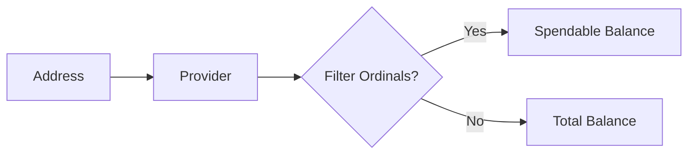

# Bitcoin Balances

This guide covers fetching Bitcoin balances for addresses on OPNet.

## Overview

OPNet provides methods to retrieve the satoshi balance of Bitcoin addresses, with options to filter out ordinals.



---

## Single Address Balance

### Basic Usage

```typescript
import { JSONRpcProvider } from 'opnet';
import { networks } from '@btc-vision/bitcoin';

const network = networks.regtest;
const provider = new JSONRpcProvider({ url: 'https://regtest.opnet.org', network });

// Get balance (filters ordinals by default)
const balance = await provider.getBalance('bcrt1p...');
console.log('Balance:', balance, 'satoshis');
```

### Method Signature

```typescript
async getBalance(
    address: string | Address,
    filterOrdinals?: boolean  // Default: true
): Promise<bigint>
```

### Parameters

| Parameter | Type | Default | Description |
|-----------|------|---------|-------------|
| `address` | `string \| Address` | - | Bitcoin address (any format) |
| `filterOrdinals` | `boolean` | `true` | Whether to exclude ordinal inscriptions |

### Example with Options

```typescript
// Get total balance including ordinals
const totalBalance = await provider.getBalance(wallet.p2tr, false);

// Get spendable balance excluding ordinals
const spendableBalance = await provider.getBalance(wallet.p2tr, true);

console.log('Total balance:', totalBalance);
console.log('Spendable balance:', spendableBalance);
console.log('Ordinal value:', totalBalance - spendableBalance);
```

---

## Multiple Address Balances

### Batch Balance Query

```typescript
// Get balances for multiple addresses efficiently
const addresses = [
    'bcrt1p...address1...',
    'bcrt1p...address2...',
    'bcrt1p...address3...',
];

const balances = await provider.getBalances(addresses, true);

// balances is Record<string, bigint>
for (const [address, balance] of Object.entries(balances)) {
    console.log(`${address}: ${balance} sats`);
}
```

### Method Signature

```typescript
async getBalances(
    addresses: string[],
    filterOrdinals?: boolean  // Default: true
): Promise<Record<string, bigint>>
```

### Example with Total Calculation

```typescript
async function getTotalBalance(
    provider: JSONRpcProvider,
    addresses: string[]
): Promise<bigint> {
    const balances = await provider.getBalances(addresses, true);

    let total = 0n;
    for (const balance of Object.values(balances)) {
        total += balance;
    }

    return total;
}

// Usage
const total = await getTotalBalance(provider, [
    wallet.p2tr,
    wallet.p2wpkh,
]);
console.log('Total across addresses:', total, 'sats');
```

---

## Formatting Balances

### Convert to BTC

```typescript
import { BitcoinUtils } from 'opnet';

const balanceSats = await provider.getBalance(address);
const balanceBTC = BitcoinUtils.formatUnits(balanceSats, 8);

console.log(`Balance: ${balanceBTC} BTC`);
```

### Human-Readable Format

```typescript
function formatBalance(satoshis: bigint): string {
    if (satoshis >= 100_000_000n) {
        // Format as BTC for large amounts
        const btc = Number(satoshis) / 100_000_000;
        return `${btc.toFixed(8)} BTC`;
    } else if (satoshis >= 1_000_000n) {
        // Format as mBTC
        const mbtc = Number(satoshis) / 100_000;
        return `${mbtc.toFixed(5)} mBTC`;
    } else {
        // Format as sats
        return `${satoshis.toLocaleString()} sats`;
    }
}

const balance = await provider.getBalance(address);
console.log('Balance:', formatBalance(balance));
```

---

## Wallet Balance Tracking

### Complete Balance Service

```typescript
class BalanceService {
    private provider: JSONRpcProvider;
    private cache: Map<string, { balance: bigint; timestamp: number }> = new Map();
    private cacheTimeout = 30000; // 30 seconds

    constructor(provider: JSONRpcProvider) {
        this.provider = provider;
    }

    async getBalance(
        address: string,
        useCache: boolean = true
    ): Promise<bigint> {
        if (useCache) {
            const cached = this.cache.get(address);
            if (cached && Date.now() - cached.timestamp < this.cacheTimeout) {
                return cached.balance;
            }
        }

        const balance = await this.provider.getBalance(address, true);
        this.cache.set(address, { balance, timestamp: Date.now() });

        return balance;
    }

    async getMultipleBalances(
        addresses: string[],
        useCache: boolean = true
    ): Promise<Record<string, bigint>> {
        if (!useCache) {
            return this.provider.getBalances(addresses, true);
        }

        const result: Record<string, bigint> = {};
        const addressesToFetch: string[] = [];

        // Check cache first
        for (const address of addresses) {
            const cached = this.cache.get(address);
            if (cached && Date.now() - cached.timestamp < this.cacheTimeout) {
                result[address] = cached.balance;
            } else {
                addressesToFetch.push(address);
            }
        }

        // Fetch uncached addresses
        if (addressesToFetch.length > 0) {
            const freshBalances = await this.provider.getBalances(
                addressesToFetch,
                true
            );

            for (const [address, balance] of Object.entries(freshBalances)) {
                result[address] = balance;
                this.cache.set(address, { balance, timestamp: Date.now() });
            }
        }

        return result;
    }

    clearCache(address?: string): void {
        if (address) {
            this.cache.delete(address);
        } else {
            this.cache.clear();
        }
    }
}

// Usage
const balanceService = new BalanceService(provider);

const balance = await balanceService.getBalance(wallet.p2tr);
console.log('Balance:', balance);

// Clear cache after transaction
balanceService.clearCache(wallet.p2tr);
```

---

## Balance Monitoring

### Polling for Balance Changes

```typescript
async function monitorBalance(
    provider: JSONRpcProvider,
    address: string,
    callback: (balance: bigint) => void,
    intervalMs: number = 10000
): Promise<() => void> {
    let previousBalance = await provider.getBalance(address, true);
    callback(previousBalance);

    const intervalId = setInterval(async () => {
        try {
            const currentBalance = await provider.getBalance(address, true);

            if (currentBalance !== previousBalance) {
                callback(currentBalance);
                previousBalance = currentBalance;
            }
        } catch (error) {
            console.error('Error checking balance:', error);
        }
    }, intervalMs);

    // Return cleanup function
    return () => clearInterval(intervalId);
}

// Usage
const stopMonitoring = await monitorBalance(
    provider,
    wallet.p2tr,
    (balance) => {
        console.log('Balance updated:', balance, 'sats');
    },
    5000  // Check every 5 seconds
);

// Later: stop monitoring
// stopMonitoring();
```

### Using WebSocket for Real-Time Updates

```typescript
import { WebSocketRpcProvider } from 'opnet';

const wsProvider = new WebSocketRpcProvider({ url: 'wss://regtest.opnet.org/ws', network });

// Subscribe to block notifications
wsProvider.subscribeToBlocks((block) => {
    // Check balance after each new block
    provider.getBalance(wallet.p2tr).then((balance) => {
        console.log(`Block ${block.height}: Balance = ${balance} sats`);
    });
});
```

---

## Error Handling

```typescript
async function safeGetBalance(
    provider: JSONRpcProvider,
    address: string
): Promise<bigint | null> {
    try {
        return await provider.getBalance(address, true);
    } catch (error) {
        if (error instanceof Error) {
            console.error(`Failed to get balance for ${address}:`, error.message);
        }
        return null;
    }
}

// Usage
const balance = await safeGetBalance(provider, address);
if (balance !== null) {
    console.log('Balance:', balance);
} else {
    console.log('Could not fetch balance');
}
```

---

## Best Practices

1. **Filter Ordinals**: Use `filterOrdinals: true` to get spendable balance

2. **Batch Requests**: Use `getBalances()` for multiple addresses

3. **Cache Results**: Implement caching to reduce RPC calls

4. **Handle Errors**: Balance queries can fail during network issues

5. **Format for Users**: Convert satoshis to BTC for display

---

## Next Steps

- [UTXOs](./utxos.md) - Managing unspent outputs
- [Sending Bitcoin](./sending-bitcoin.md) - Bitcoin transfers
- [UTXO Optimization](./utxo-optimization.md) - Consolidation strategies

---

[← Previous: Deployment Examples](../examples/deployment-examples.md) | [Next: UTXOs →](./utxos.md)
