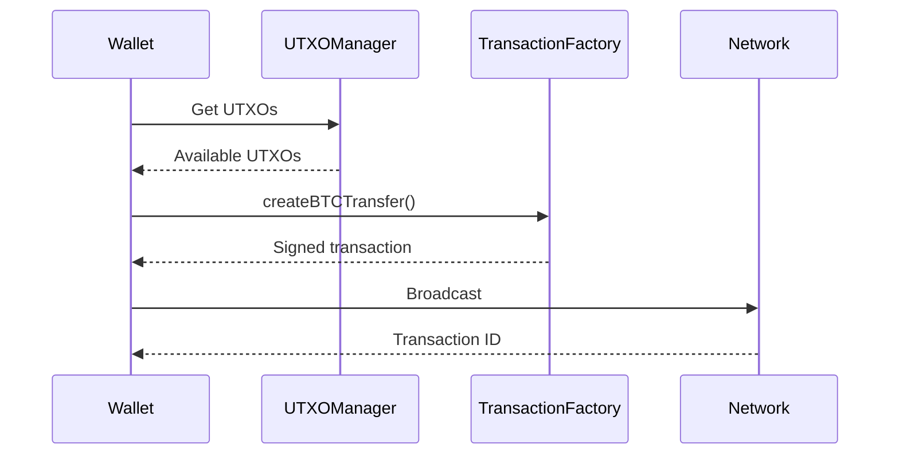

# Sending Bitcoin

This guide covers building and sending Bitcoin transactions using `TransactionFactory` from `@btc-vision/transaction`.

## Table of Contents

- [Overview](#overview)
- [Prerequisites](#prerequisites)
- [Simple Bitcoin Transfer](#simple-bitcoin-transfer)
- [Splitting UTXOs](#splitting-utxos)
- [Consolidating UTXOs](#consolidating-utxos)
- [Multi-Address UTXO Fetching](#multi-address-utxo-fetching)
- [Fee Estimation](#fee-estimation)
- [Adding Notes to Transactions](#adding-notes-to-transactions)
- [Broadcasting Transactions](#broadcasting-transactions)
- [Complete Examples](#complete-examples)
- [Best Practices](#best-practices)

---

## Overview

Bitcoin transactions on OPNet are built using `TransactionFactory.createBTCTransfer()`. This method handles all the complexity of UTXO selection, fee calculation, and change output creation.



---

## Prerequisites

```typescript
import { networks } from '@btc-vision/bitcoin';
import {
    AddressTypes,
    IFundingTransactionParameters,
    Mnemonic,
    MLDSASecurityLevel,
    TransactionFactory,
    OPNetLimitedProvider,
} from '@btc-vision/transaction';
import { JSONRpcProvider } from 'opnet';

// Setup network and providers
const network = networks.regtest;
const provider = new JSONRpcProvider({ url: 'https://regtest.opnet.org', network });
const limitedProvider = new OPNetLimitedProvider('https://regtest.opnet.org');

// Create wallet from mnemonic
const mnemonic = new Mnemonic(
    'your twenty four word seed phrase goes here ...',
    '',
    network,
    MLDSASecurityLevel.LEVEL2,
);
const wallet = mnemonic.deriveUnisat(AddressTypes.P2TR, 0);

// Create transaction factory
const factory = new TransactionFactory();
```

---

## Simple Bitcoin Transfer

### Basic Send

```typescript
async function sendBitcoin(
    recipient: string,
    amount: bigint,
): Promise<string> {
    // Get UTXOs for the transfer
    const utxos = await provider.utxoManager.getUTXOsForAmount({
        address: wallet.p2tr,
        amount: amount + 10000n,  // Add buffer for fees
        mergePendingUTXOs: true,
        filterSpentUTXOs: true,
        throwErrors: true,
    });

    // Build funding transaction parameters
    const params: IFundingTransactionParameters = {
        amount: amount,
        feeRate: 10,
        from: wallet.p2tr,
        to: recipient,
        utxos: utxos,
        signer: wallet.keypair,
        network: network,
        priorityFee: 0n,
        gasSatFee: 0n,
    };

    // Create the transfer
    const result = await factory.createBTCTransfer(params);

    // Broadcast the transaction
    const broadcast = await provider.sendRawTransaction(result.tx, false);

    if (!broadcast || broadcast.error) {
        throw new Error(`Broadcast failed: ${broadcast?.error}`);
    }

    // Track spent UTXOs for future transactions
    provider.utxoManager.spentUTXO(wallet.p2tr, result.inputUtxos, result.nextUTXOs);

    return broadcast.result;
}

// Usage
const txId = await sendBitcoin(
    'bcrt1p...recipient...',
    50000n,  // 50,000 satoshis
);
console.log('Transaction sent:', txId);
```

---

## Splitting UTXOs

Split a large UTXO into multiple smaller outputs using `splitInputsInto`.

```typescript
import { BitcoinUtils } from 'opnet';

async function splitUTXOs(
    recipient: string,
    totalAmount: bigint,
    splitCount: number,
): Promise<string> {
    const utxos = await provider.utxoManager.getUTXOsForAmount({
        address: wallet.p2tr,
        amount: totalAmount + 50000n,  // Extra buffer for fees with many outputs
        mergePendingUTXOs: true,
        filterSpentUTXOs: true,
        throwErrors: true,
    });

    const params: IFundingTransactionParameters = {
        amount: totalAmount,
        feeRate: 1.5,
        from: wallet.p2tr,
        to: recipient,
        utxos: utxos,
        signer: wallet.keypair,
        network: network,
        priorityFee: 0n,
        gasSatFee: 0n,
        splitInputsInto: splitCount,  // Split into this many outputs
    };

    const result = await factory.createBTCTransfer(params);
    const broadcast = await limitedProvider.broadcastTransaction(result.tx, false);

    if (!broadcast) {
        throw new Error('Could not broadcast transaction');
    }

    return broadcast.result;
}

// Usage: Split 5 BTC into 500 UTXOs
const amount = BitcoinUtils.expandToDecimals(5, 8);  // 5 BTC in satoshis
const txId = await splitUTXOs(wallet.p2tr, amount - 10000n, 500);
console.log('Split transaction:', txId);
```

---

## Consolidating UTXOs

Merge multiple small UTXOs into a single larger output.

```typescript
async function consolidateUTXOs(
    destinationAddress: string,
    maxUTXOs: number = 100,
): Promise<string> {
    // Fetch all available UTXOs
    const utxos = await provider.utxoManager.getUTXOs({
        address: wallet.p2tr,
        optimize: false,
        mergePendingUTXOs: false,
        filterSpentUTXOs: true,
    });

    // Limit number of UTXOs to consolidate
    const selectedUTXOs = utxos.slice(0, maxUTXOs);
    const total = selectedUTXOs.reduce((acc, utxo) => acc + utxo.value, 0n);

    console.log(`Consolidating ${selectedUTXOs.length} UTXOs with total value ${total} sats`);

    // Estimate fees - start with minimal fee and adjust if needed
    let fees = 1n;

    const params: IFundingTransactionParameters = {
        amount: total - fees,
        feeRate: 10,
        from: wallet.p2tr,
        to: destinationAddress,
        utxos: selectedUTXOs,
        signer: wallet.keypair,
        network: network,
        priorityFee: 0n,
        gasSatFee: 0n,
    };

    const result = await factory.createBTCTransfer(params);

    // Actual fees are calculated by the factory
    console.log(`Transaction size: ${result.tx.length / 2} bytes`);
    console.log(`Estimated fees: ${result.estimatedFees} sats`);

    const broadcast = await provider.sendRawTransaction(result.tx, false);

    if (!broadcast || broadcast.error) {
        throw new Error(`Broadcast failed: ${broadcast?.error}`);
    }

    return broadcast.result;
}

// Usage
const txId = await consolidateUTXOs(wallet.p2tr, 50);
console.log('Consolidation transaction:', txId);
```

---

## Multi-Address UTXO Fetching

Fetch UTXOs from multiple addresses at once using `OPNetLimitedProvider`.

```typescript
import {
    FetchUTXOParamsMultiAddress,
    OPNetLimitedProvider,
    UTXO,
} from '@btc-vision/transaction';
import { BitcoinUtils } from 'opnet';

async function fetchMultiAddressUTXOs(): Promise<UTXO[]> {
    const limitedProvider = new OPNetLimitedProvider('https://regtest.opnet.org');

    const params: FetchUTXOParamsMultiAddress = {
        addresses: [wallet.p2tr, wallet.p2wpkh],
        minAmount: 10n,
        requestedAmount: BitcoinUtils.expandToDecimals(1, 8),  // 1 BTC
        optimized: true,
        usePendingUTXO: true,
    };

    const utxos = await limitedProvider.fetchUTXOMultiAddr(params);

    if (!utxos || !utxos.length) {
        throw new Error('No UTXOs found');
    }

    const total = utxos.reduce((acc, utxo) => acc + utxo.value, 0n);
    console.log(`Found ${utxos.length} UTXOs with total ${total} sats`);

    return utxos;
}
```

---

## Fee Estimation

### Get Network Fee Rates

```typescript
async function getRecommendedFees(): Promise<{
    high: number;
    medium: number;
    low: number;
    conservative: number;
}> {
    const gasParams = await provider.gasParameters();

    return {
        high: gasParams.bitcoin.recommended.high,
        medium: gasParams.bitcoin.recommended.medium,
        low: gasParams.bitcoin.recommended.low,
        conservative: gasParams.bitcoin.conservative,
    };
}

// Usage
const fees = await getRecommendedFees();
console.log('Fee rates (sat/vB):');
console.log('  High:', fees.high);
console.log('  Medium:', fees.medium);
console.log('  Low:', fees.low);
console.log('  Conservative:', fees.conservative);
```

### Use Automatic Fee Rate

Set `feeRate: 0` to automatically use network-recommended fees:

```typescript
const params: IFundingTransactionParameters = {
    amount: 50000n,
    feeRate: 0,  // Automatic fee rate
    from: wallet.p2tr,
    to: recipient,
    utxos: utxos,
    signer: wallet.keypair,
    network: network,
    priorityFee: 0n,
    gasSatFee: 0n,
};
```

---

## Adding Notes to Transactions

Add an OP_RETURN note to your transaction:

```typescript
const params: IFundingTransactionParameters = {
    amount: 50000n,
    feeRate: 10,
    from: wallet.p2tr,
    to: recipient,
    utxos: utxos,
    signer: wallet.keypair,
    network: network,
    priorityFee: 0n,
    gasSatFee: 0n,
    note: 'Hello from OPNet!',  // String or Uint8Array
};
```

---

## Broadcasting Transactions

### Using JSONRpcProvider

```typescript
const broadcast = await provider.sendRawTransaction(rawTxHex, false);

if (broadcast.error) {
    console.error('Broadcast failed:', broadcast.error);
} else {
    console.log('Transaction ID:', broadcast.result);
    console.log('Peers notified:', broadcast.peers);
}
```

### Using OPNetLimitedProvider

```typescript
const broadcast = await limitedProvider.broadcastTransaction(rawTxHex, false);

if (!broadcast) {
    throw new Error('Could not broadcast transaction');
}

console.log('Broadcast result:', broadcast);
```

---

## Complete Examples

### Full Transfer Service

```typescript
import { networks } from '@btc-vision/bitcoin';
import {
    IFundingTransactionParameters,
    TransactionFactory,
    Wallet,
} from '@btc-vision/transaction';
import { JSONRpcProvider } from 'opnet';

class BitcoinTransferService {
    private readonly factory = new TransactionFactory();

    constructor(
        private readonly provider: JSONRpcProvider,
        private readonly wallet: Wallet,
        private readonly network: typeof networks.bitcoin,
    ) {}

    async getBalance(): Promise<bigint> {
        return this.provider.getBalance(this.wallet.p2tr);
    }

    async send(
        recipient: string,
        amount: bigint,
        feeRate: number = 10,
    ): Promise<{ txId: string; fees: bigint }> {
        const utxos = await this.provider.utxoManager.getUTXOsForAmount({
            address: this.wallet.p2tr,
            amount: amount + 20000n,
            mergePendingUTXOs: true,
            filterSpentUTXOs: true,
            throwErrors: true,
        });

        const params: IFundingTransactionParameters = {
            amount: amount,
            feeRate: feeRate,
            from: this.wallet.p2tr,
            to: recipient,
            utxos: utxos,
            signer: this.wallet.keypair,
            network: this.network,
            priorityFee: 0n,
            gasSatFee: 0n,
        };

        const result = await this.factory.createBTCTransfer(params);
        const broadcast = await this.provider.sendRawTransaction(result.tx, false);

        if (!broadcast || broadcast.error) {
            throw new Error(`Broadcast failed: ${broadcast?.error}`);
        }

        // Update UTXO tracking
        this.provider.utxoManager.spentUTXO(
            this.wallet.p2tr,
            result.inputUtxos,
            result.nextUTXOs,
        );

        return {
            txId: broadcast.result,
            fees: result.estimatedFees,
        };
    }

    async split(
        amount: bigint,
        splitCount: number,
        feeRate: number = 10,
    ): Promise<string> {
        const utxos = await this.provider.utxoManager.getUTXOsForAmount({
            address: this.wallet.p2tr,
            amount: amount + 50000n,
            mergePendingUTXOs: true,
            filterSpentUTXOs: true,
            throwErrors: true,
        });

        const params: IFundingTransactionParameters = {
            amount: amount,
            feeRate: feeRate,
            from: this.wallet.p2tr,
            to: this.wallet.p2tr,
            utxos: utxos,
            signer: this.wallet.keypair,
            network: this.network,
            priorityFee: 0n,
            gasSatFee: 0n,
            splitInputsInto: splitCount,
        };

        const result = await this.factory.createBTCTransfer(params);
        const broadcast = await this.provider.sendRawTransaction(result.tx, false);

        if (!broadcast || broadcast.error) {
            throw new Error(`Broadcast failed: ${broadcast?.error}`);
        }

        return broadcast.result;
    }

    async consolidate(maxUTXOs: number = 100): Promise<string> {
        const utxos = await this.provider.utxoManager.getUTXOs({
            address: this.wallet.p2tr,
            optimize: false,
            mergePendingUTXOs: false,
            filterSpentUTXOs: true,
        });

        const selectedUTXOs = utxos.slice(0, maxUTXOs);
        const total = selectedUTXOs.reduce((acc, utxo) => acc + utxo.value, 0n);

        const params: IFundingTransactionParameters = {
            amount: total - 1000n,  // Reserve for fees
            feeRate: 10,
            from: this.wallet.p2tr,
            to: this.wallet.p2tr,
            utxos: selectedUTXOs,
            signer: this.wallet.keypair,
            network: this.network,
            priorityFee: 0n,
            gasSatFee: 0n,
        };

        const result = await this.factory.createBTCTransfer(params);
        const broadcast = await this.provider.sendRawTransaction(result.tx, false);

        if (!broadcast || broadcast.error) {
            throw new Error(`Broadcast failed: ${broadcast?.error}`);
        }

        return broadcast.result;
    }
}

// Usage
const network = networks.regtest;
const provider = new JSONRpcProvider({ url: 'https://regtest.opnet.org', network });
const mnemonic = new Mnemonic(
    'your twenty four word seed phrase goes here ...',
    '',
    network,
    MLDSASecurityLevel.LEVEL2,
);
const wallet = mnemonic.deriveUnisat(AddressTypes.P2TR, 0);

const service = new BitcoinTransferService(provider, wallet, network);

// Check balance
const balance = await service.getBalance();
console.log('Balance:', balance, 'sats');

// Send Bitcoin
const { txId, fees } = await service.send('bcrt1p...recipient...', 50000n);
console.log('Sent! TxID:', txId, 'Fees:', fees);

// Split UTXOs
const splitTxId = await service.split(1000000n, 10);
console.log('Split! TxID:', splitTxId);

// Consolidate UTXOs
const consolidateTxId = await service.consolidate(50);
console.log('Consolidated! TxID:', consolidateTxId);
```

---

## Best Practices

1. **Always Buffer for Fees**: When fetching UTXOs, add extra satoshis to cover transaction fees

2. **Track UTXO State**: Call `spentUTXO()` after successful broadcasts to keep local state in sync

3. **Handle Broadcast Errors**: Always check for errors in broadcast responses

4. **Use Appropriate Fee Rates**: Query network conditions before sending time-sensitive transactions

5. **Avoid Dust Outputs**: The minimum output value is 330 satoshis (dust threshold)

6. **Consolidate Regularly**: Merge small UTXOs to reduce future transaction fees

7. **Split for Concurrency**: Split UTXOs when you need to send multiple transactions in parallel

---

## Next Steps

- [UTXOs](./utxos.md) - Understanding UTXOs
- [UTXO Optimization](./utxo-optimization.md) - Consolidation strategies
- [Balances](./balances.md) - Balance queries

---

[← Previous: UTXOs](./utxos.md) | [Next: UTXO Optimization →](./utxo-optimization.md)
