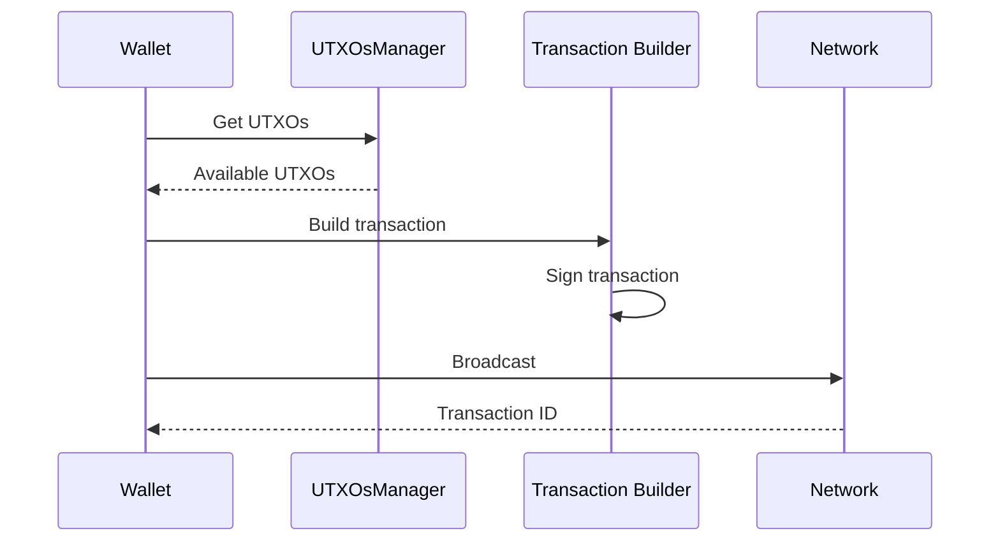

# Sending Bitcoin

This guide covers building and sending Bitcoin transactions on OPNet.

## Overview

Bitcoin transactions on OPNet are built using UTXOs as inputs and specifying outputs for recipients and change.



---

## Prerequisites

```typescript
import {
    AddressTypes,
    TransactionFactory,
    Mnemonic,
    MLDSASecurityLevel,
    UTXO,
} from '@btc-vision/transaction';
import { JSONRpcProvider } from 'opnet';
import { networks, Psbt } from '@btc-vision/bitcoin';

const network = networks.regtest;
const provider = new JSONRpcProvider('https://regtest.opnet.org', network);
const mnemonic = new Mnemonic('your seed phrase here ...', '', network, MLDSASecurityLevel.LEVEL2);
const wallet = mnemonic.deriveUnisat(AddressTypes.P2TR, 0);  // OPWallet-compatible
const factory = new TransactionFactory();
```

---

## Simple Bitcoin Transfer

### Basic Send

```typescript
async function sendBitcoin(
    recipient: string,
    amount: bigint,
    wallet: Wallet,
    feeRate: number = 10
): Promise<string> {
    // Get UTXOs
    const utxos = await provider.utxoManager.getUTXOsForAmount({
        address: wallet.p2tr,
        amount: amount + 10000n,  // Add buffer for fees
        throwErrors: true,
    });

    // Calculate total input value
    const inputValue = utxos.reduce((sum, u) => sum + u.value, 0n);

    // Build PSBT
    const psbt = new Psbt({ network });

    // Add inputs
    for (const utxo of utxos) {
        psbt.addInput({
            hash: utxo.transactionId,
            index: utxo.outputIndex,
            witnessUtxo: {
                script: utxo.scriptPubKey.toBuffer(),
                value: Number(utxo.value),
            },
            tapInternalKey: wallet.internalPubkey,
        });
    }

    // Add recipient output
    psbt.addOutput({
        address: recipient,
        value: Number(amount),
    });

    // Calculate fee (estimate 150 vB per input + 50 vB base)
    const estimatedSize = 50 + utxos.length * 150;
    const fee = BigInt(estimatedSize * feeRate);

    // Add change output
    const change = inputValue - amount - fee;
    if (change > 546n) {  // Dust threshold
        psbt.addOutput({
            address: wallet.p2tr,
            value: Number(change),
        });
    }

    // Sign all inputs
    for (let i = 0; i < utxos.length; i++) {
        psbt.signTaprootInput(i, wallet.keypair);
    }

    // Finalize and extract
    psbt.finalizeAllInputs();
    const tx = psbt.extractTransaction();

    // Broadcast
    const result = await provider.sendRawTransaction(tx.toHex());

    // Track spent UTXOs
    provider.utxoManager.spentUTXO(wallet.p2tr, utxos, []);

    return result.txid;
}

// Usage
const txId = await sendBitcoin(
    'bcrt1p...recipient...',
    50000n,  // 50,000 satoshis
    wallet
);
console.log('Transaction sent:', txId);
```

---

## Multi-Output Transaction

### Send to Multiple Recipients

```typescript
interface PaymentOutput {
    address: string;
    amount: bigint;
}

async function sendToMultiple(
    payments: PaymentOutput[],
    wallet: Wallet,
    feeRate: number = 10
): Promise<string> {
    // Calculate total needed
    const totalAmount = payments.reduce((sum, p) => sum + p.amount, 0n);

    // Get UTXOs
    const utxos = await provider.utxoManager.getUTXOsForAmount({
        address: wallet.p2tr,
        amount: totalAmount + 20000n,  // Buffer for fees
        throwErrors: true,
    });

    const inputValue = utxos.reduce((sum, u) => sum + u.value, 0n);

    // Build PSBT
    const psbt = new Psbt({ network });

    // Add inputs
    for (const utxo of utxos) {
        psbt.addInput({
            hash: utxo.transactionId,
            index: utxo.outputIndex,
            witnessUtxo: {
                script: utxo.scriptPubKey.toBuffer(),
                value: Number(utxo.value),
            },
            tapInternalKey: wallet.internalPubkey,
        });
    }

    // Add payment outputs
    for (const payment of payments) {
        psbt.addOutput({
            address: payment.address,
            value: Number(payment.amount),
        });
    }

    // Calculate fee
    const estimatedSize = 50 + utxos.length * 150 + payments.length * 40;
    const fee = BigInt(estimatedSize * feeRate);

    // Add change
    const change = inputValue - totalAmount - fee;
    if (change > 546n) {
        psbt.addOutput({
            address: wallet.p2tr,
            value: Number(change),
        });
    }

    // Sign and finalize
    for (let i = 0; i < utxos.length; i++) {
        psbt.signTaprootInput(i, wallet.keypair);
    }
    psbt.finalizeAllInputs();

    const tx = psbt.extractTransaction();
    const result = await provider.sendRawTransaction(tx.toHex());

    provider.utxoManager.spentUTXO(wallet.p2tr, utxos, []);

    return result.txid;
}

// Usage
const txId = await sendToMultiple([
    { address: 'bcrt1p...addr1...', amount: 10000n },
    { address: 'bcrt1p...addr2...', amount: 20000n },
    { address: 'bcrt1p...addr3...', amount: 15000n },
], wallet);
```

---

## Fee Estimation

### Get Recommended Fees

```typescript
async function getRecommendedFees(): Promise<{
    fastest: number;
    halfHour: number;
    hour: number;
    economy: number;
}> {
    const gasParams = await provider.gasParameters();

    return {
        fastest: gasParams.bitcoin.fastestFee,
        halfHour: gasParams.bitcoin.halfHourFee,
        hour: gasParams.bitcoin.hourFee,
        economy: gasParams.bitcoin.economyFee,
    };
}

// Usage
const fees = await getRecommendedFees();
console.log('Fastest fee:', fees.fastest, 'sat/vB');

// Use appropriate fee rate
const urgentTx = await sendBitcoin(recipient, amount, wallet, fees.fastest);
const normalTx = await sendBitcoin(recipient, amount, wallet, fees.halfHour);
```

### Calculate Transaction Size

```typescript
function estimateTransactionSize(
    inputCount: number,
    outputCount: number,
    inputType: 'p2tr' | 'p2wpkh' | 'p2pkh' = 'p2tr'
): number {
    // Base size (version + locktime + input/output counts)
    let size = 10;

    // Input sizes by type
    const inputSizes = {
        p2tr: 58,    // Taproot
        p2wpkh: 68,  // Native SegWit
        p2pkh: 148,  // Legacy
    };

    size += inputCount * inputSizes[inputType];

    // Output size (approximately 34 bytes for P2TR/P2WPKH)
    size += outputCount * 34;

    return size;
}

function calculateFee(
    inputCount: number,
    outputCount: number,
    feeRate: number
): bigint {
    const size = estimateTransactionSize(inputCount, outputCount);
    return BigInt(Math.ceil(size * feeRate));
}

// Usage
const fee = calculateFee(3, 2, 10);
console.log('Estimated fee:', fee, 'sats');
```

---

## Transaction with OP_RETURN

### Add Data to Transaction

```typescript
async function sendWithData(
    recipient: string,
    amount: bigint,
    data: string | Buffer,
    wallet: Wallet,
    feeRate: number = 10
): Promise<string> {
    const utxos = await provider.utxoManager.getUTXOsForAmount({
        address: wallet.p2tr,
        amount: amount + 20000n,
        throwErrors: true,
    });

    const inputValue = utxos.reduce((sum, u) => sum + u.value, 0n);

    const psbt = new Psbt({ network });

    // Add inputs
    for (const utxo of utxos) {
        psbt.addInput({
            hash: utxo.transactionId,
            index: utxo.outputIndex,
            witnessUtxo: {
                script: utxo.scriptPubKey.toBuffer(),
                value: Number(utxo.value),
            },
            tapInternalKey: wallet.internalPubkey,
        });
    }

    // Add recipient output
    psbt.addOutput({
        address: recipient,
        value: Number(amount),
    });

    // Add OP_RETURN output with data
    const dataBuffer = typeof data === 'string' ? Buffer.from(data) : data;
    const embed = bitcoin.payments.embed({ data: [dataBuffer] });

    psbt.addOutput({
        script: embed.output!,
        value: 0,
    });

    // Calculate fee and add change
    const estimatedSize = 50 + utxos.length * 150 + 80 + dataBuffer.length;
    const fee = BigInt(estimatedSize * feeRate);
    const change = inputValue - amount - fee;

    if (change > 546n) {
        psbt.addOutput({
            address: wallet.p2tr,
            value: Number(change),
        });
    }

    // Sign and broadcast
    for (let i = 0; i < utxos.length; i++) {
        psbt.signTaprootInput(i, wallet.keypair);
    }
    psbt.finalizeAllInputs();

    const tx = psbt.extractTransaction();
    const result = await provider.sendRawTransaction(tx.toHex());

    return result.txid;
}

// Usage
const txId = await sendWithData(
    recipient,
    10000n,
    'Hello OPNet!',
    wallet
);
```

---

## Broadcasting Transactions

### Single Transaction

```typescript
const result = await provider.sendRawTransaction(rawTxHex);
console.log('Transaction ID:', result.txid);
```

### Multiple Transactions

```typescript
const transactions = [
    { tx: rawTx1, psbt: null },
    { tx: rawTx2, psbt: null },
];

const results = await provider.sendRawTransactions(transactions);

for (const result of results) {
    console.log('TX ID:', result.txid);
}
```

---

## Complete Bitcoin Service

```typescript
class BitcoinService {
    private provider: JSONRpcProvider;
    private wallet: Wallet;
    private network: Network;

    constructor(
        provider: JSONRpcProvider,
        wallet: Wallet,
        network: Network
    ) {
        this.provider = provider;
        this.wallet = wallet;
        this.network = network;
    }

    async getBalance(): Promise<bigint> {
        return this.provider.getBalance(this.wallet.p2tr);
    }

    async getRecommendedFee(priority: 'fast' | 'normal' | 'slow'): Promise<number> {
        const gasParams = await this.provider.gasParameters();

        switch (priority) {
            case 'fast':
                return gasParams.bitcoin.fastestFee;
            case 'normal':
                return gasParams.bitcoin.halfHourFee;
            case 'slow':
                return gasParams.bitcoin.economyFee;
        }
    }

    async send(
        recipient: string,
        amount: bigint,
        priority: 'fast' | 'normal' | 'slow' = 'normal'
    ): Promise<string> {
        const feeRate = await this.getRecommendedFee(priority);

        const utxos = await this.provider.utxoManager.getUTXOsForAmount({
            address: this.wallet.p2tr,
            amount: amount + 20000n,
            throwErrors: true,
        });

        const inputValue = utxos.reduce((sum, u) => sum + u.value, 0n);

        const psbt = new Psbt({ network: this.network });

        for (const utxo of utxos) {
            psbt.addInput({
                hash: utxo.transactionId,
                index: utxo.outputIndex,
                witnessUtxo: {
                    script: utxo.scriptPubKey.toBuffer(),
                    value: Number(utxo.value),
                },
                tapInternalKey: this.wallet.internalPubkey,
            });
        }

        psbt.addOutput({
            address: recipient,
            value: Number(amount),
        });

        const estimatedSize = 50 + utxos.length * 150 + 80;
        const fee = BigInt(Math.ceil(estimatedSize * feeRate));
        const change = inputValue - amount - fee;

        if (change > 546n) {
            psbt.addOutput({
                address: this.wallet.p2tr,
                value: Number(change),
            });
        }

        for (let i = 0; i < utxos.length; i++) {
            psbt.signTaprootInput(i, this.wallet.keypair);
        }
        psbt.finalizeAllInputs();

        const tx = psbt.extractTransaction();
        const result = await this.provider.sendRawTransaction(tx.toHex());

        this.provider.utxoManager.spentUTXO(this.wallet.p2tr, utxos, []);

        return result.txid;
    }
}

// Usage
const btcService = new BitcoinService(provider, wallet, network);

const balance = await btcService.getBalance();
console.log('Balance:', balance, 'sats');

const txId = await btcService.send(
    'bcrt1p...recipient...',
    50000n,
    'normal'
);
console.log('Sent:', txId);
```

---

## Best Practices

1. **Use Appropriate Fee Rates**: Check network conditions before sending

2. **Handle Dust**: Don't create outputs below 546 satoshis

3. **Track UTXOs**: Always update UTXO state after transactions

4. **Verify Before Broadcast**: Double-check amounts and addresses

5. **Handle Errors**: Network issues can cause broadcast failures

---

## Next Steps

- [UTXO Optimization](./utxo-optimization.md) - Consolidation strategies
- [Balances](./balances.md) - Balance queries
- [Transaction Configuration](../contracts/transaction-configuration.md) - Advanced options

---

[← Previous: UTXOs](./utxos.md) | [Next: UTXO Optimization →](./utxo-optimization.md)
