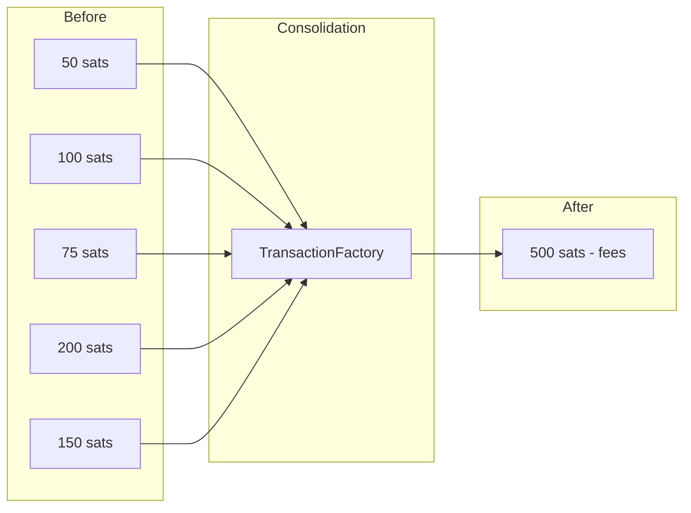

# UTXO Optimization

This guide covers strategies for optimizing UTXOs using `TransactionFactory` from `@btc-vision/transaction`.

## Table of Contents

- [Overview](#overview)
- [Why Optimize UTXOs?](#why-optimize-utxos)
- [UTXO Analysis](#utxo-analysis)
- [UTXO Consolidation](#utxo-consolidation)
- [UTXO Splitting](#utxo-splitting)
- [Complete Optimizer Service](#complete-optimizer-service)
- [Best Practices](#best-practices)

---

## Overview

Over time, wallets accumulate many small UTXOs which increase transaction fees. UTXO optimization helps consolidate these into fewer, larger UTXOs.



---

## Why Optimize UTXOs?

| Problem | Impact |
|---------|--------|
| Many small UTXOs | Higher transaction fees |
| Dust UTXOs | May be unspendable |
| Fragmented balance | Complex transaction building |
| Chain limit | Max 25 unconfirmed transactions |

---

## UTXO Analysis

### Analyze UTXO Distribution

```typescript
import { networks } from '@btc-vision/bitcoin';
import { Wallet } from '@btc-vision/transaction';
import { JSONRpcProvider } from 'opnet';

interface UTXOAnalysis {
    total: bigint;
    count: number;
    dust: number;
    small: number;
    medium: number;
    large: number;
    dustValue: bigint;
}

async function analyzeUTXOs(
    provider: JSONRpcProvider,
    address: string,
): Promise<UTXOAnalysis> {
    const utxos = await provider.utxoManager.getUTXOs({
        address,
        optimize: false,
        filterSpentUTXOs: true,
    });

    let total = 0n;
    let dust = 0;
    let small = 0;
    let medium = 0;
    let large = 0;
    let dustValue = 0n;

    for (const utxo of utxos) {
        total += utxo.value;

        if (utxo.value < 546n) {
            dust++;
            dustValue += utxo.value;
        } else if (utxo.value < 10000n) {
            small++;
        } else if (utxo.value < 100000n) {
            medium++;
        } else {
            large++;
        }
    }

    return {
        total,
        count: utxos.length,
        dust,
        small,
        medium,
        large,
        dustValue,
    };
}

// Usage
const analysis = await analyzeUTXOs(provider, wallet.p2tr);
console.log('UTXO Analysis:');
console.log(`  Total: ${analysis.total} sats across ${analysis.count} UTXOs`);
console.log(`  Dust (<546 sats): ${analysis.dust}`);
console.log(`  Small (546-10k): ${analysis.small}`);
console.log(`  Medium (10k-100k): ${analysis.medium}`);
console.log(`  Large (>100k): ${analysis.large}`);
```

### Should Consolidate?

```typescript
function shouldConsolidate(analysis: UTXOAnalysis): boolean {
    // Consolidate if many small UTXOs
    if (analysis.small + analysis.dust > 10) {
        return true;
    }

    // Consolidate if total count is high
    if (analysis.count > 20) {
        return true;
    }

    // Consolidate if significant dust value
    if (analysis.dustValue > 10000n) {
        return true;
    }

    return false;
}
```

---

## UTXO Consolidation

### Basic Consolidation

Merge multiple UTXOs into a single output using `TransactionFactory.createBTCTransfer()`.

```typescript
import { networks, Network } from '@btc-vision/bitcoin';
import {
    IFundingTransactionParameters,
    TransactionFactory,
    Wallet,
} from '@btc-vision/transaction';
import { JSONRpcProvider } from 'opnet';

const factory = new TransactionFactory();

async function consolidateUTXOs(
    wallet: Wallet,
    provider: JSONRpcProvider,
    network: Network,
    maxUTXOs: number = 100,
    feeRate: number = 5,
): Promise<string | null> {
    // Get all UTXOs
    const utxos = await provider.utxoManager.getUTXOs({
        address: wallet.p2tr,
        optimize: false,
        mergePendingUTXOs: false,
        filterSpentUTXOs: true,
    });

    if (utxos.length <= 1) {
        console.log('Nothing to consolidate');
        return null;
    }

    // Limit number of UTXOs to consolidate
    const selectedUTXOs = utxos.slice(0, maxUTXOs);
    const totalValue = selectedUTXOs.reduce((sum, u) => sum + u.value, 0n);

    console.log(`Consolidating ${selectedUTXOs.length} UTXOs with total ${totalValue} sats`);

    // Build consolidation transaction
    const params: IFundingTransactionParameters = {
        amount: totalValue - 1000n,  // Reserve for fees
        feeRate: feeRate,
        from: wallet.p2tr,
        to: wallet.p2tr,  // Send back to self
        utxos: selectedUTXOs,
        signer: wallet.keypair,
        network: network,
        priorityFee: 0n,
        gasSatFee: 0n,
    };

    const result = await factory.createBTCTransfer(params);

    console.log(`Transaction size: ${result.tx.length / 2} bytes`);
    console.log(`Estimated fees: ${result.estimatedFees} sats`);

    // Broadcast
    const broadcast = await provider.sendRawTransaction(result.tx, false);

    if (!broadcast || broadcast.error) {
        throw new Error(`Broadcast failed: ${broadcast?.error}`);
    }

    // Track UTXO changes
    provider.utxoManager.spentUTXO(wallet.p2tr, result.inputUtxos, result.nextUTXOs);

    console.log(`Consolidated ${selectedUTXOs.length} UTXOs into 1`);

    return broadcast.result;
}

// Usage
const txId = await consolidateUTXOs(wallet, provider, network, 50, 5);
console.log('Consolidation TX:', txId);
```

### Selective Consolidation

Consolidate only small UTXOs below a threshold.

```typescript
async function consolidateSmallUTXOs(
    wallet: Wallet,
    provider: JSONRpcProvider,
    network: Network,
    threshold: bigint = 10000n,
    feeRate: number = 5,
): Promise<string | null> {
    const utxos = await provider.utxoManager.getUTXOs({
        address: wallet.p2tr,
        optimize: false,
        filterSpentUTXOs: true,
    });

    // Filter small UTXOs
    const smallUtxos = utxos.filter((u) => u.value < threshold);

    if (smallUtxos.length < 2) {
        console.log('Not enough small UTXOs to consolidate');
        return null;
    }

    const totalValue = smallUtxos.reduce((sum, u) => sum + u.value, 0n);

    // Check if consolidation is profitable
    // Rough estimate: 58 vB per input, need to cover fees
    const estimatedFee = BigInt(smallUtxos.length * 58 * feeRate);
    if (totalValue <= estimatedFee * 2n) {
        console.log('Consolidation not profitable - fee exceeds value');
        return null;
    }

    const params: IFundingTransactionParameters = {
        amount: totalValue - estimatedFee,
        feeRate: feeRate,
        from: wallet.p2tr,
        to: wallet.p2tr,
        utxos: smallUtxos,
        signer: wallet.keypair,
        network: network,
        priorityFee: 0n,
        gasSatFee: 0n,
    };

    const result = await factory.createBTCTransfer(params);
    const broadcast = await provider.sendRawTransaction(result.tx, false);

    if (!broadcast || broadcast.error) {
        throw new Error(`Broadcast failed: ${broadcast?.error}`);
    }

    provider.utxoManager.spentUTXO(wallet.p2tr, result.inputUtxos, result.nextUTXOs);

    console.log(`Consolidated ${smallUtxos.length} small UTXOs`);

    return broadcast.result;
}
```

### Consolidation with Message

Add an OP_RETURN note to your consolidation transaction.

```typescript
async function consolidateWithMessage(
    wallet: Wallet,
    provider: JSONRpcProvider,
    network: Network,
    message: string,
    feeRate: number = 10,
): Promise<string | null> {
    const utxos = await provider.utxoManager.getUTXOs({
        address: wallet.p2tr,
        optimize: false,
        filterSpentUTXOs: true,
    });

    if (utxos.length <= 1) {
        return null;
    }

    const totalValue = utxos.reduce((sum, u) => sum + u.value, 0n);

    const params: IFundingTransactionParameters = {
        amount: totalValue - 2000n,
        feeRate: feeRate,
        from: wallet.p2tr,
        to: wallet.p2tr,
        utxos: utxos,
        signer: wallet.keypair,
        network: network,
        priorityFee: 0n,
        gasSatFee: 0n,
        note: message,  // Add OP_RETURN message
    };

    const result = await factory.createBTCTransfer(params);
    const broadcast = await provider.sendRawTransaction(result.tx, false);

    if (!broadcast || broadcast.error) {
        throw new Error(`Broadcast failed: ${broadcast?.error}`);
    }

    return broadcast.result;
}

// Usage
const txId = await consolidateWithMessage(
    wallet,
    provider,
    network,
    'UTXO consolidation',
    10,
);
```

---

## UTXO Splitting

### Split Large UTXO

Use `splitInputsInto` to split a large UTXO into multiple smaller ones.

```typescript
import { BitcoinUtils } from 'opnet';

async function splitUTXO(
    wallet: Wallet,
    provider: JSONRpcProvider,
    network: Network,
    splitCount: number = 5,
    feeRate: number = 5,
): Promise<string> {
    // Get UTXOs sorted by value (largest first when optimized)
    const utxos = await provider.utxoManager.getUTXOs({
        address: wallet.p2tr,
        optimize: true,
        filterSpentUTXOs: true,
    });

    if (utxos.length === 0) {
        throw new Error('No UTXOs available');
    }

    // Use the largest UTXO
    const largestUtxo = utxos[0];

    // Ensure enough value for split outputs + fees
    const minRequired = BigInt(splitCount) * 546n + 10000n;
    if (largestUtxo.value < minRequired) {
        throw new Error(`UTXO too small to split into ${splitCount} outputs`);
    }

    // Calculate amount to split (leave room for fees)
    const amountToSplit = largestUtxo.value - 5000n;

    const params: IFundingTransactionParameters = {
        amount: amountToSplit,
        feeRate: feeRate,
        from: wallet.p2tr,
        to: wallet.p2tr,
        utxos: [largestUtxo],
        signer: wallet.keypair,
        network: network,
        priorityFee: 0n,
        gasSatFee: 0n,
        splitInputsInto: splitCount,  // Split into this many outputs
    };

    const result = await factory.createBTCTransfer(params);
    const broadcast = await provider.sendRawTransaction(result.tx, false);

    if (!broadcast || broadcast.error) {
        throw new Error(`Broadcast failed: ${broadcast?.error}`);
    }

    provider.utxoManager.spentUTXO(wallet.p2tr, result.inputUtxos, result.nextUTXOs);

    console.log(`Split 1 UTXO into ${splitCount} outputs`);

    return broadcast.result;
}

// Usage - split into 10 UTXOs for parallel operations
const txId = await splitUTXO(wallet, provider, network, 10, 5);
console.log('Split TX:', txId);
```

### Split for Batch Operations

Prepare multiple UTXOs for parallel transaction sending.

```typescript
async function prepareForBatchOperations(
    wallet: Wallet,
    provider: JSONRpcProvider,
    network: Network,
    operationsNeeded: number,
    feeRate: number = 5,
): Promise<void> {
    const utxos = await provider.utxoManager.getUTXOs({
        address: wallet.p2tr,
        optimize: true,
        filterSpentUTXOs: true,
    });

    if (utxos.length >= operationsNeeded) {
        console.log(`Already have ${utxos.length} UTXOs, sufficient for ${operationsNeeded} operations`);
        return;
    }

    const needed = operationsNeeded - utxos.length + 1;
    console.log(`Need to create ${needed} more UTXOs`);

    // Get total available value
    const totalValue = utxos.reduce((sum, u) => sum + u.value, 0n);
    const amountToSplit = totalValue - 10000n;

    const params: IFundingTransactionParameters = {
        amount: amountToSplit,
        feeRate: feeRate,
        from: wallet.p2tr,
        to: wallet.p2tr,
        utxos: utxos,
        signer: wallet.keypair,
        network: network,
        priorityFee: 0n,
        gasSatFee: 0n,
        splitInputsInto: needed,
    };

    const result = await factory.createBTCTransfer(params);
    const broadcast = await provider.sendRawTransaction(result.tx, false);

    if (!broadcast || broadcast.error) {
        throw new Error(`Broadcast failed: ${broadcast?.error}`);
    }

    console.log(`Created ${needed} UTXOs for batch operations`);
}

// Usage - prepare for 20 parallel transactions
await prepareForBatchOperations(wallet, provider, network, 20);
```

---

## Complete Optimizer Service

A full-featured UTXO optimization service.

```typescript
import { networks, Network } from '@btc-vision/bitcoin';
import {
    IFundingTransactionParameters,
    TransactionFactory,
    Wallet,
} from '@btc-vision/transaction';
import { JSONRpcProvider } from 'opnet';

interface UTXOAnalysis {
    total: bigint;
    count: number;
    dust: number;
    small: number;
    medium: number;
    large: number;
    dustValue: bigint;
}

class UTXOOptimizer {
    private readonly factory = new TransactionFactory();

    constructor(
        private readonly provider: JSONRpcProvider,
        private readonly wallet: Wallet,
        private readonly network: Network,
    ) {}

    async analyze(): Promise<UTXOAnalysis> {
        const utxos = await this.provider.utxoManager.getUTXOs({
            address: this.wallet.p2tr,
            optimize: false,
            filterSpentUTXOs: true,
        });

        let total = 0n;
        let dust = 0;
        let small = 0;
        let medium = 0;
        let large = 0;
        let dustValue = 0n;

        for (const utxo of utxos) {
            total += utxo.value;

            if (utxo.value < 546n) {
                dust++;
                dustValue += utxo.value;
            } else if (utxo.value < 10000n) {
                small++;
            } else if (utxo.value < 100000n) {
                medium++;
            } else {
                large++;
            }
        }

        return { total, count: utxos.length, dust, small, medium, large, dustValue };
    }

    async getRecommendation(): Promise<string> {
        const analysis = await this.analyze();

        if (analysis.count === 0) {
            return 'No UTXOs found';
        }

        if (analysis.count === 1) {
            if (analysis.total > 1_000_000n) {
                return 'Consider splitting for parallel transactions';
            }
            return 'Single UTXO - optimal';
        }

        if (analysis.dust > 0) {
            return `Consolidate ${analysis.dust} dust UTXOs to reclaim ${analysis.dustValue} sats`;
        }

        if (analysis.small > 10) {
            return `Consolidate ${analysis.small} small UTXOs to reduce future fees`;
        }

        if (analysis.count > 20) {
            return `Consolidate to reduce UTXO count from ${analysis.count}`;
        }

        return 'UTXO set is healthy';
    }

    async consolidate(
        maxUTXOs: number = 100,
        feeRate: number = 5,
    ): Promise<string | null> {
        const utxos = await this.provider.utxoManager.getUTXOs({
            address: this.wallet.p2tr,
            optimize: false,
            filterSpentUTXOs: true,
        });

        if (utxos.length <= 1) {
            console.log('Nothing to consolidate');
            return null;
        }

        const selectedUTXOs = utxos.slice(0, maxUTXOs);
        const totalValue = selectedUTXOs.reduce((sum, u) => sum + u.value, 0n);

        const params: IFundingTransactionParameters = {
            amount: totalValue - 1000n,
            feeRate: feeRate,
            from: this.wallet.p2tr,
            to: this.wallet.p2tr,
            utxos: selectedUTXOs,
            signer: this.wallet.keypair,
            network: this.network,
            priorityFee: 0n,
            gasSatFee: 0n,
        };

        const result = await this.factory.createBTCTransfer(params);
        const broadcast = await this.provider.sendRawTransaction(result.tx, false);

        if (!broadcast || broadcast.error) {
            throw new Error(`Broadcast failed: ${broadcast?.error}`);
        }

        this.provider.utxoManager.spentUTXO(
            this.wallet.p2tr,
            result.inputUtxos,
            result.nextUTXOs,
        );

        return broadcast.result;
    }

    async split(
        splitCount: number,
        feeRate: number = 5,
    ): Promise<string> {
        const utxos = await this.provider.utxoManager.getUTXOs({
            address: this.wallet.p2tr,
            optimize: true,
            filterSpentUTXOs: true,
        });

        if (utxos.length === 0) {
            throw new Error('No UTXOs available');
        }

        const totalValue = utxos.reduce((sum, u) => sum + u.value, 0n);

        const params: IFundingTransactionParameters = {
            amount: totalValue - 10000n,
            feeRate: feeRate,
            from: this.wallet.p2tr,
            to: this.wallet.p2tr,
            utxos: utxos,
            signer: this.wallet.keypair,
            network: this.network,
            priorityFee: 0n,
            gasSatFee: 0n,
            splitInputsInto: splitCount,
        };

        const result = await this.factory.createBTCTransfer(params);
        const broadcast = await this.provider.sendRawTransaction(result.tx, false);

        if (!broadcast || broadcast.error) {
            throw new Error(`Broadcast failed: ${broadcast?.error}`);
        }

        return broadcast.result;
    }

    async autoOptimize(feeRate: number = 5): Promise<string | null> {
        const analysis = await this.analyze();

        // Too many UTXOs - consolidate
        if (analysis.count > 20 || analysis.small + analysis.dust > 10) {
            console.log('Auto-optimizing: consolidating UTXOs');
            return this.consolidate(100, feeRate);
        }

        console.log('No optimization needed');
        return null;
    }

    async prepareForBatch(
        operationCount: number,
        feeRate: number = 5,
    ): Promise<string | null> {
        const utxos = await this.provider.utxoManager.getUTXOs({
            address: this.wallet.p2tr,
            filterSpentUTXOs: true,
        });

        if (utxos.length >= operationCount) {
            console.log('Sufficient UTXOs for batch operations');
            return null;
        }

        const needed = operationCount - utxos.length + 1;
        console.log(`Creating ${needed} more UTXOs for batch operations`);

        return this.split(needed, feeRate);
    }
}

// Usage
const network = networks.regtest;
const provider = new JSONRpcProvider({ url: 'https://regtest.opnet.org', network });
const mnemonic = new Mnemonic(
    'your twenty four word seed phrase goes here ...',
    '',
    network,
    MLDSASecurityLevel.LEVEL2,
);
const wallet = mnemonic.deriveUnisat(AddressTypes.P2TR, 0);

const optimizer = new UTXOOptimizer(provider, wallet, network);

// Analyze current state
const analysis = await optimizer.analyze();
console.log('Current UTXO state:', analysis);

// Get recommendation
const recommendation = await optimizer.getRecommendation();
console.log('Recommendation:', recommendation);

// Auto-optimize if needed
const txId = await optimizer.autoOptimize(5);
if (txId) {
    console.log('Optimized in TX:', txId);
}

// Prepare for 10 parallel transactions
await optimizer.prepareForBatch(10);
```

---

## Best Practices

1. **Monitor UTXO Count**: Keep total UTXOs reasonable (<50)

2. **Consolidate During Low Fees**: Wait for low fee periods to consolidate

3. **Avoid Dust Creation**: Don't create outputs < 330 sats (dust threshold)

4. **Split for Parallel Ops**: Split UTXOs before batch operations

5. **Regular Maintenance**: Periodically analyze and optimize

6. **Track UTXO State**: Always call `spentUTXO()` after broadcasts

---

## When to Optimize

| Scenario | Action |
|----------|--------|
| Many dust UTXOs | Consolidate (low priority) |
| Many small UTXOs (>10) | Consolidate when fees low |
| Single large UTXO | Split before batch operations |
| High UTXO count (>20) | Consolidate to reduce future fees |
| Low fee environment | Good time to consolidate |
| Need parallel transactions | Split into multiple UTXOs |

---

## Next Steps

- [Balances](./balances.md) - Balance queries
- [UTXOs](./utxos.md) - UTXO management
- [Sending Bitcoin](./sending-bitcoin.md) - Transaction building

---

[← Previous: Sending Bitcoin](./sending-bitcoin.md) | [Next: Block Operations →](../blocks/block-operations.md)
