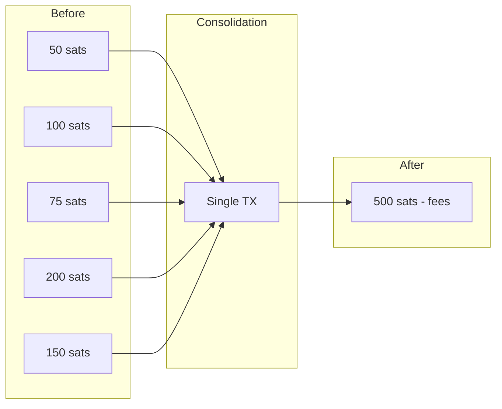

# UTXO Optimization

This guide covers strategies for optimizing UTXOs to reduce transaction costs and improve wallet efficiency.

## Overview

Over time, wallets accumulate many small UTXOs which increase transaction fees. UTXO optimization helps consolidate these into fewer, larger UTXOs.



---

## Why Optimize UTXOs?

| Problem | Impact |
|---------|--------|
| Many small UTXOs | Higher transaction fees |
| Dust UTXOs | May be unspendable |
| Fragmented balance | Complex transaction building |
| Chain limit | Max 25 unconfirmed transactions |

---

## UTXO Analysis

### Analyze UTXO Distribution

```typescript
interface UTXOAnalysis {
    total: bigint;
    count: number;
    dust: number;
    small: number;
    medium: number;
    large: number;
    dustValue: bigint;
}

async function analyzeUTXOs(
    provider: JSONRpcProvider,
    address: string
): Promise<UTXOAnalysis> {
    const utxos = await provider.utxoManager.getUTXOs({
        address,
        optimize: false,  // Get all UTXOs unsorted
    });

    let total = 0n;
    let dust = 0;
    let small = 0;
    let medium = 0;
    let large = 0;
    let dustValue = 0n;

    for (const utxo of utxos) {
        total += utxo.value;

        if (utxo.value < 546n) {
            dust++;
            dustValue += utxo.value;
        } else if (utxo.value < 10000n) {
            small++;
        } else if (utxo.value < 100000n) {
            medium++;
        } else {
            large++;
        }
    }

    return {
        total,
        count: utxos.length,
        dust,
        small,
        medium,
        large,
        dustValue,
    };
}

// Usage
const analysis = await analyzeUTXOs(provider, wallet.p2tr);
console.log('UTXO Analysis:');
console.log(`  Total: ${analysis.total} sats across ${analysis.count} UTXOs`);
console.log(`  Dust (<546 sats): ${analysis.dust}`);
console.log(`  Small (546-10k): ${analysis.small}`);
console.log(`  Medium (10k-100k): ${analysis.medium}`);
console.log(`  Large (>100k): ${analysis.large}`);
```

### Should Consolidate?

```typescript
function shouldConsolidate(analysis: UTXOAnalysis): boolean {
    // Consolidate if many small UTXOs
    if (analysis.small + analysis.dust > 10) {
        return true;
    }

    // Consolidate if total count is high
    if (analysis.count > 20) {
        return true;
    }

    // Consolidate if significant dust value
    if (analysis.dustValue > 10000n) {
        return true;
    }

    return false;
}
```

---

## UTXO Consolidation

### Basic Consolidation

```typescript
async function consolidateUTXOs(
    wallet: Wallet,
    provider: JSONRpcProvider,
    network: Network,
    feeRate: number = 5
): Promise<string> {
    // Get all UTXOs
    const utxos = await provider.utxoManager.getUTXOs({
        address: wallet.p2tr,
        optimize: true,
    });

    if (utxos.length <= 1) {
        console.log('Nothing to consolidate');
        return '';
    }

    const totalValue = utxos.reduce((sum, u) => sum + u.value, 0n);

    // Build consolidation transaction
    const psbt = new Psbt({ network });

    // Add all UTXOs as inputs
    for (const utxo of utxos) {
        psbt.addInput({
            hash: utxo.transactionId,
            index: utxo.outputIndex,
            witnessUtxo: {
                script: utxo.scriptPubKey.toBuffer(),
                value: Number(utxo.value),
            },
            tapInternalKey: wallet.internalPubkey,
        });
    }

    // Calculate fee (each P2TR input ~58 vB, output ~34 vB)
    const estimatedSize = 10 + utxos.length * 58 + 34;
    const fee = BigInt(Math.ceil(estimatedSize * feeRate));

    const outputValue = totalValue - fee;

    if (outputValue < 546n) {
        throw new Error('Consolidation would result in dust');
    }

    // Single output back to self
    psbt.addOutput({
        address: wallet.p2tr,
        value: Number(outputValue),
    });

    // Sign all inputs
    for (let i = 0; i < utxos.length; i++) {
        psbt.signTaprootInput(i, wallet.keypair);
    }
    psbt.finalizeAllInputs();

    const tx = psbt.extractTransaction();
    const result = await provider.sendRawTransaction(tx.toHex());

    // Track UTXO changes
    provider.utxoManager.spentUTXO(wallet.p2tr, utxos, []);

    console.log(`Consolidated ${utxos.length} UTXOs into 1`);
    console.log(`Fee paid: ${fee} sats`);

    return result.txid;
}

// Usage
const txId = await consolidateUTXOs(wallet, provider, network, 5);
console.log('Consolidation TX:', txId);
```

### Selective Consolidation

```typescript
async function consolidateSmallUTXOs(
    wallet: Wallet,
    provider: JSONRpcProvider,
    network: Network,
    threshold: bigint = 10000n,
    feeRate: number = 5
): Promise<string> {
    const utxos = await provider.utxoManager.getUTXOs({
        address: wallet.p2tr,
    });

    // Filter small UTXOs
    const smallUtxos = utxos.filter((u) => u.value < threshold);

    if (smallUtxos.length < 2) {
        console.log('Not enough small UTXOs to consolidate');
        return '';
    }

    const totalValue = smallUtxos.reduce((sum, u) => sum + u.value, 0n);

    // Estimate if consolidation is profitable
    const estimatedSize = 10 + smallUtxos.length * 58 + 34;
    const fee = BigInt(Math.ceil(estimatedSize * feeRate));

    if (totalValue <= fee) {
        console.log('Consolidation not profitable - fee exceeds value');
        return '';
    }

    const psbt = new Psbt({ network });

    for (const utxo of smallUtxos) {
        psbt.addInput({
            hash: utxo.transactionId,
            index: utxo.outputIndex,
            witnessUtxo: {
                script: utxo.scriptPubKey.toBuffer(),
                value: Number(utxo.value),
            },
            tapInternalKey: wallet.internalPubkey,
        });
    }

    psbt.addOutput({
        address: wallet.p2tr,
        value: Number(totalValue - fee),
    });

    for (let i = 0; i < smallUtxos.length; i++) {
        psbt.signTaprootInput(i, wallet.keypair);
    }
    psbt.finalizeAllInputs();

    const tx = psbt.extractTransaction();
    const result = await provider.sendRawTransaction(tx.toHex());

    provider.utxoManager.spentUTXO(wallet.p2tr, smallUtxos, []);

    return result.txid;
}
```

---

## UTXO Splitting

### Split Large UTXO

```typescript
async function splitUTXO(
    wallet: Wallet,
    provider: JSONRpcProvider,
    network: Network,
    splitCount: number = 5,
    feeRate: number = 5
): Promise<string> {
    // Get largest UTXO
    const utxos = await provider.utxoManager.getUTXOs({
        address: wallet.p2tr,
        optimize: true,
    });

    if (utxos.length === 0) {
        throw new Error('No UTXOs available');
    }

    const largestUtxo = utxos[0];

    // Calculate split
    const estimatedSize = 10 + 58 + splitCount * 34;
    const fee = BigInt(Math.ceil(estimatedSize * feeRate));
    const availableValue = largestUtxo.value - fee;
    const valuePerOutput = availableValue / BigInt(splitCount);

    if (valuePerOutput < 546n) {
        throw new Error('Split outputs would be dust');
    }

    const psbt = new Psbt({ network });

    psbt.addInput({
        hash: largestUtxo.transactionId,
        index: largestUtxo.outputIndex,
        witnessUtxo: {
            script: largestUtxo.scriptPubKey.toBuffer(),
            value: Number(largestUtxo.value),
        },
        tapInternalKey: wallet.internalPubkey,
    });

    // Add split outputs
    let remaining = availableValue;
    for (let i = 0; i < splitCount; i++) {
        const outputValue = i === splitCount - 1 ? remaining : valuePerOutput;
        remaining -= outputValue;

        psbt.addOutput({
            address: wallet.p2tr,
            value: Number(outputValue),
        });
    }

    psbt.signTaprootInput(0, wallet.keypair);
    psbt.finalizeAllInputs();

    const tx = psbt.extractTransaction();
    const result = await provider.sendRawTransaction(tx.toHex());

    provider.utxoManager.spentUTXO(wallet.p2tr, [largestUtxo], []);

    console.log(`Split 1 UTXO into ${splitCount} outputs`);

    return result.txid;
}

// Usage - split into 5 UTXOs for batch operations
const txId = await splitUTXO(wallet, provider, network, 5);
```

---

## Batch Payments with UTXO Creation

### Pay Multiple Recipients and Create Change UTXOs

```typescript
interface Payment {
    address: string;
    amount: bigint;
}

async function batchPayWithSplitChange(
    wallet: Wallet,
    provider: JSONRpcProvider,
    network: Network,
    payments: Payment[],
    changeCount: number = 3,
    feeRate: number = 10
): Promise<string> {
    const totalPayments = payments.reduce((sum, p) => sum + p.amount, 0n);

    // Get UTXOs
    const utxos = await provider.utxoManager.getUTXOsForAmount({
        address: wallet.p2tr,
        amount: totalPayments + 50000n,  // Buffer
        throwErrors: true,
    });

    const inputValue = utxos.reduce((sum, u) => sum + u.value, 0n);

    const psbt = new Psbt({ network });

    // Add inputs
    for (const utxo of utxos) {
        psbt.addInput({
            hash: utxo.transactionId,
            index: utxo.outputIndex,
            witnessUtxo: {
                script: utxo.scriptPubKey.toBuffer(),
                value: Number(utxo.value),
            },
            tapInternalKey: wallet.internalPubkey,
        });
    }

    // Add payment outputs
    for (const payment of payments) {
        psbt.addOutput({
            address: payment.address,
            value: Number(payment.amount),
        });
    }

    // Calculate fee and change
    const outputCount = payments.length + changeCount;
    const estimatedSize = 10 + utxos.length * 58 + outputCount * 34;
    const fee = BigInt(Math.ceil(estimatedSize * feeRate));

    const totalChange = inputValue - totalPayments - fee;
    const changePerOutput = totalChange / BigInt(changeCount);

    // Add change outputs (split change into multiple UTXOs)
    if (changePerOutput > 546n) {
        let remaining = totalChange;
        for (let i = 0; i < changeCount; i++) {
            const value = i === changeCount - 1 ? remaining : changePerOutput;
            remaining -= value;

            psbt.addOutput({
                address: wallet.p2tr,
                value: Number(value),
            });
        }
    } else if (totalChange > 546n) {
        // Single change output if split would be dust
        psbt.addOutput({
            address: wallet.p2tr,
            value: Number(totalChange),
        });
    }

    // Sign and broadcast
    for (let i = 0; i < utxos.length; i++) {
        psbt.signTaprootInput(i, wallet.keypair);
    }
    psbt.finalizeAllInputs();

    const tx = psbt.extractTransaction();
    const result = await provider.sendRawTransaction(tx.toHex());

    provider.utxoManager.spentUTXO(wallet.p2tr, utxos, []);

    return result.txid;
}
```

---

## Optimal UTXO Strategy

### UTXO Optimization Service

```typescript
class UTXOOptimizer {
    constructor(
        private provider: JSONRpcProvider,
        private wallet: Wallet,
        private network: Network
    ) {}

    async analyze(): Promise<UTXOAnalysis> {
        return analyzeUTXOs(this.provider, this.wallet.p2tr);
    }

    async getOptimizationRecommendation(): Promise<string> {
        const analysis = await this.analyze();

        if (analysis.count === 0) {
            return 'No UTXOs found';
        }

        if (analysis.count === 1) {
            if (analysis.total > 1_000_000n) {
                return 'Consider splitting for parallel transactions';
            }
            return 'Single UTXO - optimal';
        }

        if (analysis.dust > 0) {
            return `Consolidate ${analysis.dust} dust UTXOs to reclaim ${analysis.dustValue} sats`;
        }

        if (analysis.small > 10) {
            return `Consolidate ${analysis.small} small UTXOs to reduce future fees`;
        }

        if (analysis.count > 20) {
            return `Consolidate to reduce UTXO count from ${analysis.count}`;
        }

        return 'UTXO set is healthy';
    }

    async consolidateIfNeeded(
        feeRate: number = 5
    ): Promise<string | null> {
        const analysis = await this.analyze();

        if (!shouldConsolidate(analysis)) {
            console.log('Consolidation not needed');
            return null;
        }

        return consolidateUTXOs(
            this.wallet,
            this.provider,
            this.network,
            feeRate
        );
    }

    async prepareForBatch(
        operationCount: number,
        feeRate: number = 5
    ): Promise<void> {
        const utxos = await this.provider.utxoManager.getUTXOs({
            address: this.wallet.p2tr,
        });

        if (utxos.length >= operationCount) {
            console.log('Sufficient UTXOs for batch operations');
            return;
        }

        const needed = operationCount - utxos.length + 1;
        console.log(`Splitting to create ${needed} more UTXOs`);

        await splitUTXO(
            this.wallet,
            this.provider,
            this.network,
            needed,
            feeRate
        );
    }
}

// Usage
const optimizer = new UTXOOptimizer(provider, wallet, network);

const recommendation = await optimizer.getOptimizationRecommendation();
console.log('Recommendation:', recommendation);

// Auto-consolidate if needed
const txId = await optimizer.consolidateIfNeeded(5);
if (txId) {
    console.log('Consolidated in TX:', txId);
}

// Prepare for 10 parallel transactions
await optimizer.prepareForBatch(10);
```

---

## Best Practices

1. **Monitor UTXO Count**: Keep total UTXOs reasonable (<50)

2. **Consolidate During Low Fees**: Wait for low fee periods

3. **Avoid Dust Creation**: Don't create outputs < 546 sats

4. **Split for Parallel Ops**: Split before batch operations

5. **Regular Maintenance**: Periodically analyze and optimize

---

## When to Optimize

| Scenario | Action |
|----------|--------|
| Many dust UTXOs | Consolidate (low priority) |
| Many small UTXOs | Consolidate when fees low |
| Single large UTXO | Split before batch operations |
| High UTXO count | Consolidate to reduce future fees |
| Low fee environment | Good time to consolidate |

---

## Next Steps

- [Balances](./balances.md) - Balance queries
- [UTXOs](./utxos.md) - UTXO management
- [Sending Bitcoin](./sending-bitcoin.md) - Transaction building

---

[← Previous: Sending Bitcoin](./sending-bitcoin.md) | [Next: Block Operations →](../blocks/block-operations.md)
