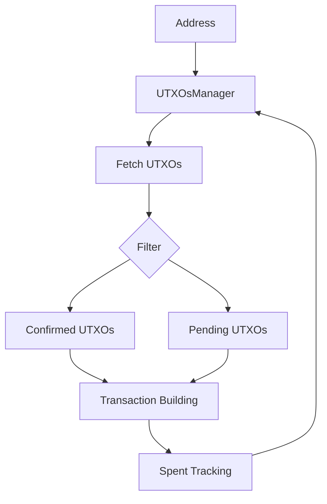

# UTXO Management

This guide covers managing unspent transaction outputs (UTXOs) for OPNet transactions.

## Overview

UTXOs (Unspent Transaction Outputs) are the fundamental building blocks of Bitcoin transactions. The `UTXOsManager` class provides comprehensive UTXO management for building transactions.



---

## Accessing UTXOs Manager

```typescript
import { JSONRpcProvider } from 'opnet';
import { networks } from '@btc-vision/bitcoin';

const network = networks.regtest;
const provider = new JSONRpcProvider({ url: 'https://regtest.opnet.org', network });

// Access the UTXOs manager
const utxoManager = provider.utxoManager;
```

---

## Fetching UTXOs

### Basic UTXO Fetch

```typescript
const utxos = await utxoManager.getUTXOs({
    address: wallet.p2tr,
});

console.log('UTXOs found:', utxos.length);
for (const utxo of utxos) {
    console.log(`  ${utxo.transactionId}:${utxo.outputIndex} - ${utxo.value} sats`);
}
```

### RequestUTXOsParams Reference

```typescript
interface RequestUTXOsParams {
    address: string;              // Required: address to fetch UTXOs for
    optimize?: boolean;           // Default: true - sort by value
    mergePendingUTXOs?: boolean;  // Default: true - include unconfirmed
    filterSpentUTXOs?: boolean;   // Default: true - exclude known spent
    olderThan?: bigint;           // Only UTXOs older than this block
    isCSV?: boolean;              // Default: false - CSV (timelock) UTXOs
}
```

### Fetch with Options

```typescript
// Get only confirmed UTXOs
const confirmedOnly = await utxoManager.getUTXOs({
    address: wallet.p2tr,
    mergePendingUTXOs: false,
});

// Get UTXOs optimized by value (largest first)
const optimized = await utxoManager.getUTXOs({
    address: wallet.p2tr,
    optimize: true,
});

// Include spent UTXOs (for debugging)
const allUtxos = await utxoManager.getUTXOs({
    address: wallet.p2tr,
    filterSpentUTXOs: false,
});
```

---

## Fetching UTXOs for Specific Amount

### Get Enough UTXOs for Amount

```typescript
const utxos = await utxoManager.getUTXOsForAmount({
    address: wallet.p2tr,
    amount: 100000n,  // 100,000 satoshis needed
});

// Calculate total value
const total = utxos.reduce((sum, utxo) => sum + utxo.value, 0n);
console.log(`Selected ${utxos.length} UTXOs totaling ${total} sats`);
```

### RequestUTXOsParamsWithAmount Reference

```typescript
interface RequestUTXOsParamsWithAmount extends RequestUTXOsParams {
    amount: bigint;                    // Required: amount needed
    throwErrors?: boolean;             // Default: false - throw if insufficient
    csvAddress?: string;               // Optional: CSV address for priority
    maxUTXOs?: number;                 // Default: 5000 - max UTXOs to select
    throwIfUTXOsLimitReached?: boolean; // Throw if limit reached
}
```

### With Error Handling

```typescript
async function getRequiredUTXOs(
    utxoManager: UTXOsManager,
    address: string,
    amount: bigint
): Promise<UTXO[]> {
    try {
        const utxos = await utxoManager.getUTXOsForAmount({
            address,
            amount,
            throwErrors: true,
        });

        return utxos;
    } catch (error) {
        if (error instanceof Error && error.message.includes('Insufficient')) {
            throw new Error(`Not enough funds. Need ${amount} sats`);
        }
        throw error;
    }
}
```

---

## Tracking Spent UTXOs

### Mark UTXOs as Spent

After sending a transaction, mark the spent UTXOs and add new ones:

```typescript
// After sending transaction
const spentUtxos = usedUtxos;  // UTXOs used in the transaction
const newUtxos = receipt.newUTXOs;  // New UTXOs from change output

utxoManager.spentUTXO(
    wallet.p2tr,    // Address
    spentUtxos,     // Spent UTXOs
    newUtxos        // New UTXOs created
);
```

### Integration with Transaction Sending

```typescript
import { CallResult, TransactionParameters, UTXOsManager } from 'opnet';

async function sendTransactionWithTracking<T extends Record<string, unknown>>(
    simulation: CallResult<T>,
    params: TransactionParameters,
    utxoManager: UTXOsManager
): Promise<string> {
    const receipt = await simulation.sendTransaction(params);

    // Track UTXO state
    if (params.utxos) {
        utxoManager.spentUTXO(
            params.refundTo,
            params.utxos,
            receipt.newUTXOs
        );
    }

    return receipt.transactionId;
}
```

---

## Pending UTXOs

### Get Pending (Unconfirmed) UTXOs

```typescript
const pendingUtxos = utxoManager.getPendingUTXOs(wallet.p2tr);

console.log('Pending UTXOs:', pendingUtxos.length);
for (const utxo of pendingUtxos) {
    console.log(`  Pending: ${utxo.transactionId}:${utxo.outputIndex}`);
}
```

### Working with Pending UTXOs

```typescript
async function waitForConfirmation(
    provider: JSONRpcProvider,
    address: string,
    maxWaitMs: number = 60000
): Promise<void> {
    const startTime = Date.now();

    while (Date.now() - startTime < maxWaitMs) {
        const pending = provider.utxoManager.getPendingUTXOs(address);

        if (pending.length === 0) {
            console.log('All UTXOs confirmed');
            return;
        }

        console.log(`Waiting for ${pending.length} pending UTXOs...`);
        await new Promise((resolve) => setTimeout(resolve, 5000));
    }

    throw new Error('Timeout waiting for confirmation');
}
```

---

## Mempool Chain Limit

OPNet enforces a mempool chain limit of 25 unconfirmed transaction descendants.

```typescript
// This will throw if limit exceeded
try {
    utxoManager.spentUTXO(address, spentUtxos, newUtxos);
} catch (error) {
    if (error instanceof Error && error.message.includes('too-long-mempool-chain')) {
        console.error('Too many unconfirmed transactions. Wait for confirmation.');
    }
}
```

---

## Multiple Address UTXO Fetch

### Batch UTXO Query

```typescript
const result = await utxoManager.getMultipleUTXOs({
    requests: [
        { address: 'bcrt1p...address1...' },
        { address: 'bcrt1p...address2...' },
        { address: 'bcrt1p...address3...' },
    ],
    mergePendingUTXOs: true,
    filterSpentUTXOs: true,
});

// result is Record<string, UTXOs>
for (const [address, utxos] of Object.entries(result)) {
    const total = utxos.reduce((sum, u) => sum + u.value, 0n);
    console.log(`${address}: ${utxos.length} UTXOs, ${total} sats`);
}
```

---

## UTXO Class Reference

```typescript
class UTXO {
    readonly transactionId: string;             // Previous transaction hash
    readonly outputIndex: number;               // Output index in transaction
    readonly value: bigint;                     // Satoshi value
    readonly scriptPubKey: ScriptPubKey;        // Locking script
    readonly nonWitnessUtxo?: Uint8Array | string; // Full previous transaction
    witnessScript?: Uint8Array | string;        // Witness script
    redeemScript?: Uint8Array | string;         // Redeem script
    isCSV?: boolean;                            // CheckSequenceVerify timelock
}
```

---

## Cleaning UTXO State

### Reset Cache

```typescript
// Reset single address
utxoManager.clean(wallet.p2tr);

// Reset all addresses
utxoManager.clean();
```

### When to Clean

```typescript
// After transaction confirmation
async function onTransactionConfirmed(
    provider: JSONRpcProvider,
    address: string
): Promise<void> {
    // Clean cached state
    provider.utxoManager.clean(address);

    // Fetch fresh UTXOs
    const utxos = await provider.utxoManager.getUTXOs({
        address,
        mergePendingUTXOs: false,  // Only confirmed
    });

    console.log('Confirmed UTXOs:', utxos.length);
}
```

---

## Complete UTXO Service

```typescript
class UTXOService {
    private provider: JSONRpcProvider;

    constructor(provider: JSONRpcProvider) {
        this.provider = provider;
    }

    get manager(): UTXOsManager {
        return this.provider.utxoManager;
    }

    async getBalance(address: string): Promise<bigint> {
        const utxos = await this.manager.getUTXOs({ address });
        return utxos.reduce((sum, utxo) => sum + utxo.value, 0n);
    }

    async getSpendableUTXOs(
        address: string,
        amount: bigint
    ): Promise<UTXO[]> {
        return this.manager.getUTXOsForAmount({
            address,
            amount,
            optimize: true,
            throwErrors: true,
        });
    }

    async countUTXOs(address: string): Promise<{
        confirmed: number;
        pending: number;
    }> {
        const all = await this.manager.getUTXOs({
            address,
            mergePendingUTXOs: true,
        });

        const confirmed = await this.manager.getUTXOs({
            address,
            mergePendingUTXOs: false,
        });

        return {
            confirmed: confirmed.length,
            pending: all.length - confirmed.length,
        };
    }

    markSpent(address: string, spent: UTXO[], newUTXOs: UTXO[]): void {
        this.manager.spentUTXO(address, spent, newUTXOs);
    }

    reset(address?: string): void {
        this.manager.clean(address);
    }
}

// Usage
const utxoService = new UTXOService(provider);

const balance = await utxoService.getBalance(wallet.p2tr);
console.log('Balance:', balance);

const utxos = await utxoService.getSpendableUTXOs(wallet.p2tr, 100000n);
console.log('Selected UTXOs:', utxos.length);

const counts = await utxoService.countUTXOs(wallet.p2tr);
console.log('Confirmed:', counts.confirmed, 'Pending:', counts.pending);
```

---

## Best Practices

1. **Track Spent UTXOs**: Always call `spentUTXO()` after transactions

2. **Use Optimization**: Enable `optimize: true` for efficient UTXO selection

3. **Handle Chain Limits**: Respect the 25 unconfirmed transaction limit

4. **Clean Periodically**: Reset state after confirmations

5. **Batch Queries**: Use `getMultipleUTXOs()` for multiple addresses

---

## Next Steps

- [Sending Bitcoin](./sending-bitcoin.md) - Building transactions
- [UTXO Optimization](./utxo-optimization.md) - Consolidation strategies
- [Transaction Configuration](../contracts/transaction-configuration.md) - TX options

---

[← Previous: Balances](./balances.md) | [Next: Sending Bitcoin →](./sending-bitcoin.md)
