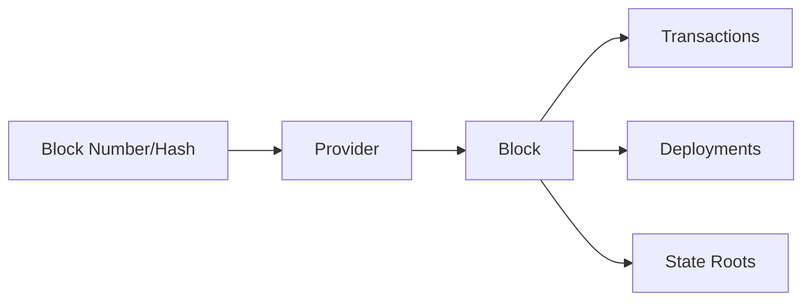

# Block Operations

This guide covers fetching and working with blocks on OPNet.

## Overview

OPNet blocks contain Bitcoin transaction data plus OPNet-specific state information like gas usage, storage roots, and deployed contracts.



---

## Get Current Block Number

```typescript
import { JSONRpcProvider } from 'opnet';
import { networks } from '@btc-vision/bitcoin';

const network = networks.regtest;
const provider = new JSONRpcProvider({ url: 'https://regtest.opnet.org', network });

const blockNumber = await provider.getBlockNumber();
console.log('Current block:', blockNumber);
```

---

## Fetching Blocks

### Get Block by Number

```typescript
const block = await provider.getBlock(123456);

console.log('Block info:');
console.log('  Height:', block.height);
console.log('  Hash:', block.hash);
console.log('  Time:', new Date(block.time * 1000));
console.log('  TX count:', block.txCount);
```

### Get Block by Hash

```typescript
const block = await provider.getBlockByHash(
    '00000000000000000001a2b3c4d5e6f...'
);

console.log('Block height:', block.height);
```

### Get Block by Checksum

```typescript
const block = await provider.getBlockByChecksum(
    '0xabcdef123456...'
);

console.log('Block:', block.height);
```

### Get Block with Transactions

```typescript
// Prefetch transactions for faster access
const block = await provider.getBlock(123456, true);

console.log('Transactions:', block.transactions.length);
for (const tx of block.transactions) {
    console.log('  TX:', tx.hash);
}
```

---

## Block Class Reference

```typescript
interface Block {
    // Identity
    height: BigNumberish;
    hash: string;
    previousBlockHash: string;
    previousBlockChecksum: string;

    // Mining info
    bits: string;
    nonce: number;
    version: number;

    // Size metrics
    size: number;
    weight: number;
    strippedSize: number;
    txCount: number;

    // Timestamps
    time: number;          // Unix timestamp
    medianTime: number;

    // State roots (OPNet specific)
    checksumRoot: string;
    merkleRoot: string;
    storageRoot: string;
    receiptRoot: string;

    // Gas info
    ema: bigint;
    baseGas: bigint;
    gasUsed: bigint;

    // Proofs
    checksumProofs: BlockHeaderChecksumProof;

    // Accessors
    transactions: TransactionBase[];  // Parsed transactions
    deployments: Address[];           // Deployed contracts
    rawTransactions: ITransaction[];  // Raw transaction data
}
```

---

## Get Multiple Blocks

### Batch Block Fetch

```typescript
const blockNumbers = [100, 101, 102, 103, 104];
const blocks = await provider.getBlocks(blockNumbers);

for (const block of blocks) {
    console.log(`Block ${block.height}: ${block.txCount} transactions`);
}
```

### Fetch Block Range

```typescript
async function getBlockRange(
    provider: JSONRpcProvider,
    startBlock: number,
    endBlock: number
): Promise<Block[]> {
    const blockNumbers: number[] = [];
    for (let i = startBlock; i <= endBlock; i++) {
        blockNumbers.push(i);
    }

    return provider.getBlocks(blockNumbers);
}

// Usage
const blocks = await getBlockRange(provider, 100, 110);
console.log('Fetched', blocks.length, 'blocks');
```

---

## Working with Block Data

### Get Deployed Contracts in Block

```typescript
async function getDeploymentsInBlock(
    provider: JSONRpcProvider,
    blockNumber: number
): Promise<Address[]> {
    const block = await provider.getBlock(blockNumber, true);
    return block.deployments;
}

// Usage
const deployments = await getDeploymentsInBlock(provider, 123456);
console.log('Deployed contracts:', deployments.length);
for (const addr of deployments) {
    console.log('  Contract:', addr.toHex());
}
```

### Analyze Block Gas Usage

```typescript
async function analyzeBlockGas(
    provider: JSONRpcProvider,
    blockNumber: number
): Promise<{
    gasUsed: bigint;
    baseGas: bigint;
    ema: bigint;
}> {
    const block = await provider.getBlock(blockNumber);

    return {
        gasUsed: block.gasUsed,
        baseGas: block.baseGas,
        ema: block.ema,
    };
}

// Usage
const gasInfo = await analyzeBlockGas(provider, 123456);
console.log('Gas used:', gasInfo.gasUsed);
console.log('Base gas:', gasInfo.baseGas);
console.log('EMA:', gasInfo.ema);
```

### Find Block by Time

```typescript
async function findBlockByTime(
    provider: JSONRpcProvider,
    targetTime: Date
): Promise<Block | null> {
    const targetTimestamp = Math.floor(targetTime.getTime() / 1000);
    const currentBlock = await provider.getBlockNumber();

    // Binary search for block
    let low = 1n;
    let high = currentBlock;

    while (low <= high) {
        const mid = (low + high) / 2n;
        const block = await provider.getBlock(mid);

        if (block.time === targetTimestamp) {
            return block;
        } else if (block.time < targetTimestamp) {
            low = mid + 1n;
        } else {
            high = mid - 1n;
        }
    }

    // Return closest block
    return provider.getBlock(low);
}
```

---

## Block Monitoring

### Poll for New Blocks

```typescript
async function monitorBlocks(
    provider: JSONRpcProvider,
    callback: (block: Block) => void,
    intervalMs: number = 10000
): Promise<() => void> {
    let lastBlock = await provider.getBlockNumber();

    const intervalId = setInterval(async () => {
        try {
            const currentBlock = await provider.getBlockNumber();

            if (currentBlock > lastBlock) {
                // Fetch new blocks
                for (let i = lastBlock + 1n; i <= currentBlock; i++) {
                    const block = await provider.getBlock(i);
                    callback(block);
                }
                lastBlock = currentBlock;
            }
        } catch (error) {
            console.error('Error monitoring blocks:', error);
        }
    }, intervalMs);

    return () => clearInterval(intervalId);
}

// Usage
const stopMonitoring = await monitorBlocks(provider, (block) => {
    console.log(`New block: ${block.height} with ${block.txCount} transactions`);
});

// Later: stop monitoring
// stopMonitoring();
```

### Polling-Based Real-Time Monitoring

For real-time block monitoring, use the polling approach shown above. The `getBlockNumber()` method can be called periodically to detect new blocks and fetch them as they arrive.

---

## Complete Block Service

```typescript
class BlockService {
    private provider: JSONRpcProvider;
    private blockCache: Map<string, Block> = new Map();

    constructor(provider: JSONRpcProvider) {
        this.provider = provider;
    }

    async getCurrentHeight(): Promise<bigint> {
        return this.provider.getBlockNumber();
    }

    async getBlock(blockNumberOrHash: number | string): Promise<Block> {
        const cacheKey = String(blockNumberOrHash);

        if (this.blockCache.has(cacheKey)) {
            return this.blockCache.get(cacheKey)!;
        }

        const block = await this.provider.getBlock(blockNumberOrHash);
        this.blockCache.set(cacheKey, block);
        this.blockCache.set(block.hash, block);

        return block;
    }

    async getBlocksInRange(
        start: number,
        end: number
    ): Promise<Block[]> {
        const numbers: number[] = [];
        for (let i = start; i <= end; i++) {
            numbers.push(i);
        }
        return this.provider.getBlocks(numbers);
    }

    async getLatestBlocks(count: number): Promise<Block[]> {
        const current = await this.getCurrentHeight();
        const start = Number(current) - count + 1;
        return this.getBlocksInRange(Math.max(1, start), Number(current));
    }

    async getBlockTransactions(
        blockNumber: number
    ): Promise<TransactionBase[]> {
        const block = await this.provider.getBlock(blockNumber, true);
        return block.transactions;
    }

    async getBlockDeployments(blockNumber: number): Promise<Address[]> {
        const block = await this.provider.getBlock(blockNumber, true);
        return block.deployments;
    }

    clearCache(): void {
        this.blockCache.clear();
    }
}

// Usage
const blockService = new BlockService(provider);

const height = await blockService.getCurrentHeight();
console.log('Current height:', height);

const latestBlocks = await blockService.getLatestBlocks(10);
console.log('Latest 10 blocks:', latestBlocks.map(b => b.height));

const deployments = await blockService.getBlockDeployments(123456);
console.log('Deployments:', deployments.length);
```

---

## Building Indexers

When building indexers that process blocks and transactions, **threading is highly recommended** for performance.

### Why Use Threading?

- **Block processing is CPU-intensive**: Parsing transactions, decoding events, and updating state
- **I/O bound operations**: Fetching blocks from the network while processing others
- **Database writes**: Writing indexed data shouldn't block fetching
- **Parallel transaction processing**: Transactions within a block can often be processed concurrently

### Recommended Architecture

```typescript
// Conceptual indexer architecture with worker threads
import { Worker, isMainThread, parentPort, workerData } from 'worker_threads';

// Main thread: fetches blocks and dispatches to workers
// Worker threads: process blocks, decode transactions, index data

interface IndexerConfig {
    workerCount: number;      // Number of worker threads (recommend: CPU cores - 1)
    batchSize: number;        // Blocks per batch
    queueSize: number;        // Max blocks in processing queue
}

// Fetch blocks in main thread
async function fetchBlocks(provider: JSONRpcProvider, start: bigint, end: bigint) {
    const blockNumbers: number[] = [];
    for (let i = start; i <= end; i++) {
        blockNumbers.push(Number(i));
    }
    return provider.getBlocks(blockNumbers);
}

// Process blocks in worker threads
// Each worker handles: transaction parsing, event decoding, database writes
```

### Key Recommendations

1. **Separate fetching from processing**: Use main thread for I/O, workers for CPU work

2. **Batch block fetches**: Fetch multiple blocks at once with `getBlocks()`

3. **Use worker pools**: Distribute block processing across multiple threads

4. **Queue management**: Implement backpressure to avoid memory issues

5. **Database connection pooling**: Each worker should have its own DB connection

6. **Handle reorgs**: Implement rollback logic for chain reorganizations

> **Performance Tip**: For high-throughput indexers, consider using separate processes for fetching, processing, and database operations, communicating via message queues.

---

## Best Practices

1. **Use Batch Requests**: Use `getBlocks()` for multiple blocks

2. **Cache Blocks**: Blocks are immutable, safe to cache

3. **Prefetch Transactions**: Set `prefetchTxs: true` when needed

4. **Handle Missing Blocks**: Blocks may not exist for future numbers

5. **Monitor with WebSocket**: Use WebSocket for real-time updates

6. **Use Threading for Indexers**: Process blocks in parallel for performance

---

## Next Steps

- [Gas Parameters](./gas-parameters.md) - Block gas information
- [Block Witnesses](./block-witnesses.md) - Witness and proof data
- [Reorg Detection](./reorg-detection.md) - Chain reorganization

---

[← Previous: UTXO Optimization](../bitcoin/utxo-optimization.md) | [Next: Gas Parameters →](./gas-parameters.md)
