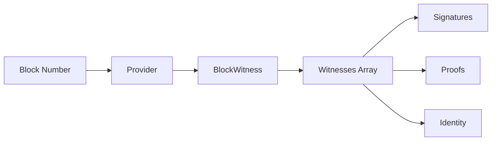

# Block Witnesses

This guide covers fetching and validating block witnesses for proof verification.

## Overview

Block witnesses provide cryptographic proofs that verify block validity. Witnesses can be trusted (from known validators) or untrusted (requiring additional verification).



---

## Fetching Block Witnesses

### Basic Witness Query

```typescript
import { JSONRpcProvider } from 'opnet';
import { networks } from '@btc-vision/bitcoin';

const network = networks.regtest;
const provider = new JSONRpcProvider({ url: 'https://regtest.opnet.org', network });

// getBlockWitness returns BlockWitnesses (readonly IBlockWitness[])
const blockWitnesses = await provider.getBlockWitness(123456n);

for (const bw of blockWitnesses) {
    console.log('Block:', bw.blockNumber);
    console.log('Witness count:', bw.witnesses.length);
}
```

### With Options

```typescript
// Get only trusted witnesses
const trustedWitnesses = await provider.getBlockWitness(
    123456n,
    true,     // trusted only
    100,      // limit
    0         // page
);

// Get all witnesses (including untrusted)
const allWitnesses = await provider.getBlockWitness(
    123456n,
    false,    // include untrusted
    100,
    0
);
```

### Method Signature

```typescript
async getBlockWitness(
    height?: BigNumberish,  // Block height (-1 for latest)
    trusted?: boolean,      // Filter trusted only
    limit?: number,         // Max witnesses to return
    page?: number           // Pagination offset
): Promise<BlockWitnesses>
```

---

## BlockWitness Structure

```typescript
// BlockWitnesses is an array of IBlockWitness
type BlockWitnesses = readonly IBlockWitness[];

interface IBlockWitness {
    blockNumber: bigint;
    readonly witnesses: readonly IBlockWitnessAPI[];
}

interface IBlockWitnessAPI {
    readonly trusted: boolean;           // Is trusted validator
    readonly signature: Uint8Array;      // Witness signature
    readonly timestamp: number;          // When witnessed
    readonly proofs: readonly Uint8Array[]; // Merkle proofs
    readonly identity?: Uint8Array;      // Validator identity
    readonly publicKey?: Address;        // Validator public key
}
```

---

## Working with Witnesses

### Check if Block is Witnessed

```typescript
async function isBlockWitnessed(
    provider: JSONRpcProvider,
    blockNumber: bigint
): Promise<boolean> {
    try {
        const blockWitnesses = await provider.getBlockWitness(blockNumber);
        return blockWitnesses.some(bw => bw.witnesses.length > 0);
    } catch {
        return false;
    }
}

// Usage
const witnessed = await isBlockWitnessed(provider, 123456n);
console.log('Block witnessed:', witnessed);
```

### Get Trusted Witness Count

```typescript
async function getTrustedWitnessCount(
    provider: JSONRpcProvider,
    blockNumber: bigint
): Promise<number> {
    const blockWitnesses = await provider.getBlockWitness(blockNumber);

    let count = 0;
    for (const bw of blockWitnesses) {
        count += bw.witnesses.filter(w => w.trusted).length;
    }
    return count;
}

// Usage
const trustedCount = await getTrustedWitnessCount(provider, 123456n);
console.log('Trusted witnesses:', trustedCount);
```

### Validate Minimum Witnesses

```typescript
async function hasMinimumWitnesses(
    provider: JSONRpcProvider,
    blockNumber: bigint,
    minTrusted: number = 1
): Promise<boolean> {
    const count = await getTrustedWitnessCount(provider, blockNumber);
    return count >= minTrusted;
}

// Usage
const hasEnough = await hasMinimumWitnesses(provider, 123456n, 3);
if (!hasEnough) {
    console.log('Block may not be final yet');
}
```

---

## Witness Analysis

### Analyze Witness Details

```typescript
async function analyzeWitnesses(
    provider: JSONRpcProvider,
    blockNumber: bigint
): Promise<{
    total: number;
    trusted: number;
    untrusted: number;
    validators: Address[];
    timestamps: number[];
}> {
    const blockWitnesses = await provider.getBlockWitness(blockNumber, false);

    // Flatten all witnesses from all blocks in the result
    const allWitnesses = blockWitnesses.flatMap(bw => [...bw.witnesses]);

    const trusted = allWitnesses.filter(w => w.trusted);
    const untrusted = allWitnesses.filter(w => !w.trusted);

    const validators = allWitnesses
        .filter(w => w.publicKey)
        .map(w => w.publicKey!);

    const timestamps = allWitnesses.map(w => w.timestamp);

    return {
        total: allWitnesses.length,
        trusted: trusted.length,
        untrusted: untrusted.length,
        validators,
        timestamps,
    };
}

// Usage
const analysis = await analyzeWitnesses(provider, 123456n);
console.log('Witness Analysis:');
console.log('  Total:', analysis.total);
console.log('  Trusted:', analysis.trusted);
console.log('  Untrusted:', analysis.untrusted);
console.log('  Validators:', analysis.validators.length);
```

### Get Witness Timing

```typescript
async function getWitnessTiming(
    provider: JSONRpcProvider,
    blockNumber: bigint
): Promise<{
    firstWitness: number;
    lastWitness: number;
    timespanMs: number;
}> {
    const blockWitnesses = await provider.getBlockWitness(blockNumber);
    const allWitnesses = blockWitnesses.flatMap(bw => [...bw.witnesses]);

    if (allWitnesses.length === 0) {
        throw new Error('No witnesses found');
    }

    const timestamps = allWitnesses.map(w => w.timestamp);
    const firstWitness = Math.min(...timestamps);
    const lastWitness = Math.max(...timestamps);

    return {
        firstWitness,
        lastWitness,
        timespanMs: (lastWitness - firstWitness) * 1000,
    };
}

// Usage
const timing = await getWitnessTiming(provider, 123456n);
console.log('First witness:', new Date(timing.firstWitness * 1000));
console.log('Last witness:', new Date(timing.lastWitness * 1000));
```

---

## Paginating Witnesses

### Fetch All Witnesses with Pagination

```typescript
async function getAllWitnesses(
    provider: JSONRpcProvider,
    blockNumber: bigint,
    pageSize: number = 100
): Promise<IBlockWitnessAPI[]> {
    const allWitnesses: IBlockWitnessAPI[] = [];
    let page = 0;

    while (true) {
        const blockWitnesses = await provider.getBlockWitness(
            blockNumber,
            false,
            pageSize,
            page
        );

        const pageWitnesses = blockWitnesses.flatMap(bw => [...bw.witnesses]);
        allWitnesses.push(...pageWitnesses);

        if (pageWitnesses.length < pageSize) {
            break;
        }

        page++;
    }

    return allWitnesses;
}

// Usage
const allWitnesses = await getAllWitnesses(provider, 123456n);
console.log('Total witnesses:', allWitnesses.length);
```

---

## Witness Verification

### Verify Witness Signature

```typescript
// Note: Actual verification depends on your crypto library
async function verifyWitnessSignature(
    witness: BlockWitnessAPI,
    blockHash: string
): Promise<boolean> {
    if (!witness.publicKey) {
        return false;
    }

    // This is conceptual - actual verification depends on
    // the signature scheme used (Schnorr, ECDSA, etc.)
    try {
        // Verify signature against block hash
        // const valid = crypto.verify(
        //     witness.publicKey,
        //     witness.signature,
        //     fromHex(blockHash)
        // );
        // return valid;

        return witness.trusted; // Simplified for trusted witnesses
    } catch {
        return false;
    }
}
```

### Check Block Finality

```typescript
interface FinalityStatus {
    isFinalized: boolean;
    trustedWitnesses: number;
    minimumRequired: number;
    confidence: number;
}

async function checkBlockFinality(
    provider: JSONRpcProvider,
    blockNumber: bigint,
    minWitnesses: number = 3
): Promise<FinalityStatus> {
    const blockWitnesses = await provider.getBlockWitness(blockNumber);
    const allWitnesses = blockWitnesses.flatMap(bw => [...bw.witnesses]);
    const trustedCount = allWitnesses.filter(w => w.trusted).length;

    const isFinalized = trustedCount >= minWitnesses;
    const confidence = Math.min(100, (trustedCount / minWitnesses) * 100);

    return {
        isFinalized,
        trustedWitnesses: trustedCount,
        minimumRequired: minWitnesses,
        confidence: Math.round(confidence),
    };
}

// Usage
const finality = await checkBlockFinality(provider, 123456n);
console.log('Block finality:', finality.isFinalized ? 'FINAL' : 'PENDING');
console.log(`Confidence: ${finality.confidence}%`);
```

---

## Complete Witness Service

```typescript
class WitnessService {
    constructor(private provider: JSONRpcProvider) {}

    async getWitnesses(
        blockNumber: bigint,
        trustedOnly: boolean = false
    ): Promise<IBlockWitnessAPI[]> {
        const blockWitnesses = await this.provider.getBlockWitness(
            blockNumber,
            trustedOnly
        );
        return blockWitnesses.flatMap(bw => [...bw.witnesses]);
    }

    async getWitnessCount(
        blockNumber: bigint
    ): Promise<{ total: number; trusted: number }> {
        const witnesses = await this.getWitnesses(blockNumber);

        return {
            total: witnesses.length,
            trusted: witnesses.filter(w => w.trusted).length,
        };
    }

    async isFinalized(
        blockNumber: bigint,
        minTrusted: number = 1
    ): Promise<boolean> {
        const { trusted } = await this.getWitnessCount(blockNumber);
        return trusted >= minTrusted;
    }

    async waitForFinality(
        blockNumber: bigint,
        minTrusted: number = 1,
        timeoutMs: number = 60000
    ): Promise<boolean> {
        const startTime = Date.now();

        while (Date.now() - startTime < timeoutMs) {
            if (await this.isFinalized(blockNumber, minTrusted)) {
                return true;
            }

            await new Promise(r => setTimeout(r, 5000));
        }

        return false;
    }

    async getValidators(blockNumber: bigint): Promise<Address[]> {
        const witnesses = await this.getWitnesses(blockNumber, true);
        return witnesses
            .filter(w => w.publicKey)
            .map(w => w.publicKey!);
    }
}

// Usage
const witnessService = new WitnessService(provider);

const counts = await witnessService.getWitnessCount(123456n);
console.log('Witnesses:', counts.total, '(trusted:', counts.trusted + ')');

const finalized = await witnessService.isFinalized(123456n);
console.log('Finalized:', finalized);

// Wait for block to be finalized
const success = await witnessService.waitForFinality(123456n, 3, 30000);
console.log('Finality achieved:', success);
```

---

## Best Practices

1. **Check Trusted Witnesses**: Prefer trusted validators for finality

2. **Wait for Finality**: Important transactions should wait for witnesses

3. **Handle Missing Witnesses**: Recent blocks may not have witnesses yet

4. **Paginate Large Results**: Use pagination for blocks with many witnesses

5. **Cache Witness Data**: Witnesses don't change after confirmation

---

## Next Steps

- [Block Operations](./block-operations.md) - Fetching blocks
- [Reorg Detection](./reorg-detection.md) - Chain reorganization
- [Gas Parameters](./gas-parameters.md) - Gas information

---

[← Previous: Gas Parameters](./gas-parameters.md) | [Next: Reorg Detection →](./reorg-detection.md)
