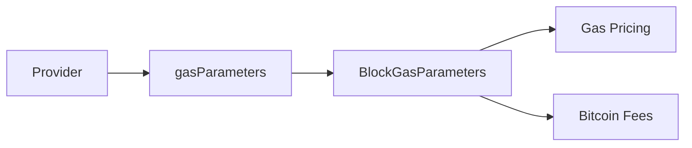

# Gas Parameters

This guide covers fetching and working with block gas parameters for fee estimation.

## Overview

OPNet uses a gas system for pricing contract execution. Gas parameters are derived from recent block data and provide fee recommendations.



---

## Getting Gas Parameters

```typescript
import { JSONRpcProvider } from 'opnet';
import { networks } from '@btc-vision/bitcoin';

const network = networks.regtest;
const provider = new JSONRpcProvider({ url: 'https://regtest.opnet.org', network });

const gasParams = await provider.gasParameters();

console.log('Gas Parameters:');
console.log('  Block:', gasParams.blockNumber);
console.log('  Gas per sat:', gasParams.gasPerSat);
console.log('  Base gas:', gasParams.baseGas);
console.log('  Gas used:', gasParams.gasUsed);
console.log('  Gas limit:', gasParams.targetGasLimit);
```

---

## BlockGasParameters Reference

```typescript
interface BlockGasParameters {
    // Block reference
    blockNumber: bigint;

    // Gas metrics
    gasUsed: bigint;           // Gas consumed in recent block
    targetGasLimit: bigint;    // Target gas limit per block
    ema: bigint;               // Exponential moving average
    baseGas: bigint;           // Minimum gas price
    gasPerSat: bigint;         // Gas units per satoshi

    // Bitcoin fee recommendations
    bitcoin: BitcoinFees;
}

interface BitcoinFees {
    conservative: number;      // Conservative fee estimate
    recommended: {
        low: number;           // Low priority (~1 hour)
        medium: number;        // Medium priority (~30 min)
        high: number;          // High priority (next block)
    };
}
```

---

## Fee Recommendations

### Get Recommended Fee Rates

```typescript
const gasParams = await provider.gasParameters();

const fees = gasParams.bitcoin;

console.log('Fee Recommendations (sat/vB):');
console.log('  Conservative:', fees.conservative);
console.log('  Low:', fees.recommended.low);
console.log('  Medium:', fees.recommended.medium);
console.log('  High:', fees.recommended.high);
```

### Choose Appropriate Fee Rate

```typescript
function selectFeeRate(
    gasParams: BlockGasParameters,
    priority: 'low' | 'medium' | 'high' | 'conservative'
): number {
    const fees = gasParams.bitcoin;

    switch (priority) {
        case 'conservative':
            return fees.conservative;
        case 'low':
            return fees.recommended.low;
        case 'medium':
            return fees.recommended.medium;
        case 'high':
            return fees.recommended.high;
    }
}

// Usage
const gasParams = await provider.gasParameters();
const feeRate = selectFeeRate(gasParams, 'medium');
console.log('Using fee rate:', feeRate, 'sat/vB');
```

---

## Gas Cost Calculation

### Calculate Transaction Gas Cost

```typescript
async function calculateGasCost(
    provider: JSONRpcProvider,
    gasUsed: bigint
): Promise<bigint> {
    const gasParams = await provider.gasParameters();

    // Gas cost in satoshis = gas used / gas per sat
    const costInSats = gasUsed / gasParams.gasPerSat;

    return costInSats;
}

// Usage
const gasCost = await calculateGasCost(provider, 50000n);
console.log('Gas cost:', gasCost, 'satoshis');
```

### Estimate Total Transaction Cost

```typescript
interface TransactionCostEstimate {
    gasCost: bigint;
    bitcoinFee: bigint;
    totalCost: bigint;
}

async function estimateTransactionCost(
    provider: JSONRpcProvider,
    gasUsed: bigint,
    txSizeVBytes: number = 250,
    priority: 'low' | 'medium' | 'high' = 'medium'
): Promise<TransactionCostEstimate> {
    const gasParams = await provider.gasParameters();

    // Gas cost
    const gasCost = gasUsed / gasParams.gasPerSat;

    // Bitcoin transaction fee
    const feeRate = gasParams.bitcoin.recommended[priority];
    const bitcoinFee = BigInt(Math.ceil(txSizeVBytes * feeRate));

    return {
        gasCost,
        bitcoinFee,
        totalCost: gasCost + bitcoinFee,
    };
}

// Usage
const estimate = await estimateTransactionCost(provider, 50000n, 300, 'medium');
console.log('Gas cost:', estimate.gasCost, 'sats');
console.log('Bitcoin fee:', estimate.bitcoinFee, 'sats');
console.log('Total:', estimate.totalCost, 'sats');
```

---

## Gas Price Tracking

### Monitor Gas Prices

```typescript
async function monitorGasPrices(
    provider: JSONRpcProvider,
    callback: (params: BlockGasParameters) => void,
    intervalMs: number = 60000
): Promise<() => void> {
    // Initial fetch
    const initial = await provider.gasParameters();
    callback(initial);

    const intervalId = setInterval(async () => {
        try {
            const params = await provider.gasParameters();
            callback(params);
        } catch (error) {
            console.error('Error fetching gas parameters:', error);
        }
    }, intervalMs);

    return () => clearInterval(intervalId);
}

// Usage
const stopMonitoring = await monitorGasPrices(provider, (params) => {
    console.log(`Block ${params.blockNumber}: ${params.gasPerSat} gas/sat`);
}, 30000);
```

### Historical Gas Analysis

```typescript
interface GasHistory {
    blockNumber: bigint;
    gasUsed: bigint;
    baseGas: bigint;
    timestamp: number;
}

async function collectGasHistory(
    provider: JSONRpcProvider,
    blockCount: number
): Promise<GasHistory[]> {
    const currentBlock = await provider.getBlockNumber();
    const history: GasHistory[] = [];

    for (let i = 0; i < blockCount; i++) {
        const blockNum = currentBlock - BigInt(i);
        if (blockNum < 1n) break;

        const block = await provider.getBlock(blockNum);
        history.push({
            blockNumber: BigInt(block.height),
            gasUsed: block.gasUsed,
            baseGas: block.baseGas,
            timestamp: block.time,
        });
    }

    return history.reverse();
}

// Usage
const history = await collectGasHistory(provider, 10);
console.log('Gas history (last 10 blocks):');
for (const entry of history) {
    console.log(`  Block ${entry.blockNumber}: ${entry.gasUsed} gas used`);
}
```

---

## Gas Optimization Strategies

### Wait for Low Gas

```typescript
async function waitForLowGas(
    provider: JSONRpcProvider,
    maxGasPerSat: bigint,
    timeoutMs: number = 300000
): Promise<BlockGasParameters> {
    const startTime = Date.now();

    while (Date.now() - startTime < timeoutMs) {
        const params = await provider.gasParameters();

        if (params.gasPerSat <= maxGasPerSat) {
            return params;
        }

        console.log(`Gas too high: ${params.gasPerSat}, waiting...`);
        await new Promise((resolve) => setTimeout(resolve, 10000));
    }

    throw new Error('Timeout waiting for low gas');
}

// Usage
try {
    const params = await waitForLowGas(provider, 1000n, 60000);
    console.log('Low gas found, proceeding with transaction');
} catch {
    console.log('Gas remained high, proceeding anyway');
}
```

### Calculate Optimal Time

```typescript
async function findBestFeeTime(
    provider: JSONRpcProvider,
    checkIntervalMs: number = 60000,
    checkCount: number = 10
): Promise<{
    bestFee: number;
    currentFee: number;
    recommendation: string;
}> {
    const readings: number[] = [];

    for (let i = 0; i < checkCount; i++) {
        const params = await provider.gasParameters();
        readings.push(params.bitcoin.recommended.medium);

        if (i < checkCount - 1) {
            await new Promise((r) => setTimeout(r, checkIntervalMs));
        }
    }

    const currentFee = readings[readings.length - 1];
    const bestFee = Math.min(...readings);
    const avgFee = readings.reduce((a, b) => a + b, 0) / readings.length;

    let recommendation: string;
    if (currentFee <= bestFee * 1.1) {
        recommendation = 'Good time to transact';
    } else if (currentFee > avgFee * 1.5) {
        recommendation = 'Fees high, consider waiting';
    } else {
        recommendation = 'Fees normal';
    }

    return { bestFee, currentFee, recommendation };
}
```

---

## Complete Gas Service

```typescript
class GasService {
    private provider: JSONRpcProvider;
    private cache: BlockGasParameters | null = null;
    private cacheTime: number = 0;
    private cacheDuration: number = 10000; // 10 seconds

    constructor(provider: JSONRpcProvider) {
        this.provider = provider;
    }

    async getParams(): Promise<BlockGasParameters> {
        if (this.cache && Date.now() - this.cacheTime < this.cacheDuration) {
            return this.cache;
        }

        this.cache = await this.provider.gasParameters();
        this.cacheTime = Date.now();

        return this.cache;
    }

    async getGasPrice(): Promise<bigint> {
        const params = await this.getParams();
        return params.gasPerSat;
    }

    async getFeeRate(
        priority: 'low' | 'medium' | 'high' = 'medium'
    ): Promise<number> {
        const params = await this.getParams();
        return params.bitcoin.recommended[priority];
    }

    async estimateCost(
        gasUsed: bigint,
        txSizeVBytes: number = 250
    ): Promise<{
        gas: bigint;
        fee: bigint;
        total: bigint;
    }> {
        const params = await this.getParams();

        const gas = gasUsed / params.gasPerSat;
        const fee = BigInt(Math.ceil(
            txSizeVBytes * params.bitcoin.recommended.medium
        ));

        return {
            gas,
            fee,
            total: gas + fee,
        };
    }

    async shouldWait(targetFeeRate: number): Promise<boolean> {
        const currentRate = await this.getFeeRate('medium');
        return currentRate > targetFeeRate;
    }

    clearCache(): void {
        this.cache = null;
    }
}

// Usage
const gasService = new GasService(provider);

const feeRate = await gasService.getFeeRate('medium');
console.log('Current fee rate:', feeRate, 'sat/vB');

const estimate = await gasService.estimateCost(50000n, 300);
console.log('Total cost:', estimate.total, 'sats');

if (await gasService.shouldWait(5)) {
    console.log('Fees are high, consider waiting');
}
```

---

## Best Practices

1. **Cache Parameters**: Gas parameters don't change frequently

2. **Use Medium Priority**: Good balance of speed and cost

3. **Monitor for Large Transactions**: Check fees before expensive operations

4. **Include Buffer**: Add 10-20% buffer to estimates

5. **Batch During Low Fees**: Save consolidation for low-fee periods

---

## Next Steps

- [Block Operations](./block-operations.md) - Fetching blocks
- [Block Witnesses](./block-witnesses.md) - Witness data
- [Gas Estimation](../contracts/gas-estimation.md) - Contract gas costs

---

[← Previous: Block Operations](./block-operations.md) | [Next: Block Witnesses →](./block-witnesses.md)
