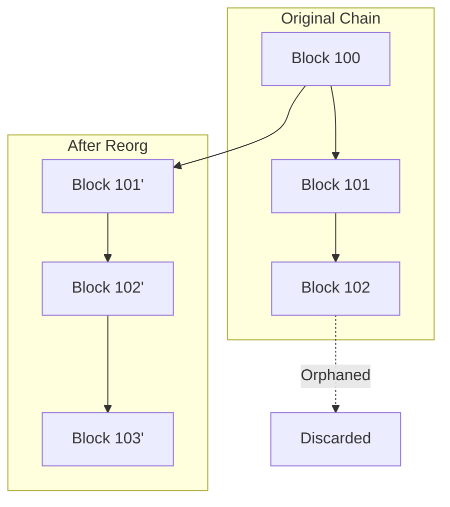

# Reorg Detection

This guide covers detecting and handling blockchain reorganizations on OPNet.

## Overview

A blockchain reorganization (reorg) occurs when a longer chain replaces the current chain, invalidating previously confirmed blocks. Detecting and handling reorgs is essential for reliable applications.



---

## Checking for Reorgs

### Basic Reorg Query

```typescript
import { JSONRpcProvider } from 'opnet';
import { networks } from '@btc-vision/bitcoin';

const network = networks.regtest;
const provider = new JSONRpcProvider({ url: 'https://regtest.opnet.org', network });

// Check for reorgs in a block range
const reorgs = await provider.getReorg(100n, 200n);

if (reorgs.length > 0) {
    console.log('Reorgs detected:', reorgs.length);
    for (const reorg of reorgs) {
        console.log('  From block:', reorg.fromBlock);
        console.log('  To block:', reorg.toBlock);
        console.log('  Timestamp:', reorg.timestamp);
    }
} else {
    console.log('No reorgs in range');
}
```

### Method Signature

```typescript
async getReorg(
    fromBlock?: BigNumberish,  // Start of range
    toBlock?: BigNumberish     // End of range
): Promise<ReorgInformation[]>
```

---

## ReorgInformation Structure

```typescript
interface ReorgInformation {
    fromBlock: string | bigint;    // Start block of reorg range
    toBlock: string | bigint;      // End block of reorg range
    readonly timestamp: number;    // When reorg was detected
}
```

---

## Reorg Detection Strategies

### Monitor for Recent Reorgs

```typescript
async function checkRecentReorgs(
    provider: JSONRpcProvider,
    blockCount: number = 10
): Promise<ReorgInformation[]> {
    const currentBlock = await provider.getBlockNumber();
    const fromBlock = currentBlock - BigInt(blockCount);

    return provider.getReorg(fromBlock, currentBlock);
}

// Usage
const recentReorgs = await checkRecentReorgs(provider, 100);
if (recentReorgs.length > 0) {
    console.log('Recent reorgs detected!');
}
```

### Continuous Reorg Monitoring

```typescript
async function monitorReorgs(
    provider: JSONRpcProvider,
    callback: (reorg: ReorgInformation) => void,
    intervalMs: number = 30000
): Promise<() => void> {
    let lastCheckedBlock = await provider.getBlockNumber();

    const intervalId = setInterval(async () => {
        try {
            const currentBlock = await provider.getBlockNumber();

            if (currentBlock > lastCheckedBlock) {
                const reorgs = await provider.getReorg(
                    lastCheckedBlock,
                    currentBlock
                );

                for (const reorg of reorgs) {
                    callback(reorg);
                }

                lastCheckedBlock = currentBlock;
            }
        } catch (error) {
            console.error('Error checking reorgs:', error);
        }
    }, intervalMs);

    return () => clearInterval(intervalId);
}

// Usage
const stopMonitoring = await monitorReorgs(provider, (reorg) => {
    console.log(`REORG: Blocks ${reorg.fromBlock} to ${reorg.toBlock} affected!`);
    console.log(`  Timestamp: ${reorg.timestamp}`);
});

// Later: stop monitoring
// stopMonitoring();
```

---

## Handling Reorgs

### Verify Transaction After Reorg

```typescript
async function isTransactionStillValid(
    provider: JSONRpcProvider,
    txHash: string,
    expectedBlockNumber: bigint
): Promise<boolean> {
    try {
        // Check for reorgs affecting this block
        const reorgs = await provider.getReorg(
            expectedBlockNumber,
            expectedBlockNumber
        );

        if (reorgs.length > 0) {
            // Block was reorganized, check if TX still exists
            try {
                const tx = await provider.getTransaction(txHash);
                return tx !== null;
            } catch {
                return false;
            }
        }

        return true;
    } catch {
        return false;
    }
}

// Usage
const txValid = await isTransactionStillValid(
    provider,
    '0x123...txhash...',
    123456n
);

if (!txValid) {
    console.log('Transaction may have been reverted by reorg!');
}
```

### Reorg-Safe Confirmation

```typescript
interface ConfirmationStatus {
    confirmed: boolean;
    confirmations: number;
    reorgRisk: boolean;
    message: string;
}

async function getConfirmationStatus(
    provider: JSONRpcProvider,
    txBlockNumber: bigint,
    requiredConfirmations: number = 6
): Promise<ConfirmationStatus> {
    const currentBlock = await provider.getBlockNumber();
    const confirmations = Number(currentBlock - txBlockNumber);

    // Check for any reorgs in the confirmation range
    const reorgs = await provider.getReorg(txBlockNumber, currentBlock);
    const reorgRisk = reorgs.length > 0;

    const confirmed = confirmations >= requiredConfirmations && !reorgRisk;

    let message: string;
    if (reorgRisk) {
        message = `Reorg detected affecting blocks ${reorgs.map(r => `${r.fromBlock}-${r.toBlock}`).join(', ')}`;
    } else if (confirmed) {
        message = `Confirmed with ${confirmations} confirmations`;
    } else {
        message = `Waiting for confirmations (${confirmations}/${requiredConfirmations})`;
    }

    return {
        confirmed,
        confirmations,
        reorgRisk,
        message,
    };
}

// Usage
const status = await getConfirmationStatus(provider, 123456n, 6);
console.log('Status:', status.message);
```

---

## Block Hash Tracking

### Track Known Block Hashes

```typescript
class BlockHashTracker {
    private knownHashes: Map<bigint, string> = new Map();

    async updateFromProvider(
        provider: JSONRpcProvider,
        startBlock: bigint,
        endBlock: bigint
    ): Promise<void> {
        for (let i = startBlock; i <= endBlock; i++) {
            const block = await provider.getBlock(i);
            this.knownHashes.set(BigInt(block.height), block.hash);
        }
    }

    async detectReorgs(
        provider: JSONRpcProvider
    ): Promise<Array<{ blockNumber: bigint; expected: string; actual: string }>> {
        const reorgs: Array<{ blockNumber: bigint; expected: string; actual: string }> = [];

        for (const [blockNumber, expectedHash] of this.knownHashes) {
            try {
                const block = await provider.getBlock(blockNumber);

                if (block.hash !== expectedHash) {
                    reorgs.push({
                        blockNumber,
                        expected: expectedHash,
                        actual: block.hash,
                    });

                    // Update to new hash
                    this.knownHashes.set(blockNumber, block.hash);
                }
            } catch {
                // Block might not exist anymore
                reorgs.push({
                    blockNumber,
                    expected: expectedHash,
                    actual: 'MISSING',
                });
            }
        }

        return reorgs;
    }

    getHash(blockNumber: bigint): string | undefined {
        return this.knownHashes.get(blockNumber);
    }

    clear(): void {
        this.knownHashes.clear();
    }
}

// Usage
const tracker = new BlockHashTracker();

// Track blocks 100-110
await tracker.updateFromProvider(provider, 100n, 110n);

// Later, check for reorgs
const detected = await tracker.detectReorgs(provider);
if (detected.length > 0) {
    console.log('Detected reorgs:', detected);
}
```

---

## Reorg Recovery

### Handle Application State After Reorg

```typescript
interface TransactionRecord {
    txHash: string;
    blockNumber: bigint;
    blockHash: string;
    status: 'pending' | 'confirmed' | 'failed' | 'reorged';
}

class ReorgAwareTransactionTracker {
    private transactions: Map<string, TransactionRecord> = new Map();

    addTransaction(tx: TransactionRecord): void {
        this.transactions.set(tx.txHash, tx);
    }

    async checkAllTransactions(
        provider: JSONRpcProvider
    ): Promise<TransactionRecord[]> {
        const reorgedTxs: TransactionRecord[] = [];

        for (const [txHash, record] of this.transactions) {
            if (record.status === 'confirmed') {
                const reorgs = await provider.getReorg(
                    record.blockNumber,
                    record.blockNumber
                );

                if (reorgs.length > 0) {
                    // Check if transaction is still valid
                    try {
                        const tx = await provider.getTransaction(txHash);
                        if (!tx) {
                            record.status = 'reorged';
                            reorgedTxs.push(record);
                        }
                    } catch {
                        record.status = 'reorged';
                        reorgedTxs.push(record);
                    }
                }
            }
        }

        return reorgedTxs;
    }

    getReorgedTransactions(): TransactionRecord[] {
        return Array.from(this.transactions.values())
            .filter(tx => tx.status === 'reorged');
    }
}

// Usage
const txTracker = new ReorgAwareTransactionTracker();

// Add confirmed transaction
txTracker.addTransaction({
    txHash: '0x123...',
    blockNumber: 123456n,
    blockHash: '0xabc...',
    status: 'confirmed',
});

// Check for reorgs affecting our transactions
const reorgedTxs = await txTracker.checkAllTransactions(provider);
if (reorgedTxs.length > 0) {
    console.log('Transactions need to be resubmitted:', reorgedTxs);
}
```

---

## Complete Reorg Service

```typescript
class ReorgService {
    private provider: JSONRpcProvider;
    private callbacks: ((reorg: ReorgInformation) => void)[] = [];
    private monitoringInterval: ReturnType<typeof setInterval> | null = null;
    private lastCheckedBlock: bigint = 0n;

    constructor(provider: JSONRpcProvider) {
        this.provider = provider;
    }

    async checkRange(
        fromBlock: bigint,
        toBlock: bigint
    ): Promise<ReorgInformation[]> {
        return this.provider.getReorg(fromBlock, toBlock);
    }

    async checkRecent(blockCount: number = 10): Promise<ReorgInformation[]> {
        const current = await this.provider.getBlockNumber();
        const from = current - BigInt(blockCount);
        return this.checkRange(from, current);
    }

    async wasBlockReorged(blockNumber: bigint): Promise<boolean> {
        const reorgs = await this.checkRange(blockNumber, blockNumber);
        return reorgs.length > 0;
    }

    onReorg(callback: (reorg: ReorgInformation) => void): () => void {
        this.callbacks.push(callback);

        return () => {
            const index = this.callbacks.indexOf(callback);
            if (index > -1) {
                this.callbacks.splice(index, 1);
            }
        };
    }

    startMonitoring(intervalMs: number = 30000): void {
        if (this.monitoringInterval) return;

        this.provider.getBlockNumber().then((block) => {
            this.lastCheckedBlock = block;
        });

        this.monitoringInterval = setInterval(async () => {
            try {
                const current = await this.provider.getBlockNumber();

                if (current > this.lastCheckedBlock) {
                    const reorgs = await this.checkRange(
                        this.lastCheckedBlock,
                        current
                    );

                    for (const reorg of reorgs) {
                        for (const callback of this.callbacks) {
                            callback(reorg);
                        }
                    }

                    this.lastCheckedBlock = current;
                }
            } catch (error) {
                console.error('Reorg monitoring error:', error);
            }
        }, intervalMs);
    }

    stopMonitoring(): void {
        if (this.monitoringInterval) {
            clearInterval(this.monitoringInterval);
            this.monitoringInterval = null;
        }
    }
}

// Usage
const reorgService = new ReorgService(provider);

// Register callback
const unsubscribe = reorgService.onReorg((reorg) => {
    console.log(`REORG ALERT: Blocks ${reorg.fromBlock} to ${reorg.toBlock}`);
    // Handle reorg: invalidate caches, check transactions, etc.
});

// Start monitoring
reorgService.startMonitoring(10000);

// Check specific block
const wasReorged = await reorgService.wasBlockReorged(123456n);
console.log('Block 123456 reorged:', wasReorged);

// Check recent blocks
const recent = await reorgService.checkRecent(50);
console.log('Recent reorgs:', recent.length);

// Cleanup
// reorgService.stopMonitoring();
// unsubscribe();
```

---

## Best Practices

1. **Wait for Confirmations**: More confirmations = lower reorg risk

2. **Monitor Critical Blocks**: Track blocks containing important transactions

3. **Handle Gracefully**: Don't crash on reorg, recover state

4. **Cache Invalidation**: Clear caches on reorg detection

5. **User Notification**: Inform users if their transactions are affected

---

## Confirmation Recommendations

| Risk Level | Confirmations | Use Case |
|------------|---------------|----------|
| Low | 1-2 | Read-only queries |
| Medium | 3-6 | Small value transactions |
| High | 6-12 | Large value transactions |
| Critical | 12+ | Exchange deposits |

---

## Next Steps

- [Block Operations](./block-operations.md) - Fetching blocks
- [Block Witnesses](./block-witnesses.md) - Witness validation
- [Transaction Receipts](../transactions/transaction-receipts.md) - Receipt handling

---

[← Previous: Block Witnesses](./block-witnesses.md) | [Next: Epoch Overview →](../epochs/overview.md)
