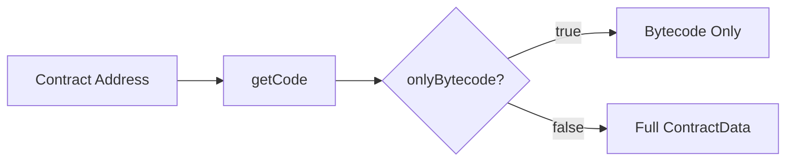

# Contract Code

This guide covers how to fetch and work with contract code (bytecode) from deployed contracts.

## Overview

Every deployed contract has associated bytecode that can be fetched from the network. This is useful for verification, analysis, and debugging.



---

## Fetching Contract Code

Use the provider's `getCode()` method to fetch contract data:

```typescript
// Fetch full contract data
const contractData = await provider.getCode(contractAddress);

// Fetch only bytecode (more efficient)
const bytecodeOnly = await provider.getCode(contractAddress, true);
```

---

## getCode() Method

```typescript
async getCode(
    address: string | Address,
    onlyBytecode?: boolean
): Promise<ContractData>
```

### Parameters

| Parameter | Type | Required | Description |
|-----------|------|----------|-------------|
| `address` | `string \| Address` | Yes | Contract address |
| `onlyBytecode` | `boolean` | No | If true, only returns bytecode |

### Returns

Returns a `ContractData` object containing the contract's code.

---

## ContractData Class

The `ContractData` class holds contract bytecode and metadata:

```typescript
class ContractData {
    contractAddress: string;               // Contract address (hex string)
    contractPublicKey: Address;            // Contract public key as Address
    bytecode: Uint8Array;                  // Contract WASM bytecode
    wasCompressed: boolean;                // Whether bytecode was compressed
    deployedTransactionId: string;         // Deployment transaction ID
    deployedTransactionHash: string;       // Deployment transaction hash
    deployerPubKey: Uint8Array;            // Deployer's public key
    deployerHashedPublicKey: Uint8Array;   // Deployer's hashed public key
    contractSeed: Uint8Array;              // Contract seed
    contractSaltHash: Uint8Array;          // Contract salt hash
    deployerAddress: Address;              // Deployer's address
}
```

---

## Examples

### Fetch Full Contract Data

```typescript
const address = Address.fromString('0x...');
const contractData = await provider.getCode(address, false);

console.log('Contract address:', contractData.contractAddress);
console.log('Bytecode size:', contractData.bytecode.length, 'bytes');
```

### Fetch Bytecode Only

```typescript
import { toHex } from '@btc-vision/bitcoin';

// More efficient when you only need bytecode
const contractData = await provider.getCode(contractAddress, true);

const bytecode = contractData.bytecode;
console.log('Bytecode:', toHex(bytecode).slice(0, 100), '...');
```

### Verify Contract Deployment

```typescript
async function isContractDeployed(
    provider: AbstractRpcProvider,
    address: string | Address
): Promise<boolean> {
    try {
        const code = await provider.getCode(address, true);
        return code.bytecode.length > 0;
    } catch {
        return false;
    }
}

// Usage
const deployed = await isContractDeployed(provider, contractAddress);
console.log('Contract deployed:', deployed);
```

### Compare Contract Code

```typescript
import { toHex } from '@btc-vision/bitcoin';

async function compareContracts(
    provider: AbstractRpcProvider,
    address1: Address,
    address2: Address
): Promise<boolean> {
    const [code1, code2] = await Promise.all([
        provider.getCode(address1, true),
        provider.getCode(address2, true),
    ]);

    // Compare Uint8Array bytecode
    return toHex(code1.bytecode) === toHex(code2.bytecode);
}

// Check if two contracts have same code
const sameCode = await compareContracts(provider, addr1, addr2);
console.log('Same bytecode:', sameCode);
```

### Calculate Code Hash

```typescript
import { toHex } from '@btc-vision/bitcoin';
import { sha256 } from '@noble/hashes/sha256';

async function getCodeHash(
    provider: AbstractRpcProvider,
    address: Address
): Promise<string> {
    const contractData = await provider.getCode(address, true);
    const hash = sha256(contractData.bytecode);
    return toHex(hash);
}

// Get unique identifier for contract code
const codeHash = await getCodeHash(provider, contractAddress);
console.log('Code hash:', codeHash);
```

---

## Use Cases

### 1. Contract Verification

Verify that a deployed contract matches expected code:

```typescript
import { toHex } from '@btc-vision/bitcoin';

async function verifyContract(
    provider: AbstractRpcProvider,
    address: Address,
    expectedBytecode: Uint8Array
): Promise<boolean> {
    const contractData = await provider.getCode(address, true);
    return toHex(contractData.bytecode) === toHex(expectedBytecode);
}
```

### 2. Security Analysis

Check contract size and analyze bytecode:

```typescript
import { toHex } from '@btc-vision/bitcoin';

async function analyzeContract(
    provider: AbstractRpcProvider,
    address: Address
) {
    const contractData = await provider.getCode(address, false);

    console.log('Contract Analysis:');
    console.log('  Address:', contractData.contractAddress);
    console.log('  Bytecode size:', contractData.bytecode.length, 'bytes');

    // Check for common patterns
    const bytecodeHex = toHex(contractData.bytecode);

    return {
        address: contractData.contractAddress,
        size: contractData.bytecode.length,
    };
}
```

### 3. Contract Discovery

List contracts with specific characteristics:

```typescript
async function findContractsWithCode(
    provider: AbstractRpcProvider,
    addresses: Address[],
    targetCodeHash: string
): Promise<Address[]> {
    const matches: Address[] = [];

    for (const address of addresses) {
        try {
            const codeHash = await getCodeHash(provider, address);
            if (codeHash === targetCodeHash) {
                matches.push(address);
            }
        } catch {
            // Contract doesn't exist or error
        }
    }

    return matches;
}
```

---

## Error Handling

```typescript
async function safeGetCode(
    provider: AbstractRpcProvider,
    address: Address
): Promise<ContractData | null> {
    try {
        return await provider.getCode(address, true);
    } catch (error) {
        if (error instanceof Error) {
            if (error.message.includes('not found')) {
                console.log('Contract not deployed at address');
                return null;
            }
        }
        throw error;
    }
}
```

---

## Best Practices

1. **Use onlyBytecode**: When you only need bytecode, set `onlyBytecode: true` for efficiency

2. **Cache Results**: Bytecode doesn't change, so cache results

3. **Verify Important Contracts**: Always verify bytecode for contracts handling significant value

4. **Handle Missing Contracts**: Contract may not exist at address

---

## Next Steps

- [Offline Signing](./offline-signing.md) - Sign transactions without provider
- [Contract Deployment](../examples/deployment-examples.md) - Deploy your own contracts

---

[← Previous: Gas Estimation](./gas-estimation.md) | [Next: Offline Signing →](./offline-signing.md)
