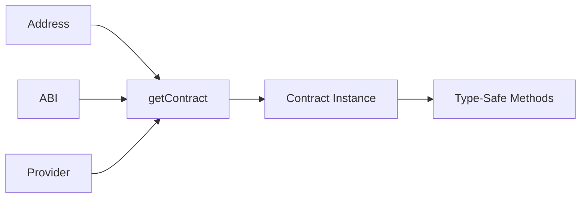

# Instantiating Contracts

This guide covers how to create contract instances using the `getContract()` factory function.

## Overview



---

## Using getContract()

The `getContract()` factory function creates type-safe contract instances:

```typescript
import {
    getContract,
    IOP20Contract,
    JSONRpcProvider,
    OP_20_ABI,
} from 'opnet';
import { Address } from '@btc-vision/transaction';
import { Network, networks } from '@btc-vision/bitcoin';

// Setup
const network: Network = networks.regtest;
const provider: JSONRpcProvider = new JSONRpcProvider({
    url: 'https://regtest.opnet.org',
    network,
});

// Contract address
const tokenAddress: Address = Address.fromString(
    '0x1234567890abcdef1234567890abcdef1234567890abcdef1234567890abcdef'
);

// Create contract instance with full type safety
const token: IOP20Contract = getContract<IOP20Contract>(
    tokenAddress,
    OP_20_ABI,
    provider,
    network
);
```

---

## Function Signature

```typescript
function getContract<T extends BaseContractProperties>(
    address: string | Address,
    abi: BitcoinInterface | BitcoinInterfaceAbi,
    provider: AbstractRpcProvider,
    network: Network,
    sender?: Address
): BaseContract<T> & Omit<T, keyof BaseContract<T>>
```

### Parameters

| Parameter | Type | Required | Description |
|-----------|------|----------|-------------|
| `address` | `string \| Address` | Yes | Contract address (P2OP or hex format) |
| `abi` | `BitcoinInterface \| BitcoinInterfaceAbi` | Yes | Contract ABI definition |
| `provider` | `AbstractRpcProvider` | Yes | RPC provider instance |
| `network` | `Network` | Yes | Bitcoin network |
| `sender` | `Address` | No | Default sender address for calls |

---

## Importing ABIs

### Built-in ABIs

```typescript
import {
    // Token ABIs
    OP_20_ABI,
    OP_20S_ABI,
    OP_721_ABI,

    // DEX ABIs
    MOTOSWAP_ROUTER_ABI,
    MotoswapPoolAbi,
    MotoSwapFactoryAbi,
    MOTO_ABI,

    // Staking ABIs
    STAKING_ABI,
    MOTOCHEF_ABI,
} from 'opnet';
```

### Importing Interfaces

```typescript
import {
    // Token interfaces
    IOP20Contract,
    IOP20SContract,
    IOP721Contract,
    IExtendedOP721Contract,

    // DEX interfaces
    IMotoswapRouterContract,
    IMotoswapPoolContract,
    IMotoswapFactoryContract,
    IMoto,
} from 'opnet';
```

---

## Type-Safe Interfaces

Using generics provides full TypeScript support:

```typescript
// Type-safe OP20 contract
const token = getContract<IOP20Contract>(
    address,
    OP_20_ABI,
    provider,
    network
);

// TypeScript knows all available methods
const name = await token.name();           // Returns CallResult with name property
const balance = await token.balanceOf(addr);  // Returns CallResult with balance property
const decimals = await token.decimals();   // Returns CallResult with decimals property
```

### Available Interface Methods

```typescript
// IOP20Contract methods
interface IOP20Contract {
    name(): Promise<CallResult<{ name: string }>>;
    symbol(): Promise<CallResult<{ symbol: string }>>;
    decimals(): Promise<CallResult<{ decimals: number }>>;
    totalSupply(): Promise<CallResult<{ totalSupply: bigint }>>;
    balanceOf(account: Address): Promise<CallResult<{ balance: bigint }>>;
    transfer(to: Address, value: bigint): Promise<CallResult<{ success: boolean }>>;
    approve(spender: Address, value: bigint): Promise<CallResult<{ success: boolean }>>;
    allowance(owner: Address, spender: Address): Promise<CallResult<{ remaining: bigint }>>;
    transferFrom(from: Address, to: Address, value: bigint): Promise<CallResult<{ success: boolean }>>;
}
```

---

## Setting Sender Address

The sender address is used for simulating calls as a specific user:

### At Construction

```typescript
import {
    Address,
    AddressTypes,
    Mnemonic,
    MLDSASecurityLevel,
} from '@btc-vision/transaction';

const mnemonic = new Mnemonic('your seed phrase here ...', '', network, MLDSASecurityLevel.LEVEL2);
const wallet = mnemonic.deriveUnisat(AddressTypes.P2TR, 0);  // OPWallet-compatible

// Set sender at construction
const token = getContract<IOP20Contract>(
    tokenAddress,
    OP_20_ABI,
    provider,
    network,
    wallet.address  // Sender address
);
```

### After Construction

```typescript
// Create without sender
const token = getContract<IOP20Contract>(
    tokenAddress,
    OP_20_ABI,
    provider,
    network
);

// Set sender later
token.setSender(wallet.address);
```

### Why Set Sender?

The sender address affects:
- **Caller identification**: Contract sees this as the caller address
- **Balance simulations**: Proper balance checking for transfers
- **Authorization checks**: Contracts can verify caller permissions

---

## P2OP Address Conversion

Contract addresses use P2OP (Pay-to-OPNet) format:

```typescript
// Get P2OP format address
const p2opAddress = token.p2op;
console.log('P2OP:', p2opAddress);

// Get full Address object
const contractAddress = await token.contractAddress;
console.log('Hex:', contractAddress.toHex());
```

### Address Formats

| Format | Example | Use Case |
|--------|---------|----------|
| P2OP | `bcrt1p...` | Display, configuration |
| Hex | `0x1234...` | Internal operations |
| Address object | `Address` | Type-safe operations |

---

## Complete Examples

### OP20 Token Contract

```typescript
import {
    getContract,
    IOP20Contract,
    JSONRpcProvider,
    OP_20_ABI,
} from 'opnet';
import {
    Address,
    AddressTypes,
    Mnemonic,
    MLDSASecurityLevel,
} from '@btc-vision/transaction';
import { networks } from '@btc-vision/bitcoin';

async function main() {
    const network = networks.regtest;
    const provider = new JSONRpcProvider({ url: 'https://regtest.opnet.org', network });
    const mnemonic = new Mnemonic('your seed phrase here ...', '', network, MLDSASecurityLevel.LEVEL2);
    const wallet = mnemonic.deriveUnisat(AddressTypes.P2TR, 0);  // OPWallet-compatible

    const tokenAddress = Address.fromString('0x...');

    const token = getContract<IOP20Contract>(
        tokenAddress,
        OP_20_ABI,
        provider,
        network,
        wallet.address
    );

    // Read token info
    const [name, symbol, decimals] = await Promise.all([
        token.name(),
        token.symbol(),
        token.decimals(),
    ]);

    console.log(`Token: ${name.properties.name} (${symbol.properties.symbol})`);
    console.log(`Decimals: ${decimals.properties.decimals}`);

    // Check balance
    const balance = await token.balanceOf(wallet.address);
    console.log(`Balance: ${balance.properties.balance}`);

    await provider.close();
}
```

### NFT Contract

```typescript
import {
    getContract,
    IExtendedOP721Contract,
    OP_721_ABI,
} from 'opnet';

const nft = getContract<IExtendedOP721Contract>(
    nftAddress,
    OP_721_ABI,
    provider,
    network,
    wallet.address
);

// Read NFT info
const name = await nft.name();
const symbol = await nft.symbol();

// Check ownership
const owner = await nft.ownerOf(tokenId);
console.log('Owner:', owner.properties.owner);
```

### DEX Router Contract

```typescript
import {
    getContract,
    IMotoswapRouterContract,
    MOTOSWAP_ROUTER_ABI,
} from 'opnet';

const router = getContract<IMotoswapRouterContract>(
    routerAddress,
    MOTOSWAP_ROUTER_ABI,
    provider,
    network,
    wallet.address
);

// Get quote
const quote = await router.getAmountOut(
    amountIn,
    reserveIn,
    reserveOut
);
console.log('Expected output:', quote.properties.amountOut);
```

---

## Best Practices

### 1. Store Contract References

```typescript
// Good: Create once
class TokenService {
    private token: IOP20Contract;

    constructor(address: Address, provider: JSONRpcProvider, network: Network) {
        this.token = getContract<IOP20Contract>(
            address,
            OP_20_ABI,
            provider,
            network
        );
    }

    async getBalance(address: Address): Promise<bigint> {
        const result = await this.token.balanceOf(address);
        return result.properties.balance;
    }
}
```

### 2. Use Proper Types

```typescript
// Good: Full type safety
const token = getContract<IOP20Contract>(addr, OP_20_ABI, provider, network);

// TypeScript catches errors
const balance = await token.balanceOf(address);
console.log(balance.properties.balance);  // TypeScript knows this is bigint
```

### 3. Handle Address Conversion

```typescript
import { Address, AddressVerificator } from '@btc-vision/transaction';

// Convert Bitcoin address to contract address
async function toContractAddress(bitcoinAddress: string): Promise<Address> {
    if (AddressVerificator.isValidPublicKey(bitcoinAddress, network)) {
        return Address.fromString(bitcoinAddress);
    }
    return await provider.getPublicKeyInfo(bitcoinAddress, false);
}
```

---

## Next Steps

- [Simulating Calls](./simulating-calls.md) - Reading contract state
- [Sending Transactions](./sending-transactions.md) - Writing to contracts
- [Transaction Configuration](./transaction-configuration.md) - All transaction options

---

[← Previous: Contract Overview](./overview.md) | [Next: Simulating Calls →](./simulating-calls.md)
