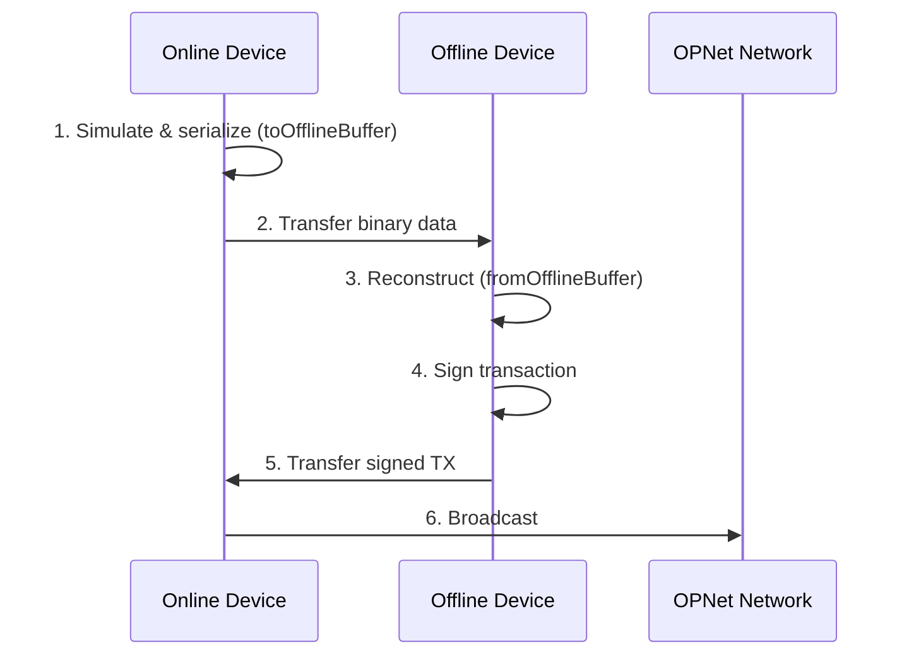

# Offline Signing

This guide covers offline signing for cold wallet security. OPNet provides built-in binary serialization to transfer transaction data between online and offline devices.

## Table of Contents

- [Overview](#overview)
- [Workflow](#workflow)
- [Online Phase: Prepare Transaction Data](#online-phase-prepare-transaction-data)
- [Offline Phase: Sign Transaction](#offline-phase-sign-transaction)
- [Broadcast Phase: Send to Network](#broadcast-phase-send-to-network)
- [Binary Serialization Format](#binary-serialization-format)
- [Security Considerations](#security-considerations)
- [Best Practices](#best-practices)

---

## Overview

Offline signing keeps your private keys on a device that never connects to the internet. The workflow uses binary serialization to transfer transaction data between devices:

1. **Online device**: Simulate transaction, serialize to binary
2. **Transfer**: Move binary data by any means to offline device
3. **Offline device**: Deserialize, verify, and sign
4. **Transfer**: Move signed transaction back to online device
5. **Online device**: Broadcast to network

---

## Workflow



### Online Phase: Prepare Transaction Data

On your online device, simulate the call and serialize all required data:

```typescript
// online-prepare.ts
import {
    getContract,
    IOP20Contract,
    JSONRpcProvider,
    OP_20_ABI
} from 'opnet';
import { Address } from '@btc-vision/transaction';
import { networks, toHex } from '@btc-vision/bitcoin';
import * as fs from 'fs';

async function prepareForOfflineSigning() {
    const network = networks.regtest;
    const provider = new JSONRpcProvider({ url: 'https://regtest.opnet.org', network });

    // Your PUBLIC address (no private key needed here)
    const myAddress = Address.fromString('0x...');

    const token = getContract<IOP20Contract>(
        Address.fromString('0xTokenContract...'),
        OP_20_ABI,
        provider,
        network,
        myAddress
    );

    // Step 1: Simulate the contract call
    const simulation = await token.transfer(
        Address.fromString('0xRecipient...'),
        100_00000000n,  // 100 tokens
        new Uint8Array(0),
    );

    if (simulation.revert) {
        throw new Error(`Simulation failed: ${simulation.revert}`);
    }

    // Step 2: Serialize to binary buffer
    // This fetches UTXOs, challenge, and all required data automatically
    const offlineBuffer = await simulation.toOfflineBuffer(
        'bcrt1p...',  // Your p2tr address for UTXOs
        50000n        // Satoshis needed for transaction
    );

    // Step 3: Transfer buffer to offline device (your choice how)
    // Example: write to file
    fs.writeFileSync('offline-tx.bin', offlineBuffer);

    // Example: encode as hex string
    const hexData = toHex(offlineBuffer);
    console.log('Data size:', offlineBuffer.length, 'bytes');

    await provider.close();
}

prepareForOfflineSigning();
```

### Offline Phase: Sign Transaction

On your offline device with the private key:

```typescript
// offline-sign.ts (run on offline device)
import { CallResult } from 'opnet';
import {
    AddressTypes,
    Mnemonic,
    MLDSASecurityLevel,
    Wallet,
} from '@btc-vision/transaction';
import { fromHex, networks, Network } from '@btc-vision/bitcoin';
import * as fs from 'fs';

// Initialize wallet from mnemonic - ONLY ON OFFLINE DEVICE
const network: Network = networks.regtest;
const mnemonic: Mnemonic = new Mnemonic(
    'your twenty four word seed phrase goes here ...',
    '',
    network,
    MLDSASecurityLevel.LEVEL2,
);
const wallet: Wallet = mnemonic.deriveUnisat(AddressTypes.P2TR, 0);

async function signOffline() {
    // Step 1: Load binary data (however you transferred it)
    // Example: from file
    const buffer = fs.readFileSync('offline-tx.bin');

    // Example: from hex string
    // const buffer = fromHex(hexString);

    // Step 2: Reconstruct the CallResult
    const simulation = CallResult.fromOfflineBuffer(buffer);

    // Step 3: Verify transaction details before signing!
    console.log('=== VERIFY TRANSACTION ===');
    console.log('Contract:', simulation.to);
    console.log('Estimated gas (sat):', simulation.estimatedSatGas.toString());
    console.log('========================');

    // Step 4: Sign the transaction
    const signedTx = await simulation.signTransaction({
        signer: wallet.keypair,
        mldsaSigner: wallet.mldsaKeypair,
        refundTo: wallet.p2tr,
        maximumAllowedSatToSpend: 50000n,
        feeRate: 10,
        network: network,
    });

    // Step 5: Prepare signed transaction data for transfer back
    // Include spent UTXOs so the online device can track them
    const signedData = {
        fundingTx: signedTx.fundingTransactionRaw,
        interactionTx: signedTx.interactionTransactionRaw,
        estimatedFees: signedTx.estimatedFees.toString(),
        // Include spent UTXOs for UTXO manager tracking
        spentUtxos: signedTx.fundingInputUtxos.map(u => ({
            transactionId: u.transactionId,
            outputIndex: u.outputIndex,
            value: u.value.toString(),
        })),
        // Include new UTXOs created by the transaction
        newUtxos: signedTx.nextUTXOs.map(u => ({
            transactionId: u.transactionId,
            outputIndex: u.outputIndex,
            value: u.value.toString(),
            scriptPubKey: u.scriptPubKey,
        })),
    };

    // Example: write to file
    fs.writeFileSync('signed-tx.json', JSON.stringify(signedData, null, 2));

    console.log('Signed transaction ready for broadcast');
}

signOffline();
```

### Broadcast Phase: Send to Network

Back on your online device, broadcast the signed transaction and update UTXO tracking:

```typescript
// online-broadcast.ts
import { JSONRpcProvider, UTXO } from 'opnet';
import { networks } from '@btc-vision/bitcoin';
import * as fs from 'fs';

// Type for serialized signed transaction data
interface SerializedSignedTx {
    fundingTx: string | null;
    interactionTx: string;
    estimatedFees: string;
    spentUtxos: SerializedUTXO[];
    newUtxos: SerializedUTXOWithScript[];
}

interface SerializedUTXO {
    transactionId: string;
    outputIndex: number;
    value: string;
}

interface SerializedUTXOWithScript extends SerializedUTXO {
    scriptPubKey: { hex: string; address?: string };
}

async function broadcastTransaction() {
    const network = networks.regtest;
    const provider = new JSONRpcProvider({ url: 'https://regtest.opnet.org', network });

    // Your address (same as used in preparation)
    const myP2TR = 'bcrt1p...';

    // Load signed transaction
    const signedData: SerializedSignedTx = JSON.parse(
        fs.readFileSync('signed-tx.json', 'utf-8')
    );

    // Broadcast funding transaction first (if present)
    if (signedData.fundingTx) {
        const fundingResult = await provider.sendRawTransaction(
            signedData.fundingTx,
            false
        );

        if (!fundingResult.success) {
            throw new Error(`Funding TX failed: ${fundingResult.error}`);
        }
        console.log('Funding TX broadcast');
    }

    // Broadcast interaction transaction
    const result = await provider.sendRawTransaction(
        signedData.interactionTx,
        false
    );

    if (!result.success) {
        throw new Error(`Transaction failed: ${result.error}`);
    }

    console.log('Transaction broadcast!');
    console.log('TX ID:', result.result);

    // IMPORTANT: Update UTXO manager to track spent/new UTXOs
    // Option 1: Clean the cache to force refetch (simplest)
    provider.utxoManager.clean();

    // Option 2: Manually track spent and new UTXOs (more precise)
    const spentUtxos: UTXO[] = signedData.spentUtxos.map((u) => ({
        transactionId: u.transactionId,
        outputIndex: u.outputIndex,
        value: BigInt(u.value),
        scriptPubKey: { hex: '', address: myP2TR },
    }));

    const newUtxos: UTXO[] = signedData.newUtxos.map((u) => ({
        transactionId: u.transactionId,
        outputIndex: u.outputIndex,
        value: BigInt(u.value),
        scriptPubKey: u.scriptPubKey,
    }));

    // Mark UTXOs as spent and register new ones
    provider.utxoManager.spentUTXO(myP2TR, spentUtxos, newUtxos);

    await provider.close();
}

broadcastTransaction();
```

---

## Binary Serialization Format

The `CallResultSerializer` uses efficient binary encoding for compact data transfer. The serialized data includes:

```typescript
interface OfflineCallResultData {
    readonly calldata: Uint8Array;           // Contract calldata
    readonly to: string;                    // Contract p2tr address
    readonly contractAddress: string;       // Contract hex address
    readonly estimatedSatGas: bigint;       // Estimated gas in satoshis
    readonly estimatedRefundedGasInSat: bigint;
    readonly revert?: string;               // Revert message if any
    readonly result: Uint8Array;             // Simulation result
    readonly accessList: IAccessList;       // Storage access list
    readonly bitcoinFees?: BitcoinFees;     // Current fee rates
    readonly network: NetworkName;          // mainnet/testnet/opnetTestnet/regtest
    readonly estimatedGas?: bigint;         // Gas units
    readonly refundedGas?: bigint;          // Refunded gas
    readonly challenge: RawChallenge;       // PoW challenge data
    readonly challengeOriginalPublicKey: Uint8Array; // 33-byte compressed public key
    readonly utxos: UTXO[];                 // UTXOs for signing
    readonly csvAddress?: IP2WSHAddress;    // CSV address if applicable
}
```

You can also use the serializer directly:

```typescript
import { CallResultSerializer, NetworkName } from 'opnet';

// Serialize
const buffer = CallResultSerializer.serialize(offlineData);

// Deserialize
const data = CallResultSerializer.deserialize(buffer);
```

---

## Security Considerations

### 1. Never Expose Private Keys

```typescript
// Good: Mnemonic/private key stays offline
const mnemonic = new Mnemonic(seedPhrase, '', network, MLDSASecurityLevel.LEVEL2);
const wallet = mnemonic.deriveUnisat(AddressTypes.P2TR, 0);  // OPWallet-compatible

// Bad: Transmitting private key or mnemonic
const data = { mnemonic: '...' };  // NEVER do this
```

### 2. Verify Transaction Before Signing

```typescript
// On offline device, verify transaction details
const simulation = CallResult.fromOfflineBuffer(buffer);

console.log('Signing transaction:');
console.log('  Contract:', simulation.to);
console.log('  Gas cost:', simulation.estimatedSatGas.toString(), 'sats');

// Confirm before signing
```

---

## Best Practices

1. **Offline Signing**: Use a physically isolated device for signing

2. **Verify All Details**: Double-check recipient and amount before signing

3. **Binary Format**: Use `toOfflineBuffer()` for efficient, compact data transfer

4. **Time-Sensitive**: Challenges expire, so don't delay too long between preparation and signing (typically ~10 seconds cache)

5. **Test First**: Test the workflow on regtest before mainnet

6. **UTXO Tracking**: The offline data includes UTXOs; ensure they haven't been spent between preparation and broadcast

---

## Next Steps

- [OP20 Examples](../examples/op20-examples.md) - Complete token examples
- [Transaction Broadcasting](../transactions/broadcasting.md) - Broadcast details
- [UTXO Management](../bitcoin/utxos.md) - Managing UTXOs

---

[Previous: Contract Code](./contract-code.md) | [Next: OP20 Examples](../examples/op20-examples.md)
