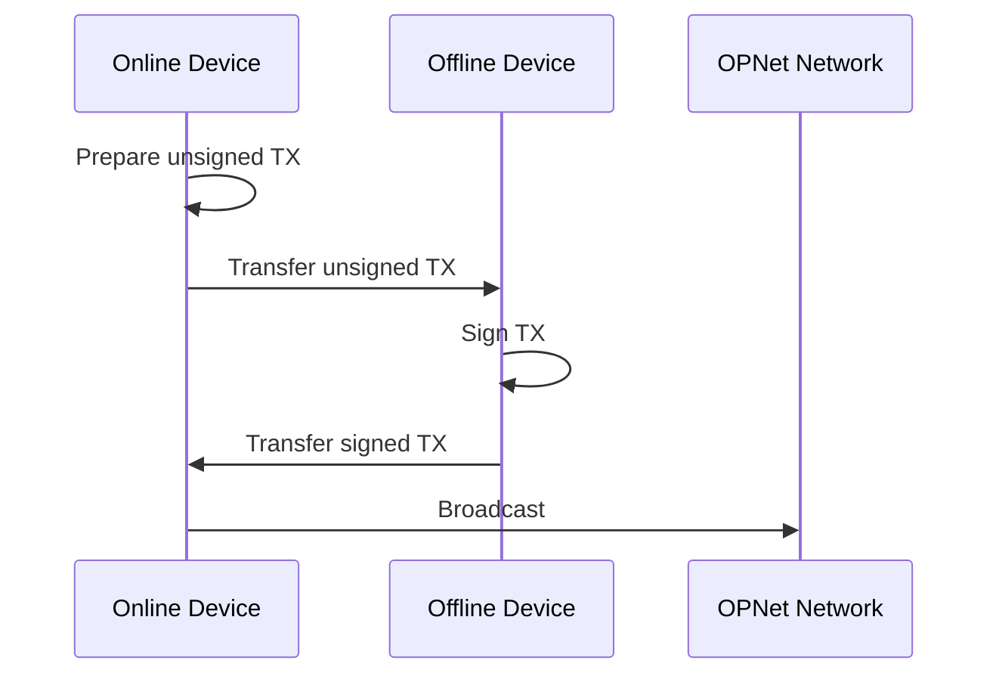

# Offline Signing

Offline signing allows you to build and sign transactions without an active network connection. This is useful for cold wallet setups and air-gapped security.

## Overview



---

## Building Transactions Offline

The transaction building process can be split into preparation and signing phases.

### Online Phase: Prepare Transaction Data

```typescript
// On online device: gather all necessary data
const preparationData = {
    contractAddress: contractAddress.toHex(),
    calldata: contract.encodeCalldata('transfer', [recipient, amount]),
    utxos: await provider.utxoManager.getUTXOs({ address: wallet.p2tr }),
    challenge: await provider.getChallenge(),
    gasParams: await provider.gasParameters(),
    network: 'regtest',
};

// Export to file or QR code
const jsonData = JSON.stringify(preparationData);
```

### Offline Phase: Sign Transaction

```typescript
// On offline device: sign without network
import { TransactionFactory } from '@btc-vision/transaction';

const factory = new TransactionFactory();

// Reconstruct from preparation data
const signedTx = await factory.signInteraction({
    from: wallet.p2tr,
    to: preparationData.contractAddress,
    calldata: Buffer.from(preparationData.calldata, 'hex'),
    utxos: preparationData.utxos,
    signer: wallet.keypair,
    network: networks[preparationData.network],
    feeRate: 10,
    challenge: preparationData.challenge,
    // ... other params
});
```

---

## signTransaction() Method

The `CallResult` provides a method to get a signed transaction without broadcasting:

```typescript
// Simulate to get CallResult
const simulation = await contract.transfer(recipient, amount);

// Get signed transaction without broadcasting
const signedTx = await simulation.signTransaction({
    signer: wallet.keypair,
    mldsaSigner: wallet.mldsaKeypair,
    refundTo: wallet.p2tr,
    maximumAllowedSatToSpend: 10000n,
    feeRate: 10,
    network: network,
});

// signedTx contains raw transaction hex
console.log('Signed TX:', signedTx.interactionTransactionRaw);
```

### SignedInteractionTransactionReceipt

```typescript
interface SignedInteractionTransactionReceipt {
    fundingTransactionRaw: string | null;    // Funding TX if needed
    interactionTransactionRaw: string;       // Main interaction TX
    nextUTXOs: UTXO[];                       // UTXOs after TX
    estimatedFees: bigint;                   // Estimated fees
    challengeSolution: RawChallenge;         // PoW challenge
    interactionAddress: string | null;       // Contract address
    fundingUTXOs: UTXO[];                    // UTXOs used for funding
    fundingInputUtxos: UTXO[];               // Input UTXOs
    compiledTargetScript: string | null;     // Target script
}
```

---

## Broadcasting Separately

After signing offline, broadcast from an online device:

```typescript
// On online device: broadcast the signed transaction
const result = await provider.sendRawTransaction(
    signedTx.interactionTransactionRaw,
    signedTx.fundingTransactionRaw  // Include funding TX if present
);

console.log('Broadcast result:', result);
```

### Broadcast Multiple Signed Transactions

```typescript
// If you have multiple signed transactions
const transactions = [
    { tx: signedTx1.interactionTransactionRaw, psbt: signedTx1.fundingTransactionRaw },
    { tx: signedTx2.interactionTransactionRaw, psbt: signedTx2.fundingTransactionRaw },
];

const results = await provider.sendRawTransactions(transactions);

for (const result of results) {
    console.log('TX ID:', result.txid);
}
```

---

## Complete Offline Signing Example

### Step 1: Prepare on Online Device

```typescript
// online-prepare.ts
import {
    getContract,
    IOP20Contract,
    JSONRpcProvider,
    OP_20_ABI,
} from 'opnet';
import { Address } from '@btc-vision/transaction';
import { networks } from '@btc-vision/bitcoin';
import * as fs from 'fs';

async function prepareTransaction() {
    const network = networks.regtest;
    const provider = new JSONRpcProvider('https://regtest.opnet.org', network);

    // Your address (derived from public key)
    const myAddress = Address.fromString('0x...');

    const token = getContract<IOP20Contract>(
        Address.fromString('0x...'),
        OP_20_ABI,
        provider,
        network,
        myAddress
    );

    // Gather all data needed for offline signing
    const preparationData = {
        // Contract info
        tokenAddress: token.p2op,
        recipientAddress: '0x...',
        amount: '10000000000',  // String for JSON

        // Network data
        utxos: await provider.utxoManager.getUTXOs({
            address: 'bcrt1p...', // Your p2tr address
        }),
        challenge: await provider.getChallenge(),
        gasParams: await provider.gasParameters(),

        // Simulation result
        calldata: token.encodeCalldata('transfer', [
            Address.fromString('0x...'),
            10000000000n,
        ]).toString('hex'),

        // Network
        network: 'regtest',
    };

    // Save to file for transfer to offline device
    fs.writeFileSync(
        'unsigned-tx.json',
        JSON.stringify(preparationData, null, 2)
    );

    console.log('Preparation data saved to unsigned-tx.json');
    await provider.close();
}

prepareTransaction();
```

### Step 2: Sign on Offline Device

```typescript
// offline-sign.ts
import { Wallet, TransactionFactory } from '@btc-vision/transaction';
import { networks } from '@btc-vision/bitcoin';
import * as fs from 'fs';

async function signTransaction() {
    // Load preparation data
    const data = JSON.parse(
        fs.readFileSync('unsigned-tx.json', 'utf-8')
    );

    const network = networks[data.network];

    // Your wallet (private key stored offline)
    const wallet = Wallet.fromWif('cPrivateKey...', undefined, network);

    const factory = new TransactionFactory();

    // Build and sign transaction
    const signedTx = await factory.signInteraction({
        from: wallet.p2tr,
        to: data.tokenAddress,
        calldata: Buffer.from(data.calldata, 'hex'),
        utxos: data.utxos,
        signer: wallet.keypair,
        mldsaSigner: wallet.mldsaKeypair,
        network: network,
        feeRate: 10,
        priorityFee: 0n,
        refundTo: wallet.p2tr,
        challenge: data.challenge,
    });

    // Save signed transaction
    const signedData = {
        interactionTx: signedTx.interactionTransactionRaw,
        fundingTx: signedTx.fundingTransactionRaw,
        estimatedFees: signedTx.estimatedFees.toString(),
    };

    fs.writeFileSync(
        'signed-tx.json',
        JSON.stringify(signedData, null, 2)
    );

    console.log('Signed transaction saved to signed-tx.json');
}

signTransaction();
```

### Step 3: Broadcast on Online Device

```typescript
// online-broadcast.ts
import { JSONRpcProvider } from 'opnet';
import { networks } from '@btc-vision/bitcoin';
import * as fs from 'fs';

async function broadcastTransaction() {
    const network = networks.regtest;
    const provider = new JSONRpcProvider('https://regtest.opnet.org', network);

    // Load signed transaction
    const signedData = JSON.parse(
        fs.readFileSync('signed-tx.json', 'utf-8')
    );

    // Broadcast
    const result = await provider.sendRawTransaction(
        signedData.interactionTx,
        signedData.fundingTx
    );

    console.log('Transaction broadcast!');
    console.log('TX ID:', result.txid);

    await provider.close();
}

broadcastTransaction();
```

---

## Security Considerations

### 1. Never Expose Private Keys

```typescript
// Good: Private key stays offline
const wallet = Wallet.fromWif(privateKey, undefined, network);

// Bad: Transmitting private key
const data = { privateKey: '...' };  // NEVER do this
```

### 2. Verify Transaction Before Signing

```typescript
// On offline device, verify transaction details
console.log('Signing transaction:');
console.log('  To:', data.tokenAddress);
console.log('  Amount:', data.amount);
console.log('  UTXOs:', data.utxos.length);

// Confirm before signing
```

### 3. Use Hardware Wallets

For maximum security, use hardware wallet integration:

```typescript
// Hardware wallet signing (conceptual)
const signature = await hardwareWallet.sign(unsignedTx);
const signedTx = applySignature(unsignedTx, signature);
```

---

## Best Practices

1. **Air-Gapped Signing**: Use physically isolated device for signing

2. **Verify All Details**: Double-check recipient and amount before signing

3. **Backup UTXOs**: Keep track of UTXOs used to avoid double-spending

4. **Time-Sensitive**: Challenges expire, so don't delay too long between preparation and signing

5. **Test First**: Test the workflow on regtest before mainnet

---

## Next Steps

- [OP20 Examples](../examples/op20-examples.md) - Complete token examples
- [Transaction Broadcasting](../transactions/broadcasting.md) - Broadcast details
- [UTXO Management](../bitcoin/utxos.md) - Managing UTXOs

---

[← Previous: Contract Code](./contract-code.md) | [Next: OP20 Examples →](../examples/op20-examples.md)
