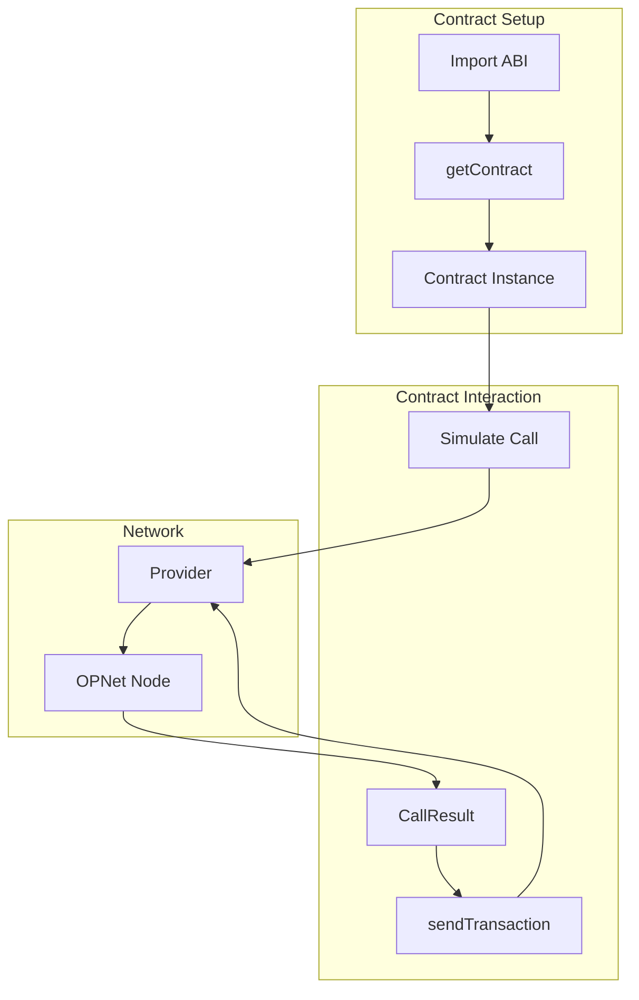
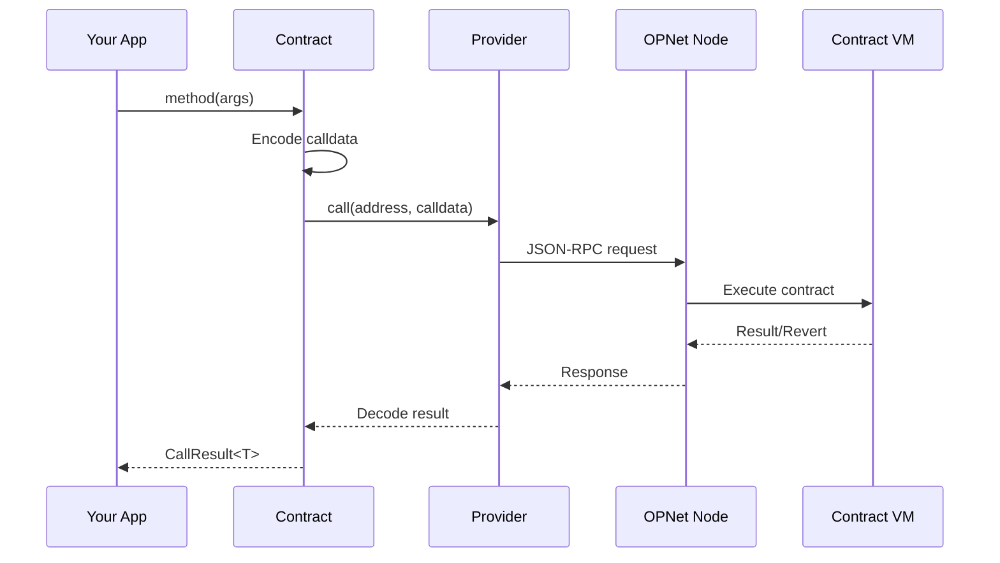
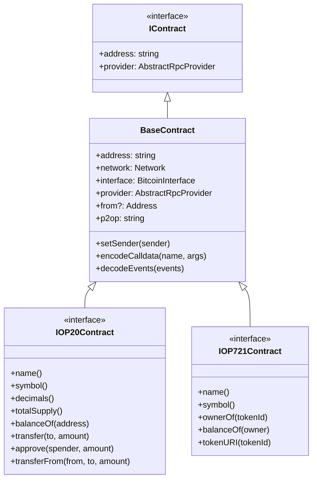

# Contract Interactions Overview

Smart contracts on OPNet are interacted with through the `Contract` class and `getContract()` factory function. This guide provides an overview of how contract interactions work.

## Overview



---

## Contract Interaction Flow

Contract interactions follow a consistent pattern:



---

## Simulation vs Execution

OPNet separates contract calls into two phases:

### Simulation (Read Operations)

Simulations execute contract code without creating a transaction:

```typescript
// Simulation - no Bitcoin spent
const balance = await contract.balanceOf(address);
console.log('Balance:', balance.properties.balance);
```

**Use simulations for:**
- Reading contract state
- Checking balances
- Verifying transactions before sending
- Querying metadata (name, symbol, etc.)

### Execution (Write Operations)

Execution creates a Bitcoin transaction that triggers contract execution:

```typescript
// First simulate
const simulation = await contract.transfer(recipient, amount, new Uint8Array(0));

// Then execute (requires Bitcoin)
const tx = await simulation.sendTransaction({
    signer: wallet.keypair,
    mldsaSigner: wallet.mldsaKeypair,
    refundTo: wallet.p2tr,
    network: network,
    // ... other params
});
```

**Use execution for:**
- Transferring tokens
- Modifying contract state
- Deploying contracts
- Any state-changing operation

---

## ABI System

ABIs (Application Binary Interface) define the contract interface:

```typescript
import { OP_20_ABI, IOP20Contract } from 'opnet';

// ABI provides:
// - Function signatures
// - Parameter types
// - Return types
// - Event definitions
```

### Built-in ABIs

| ABI | Interface | Description |
|-----|-----------|-------------|
| `OP_20_ABI` | `IOP20Contract` | Fungible tokens |
| `OP_721_ABI` | `IOP721Contract` | Non-fungible tokens |
| `MOTOSWAP_ROUTER_ABI` | `IMotoswapRouterContract` | DEX router |
| `MotoswapPoolAbi` | `IMotoswapPoolContract` | Liquidity pool |
| `MotoSwapFactoryAbi` | `IMotoswapFactoryContract` | Pair factory |

### Custom ABIs

You can define custom ABIs for your contracts:

```typescript
const myAbi = {
    functions: [
        {
            name: 'myMethod',
            inputs: [{ name: 'value', type: 'UINT256' }],
            outputs: [{ name: 'result', type: 'BOOL' }],
        },
    ],
    events: [
        {
            name: 'MyEvent',
            values: [{ name: 'data', type: 'UINT256' }],
        },
    ],
};
```

---

## Contract Types

The library provides a type hierarchy for contracts:



---

## CallResult Class

Every contract call returns a `CallResult` object:

```typescript
const result = await contract.balanceOf(address);

// Access decoded properties
result.properties.balance    // The decoded return value

// Check for reverts
result.revert               // Error message if call reverted

// Gas information
result.estimatedGas         // Gas used by the call
result.refundedGas          // Gas refunded

// ABI flags (set automatically from ABI definition)
result.constant             // true if function is read-only (view)
result.payable              // true if function requires payment

// Events
result.events               // Array of decoded events

// Access list (for optimization)
result.accessList           // Storage slots accessed
```

### Using CallResult

```typescript
// Reading values - the contract throws on revert, so use try/catch
try {
    const balance = await contract.balanceOf(address);
    console.log('Balance:', balance.properties.balance);
} catch (error) {
    console.error('Call failed:', error);
}

// Sending transactions - wrap in try/catch to handle reverts
try {
    const transfer = await contract.transfer(recipient, amount, new Uint8Array(0));
    const tx = await transfer.sendTransaction(params);
    console.log('TX:', tx.transactionId);
} catch (error) {
    console.error('Transfer failed:', error);
}
```

---

## Contract Methods

### Property Getters

```typescript
// Get P2OP address format
const p2opAddress = contract.p2op;

// Get contract address as Address object
const contractAddr = await contract.contractAddress;
```

### Configuration Methods

```typescript
// Set the sender for simulations
contract.setSender(myAddress);

// Set transaction details for simulation
contract.setTransactionDetails({
    inputs: [],
    outputs: [{ to: 'addr', value: 1000n, index: 1, flags: 0 }],  // index 0 is reserved
});

// Set access list for optimization
contract.setAccessList(accessList);

// Set block height for historical queries
contract.setSimulatedHeight(12345n);
```

### Utility Methods

```typescript
// Encode calldata manually
const calldata = contract.encodeCalldata('transfer', [recipient, amount]);

// Decode events
const decodedEvents = contract.decodeEvents(rawEvents);

// Get current gas parameters
const gasParams = await contract.currentGasParameters();
```

---

## Best Practices

### 1. Always Handle Reverts

```typescript
// The contract throws on revert, so wrap calls in try/catch
try {
    const result = await contract.someMethod(args);
    // Proceed with transaction
} catch (error) {
    console.error('Call would fail:', error);
    return;
}
```

### 2. Use Type-Safe Interfaces

```typescript
// Good: Type-safe
const token = getContract<IOP20Contract>(addr, OP_20_ABI, provider, network);
const balance = await token.balanceOf(address);  // TypeScript knows this returns balance

// Less good: No type safety
const contract = getContract(addr, OP_20_ABI, provider, network);
```

### 3. Handle BigInt Values

```typescript
// Token amounts are always bigint
const amount = 100_00000000n;  // 100 tokens with 8 decimals

// Never use Number for large values
const wrong = Number(balance);  // May lose precision!
```

### 4. Reuse Contract Instances

```typescript
// Good: Create once, reuse
const token = getContract<IOP20Contract>(addr, abi, provider, network);
await token.balanceOf(addr1);
await token.balanceOf(addr2);

// Bad: Creating new instances
await getContract(addr, abi, provider, network).balanceOf(addr1);
await getContract(addr, abi, provider, network).balanceOf(addr2);
```

---

## Next Steps

- [Instantiating Contracts](./instantiating-contracts.md) - Creating contract instances
- [Simulating Calls](./simulating-calls.md) - Read operations and simulations
- [Sending Transactions](./sending-transactions.md) - Writing to contracts

---

[← Previous: Advanced Configuration](../providers/advanced-configuration.md) | [Next: Instantiating Contracts →](./instantiating-contracts.md)
