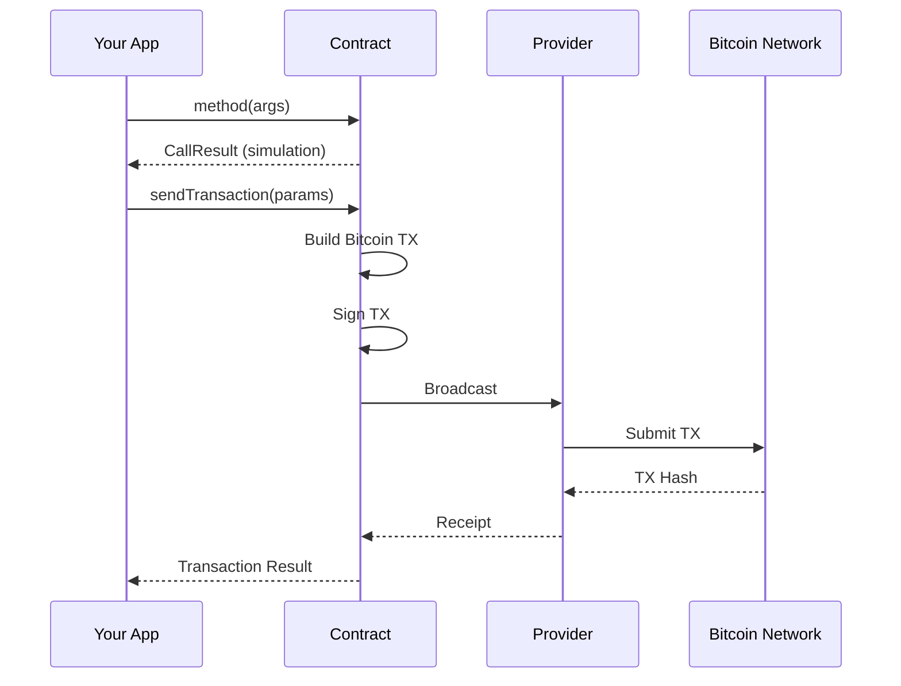

# Sending Transactions

This guide covers how to send transactions to smart contracts, including transaction building, signing, and broadcasting.

## Table of Contents

- [Overview](#overview)
- [Transaction Flow](#transaction-flow)
- [TransactionParameters](#transactionparameters)
- [Signer Configuration](#signer-configuration)
  - [ECDSA Signer](#ecdsa-signer-required-for-most-operations)
  - [ML-DSA Quantum Signer](#ml-dsa-quantum-signer-optional)
- [Fee Configuration](#fee-configuration)
- [UTXO Selection](#utxo-selection)
- [Transaction Result](#transaction-result)
- [Complete Examples](#complete-examples)
  - [Basic Token Transfer](#basic-token-transfer)
  - [Approve and TransferFrom](#approve-and-transferfrom)
  - [Multiple Transfers (Batch)](#multiple-transfers-batch)
- [Error Handling](#error-handling)
- [Best Practices](#best-practices)

---

## Overview



---

## Transaction Flow

Sending a transaction involves three steps:

### 1. Simulate the Call

```typescript
const simulation = await token.transfer(recipient, amount, new Uint8Array(0));

// Check if it would succeed
if (simulation.revert) {
    throw new Error(`Transfer would fail: ${simulation.revert}`);
}
```

### 2. Build Transaction Parameters

```typescript
import { TransactionParameters } from 'opnet';

const params: TransactionParameters = {
    signer: wallet.keypair,           // ECDSA keypair
    mldsaSigner: wallet.mldsaKeypair, // Quantum keypair (optional)
    refundTo: wallet.p2tr,            // Change address
    maximumAllowedSatToSpend: 10000n, // Max sats for fees
    feeRate: 10,                      // sat/vB
    network: network,
};
```

### 3. Send the Transaction

```typescript
const receipt = await simulation.sendTransaction(params);

console.log('Transaction ID:', receipt.transactionId);
console.log('Estimated fees:', receipt.estimatedFees);
```

---

## TransactionParameters

The `TransactionParameters` interface controls how transactions are built:

```typescript
interface TransactionParameters {
    // Signing keys (at least one required)
    readonly signer: Signer | UniversalSigner | null;
    readonly mldsaSigner: QuantumBIP32Interface | null;

    // Addresses
    readonly refundTo: string;        // Change address (required)
    readonly sender?: string;         // Override sender

    // Fees
    feeRate?: number;                 // sat/vB (0 = auto)
    readonly priorityFee?: bigint;    // Priority fee in sats

    // UTXOs
    readonly utxos?: UTXO[];          // Custom UTXOs
    readonly maximumAllowedSatToSpend: bigint;  // Max sats to use

    // Network
    readonly network: Network;

    // Advanced options
    readonly extraInputs?: UTXO[];
    readonly extraOutputs?: PsbtOutputExtended[];
    readonly from?: Address;
    readonly minGas?: bigint;
    readonly note?: string | Uint8Array;
    readonly p2wda?: boolean;
    readonly txVersion?: SupportedTransactionVersion;
    readonly anchor?: boolean;

    readonly dontUseCSVUtxos?: boolean;
    readonly maxUTXOs?: number;
    readonly throwIfUTXOsLimitReached?: boolean;

    // ML-DSA options
    readonly linkMLDSAPublicKeyToAddress?: boolean;
    readonly revealMLDSAPublicKey?: boolean;

    // Challenge
    readonly challenge?: ChallengeSolution;
}
```

---

## Signer Configuration

### ECDSA Signer (Required for most operations)

```typescript
import {
    AddressTypes,
    Mnemonic,
    MLDSASecurityLevel,
} from '@btc-vision/transaction';

// Create wallet from mnemonic (includes both ECDSA and ML-DSA keys)
const mnemonic = new Mnemonic(
    'your twenty four word seed phrase goes here ...',
    '',                            // BIP39 passphrase
    network,
    MLDSASecurityLevel.LEVEL2,     // Quantum security level
);
const wallet = mnemonic.deriveUnisat(AddressTypes.P2TR, 0);  // OPWallet-compatible

const params: TransactionParameters = {
    signer: wallet.keypair,
    mldsaSigner: null,  // Omit for non-quantum transactions
    // ... other params
};
```

### ML-DSA Quantum Signer (Optional)

```typescript
import { AddressTypes, Mnemonic, MLDSASecurityLevel } from '@btc-vision/transaction';

// The mnemonic-derived wallet automatically includes ML-DSA keys
const mnemonic = new Mnemonic(
    'your twenty four word seed phrase goes here ...',
    '',
    network,
    MLDSASecurityLevel.LEVEL2,
);
const wallet = mnemonic.deriveUnisat(AddressTypes.P2TR, 0);  // OPWallet-compatible

const params: TransactionParameters = {
    signer: wallet.keypair,
    mldsaSigner: wallet.mldsaKeypair,  // ML-DSA key from mnemonic
    // ... other params
};
```

### Both Signers

```typescript
// For quantum-resistant transactions
const params: TransactionParameters = {
    signer: wallet.keypair,
    mldsaSigner: wallet.mldsaKeypair,
    linkMLDSAPublicKeyToAddress: true,
    revealMLDSAPublicKey: true,
    // ... other params
};
```

---

## Fee Configuration

### Automatic Fee Rate

```typescript
const params: TransactionParameters = {
    // ... signers
    feeRate: 0,  // Automatic fee estimation
    network: network,
    // ... other params
};
```

### Manual Fee Rate

```typescript
const params: TransactionParameters = {
    // ... signers
    feeRate: 10,  // 10 sat/vB
    network: network,
    // ... other params
};
```

### With Priority Fee

```typescript
const params: TransactionParameters = {
    // ... signers
    feeRate: 10,
    priorityFee: 1000n,  // Additional 1000 sats
    network: network,
    // ... other params
};
```

---

## UTXO Selection

### Automatic Selection (Default)

```typescript
const params: TransactionParameters = {
    // ... signers
    refundTo: wallet.p2tr,
    maximumAllowedSatToSpend: 10000n,  // Limit spending
    network: network,
};

// Provider automatically selects UTXOs
```

### Custom UTXOs

```typescript
// Get UTXOs manually
const utxos = await provider.utxoManager.getUTXOs({
    address: wallet.p2tr,
});

const params: TransactionParameters = {
    // ... signers
    utxos: utxos,  // Use specific UTXOs
    maximumAllowedSatToSpend: 10000n,
    network: network,
};
```

---

## Transaction Result

The `sendTransaction()` method returns transaction details:

```typescript
interface InteractionTransactionReceipt {
    readonly transactionId: string;         // TX hash
    readonly newUTXOs: UTXO[];             // UTXOs to track
    readonly peerAcknowledgements: number; // Network acknowledgements
    readonly estimatedFees: bigint;        // Actual fees paid
    readonly challengeSolution: RawChallenge;
    readonly rawTransaction: string;       // Raw TX hex
    readonly interactionAddress: string | null;
    readonly fundingUTXOs: UTXO[];        // UTXOs used for funding
    readonly fundingInputUtxos: UTXO[];   // Input UTXOs for funding
    readonly compiledTargetScript: string | null;
}
```

### Handling the Result

```typescript
const receipt = await simulation.sendTransaction(params);

console.log('Transaction sent!');
console.log('TX ID:', receipt.transactionId);
console.log('Fees paid:', receipt.estimatedFees, 'sats');
console.log('New UTXOs:', receipt.newUTXOs.length);

// Track new UTXOs for future transactions
const newUtxos = receipt.newUTXOs;
```

---

## Complete Examples

### Basic Token Transfer

```typescript
import {
    getContract,
    IOP20Contract,
    JSONRpcProvider,
    OP_20_ABI,
    TransactionParameters,
} from 'opnet';
import {
    Address,
    AddressTypes,
    Mnemonic,
    MLDSASecurityLevel,
} from '@btc-vision/transaction';
import { networks } from '@btc-vision/bitcoin';

async function transferTokens() {
    const network = networks.regtest;
    const provider = new JSONRpcProvider({ url: 'https://regtest.opnet.org', network });
    const mnemonic = new Mnemonic('your seed phrase here ...', '', network, MLDSASecurityLevel.LEVEL2);
    const wallet = mnemonic.deriveUnisat(AddressTypes.P2TR, 0);  // OPWallet-compatible

    const token = getContract<IOP20Contract>(
        Address.fromString('0x...'),
        OP_20_ABI,
        provider,
        network,
        wallet.address
    );

    const recipient = Address.fromString('0x...');
    const amount = 100_00000000n;  // 100 tokens

    // Step 1: Simulate
    const simulation = await token.transfer(recipient, amount, new Uint8Array(0));

    if (simulation.revert) {
        throw new Error(`Transfer would fail: ${simulation.revert}`);
    }

    // Step 2: Build params
    const params: TransactionParameters = {
        signer: wallet.keypair,
        mldsaSigner: wallet.mldsaKeypair,
        refundTo: wallet.p2tr,
        maximumAllowedSatToSpend: 10000n,
        feeRate: 10,
        network: network,
    };

    // Step 3: Send
    const receipt = await simulation.sendTransaction(params);

    console.log('Transfer complete!');
    console.log('TX ID:', receipt.transactionId);

    await provider.close();
}
```

### Approve and TransferFrom

```typescript
async function approveAndTransferFrom() {
    // Approve spender
    const approveSimulation = await token.approve(spenderAddress, amount);

    if (approveSimulation.revert) {
        throw new Error('Approve failed');
    }

    const approveReceipt = await approveSimulation.sendTransaction(params);
    console.log('Approved:', approveReceipt.transactionId);

    // Wait for confirmation (in production, wait for actual confirmation)

    // TransferFrom (as spender)
    const spenderToken = getContract<IOP20Contract>(
        tokenAddress,
        OP_20_ABI,
        provider,
        network,
        spenderAddress  // Spender is the sender
    );

    const transferSimulation = await spenderToken.transferFrom(
        ownerAddress,
        recipientAddress,
        amount
    );

    if (transferSimulation.revert) {
        throw new Error('TransferFrom failed');
    }

    const transferReceipt = await transferSimulation.sendTransaction(spenderParams);
    console.log('Transferred:', transferReceipt.transactionId);
}
```

### Multiple Transfers (Batch)

```typescript
async function batchTransfer(
    token: IOP20Contract,
    recipients: { address: Address; amount: bigint }[],
    params: TransactionParameters
) {
    for (const { address, amount } of recipients) {
        const simulation = await token.transfer(address, amount, new Uint8Array(0));

        if (simulation.revert) {
            console.error(`Transfer to ${address.toHex()} would fail`);
            continue;
        }

        const receipt = await simulation.sendTransaction(params);
        console.log(`Sent to ${address.toHex()}: ${receipt.transactionId}`);

        // Update UTXOs for next transaction
        params = {
            ...params,
            utxos: receipt.newUTXOs,
        };
    }
}
```

---

## Error Handling

```typescript
async function safeTransfer() {
    try {
        const simulation = await token.transfer(recipient, amount, new Uint8Array(0));

        if (simulation.revert) {
            console.error('Simulation failed:', simulation.revert);
            return null;
        }

        const receipt = await simulation.sendTransaction(params);
        return receipt;

    } catch (error) {
        if (error instanceof Error) {
            if (error.message.includes('Insufficient')) {
                console.error('Not enough funds');
            } else if (error.message.includes('timeout')) {
                console.error('Request timed out');
            } else {
                console.error('Unknown error:', error.message);
            }
        }
        return null;
    }
}
```

---

## Best Practices

### 1. Always Simulate First

```typescript
const simulation = await contract.method(args);
if (simulation.revert) {
    // Don't send
    return;
}
const receipt = await simulation.sendTransaction(params);
```

### 2. Track UTXOs Between Transactions

```typescript
let currentUtxos: UTXO[] | undefined;

async function sendMultiple() {
    for (const tx of transactions) {
        const params = { ...baseParams, utxos: currentUtxos };
        const receipt = await simulation.sendTransaction(params);
        currentUtxos = receipt.newUTXOs;
    }
}
```

### 3. Set Reasonable Spending Limits

```typescript
// Don't allow unlimited spending
const params: TransactionParameters = {
    maximumAllowedSatToSpend: 50000n,  // Max 50k sats
    // ...
};
```

### 4. Handle Network Congestion

```typescript
// Increase fee rate during congestion
const gasParams = await provider.gasParameters();
const highFee = gasParams.bitcoin.recommended.high;

const params: TransactionParameters = {
    feeRate: highFee,
    // ...
};
```

---

## Next Steps

- [Transaction Configuration](./transaction-configuration.md) - All configuration options
- [Gas Estimation](./gas-estimation.md) - Understanding costs
- [Offline Signing](./offline-signing.md) - Sign without provider

---

[← Previous: Simulating Calls](./simulating-calls.md) | [Next: Transaction Configuration →](./transaction-configuration.md)
