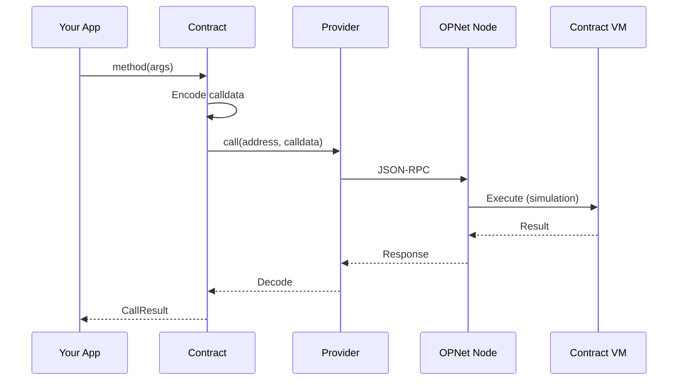

# Simulating Calls

Simulations allow you to read contract state and test transactions without spending Bitcoin. This guide covers how to effectively use contract simulations.

## Table of Contents

- [Overview](#overview)
- [Read-Only Method Calls](#read-only-method-calls)
- [CallResult Class](#callresult-class)
- [Decoded Outputs](#decoded-outputs)
- [Handling Reverts](#handling-reverts)
- [Historical Queries](#historical-queries)
- [Access Lists](#access-lists)
- [Transaction Details for Simulation](#transaction-details-for-simulation)
  - [Interface](#interface)
  - [Transaction Flags](#transaction-flags)
  - [Simulating with Extra Outputs](#simulating-with-extra-outputs)
  - [Simulating with Inputs](#simulating-with-inputs-advanced)
  - [Complete Flow: Simulate → Send](#complete-flow-simulate--send)
- [Examples](#examples)
- [Best Practices](#best-practices)

---

## Overview



---

## Read-Only Method Calls

Simple read operations return data without modifying state:

```typescript
// Read token metadata
const name = await token.name();
const symbol = await token.symbol();
const decimals = await token.decimals();
const totalSupply = await token.totalSupply();

// Access results
console.log('Name:', name.properties.name);
console.log('Symbol:', symbol.properties.symbol);
console.log('Decimals:', decimals.properties.decimals);
console.log('Total Supply:', totalSupply.properties.totalSupply);
```

### Batch Read Operations

```typescript
// Parallel reads are efficient
const [name, symbol, decimals, totalSupply, balance] = await Promise.all([
    token.name(),
    token.symbol(),
    token.decimals(),
    token.totalSupply(),
    token.balanceOf(myAddress),
]);
```

---

## CallResult Class

Every contract call returns a `CallResult` object:

```typescript
interface CallResult<T> {
    // Decoded return value
    properties: T;

    // Error message if call reverted
    revert: string | undefined;

    // ABI flags (set automatically from ABI definition)
    constant: boolean;          // true if function is read-only (view)
    payable: boolean;           // true if function requires payment

    // Gas information
    estimatedGas: bigint | undefined;
    refundedGas: bigint | undefined;
    estimatedSatGas: bigint;
    estimatedRefundedGasInSat: bigint;

    // Events emitted during simulation
    events: OPNetEvent[];

    // Storage access list
    accessList: IAccessList;

    // Raw result data
    result: BinaryReader;

    // Transaction sending methods
    signTransaction(params: TransactionParameters, amountAddition?: bigint): Promise<SignedInteractionTransactionReceipt>;
    sendTransaction(params: TransactionParameters, amountAddition?: bigint): Promise<InteractionTransactionReceipt>;
}
```

> **Important**: Calling `sendTransaction()` or `signTransaction()` on a `constant` (view) function will throw an error. For payable functions, you must provide `extraInputs` or `extraOutputs` in the transaction parameters.

---

## Decoded Outputs

Results are automatically decoded based on the ABI:

```typescript
// Balance query
const balance = await token.balanceOf(address);
console.log('Balance:', balance.properties.balance);  // bigint

// Token info
const decimals = await token.decimals();
console.log('Decimals:', decimals.properties.decimals);  // number

// Transfer result (simulation)
const transfer = await token.transfer(recipient, amount, new Uint8Array(0));
console.log('Success:', transfer.properties.success);  // boolean
```

### Property Types by Method

| Method | Property | Type |
|--------|----------|------|
| `name()` | `name` | `string` |
| `symbol()` | `symbol` | `string` |
| `decimals()` | `decimals` | `number` |
| `totalSupply()` | `totalSupply` | `bigint` |
| `balanceOf(addr)` | `balance` | `bigint` |
| `allowance(owner, spender)` | `remaining` | `bigint` |
| `transfer(to, amount)` | `success` | `boolean` |
| `approve(spender, amount)` | `success` | `boolean` |

---

## Handling Reverts

Always check for reverts before proceeding:

```typescript
const result = await token.transfer(recipient, amount, new Uint8Array(0));

if (result.revert) {
    // Call would fail
    console.error('Transfer failed:', result.revert);
    return;
}

// Safe to proceed
console.log('Transfer would succeed');
const tx = await result.sendTransaction(params);
```

### Common Revert Reasons

| Revert Message | Cause |
|----------------|-------|
| `Insufficient balance` | Sender doesn't have enough tokens |
| `Insufficient allowance` | Spender not approved for amount |
| `Invalid address` | Zero address or invalid format |
| `Overflow` | Amount exceeds maximum |
| `Paused` | Contract is paused |
| `Not authorized` | Caller lacks permission |

### Decoding Revert Messages

```typescript
import { decodeRevertData } from 'opnet';

const result = await contract.someMethod(args);

if (result.revert) {
    // The revert property already contains decoded message
    console.error('Revert reason:', result.revert);
}
```

---

## Historical Queries

Query contract state at a specific block height:

```typescript
// Set simulation height before calling
token.setSimulatedHeight(12345n);

// This query executes as of block 12345
const historicalBalance = await token.balanceOf(address);

// Reset to current height
token.setSimulatedHeight(undefined);
```

### Use Cases for Historical Queries

- Auditing past balances
- Investigating past transactions
- Debugging state changes
- Building block explorers

---

## Access Lists

Access lists track which storage slots a call reads/writes:

```typescript
const result = await token.transfer(recipient, amount, new Uint8Array(0));

// Access list shows storage accessed
console.log('Access list:', result.accessList);

// Use access list to optimize future calls
token.setAccessList(result.accessList);
const optimizedResult = await token.transfer(recipient, amount, new Uint8Array(0));
```

### Using Access Lists for Optimization

```typescript
// First call discovers access patterns
const firstCall = await token.transfer(recipient, amount, new Uint8Array(0));

// Set access list for subsequent calls
token.setAccessList(firstCall.accessList);

// Subsequent calls can be more efficient
const secondCall = await token.transfer(recipient2, amount2, new Uint8Array(0));
```

---

## Transaction Details for Simulation

For complex simulations where the contract needs to verify Bitcoin transaction inputs/outputs (e.g., NFT claims with payment verification), use `setTransactionDetails()`.

### Interface

```typescript
interface ParsedSimulatedTransaction {
    readonly inputs: StrippedTransactionInput[];
    readonly outputs: StrippedTransactionOutput[];
}

interface StrippedTransactionInput {
    readonly txId: Uint8Array;
    readonly outputIndex: number;
    readonly scriptSig: Uint8Array;
    readonly witnesses: Uint8Array[];
    readonly flags: number;
    readonly coinbase?: Uint8Array;
}

interface StrippedTransactionOutput {
    readonly value: bigint;
    readonly index: number;          // IMPORTANT: index 0 is reserved
    readonly flags: number;
    readonly scriptPubKey?: Uint8Array;
    readonly to?: string;            // P2OP/P2TR address string
}
```

### Transaction Flags

```typescript
import { TransactionInputFlags, TransactionOutputFlags } from 'opnet';

// Output flags
enum TransactionOutputFlags {
    hasTo = 1,            // 0b00000001 - Has address string
    hasScriptPubKey = 2,  // 0b00000010 - Has raw scriptPubKey
    OP_RETURN = 4,        // 0b00000100 - OP_RETURN output (must also set hasScriptPubKey)
}

// Input flags
enum TransactionInputFlags {
    hasCoinbase = 1,      // 0b00000001
    hasWitness = 2,       // 0b00000010
}
```

### Simulating with Extra Outputs

When a contract verifies payment to a treasury/recipient:

```typescript
import { TransactionOutputFlags } from 'opnet';

const treasuryAddress: string = 'bcrt1q...';  // Treasury P2TR address

// Tell the contract about the payment output
contract.setTransactionDetails({
    inputs: [],
    outputs: [
        {
            to: treasuryAddress,
            value: 10000n,           // 10,000 sats payment
            index: 1,                // Output index (0 is reserved)
            scriptPubKey: undefined,
            flags: TransactionOutputFlags.hasTo,
        },
    ],
});

// Now simulation will see the treasury output
const result = await contract.claim();

if (!result.revert) {
    console.log('Claim would succeed with treasury payment');
}
```

### Simulating with Multiple Outputs

```typescript
import { TransactionOutputFlags } from 'opnet';

contract.setTransactionDetails({
    inputs: [],
    outputs: [
        // Output 1: Treasury payment
        {
            to: treasuryAddress,
            value: 5000n,
            index: 1,
            scriptPubKey: undefined,
            flags: TransactionOutputFlags.hasTo,
        },
        // Output 2: Another recipient
        {
            to: feeRecipient,
            value: 1000n,
            index: 2,
            scriptPubKey: undefined,
            flags: TransactionOutputFlags.hasTo,
        },
    ],
});

const result = await contract.complexOperation();
```

### Simulating with Inputs (Advanced)

For contracts that verify specific input transactions:

```typescript
import { TransactionInputFlags } from 'opnet';
import { fromHex } from '@btc-vision/bitcoin';

contract.setTransactionDetails({
    inputs: [
        {
            txId: fromHex('previous_tx_hash_hex'),
            outputIndex: 0,
            scriptSig: new Uint8Array(0),
            witnesses: [],
            flags: 0,
        },
    ],
    outputs: [
        {
            to: recipientAddress,
            value: 50000n,
            index: 1,
            scriptPubKey: undefined,
            flags: TransactionOutputFlags.hasTo,
        },
    ],
});

const result = await contract.verifyAndProcess();
```

### Using with Raw ScriptPubKey

For non-standard outputs:

```typescript
import { TransactionOutputFlags } from 'opnet';
import { fromHex } from '@btc-vision/bitcoin';

contract.setTransactionDetails({
    inputs: [],
    outputs: [
        {
            value: 10000n,
            index: 1,
            scriptPubKey: fromHex('76a914...88ac'),  // P2PKH script
            to: undefined,
            flags: TransactionOutputFlags.hasScriptPubKey,
        },
    ],
});
```

### Important Notes

1. **Output index 0 is reserved** - Always use index >= 1 for your outputs
2. **Details are cleared after call** - `setTransactionDetails()` only applies to the next call
3. **Must match actual transaction** - When sending, ensure `extraOutputs` in TransactionParameters matches what you simulated

### Complete Flow: Simulate → Send

```typescript
import {
    getContract,
    IOP721Contract,
    JSONRpcProvider,
    OP_721_ABI,
    TransactionOutputFlags,
    TransactionParameters,
} from 'opnet';
import {
    Address,
    AddressTypes,
    Mnemonic,
    MLDSASecurityLevel,
} from '@btc-vision/transaction';
import { networks, PsbtOutputExtended } from '@btc-vision/bitcoin';

async function claimNFTWithPayment(): Promise<void> {
    const network = networks.regtest;
    const provider = new JSONRpcProvider({ url: 'https://regtest.opnet.org', network });
    const mnemonic = new Mnemonic('your seed phrase here ...', '', network, MLDSASecurityLevel.LEVEL2);
    const wallet = mnemonic.deriveUnisat(AddressTypes.P2TR, 0);  // OPWallet-compatible

    const nftContract = getContract<IOP721Contract>(
        Address.fromString('0x...'),
        OP_721_ABI,
        provider,
        network,
        wallet.address
    );

    const treasuryAddress: string = 'bcrt1q...';
    const paymentAmount: bigint = 10000n;

    // Step 1: Set transaction details for simulation
    nftContract.setTransactionDetails({
        inputs: [],
        outputs: [
            {
                to: treasuryAddress,
                value: paymentAmount,
                index: 1,
                scriptPubKey: undefined,
                flags: TransactionOutputFlags.hasTo,
            },
        ],
    });

    // Step 2: Simulate the claim
    const simulation = await nftContract.claim();

    if (simulation.revert) {
        console.error('Claim would fail:', simulation.revert);
        return;
    }

    console.log('Simulation succeeded, gas:', simulation.estimatedSatGas);

    // Step 3: Build transaction with matching outputs
    const treasuryOutput: PsbtOutputExtended = {
        address: treasuryAddress,
        value: Number(paymentAmount),
    };

    const params: TransactionParameters = {
        signer: wallet.keypair,
        mldsaSigner: null,
        refundTo: wallet.p2tr,
        maximumAllowedSatToSpend: 50000n,
        feeRate: 10,
        network: network,
        extraOutputs: [treasuryOutput],  // Must match simulation
    };

    // Step 4: Send transaction
    const receipt = await simulation.sendTransaction(params);
    console.log('Transaction sent:', receipt.transactionId);

    await provider.close();
}
```

---

## Examples

### Check Balance Before Transfer

```typescript
async function safeTransfer(
    token: IOP20Contract,
    recipient: Address,
    amount: bigint
): Promise<boolean> {
    // Check sender balance first
    const balance = await token.balanceOf(token.from!);

    if (balance.properties.balance < amount) {
        console.error('Insufficient balance');
        return false;
    }

    // Simulate transfer
    const transfer = await token.transfer(recipient, amount, new Uint8Array(0));

    if (transfer.revert) {
        console.error('Transfer would fail:', transfer.revert);
        return false;
    }

    console.log('Transfer would succeed');
    console.log('Gas required:', transfer.estimatedGas);
    return true;
}
```

### Check Allowance Before TransferFrom

```typescript
async function safeTransferFrom(
    token: IOP20Contract,
    from: Address,
    to: Address,
    amount: bigint
): Promise<boolean> {
    // Check allowance
    const allowance = await token.allowance(from, token.from!);

    if (allowance.properties.remaining < amount) {
        console.error('Insufficient allowance');
        return false;
    }

    // Check balance
    const balance = await token.balanceOf(from);

    if (balance.properties.balance < amount) {
        console.error('Insufficient balance');
        return false;
    }

    // Simulate
    const transfer = await token.transferFrom(from, to, amount);

    if (transfer.revert) {
        console.error('TransferFrom would fail:', transfer.revert);
        return false;
    }

    return true;
}
```

### Read Multiple Balances

```typescript
async function getBalances(
    token: IOP20Contract,
    addresses: Address[]
): Promise<Map<string, bigint>> {
    const results = await Promise.all(
        addresses.map((addr) => token.balanceOf(addr))
    );

    const balances = new Map<string, bigint>();

    addresses.forEach((addr, i) => {
        const result = results[i];
        if (!result.revert) {
            balances.set(addr.toHex(), result.properties.balance);
        }
    });

    return balances;
}
```

---

## Best Practices

### 1. Always Check Reverts

```typescript
const result = await contract.method(args);
if (result.revert) {
    // Handle error
    return;
}
// Proceed safely
```

### 2. Use Batch Reads

```typescript
// Good: Parallel
const [a, b, c] = await Promise.all([
    contract.methodA(),
    contract.methodB(),
    contract.methodC(),
]);

// Slower: Sequential
const a = await contract.methodA();
const b = await contract.methodB();
const c = await contract.methodC();
```

### 3. Cache Repeated Reads

```typescript
// If balance doesn't change frequently
let cachedBalance: bigint | undefined;

async function getBalance(token: IOP20Contract, address: Address): Promise<bigint> {
    if (cachedBalance === undefined) {
        const result = await token.balanceOf(address);
        cachedBalance = result.properties.balance;
    }
    return cachedBalance;
}
```

### 4. Simulate Before Sending

```typescript
// Always simulate first
const simulation = await contract.transfer(to, amount, new Uint8Array(0));

// Only send if simulation succeeds
if (!simulation.revert) {
    const tx = await simulation.sendTransaction(params);
}
```

---

## Next Steps

- [Sending Transactions](./sending-transactions.md) - Execute state-changing operations
- [Transaction Configuration](./transaction-configuration.md) - All transaction parameters
- [Gas Estimation](./gas-estimation.md) - Understanding gas costs

---

[← Previous: Instantiating Contracts](./instantiating-contracts.md) | [Next: Sending Transactions →](./sending-transactions.md)
