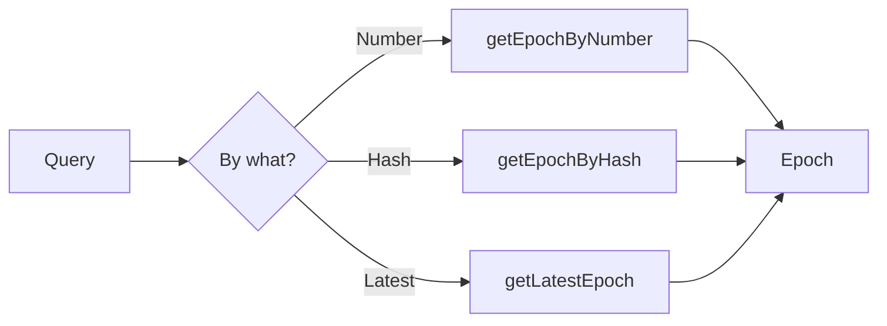

# Epoch Operations

This guide covers fetching and working with epochs on OPNet.

## Overview

Epochs can be fetched by number, hash, or you can retrieve the latest epoch. Each epoch contains consensus data about a period of blocks.



---

## Get Latest Epoch

### Basic Query

```typescript
import { JSONRpcProvider } from 'opnet';
import { networks } from '@btc-vision/bitcoin';

const network = networks.regtest;
const provider = new JSONRpcProvider({ url: 'https://regtest.opnet.org', network });

// Get latest epoch without submissions
const epoch = await provider.getLatestEpoch(false);

console.log('Epoch Number:', epoch.epochNumber);
console.log('Start Block:', epoch.startBlock);
console.log('End Block:', epoch.endBlock);
console.log('Proposer:', epoch.proposer.publicKey.toHex());
```

### With Submissions

```typescript
import { toHex } from '@btc-vision/bitcoin';

// Get latest epoch with all submissions
const epochWithSubmissions = await provider.getLatestEpoch(true);

console.log('Epoch:', epochWithSubmissions.epochNumber);
console.log('Total submissions:', epochWithSubmissions.submissions?.length ?? 0);

// Access all miner submissions
if (epochWithSubmissions.submissions) {
    for (const submission of epochWithSubmissions.submissions) {
        console.log('Miner:', submission.publicKey.toHex());
        console.log('Solution:', toHex(submission.solution));
    }
}
```

### Method Signature

```typescript
async getLatestEpoch(
    includeSubmissions: boolean  // Include all submissions
): Promise<Epoch>
```

---

## Get Epoch by Number

```typescript
import { toHex } from '@btc-vision/bitcoin';

// Fetch specific epoch by number
const epoch = await provider.getEpochByNumber(100n);

console.log('Epoch:', epoch.epochNumber);
console.log('Hash:', toHex(epoch.epochHash));
console.log('Target:', toHex(epoch.targetHash));
console.log('Difficulty:', epoch.difficultyScaled);
```

### Method Signature

```typescript
async getEpochByNumber(
    epochNumber: BigNumberish,                  // Epoch sequence number
    includeSubmissions: boolean = false          // Include all submissions
): Promise<Epoch | EpochWithSubmissions>
```

---

## Get Epoch by Hash

```typescript
// Fetch epoch by its unique hash (string parameter)
const epoch = await provider.getEpochByHash('0xabcdef...');

console.log('Epoch Number:', epoch.epochNumber);
console.log('Block Range:', epoch.startBlock, '-', epoch.endBlock);
```

### Method Signature

```typescript
async getEpochByHash(
    epochHash: string,                          // Unique epoch hash as string
    includeSubmissions: boolean = false          // Include all submissions
): Promise<Epoch | EpochWithSubmissions>
```

---

## Epoch Class Reference

```typescript
interface Epoch {
    // Identity
    epochNumber: bigint;          // Sequential epoch ID
    epochHash: Uint8Array;            // Unique hash of this epoch

    // State
    epochRoot: Uint8Array;            // State root at epoch end

    // Block range
    startBlock: bigint;           // First block in epoch
    endBlock: bigint;             // Last block in epoch

    // Mining parameters
    difficultyScaled: bigint;     // Scaled difficulty value
    minDifficulty?: string;       // Minimum required difficulty
    targetHash: Uint8Array;           // Mining target hash

    // Proposer info
    proposer: EpochMiner;         // Winning miner

    // Proofs
    proofs: readonly Uint8Array[];    // Epoch validity proofs
}
```

---

## EpochMiner Reference

The proposer who won the epoch:

```typescript
interface EpochMiner {
    solution: Uint8Array;      // SHA-1 collision solution
    publicKey: Address;    // Miner's public key address
    salt: Uint8Array;          // Salt used in solution
    graffiti?: Uint8Array;     // Optional miner message (32 bytes max)
}
```

---

## Working with Epochs

### Get Epoch Block Count

```typescript
async function getEpochBlockCount(
    provider: JSONRpcProvider,
    epochNumber: bigint
): Promise<bigint> {
    const epoch = await provider.getEpochByNumber(epochNumber);
    return epoch.endBlock - epoch.startBlock + 1n;
}

// Usage
const blockCount = await getEpochBlockCount(provider, 100n);
console.log('Blocks in epoch:', blockCount);
```

### Compare Epochs

```typescript
async function compareEpochs(
    provider: JSONRpcProvider,
    epochA: bigint,
    epochB: bigint
): Promise<{
    difficultyChange: bigint;
    blockCountDiff: bigint;
}> {
    const [a, b] = await Promise.all([
        provider.getEpochByNumber(epochA),
        provider.getEpochByNumber(epochB),
    ]);

    const blocksA = a.endBlock - a.startBlock;
    const blocksB = b.endBlock - b.startBlock;

    return {
        difficultyChange: b.difficultyScaled - a.difficultyScaled,
        blockCountDiff: blocksB - blocksA,
    };
}

// Usage
const comparison = await compareEpochs(provider, 99n, 100n);
console.log('Difficulty change:', comparison.difficultyChange);
```

### Get Epoch History

```typescript
async function getEpochHistory(
    provider: JSONRpcProvider,
    count: number
): Promise<Epoch[]> {
    const latest = await provider.getLatestEpoch(false);
    const epochs: Epoch[] = [latest];

    for (let i = 1; i < count; i++) {
        const epochNum = latest.epochNumber - BigInt(i);
        if (epochNum < 0n) break;

        const epoch = await provider.getEpochByNumber(epochNum);
        epochs.push(epoch);
    }

    return epochs;
}

// Usage
const history = await getEpochHistory(provider, 10);
console.log('Last 10 epochs:');
for (const epoch of history) {
    console.log(`  Epoch ${epoch.epochNumber}: blocks ${epoch.startBlock}-${epoch.endBlock}`);
}
```

---

## Epoch Analysis

### Analyze Epoch Difficulty

```typescript
import { toHex } from '@btc-vision/bitcoin';

async function analyzeEpochDifficulty(
    provider: JSONRpcProvider,
    epochNumber: bigint
): Promise<{
    epoch: bigint;
    difficulty: bigint;
    minDifficulty: string | undefined;
    targetHash: string;
}> {
    const epoch = await provider.getEpochByNumber(epochNumber);

    return {
        epoch: epoch.epochNumber,
        difficulty: epoch.difficultyScaled,
        minDifficulty: epoch.minDifficulty,
        targetHash: toHex(epoch.targetHash),
    };
}

// Usage
const analysis = await analyzeEpochDifficulty(provider, 100n);
console.log('Difficulty Analysis:');
console.log('  Scaled difficulty:', analysis.difficulty);
console.log('  Min difficulty:', analysis.minDifficulty);
```

### Track Proposer Wins

```typescript
async function getProposerStats(
    provider: JSONRpcProvider,
    epochCount: number
): Promise<Map<string, number>> {
    const stats = new Map<string, number>();
    const latest = await provider.getLatestEpoch(false);

    for (let i = 0; i < epochCount; i++) {
        const epochNum = latest.epochNumber - BigInt(i);
        if (epochNum < 0n) break;

        const epoch = await provider.getEpochByNumber(epochNum);
        const proposer = epoch.proposer.publicKey.toHex();

        stats.set(proposer, (stats.get(proposer) ?? 0) + 1);
    }

    return stats;
}

// Usage
const proposerStats = await getProposerStats(provider, 100);
console.log('Proposer statistics (last 100 epochs):');
for (const [proposer, wins] of proposerStats) {
    console.log(`  ${proposer.slice(0, 16)}...: ${wins} wins`);
}
```

---

## Finding Epochs

### Find Epoch Containing Block

```typescript
async function findEpochForBlock(
    provider: JSONRpcProvider,
    blockNumber: bigint
): Promise<Epoch | null> {
    // Start from latest and search backwards
    let current = await provider.getLatestEpoch(false);

    while (current.epochNumber >= 0n) {
        if (blockNumber >= current.startBlock && blockNumber <= current.endBlock) {
            return current;
        }

        if (blockNumber > current.endBlock) {
            // Block is after this epoch, not found yet
            return null;
        }

        if (current.epochNumber === 0n) break;

        current = await provider.getEpochByNumber(current.epochNumber - 1n);
    }

    return null;
}

// Usage
const epoch = await findEpochForBlock(provider, 50000n);
if (epoch) {
    console.log('Block 50000 is in epoch', epoch.epochNumber);
}
```

### Find Epochs by Proposer

```typescript
async function findEpochsByProposer(
    provider: JSONRpcProvider,
    proposerKey: string,
    maxEpochs: number = 100
): Promise<Epoch[]> {
    const results: Epoch[] = [];
    const latest = await provider.getLatestEpoch(false);

    for (let i = 0; i < maxEpochs; i++) {
        const epochNum = latest.epochNumber - BigInt(i);
        if (epochNum < 0n) break;

        const epoch = await provider.getEpochByNumber(epochNum);

        if (epoch.proposer.publicKey.toHex() === proposerKey) {
            results.push(epoch);
        }
    }

    return results;
}

// Usage
const myEpochs = await findEpochsByProposer(
    provider,
    '0x1234...minerkey...',
    500
);
console.log('Found', myEpochs.length, 'epochs proposed by this miner');
```

---

## Complete Epoch Service

```typescript
import { toHex } from '@btc-vision/bitcoin';

class EpochService {
    constructor(private provider: JSONRpcProvider) {}

    async getLatest(includeSubmissions: boolean = false): Promise<Epoch> {
        return this.provider.getLatestEpoch(includeSubmissions);
    }

    async getByNumber(epochNumber: bigint): Promise<Epoch | EpochWithSubmissions> {
        return this.provider.getEpochByNumber(epochNumber);
    }

    async getByHash(hash: string): Promise<Epoch | EpochWithSubmissions> {
        return this.provider.getEpochByHash(hash);
    }

    async getCurrentEpochNumber(): Promise<bigint> {
        const latest = await this.getLatest();
        return latest.epochNumber;
    }

    async getEpochRange(
        startEpoch: bigint,
        endEpoch: bigint
    ): Promise<Epoch[]> {
        const epochs: Epoch[] = [];

        for (let i = startEpoch; i <= endEpoch; i++) {
            const epoch = await this.getByNumber(i);
            epochs.push(epoch);
        }

        return epochs;
    }

    async getProposerInfo(epochNumber: bigint): Promise<{
        publicKey: string;
        solution: string;
        salt: string;
        graffiti?: string;
    }> {
        const epoch = await this.getByNumber(epochNumber);
        const proposer = epoch.proposer;

        return {
            publicKey: proposer.publicKey.toHex(),
            solution: toHex(proposer.solution),
            salt: toHex(proposer.salt),
            graffiti: proposer.graffiti
                ? new TextDecoder().decode(proposer.graffiti)
                : undefined,
        };
    }

    async isEpochFinalized(epochNumber: bigint): Promise<boolean> {
        try {
            const epoch = await this.getByNumber(epochNumber);
            return epoch.proposer !== undefined;
        } catch {
            return false;
        }
    }
}

// Usage
const epochService = new EpochService(provider);

const current = await epochService.getCurrentEpochNumber();
console.log('Current epoch:', current);

const epoch = await epochService.getByNumber(current);
console.log('Proposer:', (await epochService.getProposerInfo(current)).publicKey);

const isFinalized = await epochService.isEpochFinalized(current);
console.log('Finalized:', isFinalized);
```

---

## Best Practices

1. **Cache Epoch Data**: Finalized epochs don't change, safe to cache

2. **Check Finalization**: Verify epoch has a proposer before relying on data

3. **Handle Missing Epochs**: Future epoch numbers will throw errors

4. **Use Submissions Sparingly**: Only fetch submissions when needed (larger response)

5. **Batch Requests**: Fetch multiple epochs in parallel when possible

---

## Next Steps

- [Epoch Overview](./overview.md) - Understanding epochs
- [Mining Template](./mining-template.md) - Mining requirements
- [Submitting Epochs](./submitting-epochs.md) - Solution submission

---

[← Previous: Epoch Overview](./overview.md) | [Next: Mining Template →](./mining-template.md)
