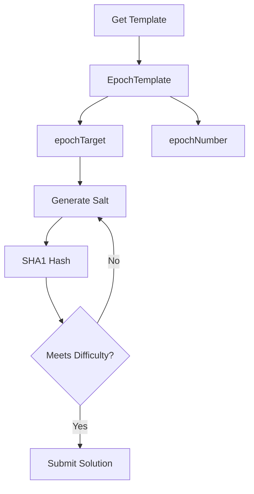

# Mining Template

This guide covers using epoch templates for SHA-1 collision mining on OPNet.

## Overview

The epoch template provides the target hash and difficulty parameters needed to mine the current epoch. Miners must find a SHA-1 collision solution that meets the difficulty requirements.



---

## Get Mining Template

### Basic Template Query

```typescript
import { JSONRpcProvider } from 'opnet';
import { networks, toHex } from '@btc-vision/bitcoin';

const network = networks.regtest;
const provider = new JSONRpcProvider({ url: 'https://regtest.opnet.org', network });

const template = await provider.getEpochTemplate();

console.log('Mining Template:');
console.log('  Epoch:', template.epochNumber);
console.log('  Target:', toHex(template.epochTarget));
```

### Method Signature

```typescript
async getEpochTemplate(): Promise<EpochTemplate>
```

---

## EpochTemplate Structure

```typescript
interface EpochTemplate {
    epochNumber: bigint;    // Current epoch being mined
    epochTarget: Uint8Array;    // Target hash for collision
}
```

---

## Mining Process

### Understanding the Target

Mining requires finding a SHA-1 collision against the target hash. The algorithm:

1. Compute preimage: `checksumRoot XOR mldsaPublicKey XOR salt` (each 32 bytes)
2. Compute hash: `SHA1(preimage)`
3. Count matching bits between `hash` and `SHA1(checksumRoot)`
4. Valid if `matchingBits >= minDifficulty`

### Basic Mining Loop

```typescript
import { createHash } from 'crypto';

function calculatePreimage(
    checksumRoot: Uint8Array,
    mldsaPublicKey: Uint8Array,
    salt: Uint8Array
): Uint8Array {
    const target32 = new Uint8Array(32);
    const pubKey32 = new Uint8Array(32);
    const salt32 = new Uint8Array(32);

    target32.set(checksumRoot.subarray(0, Math.min(32, checksumRoot.length)));
    pubKey32.set(mldsaPublicKey.subarray(0, Math.min(32, mldsaPublicKey.length)));
    salt32.set(salt.subarray(0, Math.min(32, salt.length)));

    const preimage = new Uint8Array(32);
    for (let i = 0; i < 32; i++) {
        preimage[i] = target32[i] ^ pubKey32[i] ^ salt32[i];
    }

    return preimage;
}

function countMatchingBits(hash1: Uint8Array, hash2: Uint8Array): number {
    let matchingBits = 0;
    const minLength = Math.min(hash1.length, hash2.length);

    for (let i = 0; i < minLength; i++) {
        const byte1 = hash1[i];
        const byte2 = hash2[i];

        if (byte1 === byte2) {
            matchingBits += 8;
        } else {
            for (let bit = 7; bit >= 0; bit--) {
                if (((byte1 >> bit) & 1) === ((byte2 >> bit) & 1)) {
                    matchingBits++;
                } else {
                    return matchingBits;
                }
            }
        }
    }

    return matchingBits;
}

async function mineEpoch(
    provider: JSONRpcProvider,
    mldsaPublicKey: Uint8Array
): Promise<{ salt: Uint8Array; matchingBits: number } | null> {
    const template = await provider.getEpochTemplate();
    const checksumRoot = template.epochTarget;
    const targetHash = createHash('sha1').update(checksumRoot).digest();
    const minDifficulty = 20; // Minimum matching bits required

    let attempts = 0;
    const maxAttempts = 1000000;

    while (attempts < maxAttempts) {
        const salt = crypto.getRandomValues(new Uint8Array(32));

        const preimage = calculatePreimage(checksumRoot, mldsaPublicKey, salt);
        const hash = createHash('sha1').update(preimage).digest();

        const matchingBits = countMatchingBits(hash, targetHash);

        if (matchingBits >= minDifficulty) {
            return { salt, matchingBits };
        }

        attempts++;
    }

    return null;
}
```

---

## Difficulty Management

### Get Current Difficulty

```typescript
async function getCurrentDifficulty(
    provider: JSONRpcProvider
): Promise<{
    epochNumber: bigint;
    difficultyScaled: bigint;
    minDifficulty?: string;
}> {
    const epoch = await provider.getLatestEpoch(false);

    return {
        epochNumber: epoch.epochNumber,
        difficultyScaled: epoch.difficultyScaled,
        minDifficulty: epoch.minDifficulty,
    };
}

// Usage
const difficulty = await getCurrentDifficulty(provider);
console.log('Current difficulty:', difficulty.difficultyScaled);
```

### Track Difficulty Changes

```typescript
async function trackDifficultyHistory(
    provider: JSONRpcProvider,
    epochCount: number
): Promise<Array<{ epoch: bigint; difficulty: bigint }>> {
    const history: Array<{ epoch: bigint; difficulty: bigint }> = [];
    const latest = await provider.getLatestEpoch(false);

    for (let i = 0; i < epochCount; i++) {
        const epochNum = latest.epochNumber - BigInt(i);
        if (epochNum < 0n) break;

        const epoch = await provider.getEpochByNumber(epochNum);
        history.push({
            epoch: epoch.epochNumber,
            difficulty: epoch.difficultyScaled,
        });
    }

    return history.reverse();
}

// Usage
const difficultyHistory = await trackDifficultyHistory(provider, 20);
console.log('Difficulty over last 20 epochs:');
for (const entry of difficultyHistory) {
    console.log(`  Epoch ${entry.epoch}: ${entry.difficulty}`);
}
```

---

## Mining Service

### Complete Mining Implementation

```typescript
import { toHex } from '@btc-vision/bitcoin';

class MiningService {
    private provider: JSONRpcProvider;
    private isRunning: boolean = false;
    private currentTemplate: EpochTemplate | null = null;
    private mldsaPublicKey: Uint8Array;
    private minDifficulty: number = 20;

    constructor(provider: JSONRpcProvider, mldsaPublicKey: Uint8Array) {
        this.provider = provider;
        this.mldsaPublicKey = mldsaPublicKey;
    }

    async refreshTemplate(): Promise<EpochTemplate> {
        this.currentTemplate = await this.provider.getEpochTemplate();
        return this.currentTemplate;
    }

    getTemplate(): EpochTemplate | null {
        return this.currentTemplate;
    }

    async startMining(
        onSolutionFound: (solution: {
            salt: Uint8Array;
            matchingBits: number;
            epochNumber: bigint;
        }) => void,
        hashesPerBatch: number = 10000
    ): Promise<void> {
        this.isRunning = true;

        while (this.isRunning) {
            const template = await this.refreshTemplate();

            const result = await this.mineBatch(template, hashesPerBatch);

            if (result) {
                onSolutionFound({
                    salt: result.salt,
                    matchingBits: result.matchingBits,
                    epochNumber: template.epochNumber,
                });
            }

            await new Promise(r => setTimeout(r, 100));
        }
    }

    stopMining(): void {
        this.isRunning = false;
    }

    private calculatePreimage(checksumRoot: Uint8Array, salt: Uint8Array): Uint8Array {
        const target32 = new Uint8Array(32);
        const pubKey32 = new Uint8Array(32);
        const salt32 = new Uint8Array(32);

        target32.set(checksumRoot.subarray(0, Math.min(32, checksumRoot.length)));
        pubKey32.set(this.mldsaPublicKey.subarray(0, Math.min(32, this.mldsaPublicKey.length)));
        salt32.set(salt.subarray(0, Math.min(32, salt.length)));

        const preimage = new Uint8Array(32);
        for (let i = 0; i < 32; i++) {
            preimage[i] = target32[i] ^ pubKey32[i] ^ salt32[i];
        }

        return preimage;
    }

    private countMatchingBits(hash1: Uint8Array, hash2: Uint8Array): number {
        let matchingBits = 0;
        const minLength = Math.min(hash1.length, hash2.length);

        for (let i = 0; i < minLength; i++) {
            if (hash1[i] === hash2[i]) {
                matchingBits += 8;
            } else {
                for (let bit = 7; bit >= 0; bit--) {
                    if (((hash1[i] >> bit) & 1) === ((hash2[i] >> bit) & 1)) {
                        matchingBits++;
                    } else {
                        return matchingBits;
                    }
                }
            }
        }

        return matchingBits;
    }

    private async mineBatch(
        template: EpochTemplate,
        batchSize: number
    ): Promise<{ salt: Uint8Array; matchingBits: number } | null> {
        const checksumRoot = template.epochTarget;
        const targetHash = createHash('sha1').update(checksumRoot).digest();

        for (let i = 0; i < batchSize; i++) {
            const salt = crypto.getRandomValues(new Uint8Array(32));

            const preimage = this.calculatePreimage(checksumRoot, salt);
            const hash = createHash('sha1').update(preimage).digest();

            const matchingBits = this.countMatchingBits(hash, targetHash);

            if (matchingBits >= this.minDifficulty) {
                return { salt, matchingBits };
            }
        }

        return null;
    }
}

// Usage
const miningService = new MiningService(provider, wallet.mldsaKeypair.publicKey);

miningService.startMining(async (solution) => {
    console.log('Solution found!');
    console.log('  Epoch:', solution.epochNumber);
    console.log('  Salt:', toHex(solution.salt));
    console.log('  Matching bits:', solution.matchingBits);

    // Submit the solution
    // await submitSolution(solution);
});

// Later: stop mining
// miningService.stopMining();
```

---

## Template Monitoring

### Watch for New Epochs

```typescript
import { toHex } from '@btc-vision/bitcoin';

async function monitorTemplates(
    provider: JSONRpcProvider,
    onNewEpoch: (template: EpochTemplate) => void,
    intervalMs: number = 10000
): Promise<() => void> {
    let lastEpoch = -1n;

    const intervalId = setInterval(async () => {
        try {
            const template = await provider.getEpochTemplate();

            if (template.epochNumber !== lastEpoch) {
                lastEpoch = template.epochNumber;
                onNewEpoch(template);
            }
        } catch (error) {
            console.error('Error fetching template:', error);
        }
    }, intervalMs);

    return () => clearInterval(intervalId);
}

// Usage
const stopMonitoring = await monitorTemplates(provider, (template) => {
    console.log('New epoch started:', template.epochNumber);
    console.log('New target:', toHex(template.epochTarget));
});
```

### Check Template Freshness

```typescript
async function isTemplateStale(
    provider: JSONRpcProvider,
    template: EpochTemplate
): Promise<boolean> {
    const current = await provider.getEpochTemplate();
    return current.epochNumber !== template.epochNumber;
}

// Usage in mining loop
const template = await provider.getEpochTemplate();

// ... mining work ...

if (await isTemplateStale(provider, template)) {
    console.log('Template changed, refreshing...');
    // Get new template and restart
}
```

---

## Hashrate Estimation

### Calculate Mining Hashrate

```typescript
class HashrateTracker {
    private hashCount: number = 0;
    private startTime: number = Date.now();
    private samples: number[] = [];

    addHashes(count: number): void {
        this.hashCount += count;
    }

    getHashrate(): number {
        const elapsedSeconds = (Date.now() - this.startTime) / 1000;
        if (elapsedSeconds === 0) return 0;
        return this.hashCount / elapsedSeconds;
    }

    recordSample(): void {
        const hashrate = this.getHashrate();
        this.samples.push(hashrate);

        // Keep last 60 samples
        if (this.samples.length > 60) {
            this.samples.shift();
        }

        // Reset counter
        this.hashCount = 0;
        this.startTime = Date.now();
    }

    getAverageHashrate(): number {
        if (this.samples.length === 0) return 0;
        const sum = this.samples.reduce((a, b) => a + b, 0);
        return sum / this.samples.length;
    }

    formatHashrate(hashrate: number): string {
        if (hashrate >= 1e9) {
            return `${(hashrate / 1e9).toFixed(2)} GH/s`;
        } else if (hashrate >= 1e6) {
            return `${(hashrate / 1e6).toFixed(2)} MH/s`;
        } else if (hashrate >= 1e3) {
            return `${(hashrate / 1e3).toFixed(2)} KH/s`;
        }
        return `${hashrate.toFixed(2)} H/s`;
    }
}

// Usage
const tracker = new HashrateTracker();

// In mining loop
tracker.addHashes(10000);

// Every second
setInterval(() => {
    tracker.recordSample();
    console.log('Hashrate:', tracker.formatHashrate(tracker.getAverageHashrate()));
}, 1000);
```

---

## Mining Statistics

### Track Mining Performance

```typescript
interface MiningStats {
    totalHashes: bigint;
    solutionsFound: number;
    epochsMined: Set<bigint>;
    startTime: number;
    lastSolutionTime?: number;
}

class MiningStatsTracker {
    private stats: MiningStats = {
        totalHashes: 0n,
        solutionsFound: 0,
        epochsMined: new Set(),
        startTime: Date.now(),
    };

    addHashes(count: bigint): void {
        this.stats.totalHashes += count;
    }

    recordSolution(epochNumber: bigint): void {
        this.stats.solutionsFound++;
        this.stats.epochsMined.add(epochNumber);
        this.stats.lastSolutionTime = Date.now();
    }

    getStats(): {
        totalHashes: string;
        solutions: number;
        uniqueEpochs: number;
        uptimeHours: number;
        avgHashesPerSolution: string;
    } {
        const uptimeMs = Date.now() - this.stats.startTime;
        const uptimeHours = uptimeMs / (1000 * 60 * 60);

        const avgHashes = this.stats.solutionsFound > 0
            ? this.stats.totalHashes / BigInt(this.stats.solutionsFound)
            : 0n;

        return {
            totalHashes: this.stats.totalHashes.toString(),
            solutions: this.stats.solutionsFound,
            uniqueEpochs: this.stats.epochsMined.size,
            uptimeHours: Math.round(uptimeHours * 100) / 100,
            avgHashesPerSolution: avgHashes.toString(),
        };
    }
}

// Usage
const statsTracker = new MiningStatsTracker();

// During mining
statsTracker.addHashes(10000n);

// On solution found
statsTracker.recordSolution(100n);

// Display stats
const stats = statsTracker.getStats();
console.log('Mining Stats:');
console.log('  Total hashes:', stats.totalHashes);
console.log('  Solutions found:', stats.solutions);
console.log('  Uptime:', stats.uptimeHours, 'hours');
```

---

## Best Practices

1. **Refresh Templates**: Check for new epochs regularly to avoid wasted work

2. **Batch Processing**: Process hashes in batches for better performance

3. **Monitor Difficulty**: Adjust expectations based on network difficulty

4. **Handle Errors**: Network issues shouldn't crash the mining loop

5. **Track Statistics**: Monitor hashrate and success rate

---

## Next Steps

- [Epoch Overview](./overview.md) - Understanding epochs
- [Epoch Operations](./epoch-operations.md) - Fetching epochs
- [Submitting Epochs](./submitting-epochs.md) - Submit solutions

---

[← Previous: Epoch Operations](./epoch-operations.md) | [Next: Submitting Epochs →](./submitting-epochs.md)
