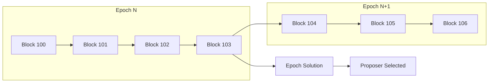
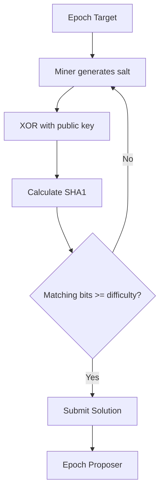

# Epoch System Overview

This guide explains the OPNet epoch system and SHA-1 collision mining consensus mechanism.

## What are Epochs?

Epochs are time-bounded periods in OPNet that provide finality and consensus. Each epoch spans multiple Bitcoin blocks and requires a SHA-1 collision solution to be proposed.



---

## Key Concepts

### Epoch Structure

| Component | Description |
|-----------|-------------|
| `epochNumber` | Sequential epoch identifier |
| `epochHash` | Unique hash of the epoch |
| `epochRoot` | State root at epoch end |
| `startBlock` | First block in epoch |
| `endBlock` | Last block in epoch |
| `targetHash` | Mining target (SHA-1 collision) |
| `proposer` | Winner who solved the collision |
| `difficultyScaled` | Difficulty adjustment |

### SHA-1 Collision Mining

OPNet uses SHA-1 collision mining for epoch consensus. Miners must find a solution where:

```
preimage = checksumRoot XOR mldsaPublicKey XOR salt
hash = SHA1(preimage)
matchingBits(hash, SHA1(checksumRoot)) >= minDifficulty
```



---

## Epoch Lifecycle

### 1. Epoch Active

During an active epoch, transactions are processed and blocks are mined normally.

### 2. Epoch End

When an epoch ends (after a certain number of blocks), miners compete to find a SHA-1 collision solution.

### 3. Solution Submission

Miners submit their solutions. The first valid solution makes the submitter the epoch proposer.

### 4. Epoch Finality

Once a proposer is selected, the epoch is finalized and the next epoch begins.

---

## Epoch Components

### Epoch

The main epoch data structure:

```typescript
interface Epoch {
    epochNumber: bigint;          // Epoch ID
    epochHash: Uint8Array;            // Unique epoch hash
    epochRoot: Uint8Array;            // State root
    startBlock: bigint;           // Start block number
    endBlock: bigint;             // End block number
    difficultyScaled: bigint;     // Scaled difficulty
    minDifficulty?: string;       // Minimum required difficulty
    targetHash: Uint8Array;           // Mining target
    proposer: EpochMiner;         // Winning miner
    proofs: readonly Uint8Array[];    // Epoch proofs
}
```

### EpochMiner

The miner who proposed the epoch:

```typescript
interface EpochMiner {
    solution: Uint8Array;      // SHA-1 collision solution
    publicKey: Address;    // Miner's public key
    salt: Uint8Array;          // Salt used in solution
    graffiti?: Uint8Array;     // Optional miner message
}
```

### EpochTemplate

Template for mining the current epoch:

```typescript
interface EpochTemplate {
    epochNumber: bigint;    // Current epoch number
    epochTarget: Uint8Array;    // Target hash for collision
}
```

---

## Why Epochs Matter

### 1. Finality

Epochs provide transaction finality. Once an epoch is complete, transactions within it are considered final.

### 2. Consensus

The SHA-1 collision requirement ensures distributed consensus without relying solely on Bitcoin block ordering.

### 3. State Commitment

Each epoch commits to a state root, allowing verification of contract state at epoch boundaries.

### 4. Incentives

Epoch proposers may receive rewards, incentivizing network participation.

---

## Epoch Query Methods

| Method | Description |
|--------|-------------|
| `getLatestEpoch()` | Get the most recent epoch |
| `getEpochByNumber()` | Get epoch by sequence number |
| `getEpochByHash()` | Get epoch by hash |
| `getEpochTemplate()` | Get current mining template |
| `submitEpoch()` | Submit a solution |

---

## Basic Usage

```typescript
import { JSONRpcProvider } from 'opnet';
import { networks, toHex } from '@btc-vision/bitcoin';

const network = networks.regtest;
const provider = new JSONRpcProvider({ url: 'https://regtest.opnet.org', network });

// Get latest epoch
const latestEpoch = await provider.getLatestEpoch(false);
console.log('Current epoch:', latestEpoch.epochNumber);
console.log('Proposer:', latestEpoch.proposer.publicKey.toHex());

// Get mining template
const template = await provider.getEpochTemplate();
console.log('Mining target:', toHex(template.epochTarget));
```

---

## Epoch Monitoring

### Check Current Epoch

```typescript
async function getCurrentEpochInfo(provider: JSONRpcProvider) {
    const epoch = await provider.getLatestEpoch(false);

    return {
        number: epoch.epochNumber,
        startBlock: epoch.startBlock,
        endBlock: epoch.endBlock,
        blockRange: epoch.endBlock - epoch.startBlock,
        proposer: epoch.proposer.publicKey.toHex(),
        difficulty: epoch.difficultyScaled,
    };
}

const info = await getCurrentEpochInfo(provider);
console.log('Epoch Info:', info);
```

### Track Epoch Progress

```typescript
async function getEpochProgress(
    provider: JSONRpcProvider
): Promise<{
    epoch: bigint;
    currentBlock: bigint;
    startBlock: bigint;
    endBlock: bigint;
    progress: number;
}> {
    const [epoch, currentBlock] = await Promise.all([
        provider.getLatestEpoch(false),
        provider.getBlockNumber(),
    ]);

    const epochBlocks = epoch.endBlock - epoch.startBlock;
    const blocksCompleted = currentBlock - epoch.startBlock;
    const progress = Number(blocksCompleted * 100n / epochBlocks);

    return {
        epoch: epoch.epochNumber,
        currentBlock,
        startBlock: epoch.startBlock,
        endBlock: epoch.endBlock,
        progress: Math.min(100, Math.max(0, progress)),
    };
}

const progress = await getEpochProgress(provider);
console.log(`Epoch ${progress.epoch}: ${progress.progress}% complete`);
```

---

## Next Steps

- [Epoch Operations](./epoch-operations.md) - Fetching epochs
- [Mining Template](./mining-template.md) - Mining requirements
- [Submitting Epochs](./submitting-epochs.md) - Solution submission

---

[← Previous: Reorg Detection](../blocks/reorg-detection.md) | [Next: Epoch Operations →](./epoch-operations.md)
