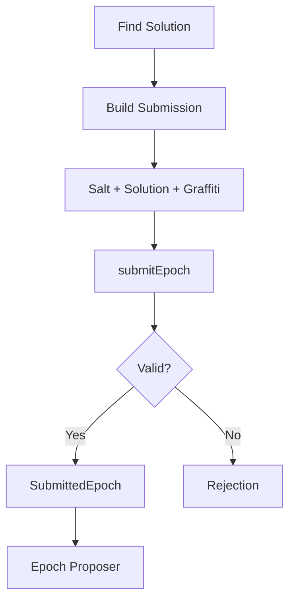

# Submitting Epochs

This guide covers submitting SHA-1 collision solutions to propose epochs on OPNet.

## Overview

After finding a valid SHA-1 collision solution, miners submit it to become the epoch proposer. The first valid submission wins the epoch.



---

## Submit Epoch Solution

### Basic Submission

```typescript
import { JSONRpcProvider, EpochSubmissionParams } from 'opnet';
import { networks, fromHex } from '@btc-vision/bitcoin';

const network = networks.regtest;
const provider = new JSONRpcProvider({ url: 'https://regtest.opnet.org', network });

// Prepare submission parameters
const submission: EpochSubmissionParams = {
    epochNumber: 100n,
    checksumRoot: fromHex('your-checksum-root-here...'),
    salt: fromHex('your-32-byte-salt-here...'),
    mldsaPublicKey: fromHex('your-mldsa-public-key...'),
    signature: fromHex('your-mldsa-signature...'),
};

// Submit the solution
const result = await provider.submitEpoch(submission);

console.log('Submission Result:');
console.log('  Status:', result.status);
console.log('  Epoch:', result.epochNumber);
```

### With Graffiti

```typescript
// Include optional graffiti message (max 32 bytes)
const submissionWithGraffiti: EpochSubmissionParams = {
    epochNumber: template.epochNumber,
    checksumRoot: checksumRoot,
    salt: solutionSalt,
    mldsaPublicKey: mldsaPublicKey,
    signature: solutionSignature,
    graffiti: new TextEncoder().encode('Mined by MyPool v1.0'),
};

const result = await provider.submitEpoch(submissionWithGraffiti);
```

### Method Signature

```typescript
async submitEpoch(
    params: EpochSubmissionParams
): Promise<SubmittedEpoch>
```

---

## EpochSubmissionParams Reference

```typescript
interface EpochSubmissionParams {
    readonly epochNumber: bigint;         // Epoch number to submit for
    readonly checksumRoot: Uint8Array;    // Checksum root
    readonly salt: Uint8Array;            // 32-byte salt used in collision
    readonly mldsaPublicKey: Uint8Array;  // ML-DSA public key
    readonly signature: Uint8Array;       // ML-DSA signature
    readonly graffiti?: Uint8Array;       // Optional message (max 32 bytes)
}
```

---

## SubmittedEpoch Result

```typescript
interface SubmittedEpoch {
    readonly epochNumber: bigint;            // Epoch that was submitted to
    readonly submissionHash: Uint8Array;     // Hash of the submission
    readonly difficulty: number;             // Difficulty of the submission
    readonly timestamp: Date;                // When the submission was made
    readonly status: SubmissionStatus;       // Acceptance status
    readonly message?: string;               // Additional status message
}

enum SubmissionStatus {
    ACCEPTED = 'accepted',
    REJECTED = 'rejected',
}
```

---

## Handling Submission Results

### Check Submission Status

```typescript
async function submitAndHandle(
    provider: JSONRpcProvider,
    params: EpochSubmissionParams
): Promise<boolean> {
    try {
        const result = await provider.submitEpoch(params);

        switch (result.status) {
            case 'accepted':
                console.log(`Successfully proposed epoch ${result.epochNumber}!`);
                console.log(`  Difficulty: ${result.difficulty}`);
                return true;

            case 'rejected':
                console.log('Submission rejected:', result.message);
                return false;

            default:
                console.log('Unknown status:', result.status);
                return false;
        }
    } catch (error) {
        console.error('Submission failed:', error);
        return false;
    }
}

// Usage
const success = await submitAndHandle(provider, submission);
if (success) {
    console.log('You are the epoch proposer!');
}
```

### Verify Submission On-Chain

```typescript
async function verifySubmission(
    provider: JSONRpcProvider,
    epochNumber: bigint,
    expectedProposer: string
): Promise<boolean> {
    try {
        const epoch = await provider.getEpochByNumber(epochNumber);
        return epoch.proposer.publicKey.toHex() === expectedProposer;
    } catch {
        return false;
    }
}

// Usage
const isProposer = await verifySubmission(
    provider,
    100n,
    'bc1p...my-address...'
);

if (isProposer) {
    console.log('Confirmed as epoch proposer!');
}
```

---

## Complete Submission Workflow

### Mining and Submitting

```typescript
import { createHash } from 'crypto';

class EpochMiner {
    private provider: JSONRpcProvider;
    private mldsaPublicKey: Uint8Array;
    private minDifficulty: number = 20;

    constructor(provider: JSONRpcProvider, mldsaPublicKey: Uint8Array) {
        this.provider = provider;
        this.mldsaPublicKey = mldsaPublicKey;
    }

    async mineAndSubmit(
        graffiti?: string
    ): Promise<SubmittedEpoch | null> {
        const template = await this.provider.getEpochTemplate();
        console.log('Mining epoch:', template.epochNumber);

        const checksumRoot = template.epochTarget;
        const targetHash = createHash('sha1').update(checksumRoot).digest();

        const solution = await this.findSolution(checksumRoot, targetHash);

        if (!solution) {
            console.log('No solution found');
            return null;
        }

        console.log(`Solution found with ${solution.matchingBits} matching bits`);

        const params: EpochSubmissionParams = {
            epochNumber: template.epochNumber,
            checksumRoot: checksumRoot,
            salt: solution.salt,
            mldsaPublicKey: this.mldsaPublicKey,
            signature: this.signSolution(solution.salt), // Sign with ML-DSA key
            graffiti: graffiti
                ? new TextEncoder().encode(graffiti.slice(0, 32))
                : undefined,
        };

        return this.provider.submitEpoch(params);
    }

    private calculatePreimage(
        checksumRoot: Uint8Array,
        salt: Uint8Array
    ): Uint8Array {
        const target32 = new Uint8Array(32);
        const pubKey32 = new Uint8Array(32);
        const salt32 = new Uint8Array(32);

        target32.set(checksumRoot.subarray(0, Math.min(32, checksumRoot.length)));
        pubKey32.set(this.mldsaPublicKey.subarray(0, Math.min(32, this.mldsaPublicKey.length)));
        salt32.set(salt.subarray(0, Math.min(32, salt.length)));

        const preimage = new Uint8Array(32);
        for (let i = 0; i < 32; i++) {
            preimage[i] = target32[i] ^ pubKey32[i] ^ salt32[i];
        }

        return preimage;
    }

    private countMatchingBits(hash1: Uint8Array, hash2: Uint8Array): number {
        let matchingBits = 0;
        const minLength = Math.min(hash1.length, hash2.length);

        for (let i = 0; i < minLength; i++) {
            if (hash1[i] === hash2[i]) {
                matchingBits += 8;
            } else {
                for (let bit = 7; bit >= 0; bit--) {
                    if (((hash1[i] >> bit) & 1) === ((hash2[i] >> bit) & 1)) {
                        matchingBits++;
                    } else {
                        return matchingBits;
                    }
                }
            }
        }

        return matchingBits;
    }

    private async findSolution(
        checksumRoot: Uint8Array,
        targetHash: Uint8Array
    ): Promise<{ salt: Uint8Array; matchingBits: number } | null> {
        const maxAttempts = 10000000;

        for (let i = 0; i < maxAttempts; i++) {
            const salt = crypto.getRandomValues(new Uint8Array(32));

            const preimage = this.calculatePreimage(checksumRoot, salt);
            const hash = createHash('sha1').update(preimage).digest();

            const matchingBits = this.countMatchingBits(hash, targetHash);

            if (matchingBits >= this.minDifficulty) {
                return { salt, matchingBits };
            }
        }

        return null;
    }

    private signSolution(salt: Uint8Array): Uint8Array {
        // Sign with ML-DSA private key
        // Implementation depends on your ML-DSA library
        return new Uint8Array(0); // Placeholder
    }
}

// Usage
const miner = new EpochMiner(provider, wallet.mldsaKeypair.publicKey);
const result = await miner.mineAndSubmit('MyMiner v1.0');

if (result?.status === 'accepted') {
    console.log('Successfully proposed epoch', result.epochNumber);
}
```

---

## Competitive Submission

### Race to Submit

```typescript
class CompetitiveMiner {
    private provider: JSONRpcProvider;
    private mldsaPublicKey: Uint8Array;
    private isRunning: boolean = false;
    private minDifficulty: number = 20;

    constructor(provider: JSONRpcProvider, mldsaPublicKey: Uint8Array) {
        this.provider = provider;
        this.mldsaPublicKey = mldsaPublicKey;
    }

    async startMining(graffiti?: string): Promise<void> {
        this.isRunning = true;

        while (this.isRunning) {
            const template = await this.provider.getEpochTemplate();
            const startEpoch = template.epochNumber;

            console.log(`Mining epoch ${startEpoch}...`);

            const checksumRoot = template.epochTarget;
            const targetHash = createHash('sha1').update(checksumRoot).digest();

            while (this.isRunning) {
                const current = await this.provider.getEpochTemplate();
                if (current.epochNumber !== startEpoch) {
                    console.log('Epoch changed, restarting...');
                    break;
                }

                const solution = await this.mineBatch(checksumRoot, targetHash, 100000);

                if (solution) {
                    const params: EpochSubmissionParams = {
                        epochNumber: template.epochNumber,
                        checksumRoot: checksumRoot,
                        salt: solution.salt,
                        mldsaPublicKey: this.mldsaPublicKey,
                        signature: this.signSolution(solution.salt),
                        graffiti: graffiti
                            ? new TextEncoder().encode(graffiti.slice(0, 32))
                            : undefined,
                    };

                    try {
                        const result = await this.provider.submitEpoch(params);

                        if (result.status === 'accepted') {
                            console.log(`WON epoch ${result.epochNumber}!`);
                        } else {
                            console.log('Submission rejected:', result.status);
                        }
                    } catch (error) {
                        console.error('Submission error:', error);
                    }

                    break;
                }
            }
        }
    }

    stop(): void {
        this.isRunning = false;
    }

    private calculatePreimage(checksumRoot: Uint8Array, salt: Uint8Array): Uint8Array {
        const target32 = new Uint8Array(32);
        const pubKey32 = new Uint8Array(32);
        const salt32 = new Uint8Array(32);

        target32.set(checksumRoot.subarray(0, Math.min(32, checksumRoot.length)));
        pubKey32.set(this.mldsaPublicKey.subarray(0, Math.min(32, this.mldsaPublicKey.length)));
        salt32.set(salt.subarray(0, Math.min(32, salt.length)));

        const preimage = new Uint8Array(32);
        for (let i = 0; i < 32; i++) {
            preimage[i] = target32[i] ^ pubKey32[i] ^ salt32[i];
        }

        return preimage;
    }

    private countMatchingBits(hash1: Uint8Array, hash2: Uint8Array): number {
        let matchingBits = 0;
        const minLength = Math.min(hash1.length, hash2.length);

        for (let i = 0; i < minLength; i++) {
            if (hash1[i] === hash2[i]) {
                matchingBits += 8;
            } else {
                for (let bit = 7; bit >= 0; bit--) {
                    if (((hash1[i] >> bit) & 1) === ((hash2[i] >> bit) & 1)) {
                        matchingBits++;
                    } else {
                        return matchingBits;
                    }
                }
            }
        }

        return matchingBits;
    }

    private async mineBatch(
        checksumRoot: Uint8Array,
        targetHash: Uint8Array,
        batchSize: number
    ): Promise<{ salt: Uint8Array; matchingBits: number } | null> {
        for (let i = 0; i < batchSize; i++) {
            const salt = crypto.getRandomValues(new Uint8Array(32));

            const preimage = this.calculatePreimage(checksumRoot, salt);
            const hash = createHash('sha1').update(preimage).digest();

            const matchingBits = this.countMatchingBits(hash, targetHash);

            if (matchingBits >= this.minDifficulty) {
                return { salt, matchingBits };
            }
        }
        return null;
    }

    private signSolution(salt: Uint8Array): Uint8Array {
        // Sign with ML-DSA private key
        return new Uint8Array(0); // Placeholder
    }
}

// Usage
const competitiveMiner = new CompetitiveMiner(provider, wallet.mldsaKeypair.publicKey);
competitiveMiner.startMining('CompetitiveMiner');

// Later: stop mining
// competitiveMiner.stop();
```

---

## Submission Monitoring

### Track Your Submissions

```typescript
interface SubmissionRecord {
    epochNumber: bigint;
    timestamp: number;
    status: string;
    wasAccepted: boolean;
}

class SubmissionTracker {
    private submissions: SubmissionRecord[] = [];

    record(result: SubmittedEpoch): void {
        this.submissions.push({
            epochNumber: result.epochNumber,
            timestamp: Date.now(),
            status: result.status,
            wasAccepted: result.status === 'accepted',
        });
    }

    getStats(): {
        total: number;
        accepted: number;
        rejected: number;
        acceptRate: number;
    } {
        const accepted = this.submissions.filter(s => s.wasAccepted).length;
        const rejected = this.submissions.length - accepted;

        return {
            total: this.submissions.length,
            accepted,
            rejected,
            acceptRate: this.submissions.length > 0
                ? (accepted / this.submissions.length) * 100
                : 0,
        };
    }

    getRecentSubmissions(count: number = 10): SubmissionRecord[] {
        return this.submissions.slice(-count);
    }

    getEpochsWon(): bigint[] {
        return this.submissions
            .filter(s => s.wasAccepted)
            .map(s => s.epochNumber);
    }
}

// Usage
const tracker = new SubmissionTracker();

// After each submission
tracker.record(result);

// Check stats
const stats = tracker.getStats();
console.log(`Submissions: ${stats.total}, Won: ${stats.accepted}`);
console.log(`Accept rate: ${stats.acceptRate.toFixed(1)}%`);
```

---

## Error Recovery

### Handle Submission Failures

```typescript
async function submitWithRetry(
    provider: JSONRpcProvider,
    params: EpochSubmissionParams,
    maxRetries: number = 3
): Promise<SubmittedEpoch | null> {
    let lastError: Error | null = null;

    for (let attempt = 1; attempt <= maxRetries; attempt++) {
        try {
            const result = await provider.submitEpoch(params);

            // Don't retry on definitive results
            if (result.status === 'accepted' || result.status === 'rejected') {
                return result;
            }

            console.log(`Attempt ${attempt} returned unexpected status: ${result.status}`);

        } catch (error) {
            lastError = error as Error;
            console.log(`Attempt ${attempt} error:`, error);
        }

        // Wait before retry
        if (attempt < maxRetries) {
            await new Promise(r => setTimeout(r, 1000 * attempt));
        }
    }

    console.error('All retries failed:', lastError);
    return null;
}

// Usage
const result = await submitWithRetry(provider, submission);
if (result?.status === 'accepted') {
    console.log('Submission accepted after retries');
}
```

---

## Complete Submission Service

```typescript
class EpochSubmissionService {
    private provider: JSONRpcProvider;
    private tracker: SubmissionTracker;

    constructor(provider: JSONRpcProvider) {
        this.provider = provider;
        this.tracker = new SubmissionTracker();
    }

    async submit(
        epochNumber: bigint,
        checksumRoot: Uint8Array,
        salt: Uint8Array,
        mldsaPublicKey: Uint8Array,
        signature: Uint8Array,
        graffiti?: string
    ): Promise<SubmittedEpoch> {
        const params: EpochSubmissionParams = {
            epochNumber,
            checksumRoot,
            salt,
            mldsaPublicKey,
            signature,
            graffiti: graffiti
                ? new TextEncoder().encode(graffiti.slice(0, 32))
                : undefined,
        };

        const result = await this.provider.submitEpoch(params);
        this.tracker.record(result);

        return result;
    }

    async submitWithVerification(
        epochNumber: bigint,
        checksumRoot: Uint8Array,
        salt: Uint8Array,
        mldsaPublicKey: Uint8Array,
        signature: Uint8Array,
        publicKeyHex: string,
        graffiti?: string
    ): Promise<{
        submitted: SubmittedEpoch;
        verified: boolean;
    }> {
        const result = await this.submit(epochNumber, checksumRoot, salt, mldsaPublicKey, signature, graffiti);

        let verified = false;
        if (result.status === 'accepted') {
            // Wait a moment for propagation
            await new Promise(r => setTimeout(r, 2000));

            // Verify on-chain
            const epoch = await this.provider.getEpochByNumber(result.epochNumber);
            verified = epoch.proposer.publicKey.toHex() === publicKeyHex;
        }

        return { submitted: result, verified };
    }

    getStats() {
        return this.tracker.getStats();
    }

    getEpochsWon(): bigint[] {
        return this.tracker.getEpochsWon();
    }
}

// Usage
const submissionService = new EpochSubmissionService(provider);

const { submitted, verified } = await submissionService.submitWithVerification(
    template.epochNumber,
    checksumRoot,
    solutionSalt,
    mldsaPublicKey,
    solutionSignature,
    minerPublicKeyHex,
    'MyMiner'
);

console.log('Status:', submitted.status);
console.log('Verified on-chain:', verified);
console.log('Total wins:', submissionService.getEpochsWon().length);
```

---

## Best Practices

1. **Submit Fast**: First valid submission wins - minimize latency

2. **Verify Solutions**: Double-check difficulty before submitting

3. **Handle Rejections**: Not all solutions will be accepted

4. **Track Performance**: Monitor acceptance rate and wins

5. **Use Graffiti Wisely**: Include pool name or version for identification

6. **Check Epoch Currency**: Ensure you're submitting for the current epoch

---

## Next Steps

- [Epoch Overview](./overview.md) - Understanding epochs
- [Epoch Operations](./epoch-operations.md) - Fetching epochs
- [Mining Template](./mining-template.md) - Mining requirements

---

[← Previous: Mining Template](./mining-template.md) | [Next: Storage Operations →](../storage/storage-operations.md)
