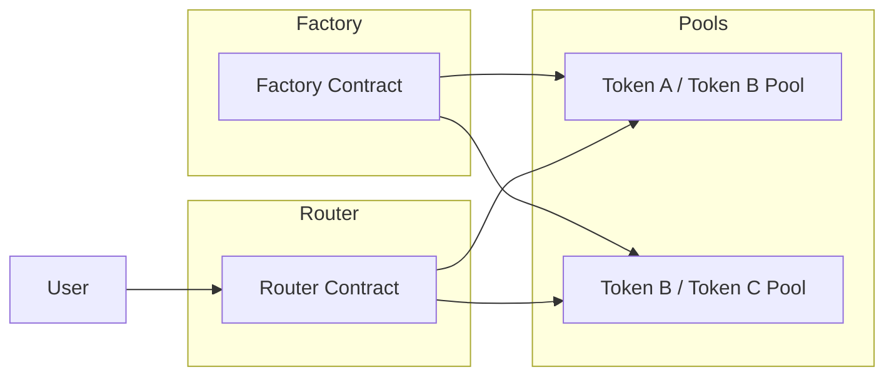
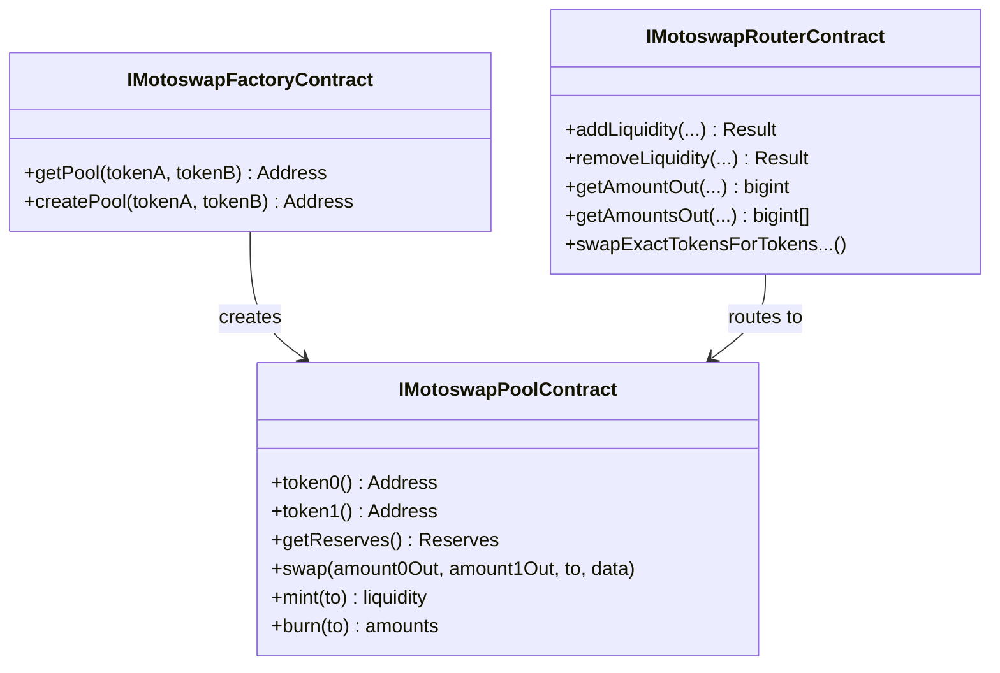

# Advanced Swaps

This guide covers DEX interactions using the MotoSwap protocol, including liquidity management and token swaps.

## Table of Contents

- [Overview](#overview)
- [Contract Architecture](#contract-architecture)
- [Setup](#setup)
- [Pool Discovery](#pool-discovery)
- [Create New Pool](#create-new-pool)
- [Price Quotes](#price-quotes)
- [Swap Execution](#swap-execution)
- [Liquidity Management](#liquidity-management)
- [Price Impact Calculation](#price-impact-calculation)
- [Complete DEX Service](#complete-dex-service)
- [Best Practices](#best-practices)

---

## Overview

MotoSwap is a decentralized exchange (DEX) on OPNet that follows the automated market maker (AMM) model similar to Uniswap V2.



---

## Contract Architecture



---

## Setup

```typescript
import {
    getContract,
    IOP20Contract,
    IMotoswapRouterContract,
    IMotoswapPoolContract,
    IMotoswapFactoryContract,
    JSONRpcProvider,
    OP_20_ABI,
    MOTOSWAP_ROUTER_ABI,
    MotoswapPoolAbi,
    MotoSwapFactoryAbi,
    TransactionParameters,
    BitcoinUtils,
} from 'opnet';
import {
    Address,
    AddressTypes,
    Mnemonic,
    MLDSASecurityLevel,
    Wallet,
} from '@btc-vision/transaction';
import { Network, networks } from '@btc-vision/bitcoin';

const network: Network = networks.regtest;
const provider: JSONRpcProvider = new JSONRpcProvider({
    url: 'https://regtest.opnet.org',
    network,
});
const mnemonic = new Mnemonic('your seed phrase here ...', '', network, MLDSASecurityLevel.LEVEL2);
const wallet: Wallet = mnemonic.deriveUnisat(AddressTypes.P2TR, 0);  // OPWallet-compatible

// Router contract
const routerAddress: Address = Address.fromString('0x...');
const router: IMotoswapRouterContract = getContract<IMotoswapRouterContract>(
    routerAddress,
    MOTOSWAP_ROUTER_ABI,
    provider,
    network,
    wallet.address
);

// Factory contract
const factoryAddress: Address = Address.fromString('0x...');
const factory: IMotoswapFactoryContract = getContract<IMotoswapFactoryContract>(
    factoryAddress,
    MotoSwapFactoryAbi,
    provider,
    network,
    wallet.address
);
```

---

## Pool Discovery

### Find Existing Pool

```typescript
async function findPool(
    factory: IMotoswapFactoryContract,
    tokenA: Address,
    tokenB: Address
): Promise<Address | null> {
    const result = await factory.getPool(tokenA, tokenB);

    // Check if pool exists (non-zero address)
    const poolAddress = result.properties.pool;
    if (poolAddress.toHex() === '0x' + '0'.repeat(64)) {
        return null;
    }

    return poolAddress;
}

// Usage
const poolAddress = await findPool(factory, tokenAAddress, tokenBAddress);

if (poolAddress) {
    console.log('Pool found:', poolAddress.toHex());
} else {
    console.log('No pool exists for this pair');
}
```

### Get Pool Contract

```typescript
async function getPoolContract(
    poolAddress: Address
): Promise<IMotoswapPoolContract> {
    return getContract<IMotoswapPoolContract>(
        poolAddress,
        MotoswapPoolAbi,
        provider,
        network,
        wallet.address
    );
}
```

### Get Pool Reserves

```typescript
async function getPoolReserves(pool: IMotoswapPoolContract) {
    const [reserves, token0, token1] = await Promise.all([
        pool.getReserves(),
        pool.token0(),
        pool.token1(),
    ]);

    return {
        token0: token0.properties.token0,
        token1: token1.properties.token1,
        reserve0: reserves.properties.reserve0,
        reserve1: reserves.properties.reserve1,
        lastUpdate: reserves.properties.blockTimestampLast,
    };
}

// Usage
const pool = await getPoolContract(poolAddress);
const reserves = await getPoolReserves(pool);

console.log('Pool reserves:');
console.log('  Token0:', reserves.token0.toHex());
console.log('  Reserve0:', reserves.reserve0);
console.log('  Token1:', reserves.token1.toHex());
console.log('  Reserve1:', reserves.reserve1);
```

---

## Create New Pool

```typescript
async function createPool(
    factory: IMotoswapFactoryContract,
    tokenA: Address,
    tokenB: Address,
    wallet: Wallet
): Promise<Address> {
    // Check if pool already exists
    const existing = await findPool(factory, tokenA, tokenB);
    if (existing) {
        console.log('Pool already exists:', existing.toHex());
        return existing;
    }

    // Create new pool
    const simulation = await factory.createPool(tokenA, tokenB);

    const params: TransactionParameters = {
        signer: wallet.keypair,
        mldsaSigner: wallet.mldsaKeypair,
        refundTo: wallet.p2tr,
        maximumAllowedSatToSpend: 20000n,
        feeRate: 10,
        network: network,
    };

    const receipt = await simulation.sendTransaction(params);

    console.log('Pool created, TX:', receipt.transactionId);
    return simulation.properties.address;
}
```

---

## Price Quotes

### Get Amount Out (Exact Input)

```typescript
async function getAmountOut(
    router: IMotoswapRouterContract,
    amountIn: bigint,
    path: Address[]
): Promise<bigint[]> {
    const result = await router.getAmountsOut(amountIn, path);
    return result.properties.amountsOut;
}

// Usage - get output for swapping 1 WBTC to MOTO
const amountIn = 100_000_000n;  // 1 WBTC (8 decimals)
const path = [wbtcAddress, motoAddress];

const amounts = await getAmountOut(router, amountIn, path);
console.log('Input:', amountIn);
console.log('Output:', amounts[amounts.length - 1]);
```

### Get Amount In (Exact Output)

```typescript
async function getAmountIn(
    router: IMotoswapRouterContract,
    amountOut: bigint,
    path: Address[]
): Promise<bigint[]> {
    const result = await router.getAmountsIn(amountOut, path);
    return result.properties.amountsIn;
}

// Usage - how much WBTC needed for 1000 MOTO
const amountOut = 1000_00000000n;  // 1000 MOTO
const path = [wbtcAddress, motoAddress];

const amounts = await getAmountIn(router, amountOut, path);
console.log('Required input:', amounts[0]);
console.log('Desired output:', amountOut);
```

### Calculate Price with Reserves

```typescript
async function calculatePrice(
    router: IMotoswapRouterContract,
    amountA: bigint,
    reserveA: bigint,
    reserveB: bigint
): Promise<bigint> {
    const result = await router.quote(amountA, reserveA, reserveB);
    return result.properties.quote;
}

// Calculate output considering fees
async function calculateAmountOut(
    router: IMotoswapRouterContract,
    amountIn: bigint,
    reserveIn: bigint,
    reserveOut: bigint
): Promise<bigint> {
    const result = await router.getAmountOut(amountIn, reserveIn, reserveOut);
    return result.properties.amountOut;
}
```

---

## Swap Execution

### Exact Input Swap

```typescript
async function swapExactTokens(
    router: IMotoswapRouterContract,
    amountIn: bigint,
    amountOutMin: bigint,
    path: Address[],
    recipient: Address,
    deadline: bigint,
    wallet: Wallet
): Promise<string> {
    // First approve router to spend tokens
    const tokenIn = getContract<IOP20Contract>(
        path[0],
        OP_20_ABI,
        provider,
        network,
        wallet.address
    );

    // Increase allowance for router (throws on revert)
    const approveSimulation = await tokenIn.increaseAllowance(router.address, amountIn);
    const approveParams: TransactionParameters = {
        signer: wallet.keypair,
        mldsaSigner: wallet.mldsaKeypair,
        refundTo: wallet.p2tr,
        maximumAllowedSatToSpend: 10000n,
        feeRate: 10,
        network: network,
    };
    await approveSimulation.sendTransaction(approveParams);

    // Execute swap
    const simulation = await router.swapExactTokensForTokensSupportingFeeOnTransferTokens(
        amountIn,
        amountOutMin,
        path,
        recipient,
        deadline
    );

    const params: TransactionParameters = {
        signer: wallet.keypair,
        mldsaSigner: wallet.mldsaKeypair,
        refundTo: wallet.p2tr,
        maximumAllowedSatToSpend: 20000n,
        feeRate: 10,
        network: network,
    };

    const receipt = await simulation.sendTransaction(params);
    return receipt.transactionId;
}

// Usage
const txId = await swapExactTokens(
    router,
    1_00000000n,                          // 1 token input
    95_0000000n,                          // Min 0.95 tokens output (5% slippage)
    [tokenAAddress, tokenBAddress],       // Path
    wallet.address,                       // Recipient
    BigInt(Date.now() + 600000),          // 10 min deadline
    wallet
);
```

### Swap with Slippage Protection

```typescript
function calculateMinOutput(
    expectedOutput: bigint,
    slippagePercent: number
): bigint {
    const slippageBps = BigInt(Math.floor(slippagePercent * 100));
    return expectedOutput - (expectedOutput * slippageBps / 10000n);
}

async function swapWithSlippage(
    router: IMotoswapRouterContract,
    amountIn: bigint,
    path: Address[],
    slippagePercent: number,
    wallet: Wallet
): Promise<string> {
    // Get expected output
    const amounts = await getAmountOut(router, amountIn, path);
    const expectedOutput = amounts[amounts.length - 1];

    // Calculate minimum with slippage
    const amountOutMin = calculateMinOutput(expectedOutput, slippagePercent);

    console.log('Expected output:', expectedOutput);
    console.log('Minimum output:', amountOutMin);
    console.log('Slippage:', slippagePercent, '%');

    // Set deadline (10 minutes from now)
    const deadline = BigInt(Math.floor(Date.now() / 1000) + 600);

    return swapExactTokens(
        router,
        amountIn,
        amountOutMin,
        path,
        wallet.address,
        deadline,
        wallet
    );
}

// Usage - 2% slippage
const txId = await swapWithSlippage(
    router,
    1_00000000n,
    [wbtcAddress, motoAddress],
    2.0,  // 2% slippage
    wallet
);
```

### Multi-hop Swap

```typescript
async function multiHopSwap(
    router: IMotoswapRouterContract,
    amountIn: bigint,
    path: Address[],  // [A, B, C] for A -> B -> C
    slippagePercent: number,
    wallet: Wallet
): Promise<string> {
    // Get output for multi-hop path
    const amounts = await getAmountOut(router, amountIn, path);

    console.log('Swap path:');
    for (let i = 0; i < path.length; i++) {
        console.log(`  Step ${i}: ${amounts[i]}`);
    }

    const expectedOutput = amounts[amounts.length - 1];
    const amountOutMin = calculateMinOutput(expectedOutput, slippagePercent);
    const deadline = BigInt(Math.floor(Date.now() / 1000) + 600);

    const simulation = await router.swapExactTokensForTokensSupportingFeeOnTransferTokens(
        amountIn,
        amountOutMin,
        path,
        wallet.address,
        deadline
    );

    const params: TransactionParameters = {
        signer: wallet.keypair,
        mldsaSigner: wallet.mldsaKeypair,
        refundTo: wallet.p2tr,
        maximumAllowedSatToSpend: 30000n,
        feeRate: 10,
        network: network,
    };

    const receipt = await simulation.sendTransaction(params);
    return receipt.transactionId;
}

// Usage - swap A -> B -> C
const path = [tokenAAddress, tokenBAddress, tokenCAddress];
const txId = await multiHopSwap(router, 100_00000000n, path, 3.0, wallet);
```

---

## Liquidity Management

### Add Liquidity

```typescript
async function addLiquidity(
    router: IMotoswapRouterContract,
    tokenA: Address,
    tokenB: Address,
    amountADesired: bigint,
    amountBDesired: bigint,
    slippagePercent: number,
    wallet: Wallet
): Promise<string> {
    // Calculate minimum amounts with slippage
    const amountAMin = calculateMinOutput(amountADesired, slippagePercent);
    const amountBMin = calculateMinOutput(amountBDesired, slippagePercent);
    const deadline = BigInt(Math.floor(Date.now() / 1000) + 600);

    // Approve both tokens for router
    const tokenAContract = getContract<IOP20Contract>(
        tokenA,
        OP_20_ABI,
        provider,
        network,
        wallet.address
    );
    const tokenBContract = getContract<IOP20Contract>(
        tokenB,
        OP_20_ABI,
        provider,
        network,
        wallet.address
    );

    // Increase allowance for token A (throws on revert)
    const approveA = await tokenAContract.increaseAllowance(router.address, amountADesired);
    await approveA.sendTransaction({
        signer: wallet.keypair,
        mldsaSigner: wallet.mldsaKeypair,
        refundTo: wallet.p2tr,
        maximumAllowedSatToSpend: 10000n,
        feeRate: 10,
        network: network,
    });

    // Increase allowance for token B (throws on revert)
    const approveB = await tokenBContract.increaseAllowance(router.address, amountBDesired);
    await approveB.sendTransaction({
        signer: wallet.keypair,
        mldsaSigner: wallet.mldsaKeypair,
        refundTo: wallet.p2tr,
        maximumAllowedSatToSpend: 10000n,
        feeRate: 10,
        network: network,
    });

    // Add liquidity
    const simulation = await router.addLiquidity(
        tokenA,
        tokenB,
        amountADesired,
        amountBDesired,
        amountAMin,
        amountBMin,
        wallet.address,
        deadline
    );

    console.log('Liquidity result:', {
        amountA: simulation.properties.amountA,
        amountB: simulation.properties.amountB,
        liquidity: simulation.properties.liquidity,
    });

    const params: TransactionParameters = {
        signer: wallet.keypair,
        mldsaSigner: wallet.mldsaKeypair,
        refundTo: wallet.p2tr,
        maximumAllowedSatToSpend: 30000n,
        feeRate: 10,
        network: network,
    };

    const receipt = await simulation.sendTransaction(params);
    return receipt.transactionId;
}

// Usage
const txId = await addLiquidity(
    router,
    wbtcAddress,
    motoAddress,
    1_00000000n,      // 1 WBTC
    1000_00000000n,   // 1000 MOTO
    2.0,              // 2% slippage
    wallet
);
```

### Remove Liquidity

```typescript
async function removeLiquidity(
    router: IMotoswapRouterContract,
    pool: IMotoswapPoolContract,
    tokenA: Address,
    tokenB: Address,
    liquidity: bigint,
    slippagePercent: number,
    wallet: Wallet
): Promise<string> {
    // Get current reserves to estimate output
    const reserves = await pool.getReserves();
    const totalSupply = await pool.totalSupply();

    // Estimate amounts to receive
    const share = (liquidity * 10000n) / totalSupply.properties.totalSupply;
    const estimatedA = (reserves.properties.reserve0 * share) / 10000n;
    const estimatedB = (reserves.properties.reserve1 * share) / 10000n;

    const amountAMin = calculateMinOutput(estimatedA, slippagePercent);
    const amountBMin = calculateMinOutput(estimatedB, slippagePercent);
    const deadline = BigInt(Math.floor(Date.now() / 1000) + 600);

    // Increase allowance for LP tokens (throws on revert)
    const approveLP = await pool.increaseAllowance(router.address, liquidity);
    await approveLP.sendTransaction({
        signer: wallet.keypair,
        mldsaSigner: wallet.mldsaKeypair,
        refundTo: wallet.p2tr,
        maximumAllowedSatToSpend: 10000n,
        feeRate: 10,
        network: network,
    });

    // Remove liquidity
    const simulation = await router.removeLiquidity(
        tokenA,
        tokenB,
        liquidity,
        amountAMin,
        amountBMin,
        wallet.address,
        deadline
    );

    console.log('Removed liquidity:', {
        amountA: simulation.properties.amountA,
        amountB: simulation.properties.amountB,
    });

    const params: TransactionParameters = {
        signer: wallet.keypair,
        mldsaSigner: wallet.mldsaKeypair,
        refundTo: wallet.p2tr,
        maximumAllowedSatToSpend: 20000n,
        feeRate: 10,
        network: network,
    };

    const receipt = await simulation.sendTransaction(params);
    return receipt.transactionId;
}
```

### Get LP Token Balance

```typescript
async function getLPBalance(
    pool: IMotoswapPoolContract,
    owner: Address
): Promise<bigint> {
    const result = await pool.balanceOf(owner);
    return result.properties.balance;
}

async function getLPShare(
    pool: IMotoswapPoolContract,
    owner: Address
): Promise<{
    share: number;
    token0Amount: bigint;
    token1Amount: bigint;
}> {
    const [balance, totalSupply, reserves] = await Promise.all([
        pool.balanceOf(owner),
        pool.totalSupply(),
        pool.getReserves(),
    ]);

    const lpBalance = balance.properties.balance;
    const total = totalSupply.properties.totalSupply;

    if (total === 0n) {
        return { share: 0, token0Amount: 0n, token1Amount: 0n };
    }

    const sharePercent = Number(lpBalance * 10000n / total) / 100;
    const token0Amount = reserves.properties.reserve0 * lpBalance / total;
    const token1Amount = reserves.properties.reserve1 * lpBalance / total;

    return {
        share: sharePercent,
        token0Amount,
        token1Amount,
    };
}

// Usage
const share = await getLPShare(pool, wallet.address);
console.log(`Pool share: ${share.share}%`);
console.log(`Token0 value: ${share.token0Amount}`);
console.log(`Token1 value: ${share.token1Amount}`);
```

---

## Price Impact Calculation

```typescript
function calculatePriceImpact(
    amountIn: bigint,
    reserveIn: bigint,
    reserveOut: bigint
): number {
    // Constant product formula: x * y = k
    const k = reserveIn * reserveOut;
    const newReserveIn = reserveIn + amountIn;
    const newReserveOut = k / newReserveIn;

    const actualOut = reserveOut - newReserveOut;
    const spotPrice = reserveOut * 10000n / reserveIn;
    const executionPrice = actualOut * 10000n / amountIn;

    const impact = Number(spotPrice - executionPrice) / Number(spotPrice) * 100;
    return impact;
}

async function getSwapPriceImpact(
    pool: IMotoswapPoolContract,
    tokenIn: Address,
    amountIn: bigint
): Promise<number> {
    const [reserves, token0] = await Promise.all([
        pool.getReserves(),
        pool.token0(),
    ]);

    const isToken0 = tokenIn.equals(token0.properties.token0);
    const reserveIn = isToken0
        ? reserves.properties.reserve0
        : reserves.properties.reserve1;
    const reserveOut = isToken0
        ? reserves.properties.reserve1
        : reserves.properties.reserve0;

    return calculatePriceImpact(amountIn, reserveIn, reserveOut);
}

// Usage
const impact = await getSwapPriceImpact(pool, wbtcAddress, 10_00000000n);
console.log(`Price impact: ${impact.toFixed(2)}%`);

if (impact > 5) {
    console.warn('High price impact! Consider reducing trade size.');
}
```

---

## Complete DEX Service

```typescript
class DexService {
    private router: IMotoswapRouterContract;
    private factory: IMotoswapFactoryContract;
    private wallet: Wallet;
    private network: Network;
    private provider: JSONRpcProvider;

    constructor(
        routerAddress: Address,
        factoryAddress: Address,
        provider: JSONRpcProvider,
        wallet: Wallet,
        network: Network
    ) {
        this.provider = provider;
        this.wallet = wallet;
        this.network = network;

        this.router = getContract<IMotoswapRouterContract>(
            routerAddress,
            MOTOSWAP_ROUTER_ABI,
            provider,
            network,
            wallet.address
        );

        this.factory = getContract<IMotoswapFactoryContract>(
            factoryAddress,
            MotoSwapFactoryAbi,
            provider,
            network,
            wallet.address
        );
    }

    async getQuote(
        tokenIn: Address,
        tokenOut: Address,
        amountIn: bigint
    ): Promise<bigint> {
        const amounts = await this.router.getAmountsOut(amountIn, [tokenIn, tokenOut]);
        return amounts.properties.amountsOut[1];
    }

    async swap(
        tokenIn: Address,
        tokenOut: Address,
        amountIn: bigint,
        slippagePercent: number
    ): Promise<string> {
        const expectedOut = await this.getQuote(tokenIn, tokenOut, amountIn);
        const minOut = expectedOut - (expectedOut * BigInt(slippagePercent * 100) / 10000n);
        const deadline = BigInt(Math.floor(Date.now() / 1000) + 600);

        // Approve
        const token = getContract<IOP20Contract>(
            tokenIn,
            OP_20_ABI,
            this.provider,
            this.network,
            this.wallet.address
        );

        // Increase allowance for router (throws on revert)
        const approve = await token.increaseAllowance(this.router.address, amountIn);
        await approve.sendTransaction({
            signer: this.wallet.keypair,
            mldsaSigner: this.wallet.mldsaKeypair,
            refundTo: this.wallet.p2tr,
            maximumAllowedSatToSpend: 10000n,
            feeRate: 10,
            network: this.network,
        });

        // Swap
        const simulation = await this.router.swapExactTokensForTokensSupportingFeeOnTransferTokens(
            amountIn,
            minOut,
            [tokenIn, tokenOut],
            this.wallet.address,
            deadline
        );

        const receipt = await simulation.sendTransaction({
            signer: this.wallet.keypair,
            mldsaSigner: this.wallet.mldsaKeypair,
            refundTo: this.wallet.p2tr,
            maximumAllowedSatToSpend: 20000n,
            feeRate: 10,
            network: this.network,
        });

        return receipt.transactionId;
    }

    async getPool(tokenA: Address, tokenB: Address): Promise<IMotoswapPoolContract | null> {
        const result = await this.factory.getPool(tokenA, tokenB);
        const poolAddress = result.properties.pool;

        if (poolAddress.toHex() === '0x' + '0'.repeat(64)) {
            return null;
        }

        return getContract<IMotoswapPoolContract>(
            poolAddress,
            MotoswapPoolAbi,
            this.provider,
            this.network,
            this.wallet.address
        );
    }
}

// Usage
const dex = new DexService(routerAddress, factoryAddress, provider, wallet, network);

const quote = await dex.getQuote(wbtcAddress, motoAddress, 1_00000000n);
console.log('Quote:', quote);

const txId = await dex.swap(wbtcAddress, motoAddress, 1_00000000n, 2.0);
console.log('Swap TX:', txId);
```

---

## Best Practices

1. **Always Check Price Impact**: High impact trades lose value to slippage

2. **Set Appropriate Deadlines**: Use 10-20 minute deadlines for normal conditions

3. **Approve Once**: Approve max amount to save on transaction fees

4. **Handle Reverts**: Check simulation results before sending

5. **Monitor Pool Reserves**: Large trades relative to reserves have high impact

---

## Next Steps

- [Deployment Examples](./deployment-examples.md) - Deploy contracts
- [OP20 Examples](./op20-examples.md) - Token operations
- [Transaction Configuration](../contracts/transaction-configuration.md) - Advanced TX options

---

[← Previous: OP721 Examples](./op721-examples.md) | [Next: Deployment Examples →](./deployment-examples.md)
