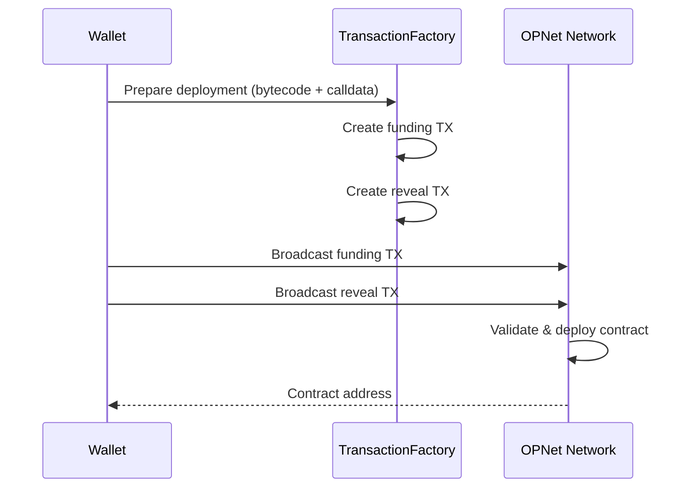

# Contract Deployment Examples

This guide covers deploying smart contracts to the OPNet network.

## Table of Contents

- [Overview](#overview)
- [Prerequisites](#prerequisites)
- [Basic Deployment](#basic-deployment)
- [Deployment with Constructor](#deployment-with-constructor)
- [IDeploymentParameters Reference](#ideploymentparameters-reference)
- [Calldata Construction](#calldata-construction)
- [Deployment Result](#deployment-result)
- [Batch Deployment](#batch-deployment)
- [Verify Deployment](#verify-deployment)
- [Complete Deployment Service](#complete-deployment-service)
- [Best Practices](#best-practices)

---

## Overview

Contract deployment on OPNet involves creating a funding transaction and a reveal transaction that contains the contract bytecode.



---

## Prerequisites

```typescript
import {
    AddressTypes,
    BinaryWriter,
    IDeploymentParameters,
    TransactionFactory,
    Wallet,
    UTXO,
    Mnemonic,
    MLDSASecurityLevel,
} from '@btc-vision/transaction';
import { JSONRpcProvider } from 'opnet';
import { networks } from '@btc-vision/bitcoin';
import * as fs from 'fs';

const network = networks.regtest;
const provider = new JSONRpcProvider({ url: 'https://regtest.opnet.org', network });
const mnemonic = new Mnemonic('your seed phrase here ...', '', network, MLDSASecurityLevel.LEVEL2);
const wallet = mnemonic.deriveUnisat(AddressTypes.P2TR, 0);  // OPWallet-compatible
const factory = new TransactionFactory();
```

---

## Basic Deployment

### Deploy Contract Without Constructor

```typescript
async function deployContract(
    bytecodeFile: string,
    wallet: Wallet
): Promise<string> {
    // Read bytecode from WASM file
    const bytecode = fs.readFileSync(bytecodeFile);

    // Get UTXOs for funding
    const utxos = await provider.utxoManager.getUTXOs({
        address: wallet.p2tr,
    });

    if (utxos.length === 0) {
        throw new Error('No UTXOs available for deployment');
    }

    // Get challenge for proof of work
    const challenge = await provider.getChallenge();

    // Prepare deployment parameters
    const deploymentParams: IDeploymentParameters = {
        from: wallet.p2tr,
        utxos: utxos,
        signer: wallet.keypair,
        mldsaSigner: wallet.mldsaKeypair,
        network: network,
        feeRate: 5,
        priorityFee: 0n,
        gasSatFee: 10_000n,
        bytecode: bytecode,
        challenge: challenge,
        linkMLDSAPublicKeyToAddress: true,
        revealMLDSAPublicKey: true,
    };

    // Sign deployment
    const deployment = await factory.signDeployment(deploymentParams);

    console.log('Contract address:', deployment.contractAddress);
    console.log('Funding TX:', deployment.transaction[0]);
    console.log('Reveal TX:', deployment.transaction[1]);

    // Broadcast funding transaction
    const fundingResult = await provider.sendRawTransaction(
        deployment.transaction[0]
    );
    console.log('Funding TX ID:', fundingResult.txid);

    // Broadcast reveal transaction
    const revealResult = await provider.sendRawTransaction(
        deployment.transaction[1]
    );
    console.log('Reveal TX ID:', revealResult.txid);

    return deployment.contractAddress;
}

// Usage
const contractAddress = await deployContract('./bytecode/MyContract.wasm', wallet);
console.log('Deployed at:', contractAddress);
```

---

## Deployment with Constructor

### Token Contract with Initial Parameters

```typescript
async function deployToken(
    bytecodeFile: string,
    name: string,
    symbol: string,
    decimals: number,
    maxSupply: bigint,
    wallet: Wallet
): Promise<string> {
    const bytecode = fs.readFileSync(bytecodeFile);

    // Construct calldata for constructor
    const calldata = new BinaryWriter();
    calldata.writeStringWithLength(name);
    calldata.writeStringWithLength(symbol);
    calldata.writeU8(decimals);
    calldata.writeU256(maxSupply);

    // Get UTXOs and challenge
    const utxos = await provider.utxoManager.getUTXOs({
        address: wallet.p2tr,
    });
    const challenge = await provider.getChallenge();

    const deploymentParams: IDeploymentParameters = {
        from: wallet.p2tr,
        utxos: utxos,
        signer: wallet.keypair,
        mldsaSigner: wallet.mldsaKeypair,
        network: network,
        feeRate: 5,
        priorityFee: 0n,
        gasSatFee: 10_000n,
        bytecode: bytecode,
        calldata: calldata.getBuffer(),
        challenge: challenge,
        linkMLDSAPublicKeyToAddress: true,
        revealMLDSAPublicKey: true,
    };

    const deployment = await factory.signDeployment(deploymentParams);

    // Broadcast transactions
    await provider.sendRawTransaction(deployment.transaction[0]);
    await provider.sendRawTransaction(deployment.transaction[1]);

    return deployment.contractAddress;
}

// Usage
const tokenAddress = await deployToken(
    './bytecode/MyToken.wasm',
    'My Token',
    'MTK',
    8,
    21_000_000_00000000n,  // 21 million with 8 decimals
    wallet
);
```

### NFT Contract with Configuration

```typescript
async function deployNFT(
    bytecodeFile: string,
    name: string,
    symbol: string,
    maxSupply: bigint,
    baseUri: string,
    wallet: Wallet
): Promise<string> {
    const bytecode = fs.readFileSync(bytecodeFile);

    // Construct NFT constructor calldata
    const calldata = new BinaryWriter();
    calldata.writeStringWithLength(name);
    calldata.writeStringWithLength(symbol);
    calldata.writeU256(maxSupply);
    calldata.writeStringWithLength(baseUri);

    const utxos = await provider.utxoManager.getUTXOs({
        address: wallet.p2tr,
    });
    const challenge = await provider.getChallenge();

    const deploymentParams: IDeploymentParameters = {
        from: wallet.p2tr,
        utxos: utxos,
        signer: wallet.keypair,
        mldsaSigner: wallet.mldsaKeypair,
        network: network,
        feeRate: 5,
        priorityFee: 0n,
        gasSatFee: 15_000n,  // Higher gas for NFT contract
        bytecode: bytecode,
        calldata: calldata.getBuffer(),
        challenge: challenge,
        linkMLDSAPublicKeyToAddress: true,
        revealMLDSAPublicKey: true,
    };

    const deployment = await factory.signDeployment(deploymentParams);

    await provider.sendRawTransaction(deployment.transaction[0]);
    await provider.sendRawTransaction(deployment.transaction[1]);

    return deployment.contractAddress;
}

// Usage
const nftAddress = await deployNFT(
    './bytecode/MyNFT.wasm',
    'My NFT Collection',
    'MNFT',
    10000n,
    'ipfs://QmBaseHash/',
    wallet
);
```

---

## IDeploymentParameters Reference

```typescript
interface IDeploymentParameters {
    // Required: Wallet information
    from: string;                          // Deployer's p2tr address
    signer: UniversalSigner;               // ECDSA keypair
    mldsaSigner?: QuantumBIP32Interface;   // ML-DSA keypair (optional)
    network: Network;                      // Bitcoin network

    // Required: UTXOs and funding
    utxos: UTXO[];                         // UTXOs for funding
    feeRate: number;                       // Fee rate in sat/vB
    priorityFee?: bigint;                  // Additional priority fee
    gasSatFee: bigint;                     // Gas allocation in sats

    // Required: Contract data
    bytecode: Uint8Array;                  // WASM bytecode
    challenge: ProofOfWorkChallenge;       // PoW challenge

    // Optional: Constructor calldata
    calldata?: Uint8Array;                 // Constructor arguments

    // Optional: ML-DSA options
    linkMLDSAPublicKeyToAddress?: boolean; // Link quantum key
    revealMLDSAPublicKey?: boolean;        // Reveal in transaction
}
```

---

## Calldata Construction

### Using BinaryWriter

```typescript
import { BinaryWriter } from '@btc-vision/transaction';

// Create calldata for various types
function createConstructorCalldata(): Uint8Array {
    const writer = new BinaryWriter();

    // String with length prefix
    writer.writeStringWithLength('My Contract');

    // Numbers
    writer.writeU8(8);           // uint8
    writer.writeU16(1000);       // uint16
    writer.writeU32(1000000);    // uint32
    writer.writeU64(1000000n);   // uint64 (bigint)
    writer.writeU256(10n ** 18n); // uint256 (bigint)

    // Boolean
    writer.writeBoolean(true);

    // Address
    writer.writeAddress(Address.fromString('0x...'));

    // Bytes
    writer.writeBytes(new TextEncoder().encode('data'));

    // Arrays
    writer.writeU16(3);  // Array length
    writer.writeU256(100n);
    writer.writeU256(200n);
    writer.writeU256(300n);

    return writer.getBuffer();
}
```

### Common Constructor Patterns

```typescript
// Token constructor
function tokenCalldata(
    name: string,
    symbol: string,
    decimals: number,
    maxSupply: bigint
): Uint8Array {
    const writer = new BinaryWriter();
    writer.writeStringWithLength(name);
    writer.writeStringWithLength(symbol);
    writer.writeU8(decimals);
    writer.writeU256(maxSupply);
    return writer.getBuffer();
}

// NFT constructor
function nftCalldata(
    name: string,
    symbol: string,
    maxSupply: bigint,
    pricePerToken: bigint,
    baseUri: string
): Uint8Array {
    const writer = new BinaryWriter();
    writer.writeStringWithLength(name);
    writer.writeStringWithLength(symbol);
    writer.writeU256(maxSupply);
    writer.writeU64(pricePerToken);
    writer.writeStringWithLength(baseUri);
    return writer.getBuffer();
}

// Staking constructor
function stakingCalldata(
    stakingToken: Address,
    rewardToken: Address,
    rewardRate: bigint
): Uint8Array {
    const writer = new BinaryWriter();
    writer.writeAddress(stakingToken);
    writer.writeAddress(rewardToken);
    writer.writeU256(rewardRate);
    return writer.getBuffer();
}
```

---

## Deployment Result

The `signDeployment` method returns:

```typescript
interface DeploymentResult {
    // The deployed contract's address (p2op format)
    contractAddress: string;

    // Array of raw transactions [funding, reveal]
    transaction: [string, string];

    // UTXOs available after deployment
    utxos: UTXO[];

    // Estimated fees paid
    estimatedFees: bigint;
}
```

---

## Batch Deployment

Deploy multiple contracts in sequence:

```typescript
interface ContractDeployment {
    file: string;
    calldata?: Uint8Array;
}

async function batchDeploy(
    contracts: ContractDeployment[],
    wallet: Wallet
): Promise<Map<string, string>> {
    const deployed = new Map<string, string>();
    let utxos = await provider.utxoManager.getUTXOs({
        address: wallet.p2tr,
    });

    for (const contract of contracts) {
        const bytecode = fs.readFileSync(contract.file);
        const challenge = await provider.getChallenge();

        const deploymentParams: IDeploymentParameters = {
            from: wallet.p2tr,
            utxos: utxos,
            signer: wallet.keypair,
            mldsaSigner: wallet.mldsaKeypair,
            network: network,
            feeRate: 5,
            priorityFee: 0n,
            gasSatFee: 10_000n,
            bytecode: bytecode,
            calldata: contract.calldata,
            challenge: challenge,
            linkMLDSAPublicKeyToAddress: true,
            revealMLDSAPublicKey: true,
        };

        try {
            const deployment = await factory.signDeployment(deploymentParams);

            await provider.sendRawTransaction(deployment.transaction[0]);
            await provider.sendRawTransaction(deployment.transaction[1]);

            deployed.set(contract.file, deployment.contractAddress);

            // Update UTXOs for next deployment
            utxos = deployment.utxos;

            console.log(`Deployed ${contract.file} at ${deployment.contractAddress}`);
        } catch (error) {
            console.error(`Failed to deploy ${contract.file}:`, error);
        }
    }

    return deployed;
}

// Usage
const contracts: ContractDeployment[] = [
    { file: './bytecode/Token.wasm', calldata: tokenCalldata('Token', 'TKN', 8, 1000000n) },
    { file: './bytecode/NFT.wasm', calldata: nftCalldata('NFT', 'NFT', 10000n, 100000n, 'ipfs://') },
];

const addresses = await batchDeploy(contracts, wallet);
console.log('Deployed contracts:', addresses);
```

---

## Verify Deployment

```typescript
async function verifyDeployment(
    contractAddress: string
): Promise<boolean> {
    try {
        const code = await provider.getCode(
            Address.fromString(contractAddress),
            true
        );

        if (code.bytecode.length > 0) {
            console.log('Contract verified');
            console.log('Bytecode size:', code.bytecode.length, 'bytes');
            return true;
        }
    } catch {
        console.log('Contract not found at address');
    }

    return false;
}

// Usage
const isDeployed = await verifyDeployment(contractAddress);
```

---

## Complete Deployment Service

```typescript
class DeploymentService {
    private provider: JSONRpcProvider;
    private factory: TransactionFactory;
    private wallet: Wallet;
    private network: Network;

    constructor(
        provider: JSONRpcProvider,
        wallet: Wallet,
        network: Network
    ) {
        this.provider = provider;
        this.factory = new TransactionFactory();
        this.wallet = wallet;
        this.network = network;
    }

    async deploy(
        bytecode: Uint8Array,
        calldata?: Uint8Array,
        options?: {
            feeRate?: number;
            gasSatFee?: bigint;
        }
    ): Promise<{
        contractAddress: string;
        fundingTxId: string;
        revealTxId: string;
    }> {
        const utxos = await this.provider.utxoManager.getUTXOs({
            address: this.wallet.p2tr,
        });

        if (utxos.length === 0) {
            throw new Error('No UTXOs available');
        }

        const challenge = await this.provider.getChallenge();

        const deploymentParams: IDeploymentParameters = {
            from: this.wallet.p2tr,
            utxos: utxos,
            signer: this.wallet.keypair,
            mldsaSigner: this.wallet.mldsaKeypair,
            network: this.network,
            feeRate: options?.feeRate ?? 5,
            priorityFee: 0n,
            gasSatFee: options?.gasSatFee ?? 10_000n,
            bytecode: bytecode,
            calldata: calldata,
            challenge: challenge,
            linkMLDSAPublicKeyToAddress: true,
            revealMLDSAPublicKey: true,
        };

        const deployment = await this.factory.signDeployment(deploymentParams);

        // Broadcast
        const fundingResult = await this.provider.sendRawTransaction(
            deployment.transaction[0]
        );
        const revealResult = await this.provider.sendRawTransaction(
            deployment.transaction[1]
        );

        return {
            contractAddress: deployment.contractAddress,
            fundingTxId: fundingResult.txid,
            revealTxId: revealResult.txid,
        };
    }

    async deployToken(
        bytecodeFile: string,
        name: string,
        symbol: string,
        decimals: number,
        maxSupply: bigint
    ): Promise<string> {
        const bytecode = fs.readFileSync(bytecodeFile);
        const calldata = tokenCalldata(name, symbol, decimals, maxSupply);

        const result = await this.deploy(bytecode, calldata);
        return result.contractAddress;
    }

    async deployNFT(
        bytecodeFile: string,
        name: string,
        symbol: string,
        maxSupply: bigint,
        baseUri: string
    ): Promise<string> {
        const bytecode = fs.readFileSync(bytecodeFile);

        const writer = new BinaryWriter();
        writer.writeStringWithLength(name);
        writer.writeStringWithLength(symbol);
        writer.writeU256(maxSupply);
        writer.writeStringWithLength(baseUri);

        const result = await this.deploy(bytecode, writer.getBuffer());
        return result.contractAddress;
    }

    async verify(contractAddress: string): Promise<boolean> {
        try {
            const code = await this.provider.getCode(
                Address.fromString(contractAddress),
                true
            );
            return code.bytecode.length > 0;
        } catch {
            return false;
        }
    }
}

// Usage
const deployer = new DeploymentService(provider, wallet, network);

const tokenAddr = await deployer.deployToken(
    './bytecode/Token.wasm',
    'My Token',
    'MTK',
    8,
    1000000_00000000n
);

const verified = await deployer.verify(tokenAddr);
console.log('Token deployed:', tokenAddr, 'Verified:', verified);
```

---

## Best Practices

1. **Test on Regtest**: Always deploy to regtest first before mainnet

2. **Sufficient UTXOs**: Ensure wallet has enough UTXOs for funding

3. **Challenge Timing**: Get challenge right before deployment (they expire)

4. **Verify Deployment**: Always verify the contract was deployed correctly

5. **Save Addresses**: Store deployed contract addresses for reference

6. **Gas Estimation**: Use higher gasSatFee for complex contracts

---

## Next Steps

- [OP20 Examples](./op20-examples.md) - Interact with deployed tokens
- [OP721 Examples](./op721-examples.md) - Interact with deployed NFTs
- [Contract Overview](../contracts/overview.md) - Contract interaction patterns

---

[← Previous: Advanced Swaps](./advanced-swaps.md) | [Next: Bitcoin Balances →](../bitcoin/balances.md)
