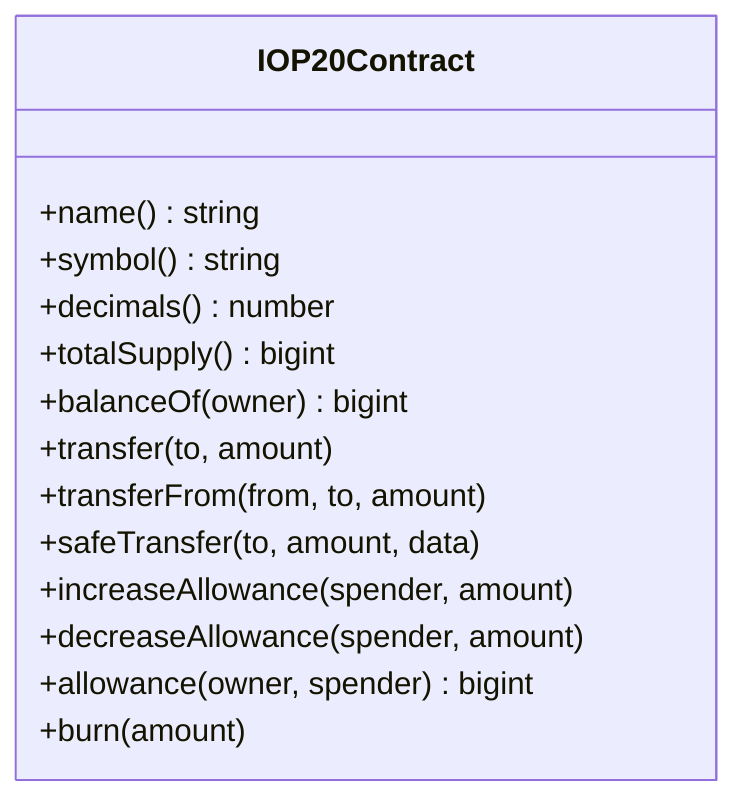

# OP20 Token Examples

This guide provides comprehensive examples for working with OP20 (fungible) tokens.

## Table of Contents

- [Overview](#overview)
- [Setup](#setup)
- [Method Data Encoding](#method-data-encoding)
- [Transfer Example](#transfer-example)
- [Allowance/TransferFrom Pattern](#allowancetransferfrom-pattern)
- [Airdrop Example (Batch Transfers)](#airdrop-example-batch-transfers)
- [Balance Checking with Decimals](#balance-checking-with-decimals)
- [Complete Token Service](#complete-token-service)

---

## Overview

OP20 is OPNet's fungible token standard, similar to ERC20 on Ethereum.



---

## Setup

```typescript
import {
    getContract,
    IOP20Contract,
    JSONRpcProvider,
    OP_20_ABI,
    TransactionParameters,
    BitcoinUtils,
} from 'opnet';
import {
    Address,
    AddressTypes,
    Mnemonic,
    MLDSASecurityLevel,
    Wallet,
} from '@btc-vision/transaction';
import { Network, networks } from '@btc-vision/bitcoin';

const network: Network = networks.regtest;
const provider: JSONRpcProvider = new JSONRpcProvider({
    url: 'https://regtest.opnet.org',
    network,
});
const mnemonic = new Mnemonic('your seed phrase here ...', '', network, MLDSASecurityLevel.LEVEL2);
const wallet: Wallet = mnemonic.deriveUnisat(AddressTypes.P2TR, 0);  // OPWallet-compatible

const tokenAddress: Address = Address.fromString('0x...');
const token: IOP20Contract = getContract<IOP20Contract>(
    tokenAddress,
    OP_20_ABI,
    provider,
    network,
    wallet.address
);
```

---

## Method Data Encoding

Manually encode calldata for contract methods:

```typescript
// Encode transfer calldata
const transferCalldata = token.encodeCalldata('transfer', [
    Address.fromString('0x...'),  // recipient
    1000000000n,                   // amount
]);

console.log('Calldata:', toHex(transferCalldata));

// Encode increaseAllowance calldata
const allowanceCalldata = token.encodeCalldata('increaseAllowance', [
    Address.fromString('0x...'),  // spender
    BigInt('0xffffffffffffffff'),  // amount to increase by
]);
```

---

## Transfer Example

### Basic Transfer

```typescript
async function transferTokens(
    token: IOP20Contract,
    recipient: Address,
    amount: bigint,
    wallet: Wallet
): Promise<string> {
    // Simulate first
    const simulation = await token.transfer(recipient, amount);

    // Send transaction
    const params: TransactionParameters = {
        signer: wallet.keypair,
        mldsaSigner: wallet.mldsaKeypair,
        refundTo: wallet.p2tr,
        maximumAllowedSatToSpend: 10000n,
        feeRate: 10,
        network: network,
    };

    const receipt = await simulation.sendTransaction(params);
    return receipt.transactionId;
}

// Usage
const txId = await transferTokens(
    token,
    Address.fromString('0x...'),
    100_00000000n,  // 100 tokens with 8 decimals
    wallet
);
console.log('Transfer TX:', txId);
```

### Safe Transfer (with data)

```typescript
async function safeTransfer(
    token: IOP20Contract,
    recipient: Address,
    amount: bigint,
    data: Uint8Array,
    wallet: Wallet
): Promise<string> {
    // safeTransfer allows passing additional data
    // The simulation call throws if the contract reverts
    const simulation = await token.safeTransfer(recipient, amount, data);

    const params: TransactionParameters = {
        signer: wallet.keypair,
        mldsaSigner: wallet.mldsaKeypair,
        refundTo: wallet.p2tr,
        maximumAllowedSatToSpend: 10000n,
        feeRate: 10,
        network: network,
    };

    const receipt = await simulation.sendTransaction(params);
    return receipt.transactionId;
}

// Usage with empty data
try {
    const txId = await safeTransfer(
        token,
        recipient,
        100_00000000n,
        new Uint8Array(),
        wallet
    );
    console.log('Safe transfer TX:', txId);
} catch (error) {
    console.error('Safe transfer failed:', error);
}
```

---

## Allowance/TransferFrom Pattern

### Increase Allowance

OP20 uses `increaseAllowance` and `decreaseAllowance` instead of a single `approve` method.

```typescript
async function increaseSpenderAllowance(
    token: IOP20Contract,
    spender: Address,
    amount: bigint,
    wallet: Wallet
): Promise<string> {
    // The simulation call throws if the contract reverts
    const simulation = await token.increaseAllowance(spender, amount);

    const params: TransactionParameters = {
        signer: wallet.keypair,
        mldsaSigner: wallet.mldsaKeypair,
        refundTo: wallet.p2tr,
        maximumAllowedSatToSpend: 10000n,
        feeRate: 10,
        network: network,
    };

    const receipt = await simulation.sendTransaction(params);
    return receipt.transactionId;
}

// Increase allowance by a large amount
const largeAmount = BigInt('0xffffffffffffffffffffffffffffffffffffffffffffffffffffffffffffffff');
await increaseSpenderAllowance(token, spenderAddress, largeAmount, wallet);
```

### Transfer From Another Account

```typescript
async function transferFrom(
    token: IOP20Contract,
    from: Address,
    to: Address,
    amount: bigint,
    spenderWallet: Wallet
): Promise<string> {
    // Create contract with spender as sender
    const spenderToken = getContract<IOP20Contract>(
        token.address,
        OP_20_ABI,
        provider,
        network,
        spenderWallet.address
    );

    // Check allowance first
    const allowance = await spenderToken.allowance(from, spenderWallet.address);
    if (allowance.properties.remaining < amount) {
        throw new Error('Insufficient allowance');
    }

    // Execute transferFrom (throws if contract reverts)
    const simulation = await spenderToken.transferFrom(from, to, amount);

    const params: TransactionParameters = {
        signer: spenderWallet.keypair,
        mldsaSigner: spenderWallet.mldsaKeypair,
        refundTo: spenderWallet.p2tr,
        maximumAllowedSatToSpend: 10000n,
        feeRate: 10,
        network: network,
    };

    const receipt = await simulation.sendTransaction(params);
    return receipt.transactionId;
}
```

---

## Airdrop Example (Batch Transfers)

Distribute tokens to multiple recipients:

```typescript
interface AirdropRecipient {
    address: Address;
    amount: bigint;
}

async function airdropTokens(
    token: IOP20Contract,
    recipients: AirdropRecipient[],
    wallet: Wallet
): Promise<string[]> {
    const txIds: string[] = [];
    let currentUtxos: UTXO[] | undefined;

    for (const recipient of recipients) {
        try {
        // Simulate transfer (throws on revert)
        const simulation = await token.transfer(recipient.address, recipient.amount);

        const params: TransactionParameters = {
            signer: wallet.keypair,
            mldsaSigner: wallet.mldsaKeypair,
            refundTo: wallet.p2tr,
            maximumAllowedSatToSpend: 10000n,
            feeRate: 10,
            network: network,
            utxos: currentUtxos,  // Use previous UTXOs
        };

        const receipt = await simulation.sendTransaction(params);
        txIds.push(receipt.transactionId);

        // Update UTXOs for next transaction
        currentUtxos = receipt.newUTXOs;

        console.log(`Sent ${recipient.amount} to ${recipient.address.toHex()}`);
        } catch (error) {
            console.error(`Skip ${recipient.address.toHex()}:`, error);
            continue;
        }
    }

    return txIds;
}

// Usage
const recipients: AirdropRecipient[] = [
    { address: Address.fromString('0x...'), amount: 100_00000000n },
    { address: Address.fromString('0x...'), amount: 200_00000000n },
    { address: Address.fromString('0x...'), amount: 150_00000000n },
];

const txIds = await airdropTokens(token, recipients, wallet);
console.log('Airdrop complete:', txIds.length, 'transfers');
```

---

## Balance Checking with Decimals

```typescript
async function getFormattedBalance(
    token: IOP20Contract,
    address: Address
): Promise<string> {
    // Get decimals
    const decimalsResult = await token.decimals();
    const decimals = decimalsResult.properties.decimals;

    // Get balance
    const balanceResult = await token.balanceOf(address);
    const balance = balanceResult.properties.balance;

    // Format with decimals
    return BitcoinUtils.formatUnits(balance, decimals);
}

// Usage
const formattedBalance = await getFormattedBalance(token, myAddress);
console.log('Balance:', formattedBalance, 'tokens');
```

### Parse Amount with Decimals

```typescript
async function parseTokenAmount(
    token: IOP20Contract,
    amountString: string
): Promise<bigint> {
    const decimalsResult = await token.decimals();
    const decimals = decimalsResult.properties.decimals;

    return BitcoinUtils.expandToDecimals(amountString, decimals);
}

// Usage
const amount = await parseTokenAmount(token, '100.5');
console.log('Amount in base units:', amount);  // 10050000000n (for 8 decimals)
```

---

## Complete Token Service

```typescript
class TokenService {
    private token: IOP20Contract;
    private wallet: Wallet;
    private network: Network;
    private decimals: number | undefined;

    constructor(
        tokenAddress: Address,
        provider: JSONRpcProvider,
        wallet: Wallet,
        network: Network
    ) {
        this.wallet = wallet;
        this.network = network;
        this.token = getContract<IOP20Contract>(
            tokenAddress,
            OP_20_ABI,
            provider,
            network,
            wallet.address
        );
    }

    async getInfo(): Promise<{
        name: string;
        symbol: string;
        decimals: number;
        totalSupply: bigint;
    }> {
        const [name, symbol, decimals, totalSupply] = await Promise.all([
            this.token.name(),
            this.token.symbol(),
            this.token.decimals(),
            this.token.totalSupply(),
        ]);

        this.decimals = decimals.properties.decimals;

        return {
            name: name.properties.name,
            symbol: symbol.properties.symbol,
            decimals: decimals.properties.decimals,
            totalSupply: totalSupply.properties.totalSupply,
        };
    }

    async getBalance(address: Address): Promise<bigint> {
        const result = await this.token.balanceOf(address);
        return result.properties.balance;
    }

    async getFormattedBalance(address: Address): Promise<string> {
        if (!this.decimals) {
            await this.getInfo();
        }
        const balance = await this.getBalance(address);
        return BitcoinUtils.formatUnits(balance, this.decimals!);
    }

    async transfer(to: Address, amount: bigint): Promise<string> {
        // Simulation throws if contract reverts
        const simulation = await this.token.transfer(to, amount);

        const receipt = await simulation.sendTransaction({
            signer: this.wallet.keypair,
            mldsaSigner: this.wallet.mldsaKeypair,
            refundTo: this.wallet.p2tr,
            maximumAllowedSatToSpend: 10000n,
            feeRate: 10,
            network: this.network,
        });

        return receipt.transactionId;
    }

    async increaseAllowance(spender: Address, amount: bigint): Promise<string> {
        // Simulation throws if contract reverts
        const simulation = await this.token.increaseAllowance(spender, amount);

        const receipt = await simulation.sendTransaction({
            signer: this.wallet.keypair,
            mldsaSigner: this.wallet.mldsaKeypair,
            refundTo: this.wallet.p2tr,
            maximumAllowedSatToSpend: 10000n,
            feeRate: 10,
            network: this.network,
        });

        return receipt.transactionId;
    }
}

// Usage
const tokenService = new TokenService(tokenAddress, provider, wallet, network);

const info = await tokenService.getInfo();
console.log(`Token: ${info.name} (${info.symbol})`);

const balance = await tokenService.getFormattedBalance(wallet.address);
console.log(`Balance: ${balance}`);

const txId = await tokenService.transfer(recipient, 100_00000000n);
console.log(`Transfer TX: ${txId}`);
```

---

## Next Steps

- [OP721 NFT Examples](./op721-examples.md) - NFT operations
- [Advanced Swaps](./advanced-swaps.md) - DEX interactions
- [Contract Deployment](./deployment-examples.md) - Deploy contracts

---

[← Previous: Offline Signing](../contracts/offline-signing.md) | [Next: OP721 Examples →](./op721-examples.md)
