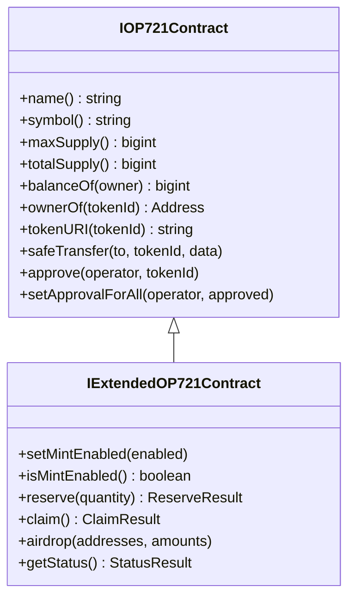

# OP721 NFT Examples

This guide provides comprehensive examples for working with OP721 (non-fungible) tokens.

## Table of Contents

- [Overview](#overview)
- [Setup](#setup)
- [Collection Information](#collection-information)
- [Ownership Queries](#ownership-queries)
- [Transfer Examples](#transfer-examples)
- [Approval Management](#approval-management)
- [Extended NFT Features](#extended-nft-features)
- [Reserve and Claim Pattern](#reserve-and-claim-pattern)
- [Airdrop Example (Batch Distribution)](#airdrop-example-batch-distribution)
- [Set Token URI (Owner Only)](#set-token-uri-owner-only)
- [Burn NFT](#burn-nft)
- [Complete NFT Service](#complete-nft-service)

---

## Overview

OP721 is OPNet's NFT standard, similar to ERC721 on Ethereum. It supports individual token ownership, metadata, and advanced features like reservations and minting.



---

## Setup

```typescript
import {
    getContract,
    IOP721Contract,
    IExtendedOP721Contract,
    JSONRpcProvider,
    OP_721_ABI,
    EXTENDED_OP721_ABI,
    TransactionParameters,
} from 'opnet';
import {
    Address,
    AddressTypes,
    Mnemonic,
    MLDSASecurityLevel,
    Wallet,
} from '@btc-vision/transaction';
import { Network, networks } from '@btc-vision/bitcoin';

const network: Network = networks.regtest;
const provider: JSONRpcProvider = new JSONRpcProvider({
    url: 'https://regtest.opnet.org',
    network,
});
const mnemonic = new Mnemonic('your seed phrase here ...', '', network, MLDSASecurityLevel.LEVEL2);
const wallet: Wallet = mnemonic.deriveUnisat(AddressTypes.P2TR, 0);  // OPWallet-compatible

// Standard OP721 contract
const nftAddress: Address = Address.fromString('0x...');
const nft: IOP721Contract = getContract<IOP721Contract>(
    nftAddress,
    OP_721_ABI,
    provider,
    network,
    wallet.address
);

// Extended OP721 with minting features
const extendedNftAddress: Address = Address.fromString('0x...');
const extendedNft: IExtendedOP721Contract = getContract<IExtendedOP721Contract>(
    extendedNftAddress,
    EXTENDED_OP721_ABI,
    provider,
    network,
    wallet.address
);
```

---

## Collection Information

### Get Metadata

```typescript
async function getCollectionInfo(nft: IOP721Contract) {
    // Get all collection metadata in one call
    const metadata = await nft.metadata();

    console.log('Collection:', metadata.properties.name);
    console.log('Symbol:', metadata.properties.symbol);
    console.log('Icon:', metadata.properties.icon);
    console.log('Banner:', metadata.properties.banner);
    console.log('Description:', metadata.properties.description);
    console.log('Website:', metadata.properties.website);
    console.log('Total Supply:', metadata.properties.totalSupply);

    return metadata.properties;
}

// Or fetch individual properties
async function getBasicInfo(nft: IOP721Contract) {
    const [name, symbol, maxSupply, totalSupply] = await Promise.all([
        nft.name(),
        nft.symbol(),
        nft.maxSupply(),
        nft.totalSupply(),
    ]);

    return {
        name: name.properties.name,
        symbol: symbol.properties.symbol,
        maxSupply: maxSupply.properties.maxSupply,
        totalSupply: totalSupply.properties.totalSupply,
    };
}
```

### Get Token URI

```typescript
async function getTokenMetadata(
    nft: IOP721Contract,
    tokenId: bigint
): Promise<string> {
    const result = await nft.tokenURI(tokenId);
    return result.properties.uri;
}

// Usage
const uri = await getTokenMetadata(nft, 1n);
console.log('Token URI:', uri);  // e.g., "ipfs://Qm..."
```

---

## Ownership Queries

### Check Balance

```typescript
async function getNFTBalance(
    nft: IOP721Contract,
    owner: Address
): Promise<bigint> {
    const result = await nft.balanceOf(owner);
    return result.properties.balance;
}

// Usage
const balance = await getNFTBalance(nft, wallet.address);
console.log('NFTs owned:', balance);
```

### Get Token Owner

```typescript
async function getTokenOwner(
    nft: IOP721Contract,
    tokenId: bigint
): Promise<Address> {
    const result = await nft.ownerOf(tokenId);
    return result.properties.owner;
}

// Usage
const owner = await getTokenOwner(nft, 1n);
console.log('Token 1 owned by:', owner.toHex());
```

### Enumerate Owned Tokens

```typescript
async function getOwnedTokens(
    nft: IOP721Contract,
    owner: Address
): Promise<bigint[]> {
    const balanceResult = await nft.balanceOf(owner);
    const balance = balanceResult.properties.balance;

    const tokenIds: bigint[] = [];

    for (let i = 0n; i < balance; i++) {
        const result = await nft.tokenOfOwnerByIndex(owner, i);
        tokenIds.push(result.properties.tokenId);
    }

    return tokenIds;
}

// Usage
const myTokens = await getOwnedTokens(nft, wallet.address);
console.log('My tokens:', myTokens);
```

---

## Transfer Examples

### Basic Transfer

```typescript
async function transferNFT(
    nft: IOP721Contract,
    recipient: Address,
    tokenId: bigint,
    wallet: Wallet
): Promise<string> {
    // safeTransfer with empty data
    const simulation = await nft.safeTransfer(
        recipient,
        tokenId,
        new Uint8Array()
    );

    // Note: The simulation call above throws if the contract reverts.
    // Use try/catch around the simulation call to handle reverts gracefully.

    const params: TransactionParameters = {
        signer: wallet.keypair,
        mldsaSigner: wallet.mldsaKeypair,
        refundTo: wallet.p2tr,
        maximumAllowedSatToSpend: 10000n,
        feeRate: 10,
        network: network,
    };

    const receipt = await simulation.sendTransaction(params);
    return receipt.transactionId;
}

// Usage
const txId = await transferNFT(
    nft,
    Address.fromString('0x...'),
    1n,
    wallet
);
console.log('Transfer TX:', txId);
```

### Transfer with Data

```typescript
async function transferWithData(
    nft: IOP721Contract,
    recipient: Address,
    tokenId: bigint,
    data: Uint8Array,
    wallet: Wallet
): Promise<string> {
    const simulation = await nft.safeTransfer(recipient, tokenId, data);

    const params: TransactionParameters = {
        signer: wallet.keypair,
        mldsaSigner: wallet.mldsaKeypair,
        refundTo: wallet.p2tr,
        maximumAllowedSatToSpend: 10000n,
        feeRate: 10,
        network: network,
    };

    const receipt = await simulation.sendTransaction(params);
    return receipt.transactionId;
}

// Usage with custom data
const customData = new TextEncoder().encode('Hello from OPNet!');
await transferWithData(nft, recipient, 1n, customData, wallet);
```

### Transfer From (Operator)

```typescript
async function transferFrom(
    nft: IOP721Contract,
    from: Address,
    to: Address,
    tokenId: bigint,
    operatorWallet: Wallet
): Promise<string> {
    // Create contract with operator as sender
    const operatorNft = getContract<IOP721Contract>(
        nft.address,
        OP_721_ABI,
        provider,
        network,
        operatorWallet.address
    );

    const simulation = await operatorNft.safeTransferFrom(
        from,
        to,
        tokenId,
        new Uint8Array()
    );

    const params: TransactionParameters = {
        signer: operatorWallet.keypair,
        mldsaSigner: operatorWallet.mldsaKeypair,
        refundTo: operatorWallet.p2tr,
        maximumAllowedSatToSpend: 10000n,
        feeRate: 10,
        network: network,
    };

    const receipt = await simulation.sendTransaction(params);
    return receipt.transactionId;
}
```

---

## Approval Management

### Approve Single Token

```typescript
async function approveToken(
    nft: IOP721Contract,
    operator: Address,
    tokenId: bigint,
    wallet: Wallet
): Promise<string> {
    const simulation = await nft.approve(operator, tokenId);

    const params: TransactionParameters = {
        signer: wallet.keypair,
        mldsaSigner: wallet.mldsaKeypair,
        refundTo: wallet.p2tr,
        maximumAllowedSatToSpend: 10000n,
        feeRate: 10,
        network: network,
    };

    const receipt = await simulation.sendTransaction(params);
    return receipt.transactionId;
}
```

### Approve All Tokens

```typescript
async function setApprovalForAll(
    nft: IOP721Contract,
    operator: Address,
    approved: boolean,
    wallet: Wallet
): Promise<string> {
    const simulation = await nft.setApprovalForAll(operator, approved);

    const params: TransactionParameters = {
        signer: wallet.keypair,
        mldsaSigner: wallet.mldsaKeypair,
        refundTo: wallet.p2tr,
        maximumAllowedSatToSpend: 10000n,
        feeRate: 10,
        network: network,
    };

    const receipt = await simulation.sendTransaction(params);
    return receipt.transactionId;
}

// Grant approval to marketplace
await setApprovalForAll(nft, marketplaceAddress, true, wallet);

// Revoke approval
await setApprovalForAll(nft, marketplaceAddress, false, wallet);
```

### Check Approvals

```typescript
async function checkApprovals(
    nft: IOP721Contract,
    owner: Address,
    operator: Address
): Promise<boolean> {
    const result = await nft.isApprovedForAll(owner, operator);
    return result.properties.approved;
}

// Usage
const isApproved = await checkApprovals(nft, wallet.address, marketplaceAddress);
console.log('Marketplace approved:', isApproved);
```

---

## Extended NFT Features

### Check Minting Status

```typescript
async function getCollectionStatus(nft: IExtendedOP721Contract) {
    const status = await nft.getStatus();

    console.log('Status:', {
        minted: status.properties.minted,
        reserved: status.properties.reserved,
        available: status.properties.available,
        maxSupply: status.properties.maxSupply,
        pricePerToken: status.properties.pricePerToken,
        reservationFeePercent: status.properties.reservationFeePercent,
    });

    return status.properties;
}

async function isMintingEnabled(nft: IExtendedOP721Contract): Promise<boolean> {
    const result = await nft.isMintEnabled();
    return result.properties.enabled;
}
```

### Enable/Disable Minting (Owner Only)

```typescript
async function setMintEnabled(
    nft: IExtendedOP721Contract,
    enabled: boolean,
    ownerWallet: Wallet
): Promise<string> {
    const simulation = await nft.setMintEnabled(enabled);

    const params: TransactionParameters = {
        signer: ownerWallet.keypair,
        mldsaSigner: ownerWallet.mldsaKeypair,
        refundTo: ownerWallet.p2tr,
        maximumAllowedSatToSpend: 10000n,
        feeRate: 5,
        network: network,
    };

    const receipt = await simulation.sendTransaction(params);
    return receipt.transactionId;
}
```

---

## Reserve and Claim Pattern

The reserve/claim pattern allows users to pay a reservation fee upfront, then claim their NFTs later.

### Calculate Reservation Fee

```typescript
function calculateReservationFee(
    quantity: bigint,
    pricePerToken: bigint,
    reservationFeePercent: bigint,
    minReservationFee: bigint
): bigint {
    const totalCost = pricePerToken * quantity;
    const calculatedFee = (totalCost * reservationFeePercent) / 100n;

    return calculatedFee < minReservationFee ? minReservationFee : calculatedFee;
}
```

### Reserve NFTs

```typescript
import { PsbtOutputExtended } from '@btc-vision/bitcoin';
import { TransactionOutputFlags } from 'opnet';

function createTreasuryOutput(
    treasuryAddress: string,
    amount: bigint,
    contract: IExtendedOP721Contract
): PsbtOutputExtended {
    const output: PsbtOutputExtended = {
        address: treasuryAddress,
        value: Number(amount),
    };

    // Tell the contract about the payment output
    contract.setTransactionDetails({
        inputs: [],
        outputs: [
            {
                to: output.address,
                value: BigInt(output.value),
                index: 1,
                scriptPubKey: undefined,
                flags: TransactionOutputFlags.hasTo,
            },
        ],
    });

    return output;
}

async function reserveNFTs(
    nft: IExtendedOP721Contract,
    quantity: bigint,
    treasuryAddress: string,
    wallet: Wallet
): Promise<string> {
    // Get status to calculate fee
    const status = await nft.getStatus();
    const reservationFee = calculateReservationFee(
        quantity,
        status.properties.pricePerToken,
        status.properties.reservationFeePercent,
        status.properties.minReservationFee
    );

    // Create treasury output and inform contract
    const extraOutput = createTreasuryOutput(treasuryAddress, reservationFee, nft);

    // Simulate reservation
    const simulation = await nft.reserve(quantity);

    console.log('Remaining payment:', simulation.properties.remainingPayment);
    console.log('Reservation block:', simulation.properties.reservationBlock);

    const params: TransactionParameters = {
        signer: wallet.keypair,
        mldsaSigner: wallet.mldsaKeypair,
        refundTo: wallet.p2tr,
        maximumAllowedSatToSpend: 10000n,
        feeRate: 5,
        network: network,
        extraOutputs: [extraOutput],
    };

    const receipt = await simulation.sendTransaction(params);
    return receipt.transactionId;
}

// Usage
const txId = await reserveNFTs(extendedNft, 5n, treasuryAddress, wallet);
console.log('Reservation TX:', txId);
```

### Claim Reserved NFTs

```typescript
async function claimNFTs(
    nft: IExtendedOP721Contract,
    remainingPayment: bigint,
    treasuryAddress: string,
    wallet: Wallet
): Promise<string> {
    // Create treasury output for remaining payment
    const extraOutput = createTreasuryOutput(treasuryAddress, remainingPayment, nft);

    // Simulate claim
    const simulation = await nft.claim();

    const params: TransactionParameters = {
        signer: wallet.keypair,
        mldsaSigner: wallet.mldsaKeypair,
        refundTo: wallet.p2tr,
        maximumAllowedSatToSpend: 10000n,
        feeRate: 5,
        network: network,
        extraOutputs: [extraOutput],
    };

    const receipt = await simulation.sendTransaction(params);

    // Check events for minted token IDs
    if (simulation.events.length > 0) {
        console.log('Claim events:', simulation.events);
    }

    return receipt.transactionId;
}
```

---

## Airdrop Example (Batch Distribution)

Distribute NFTs to multiple recipients in a single transaction.

```typescript
async function airdropNFTs(
    nft: IExtendedOP721Contract,
    recipients: Address[],
    quantities: number[],
    wallet: Wallet
): Promise<string> {
    if (recipients.length !== quantities.length) {
        throw new Error('Recipients and quantities arrays must match');
    }

    // Simulate airdrop
    const simulation = await nft.airdrop(recipients, quantities);

    const params: TransactionParameters = {
        signer: wallet.keypair,
        mldsaSigner: wallet.mldsaKeypair,
        refundTo: wallet.p2tr,
        maximumAllowedSatToSpend: 10000n,
        feeRate: 5,
        network: network,
    };

    const receipt = await simulation.sendTransaction(params);
    return receipt.transactionId;
}

// Usage - airdrop to multiple recipients
const recipients = [
    Address.fromString('0x...'),
    Address.fromString('0x...'),
    Address.fromString('0x...'),
];
const quantities = [2, 5, 3];  // 2 NFTs to first, 5 to second, 3 to third

const txId = await airdropNFTs(extendedNft, recipients, quantities, wallet);
console.log('Airdrop TX:', txId);
```

### Batch Airdrop (Large Lists)

For large airdrops, split into chunks:

```typescript
async function batchAirdrop(
    nft: IExtendedOP721Contract,
    recipients: Address[],
    quantityEach: number,
    wallet: Wallet
): Promise<string[]> {
    const maxPerTx = 1000;  // Maximum recipients per transaction
    const txIds: string[] = [];

    for (let i = 0; i < recipients.length; i += maxPerTx) {
        const chunk = recipients.slice(i, i + maxPerTx);
        const quantities = chunk.map(() => quantityEach);

        console.log(`Airdropping to ${chunk.length} recipients...`);

        try {
        const simulation = await nft.airdrop(chunk, quantities);

        const params: TransactionParameters = {
            signer: wallet.keypair,
            mldsaSigner: wallet.mldsaKeypair,
            refundTo: wallet.p2tr,
            maximumAllowedSatToSpend: 10000n,
            feeRate: 5,
            network: network,
        };

        const receipt = await simulation.sendTransaction(params);
        txIds.push(receipt.transactionId);

        console.log(`Chunk ${i / maxPerTx + 1} complete: ${receipt.transactionId}`);
        } catch (error) {
            console.error(`Chunk ${i / maxPerTx + 1} failed:`, error);
            continue;
        }
    }

    return txIds;
}
```

---

## Set Token URI (Owner Only)

```typescript
async function setTokenURI(
    nft: IExtendedOP721Contract,
    tokenId: bigint,
    uri: string,
    ownerWallet: Wallet
): Promise<string> {
    const simulation = await nft.setTokenURI(tokenId, uri);

    const params: TransactionParameters = {
        signer: ownerWallet.keypair,
        mldsaSigner: ownerWallet.mldsaKeypair,
        refundTo: ownerWallet.p2tr,
        maximumAllowedSatToSpend: 10000n,
        feeRate: 5,
        network: network,
    };

    const receipt = await simulation.sendTransaction(params);
    return receipt.transactionId;
}

// Usage
await setTokenURI(
    extendedNft,
    1n,
    'ipfs://QmNewMetadataHash...',
    ownerWallet
);
```

---

## Burn NFT

```typescript
async function burnNFT(
    nft: IOP721Contract,
    tokenId: bigint,
    wallet: Wallet
): Promise<string> {
    const simulation = await nft.burn(tokenId);

    const params: TransactionParameters = {
        signer: wallet.keypair,
        mldsaSigner: wallet.mldsaKeypair,
        refundTo: wallet.p2tr,
        maximumAllowedSatToSpend: 10000n,
        feeRate: 10,
        network: network,
    };

    const receipt = await simulation.sendTransaction(params);
    return receipt.transactionId;
}

// Usage
const burnTxId = await burnNFT(nft, 42n, wallet);
console.log('Burned NFT, TX:', burnTxId);
```

---

## Complete NFT Service

```typescript
class NFTService {
    private nft: IExtendedOP721Contract;
    private wallet: Wallet;
    private network: Network;

    constructor(
        nftAddress: Address,
        provider: JSONRpcProvider,
        wallet: Wallet,
        network: Network
    ) {
        this.wallet = wallet;
        this.network = network;
        this.nft = getContract<IExtendedOP721Contract>(
            nftAddress,
            EXTENDED_OP721_ABI,
            provider,
            network,
            wallet.address
        );
    }

    async getInfo() {
        const metadata = await this.nft.metadata();
        const status = await this.nft.getStatus();

        return {
            name: metadata.properties.name,
            symbol: metadata.properties.symbol,
            description: metadata.properties.description,
            totalSupply: metadata.properties.totalSupply,
            maxSupply: status.properties.maxSupply,
            available: status.properties.available,
            pricePerToken: status.properties.pricePerToken,
        };
    }

    async getMyBalance(): Promise<bigint> {
        const result = await this.nft.balanceOf(this.wallet.address);
        return result.properties.balance;
    }

    async getMyTokens(): Promise<bigint[]> {
        const balance = await this.getMyBalance();
        const tokens: bigint[] = [];

        for (let i = 0n; i < balance; i++) {
            const result = await this.nft.tokenOfOwnerByIndex(
                this.wallet.address,
                i
            );
            tokens.push(result.properties.tokenId);
        }

        return tokens;
    }

    async transfer(to: Address, tokenId: bigint): Promise<string> {
        const simulation = await this.nft.safeTransfer(
            to,
            tokenId,
            new Uint8Array()
        );

        const receipt = await simulation.sendTransaction({
            signer: this.wallet.keypair,
            mldsaSigner: this.wallet.mldsaKeypair,
            refundTo: this.wallet.p2tr,
            maximumAllowedSatToSpend: 10000n,
            feeRate: 10,
            network: this.network,
        });

        return receipt.transactionId;
    }

    async approveAll(operator: Address): Promise<string> {
        const simulation = await this.nft.setApprovalForAll(operator, true);

        const receipt = await simulation.sendTransaction({
            signer: this.wallet.keypair,
            mldsaSigner: this.wallet.mldsaKeypair,
            refundTo: this.wallet.p2tr,
            maximumAllowedSatToSpend: 10000n,
            feeRate: 10,
            network: this.network,
        });

        return receipt.transactionId;
    }
}

// Usage
const nftService = new NFTService(nftAddress, provider, wallet, network);

const info = await nftService.getInfo();
console.log(`${info.name}: ${info.available}/${info.maxSupply} available`);

const myTokens = await nftService.getMyTokens();
console.log('My tokens:', myTokens);

const txId = await nftService.transfer(recipientAddress, myTokens[0]);
console.log('Transfer TX:', txId);
```

---

## Next Steps

- [Advanced Swaps](./advanced-swaps.md) - DEX interactions
- [Deployment Examples](./deployment-examples.md) - Deploy contracts
- [OP20 Examples](./op20-examples.md) - Fungible token operations

---

[← Previous: OP20 Examples](./op20-examples.md) | [Next: Advanced Swaps →](./advanced-swaps.md)
