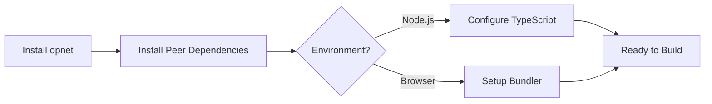

# Installation

This guide covers installing the OPNet client library and configuring your development environment.

## Overview



---

## npm Installation

Install the opnet package using npm or yarn:

```bash
# Using npm
npm install opnet

# Using yarn
yarn add opnet

# Using pnpm
pnpm add opnet
```

---

## Peer Dependencies

The opnet library requires peer dependencies for Bitcoin transaction building and cryptography. Install them alongside opnet:

```bash
npm install opnet @btc-vision/transaction @btc-vision/bitcoin
```

### Required Dependencies

| Package | Purpose |
|---------|---------|
| `opnet` | OPNet client library (providers, contracts, ABIs) |
| `@btc-vision/transaction` | Transaction building, signing, wallets |
| `@btc-vision/bitcoin` | Bitcoin primitives, networks, script handling |

### Complete Installation

```bash
npm install opnet @btc-vision/transaction @btc-vision/bitcoin
```

---

## TypeScript Configuration

The opnet library is written in TypeScript and requires **ES2025** or newer. Update your `tsconfig.json`:

```json
{
    "compilerOptions": {
        "target": "ES2025",
        "module": "NodeNext",
        "moduleResolution": "NodeNext",
        "lib": ["ES2025"],
        "strict": true,
        "esModuleInterop": true,
        "skipLibCheck": true,
        "outDir": "./build",
        "declaration": true,
        "resolveJsonModule": true
    },
    "include": ["src/**/*"],
    "exclude": ["node_modules", "build"]
}
```

### Key Configuration Options

| Option | Value | Reason |
|--------|-------|--------|
| `target` | `ES2025` | Required for BigInt, modern async features |
| `module` | `NodeNext` | ESM support for Node.js |
| `moduleResolution` | `NodeNext` | Proper module resolution |
| `strict` | `true` | Type-safe contract interactions |

---

## Node.js Setup

### Minimum Requirements

- **Node.js**: >= 24.0.0
- **TypeScript**: >= 5.9

### Basic Project Structure

```
my-opnet-app/
├── src/
│   └── index.ts
├── package.json
└── tsconfig.json
```

### package.json Configuration

```json
{
    "name": "my-opnet-app",
    "type": "module",
    "scripts": {
        "build": "tsc",
        "start": "node build/index.js"
    },
    "dependencies": {
        "opnet": "^1.7.35",
        "@btc-vision/transaction": "^1.7.31",
        "@btc-vision/bitcoin": "^6.5.4"
    },
    "devDependencies": {
        "typescript": "^5.9.2"
    }
}
```

### Verify Installation

Create a test file `src/index.ts`:

```typescript
import { JSONRpcProvider, version } from 'opnet';
import { networks } from '@btc-vision/bitcoin';

console.log('OPNet version:', version);

const provider = new JSONRpcProvider({
    url: 'https://regtest.opnet.org',
    network: networks.regtest,
});

async function main() {
    const blockNumber = await provider.getBlockNumber();
    console.log('Current block:', blockNumber);
}

main().catch(console.error);
```

Run:

```bash
npm run build && npm start
```

---

## Browser Setup

The opnet library supports browsers with additional bundler configuration.

### Using Vite

```bash
npm install vite vite-plugin-node-polyfills --save-dev
```

Create `vite.config.ts`:

```typescript
import { defineConfig } from 'vite';
import { nodePolyfills } from 'vite-plugin-node-polyfills';

export default defineConfig({
    plugins: [
        nodePolyfills({
            include: ['buffer', 'crypto', 'stream'],
        }),
    ],
    resolve: {
        alias: {
            buffer: 'buffer',
        },
    },
    define: {
        global: 'globalThis',
    },
});
```

### Using Webpack

```bash
npm install webpack webpack-cli buffer stream-browserify --save-dev
```

Add to `webpack.config.js`:

```javascript
const webpack = require('webpack');

module.exports = {
    resolve: {
        fallback: {
            buffer: require.resolve('buffer/'),
            stream: require.resolve('stream-browserify'),
            crypto: false,
        },
    },
    plugins: [
        new webpack.ProvidePlugin({
            Buffer: ['buffer', 'Buffer'],
        }),
    ],
};
```

### Browser Import

For browser environments, import from the browser-specific path:

```typescript
// Automatic (recommended) - bundler resolves correct path
import { JSONRpcProvider, getContract } from 'opnet';

// Explicit browser import
import { JSONRpcProvider, getContract } from 'opnet/browser';
```

### Required Polyfills

When using the browser build, ensure these polyfills are loaded:

```typescript
// Import polyfills before opnet
import 'opnet/browser/polyfills';

// Then import opnet
import { JSONRpcProvider } from 'opnet';
```

---

## Network Configuration

OPNet supports multiple Bitcoin networks:

| Network | URL | Network Object |
|---------|-----|----------------|
| Mainnet | `https://mainnet.opnet.org` | `networks.bitcoin` |
| Regtest | `https://regtest.opnet.org` | `networks.regtest` |

```typescript
import { JSONRpcProvider } from 'opnet';
import { networks } from '@btc-vision/bitcoin';

// Mainnet
const mainnetProvider = new JSONRpcProvider({
    url: 'https://mainnet.opnet.org',
    network: networks.bitcoin,
});

// Regtest (development)
const regtestProvider = new JSONRpcProvider({
    url: 'https://regtest.opnet.org',
    network: networks.regtest,
});
```

---

## Troubleshooting

### BigInt Serialization Error

If you encounter BigInt serialization errors:

```typescript
// The library handles BigInt serialization automatically
// But if you need to serialize manually:
const json = JSON.stringify(data, (key, value) =>
    typeof value === 'bigint' ? value.toString() : value
);
```

### Module Resolution Issues

Ensure your `package.json` has `"type": "module"` for ESM:

```json
{
    "type": "module"
}
```

### TypeScript Import Errors

If TypeScript can't find module types, verify `tsconfig.json`:

```json
{
    "compilerOptions": {
        "moduleResolution": "NodeNext",
        "esModuleInterop": true
    }
}
```

### Node.js Version

The library requires Node.js 24+. Check your version:

```bash
node --version  # Should be >= v24.0.0
```

---

## Next Steps

- [Overview](./overview.md) - Learn about the library architecture
- [Quick Start](./quick-start.md) - Build your first OPNet application

---

[Next: Overview →](./overview.md)
