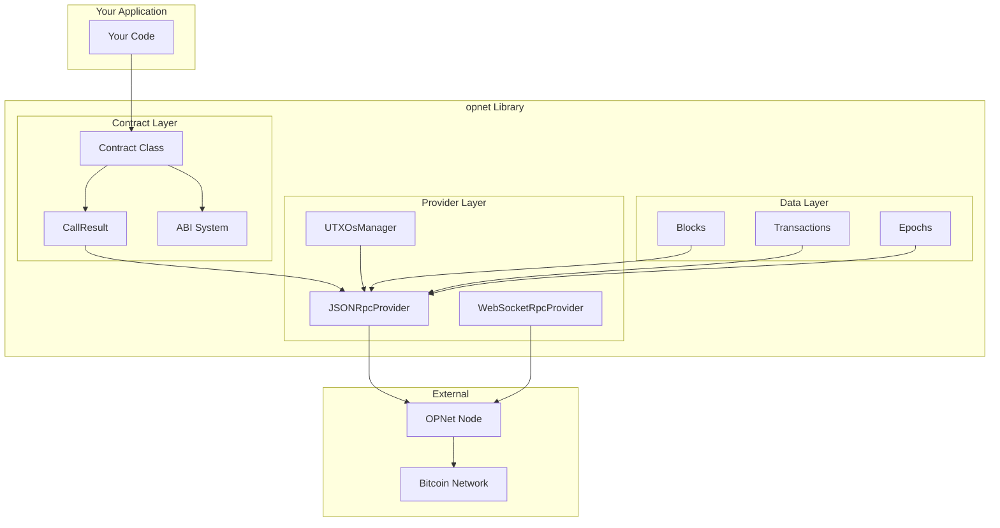
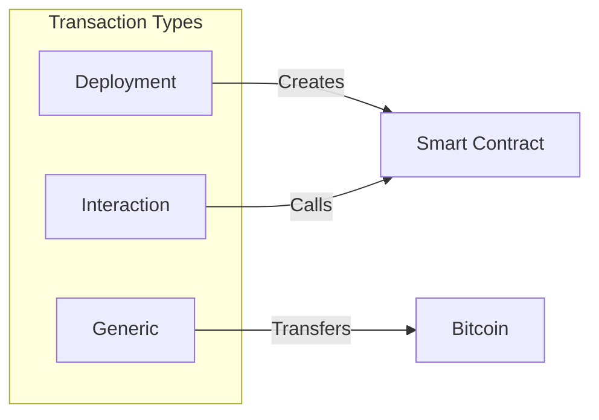
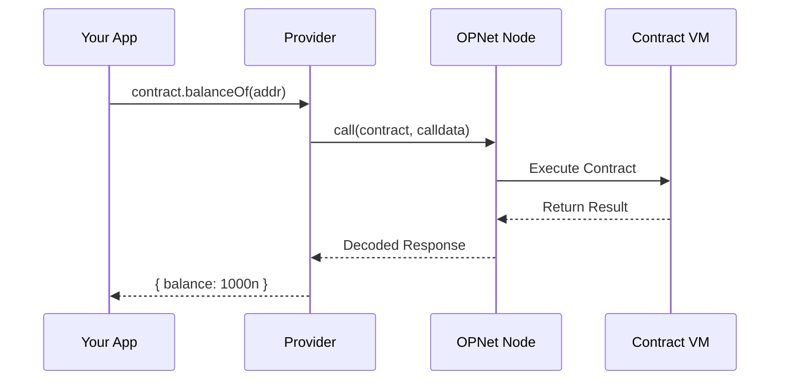
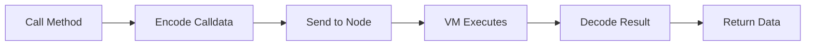
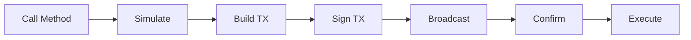

# Overview

This guide provides a high-level overview of the OPNet client library architecture, key concepts, and how all the pieces fit together.

## Architecture

The opnet library is organized into several interconnected layers:



---

## Key Concepts

### Providers

Providers handle communication with OPNet nodes. They abstract the RPC layer and provide type-safe methods for all blockchain operations.

```typescript
import { JSONRpcProvider } from 'opnet';
import { networks } from '@btc-vision/bitcoin';

// JSON-RPC for standard operations
const provider = new JSONRpcProvider({
    url: 'https://regtest.opnet.org',
    network: networks.regtest,
});

// Get blockchain state
const blockNumber = await provider.getBlockNumber();
const balance = await provider.getBalance('bc1q...');
```

**Two provider types:**
- **JSONRpcProvider**: HTTP-based, request/response pattern
- **WebSocketRpcProvider**: Real-time subscriptions and notifications

### Contracts

Contracts represent deployed smart contracts on OPNet. Use the `getContract()` factory to create type-safe contract instances:

```typescript
import { getContract, IOP20Contract, OP_20_ABI } from 'opnet';

const token = getContract<IOP20Contract>(
    contractAddress,
    OP_20_ABI,
    provider,
    network
);

// Type-safe method calls
const name = await token.name();
const balance = await token.balanceOf(address);
```

### ABIs (Application Binary Interface)

ABIs define the contract interface - what methods and events exist. The library includes pre-built ABIs for standard contracts:

| ABI | Purpose |
|-----|---------|
| `OP_20_ABI` | Fungible tokens (like ERC20) |
| `OP_721_ABI` | NFTs (like ERC721) |
| `MOTOSWAP_ROUTER_ABI` | DEX router |
| `MotoswapPoolAbi` | Liquidity pools |

### UTXOs (Unspent Transaction Outputs)

Bitcoin uses UTXOs instead of account balances. The `UTXOsManager` handles UTXO fetching and tracking:

```typescript
// Access via provider
const utxos = await provider.utxoManager.getUTXOs({
    address: 'bc1q...',
    optimize: true,
});
```

### Transactions

There are three OPNet transaction types:



| Type | Purpose |
|------|---------|
| **Deployment** | Deploy new smart contracts |
| **Interaction** | Call smart contract methods |
| **Generic** | Standard Bitcoin transfers |

### Epochs

OPNet uses epochs for consensus. Each epoch represents a mining cycle where participants submit SHA-1 collision solutions:

```typescript
const epoch = await provider.getLatestEpoch(true);
console.log('Epoch:', epoch.epochNumber);
console.log('Proposer:', epoch.proposer?.publicKey);
```

---

## OPNet Protocol

### How Contract Calls Work



1. **Simulation**: Test contract calls without spending Bitcoin
2. **Transaction Building**: Construct Bitcoin transaction with contract calldata
3. **Broadcasting**: Send transaction to Bitcoin network
4. **Execution**: OPNet nodes execute the contract when transaction confirms

---

## Networks

OPNet operates on multiple Bitcoin networks:

| Network | Purpose | RPC URL |
|---------|---------|---------|
| **Mainnet** | Production | `https://mainnet.opnet.org` |
| **Regtest** | Local development | `https://regtest.opnet.org` |

```typescript
import { networks } from '@btc-vision/bitcoin';

// Network objects
networks.bitcoin   // Mainnet
networks.testnet   // Testnet
networks.regtest   // Regtest
```

### Choosing a Network

| Use Case | Recommended Network |
|----------|---------------------|
| Development | Regtest |
| Integration testing | Testnet |
| Production | Mainnet |

---

## Library Modules

### Core Exports

```typescript
import {
    // Providers
    JSONRpcProvider,
    WebSocketRpcProvider,

    // Contracts
    getContract,
    CallResult,
    OPNetEvent,

    // ABIs
    OP_20_ABI,
    OP_721_ABI,
    MOTOSWAP_ROUTER_ABI,

    // Types
    IOP20Contract,
    IOP721Contract,

    // Data Classes
    Block,
    Epoch,
    TransactionBase,

    // Utils
    BitcoinUtils,
    decodeRevertData,
} from 'opnet';
```

---

## Type Safety

The library provides full TypeScript support with generics for type-safe contract interactions:

```typescript
// Type-safe contract interface
interface IMyToken extends IOP20Contract {
    mint(to: Address, amount: bigint): Promise<CallResult<never>>;
}

// Generic contract instantiation
const token = getContract<IMyToken>(
    address,
    myTokenABI,
    provider,
    network
);

// Type-checked method calls
const result = await token.mint(recipient, 1000n);
//                    ^^^^^ TypeScript knows this returns CallResult<never>
```

---

## Data Flow

### Reading Data (Simulation)



### Writing Data (Transaction)



---

## Best Practices

1. **Always simulate before sending**: Check for reverts without spending BTC
2. **Use type-safe interfaces**: Leverage TypeScript for contract interactions
3. **Handle BigInt correctly**: All amounts are `bigint` type
4. **Track UTXOs**: Use `UTXOsManager` to avoid double-spending
5. **Choose the right provider**: JSON-RPC for most cases, WebSocket for real-time

---

## Next Steps

- [Quick Start](./quick-start.md) - Build your first application
- [Understanding Providers](../providers/understanding-providers.md) - Deep dive into providers
- [Contract Interactions](../contracts/overview.md) - Working with smart contracts

---

[← Previous: Installation](./installation.md) | [Next: Quick Start →](./quick-start.md)
