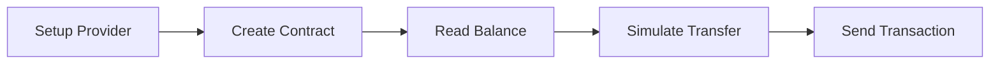
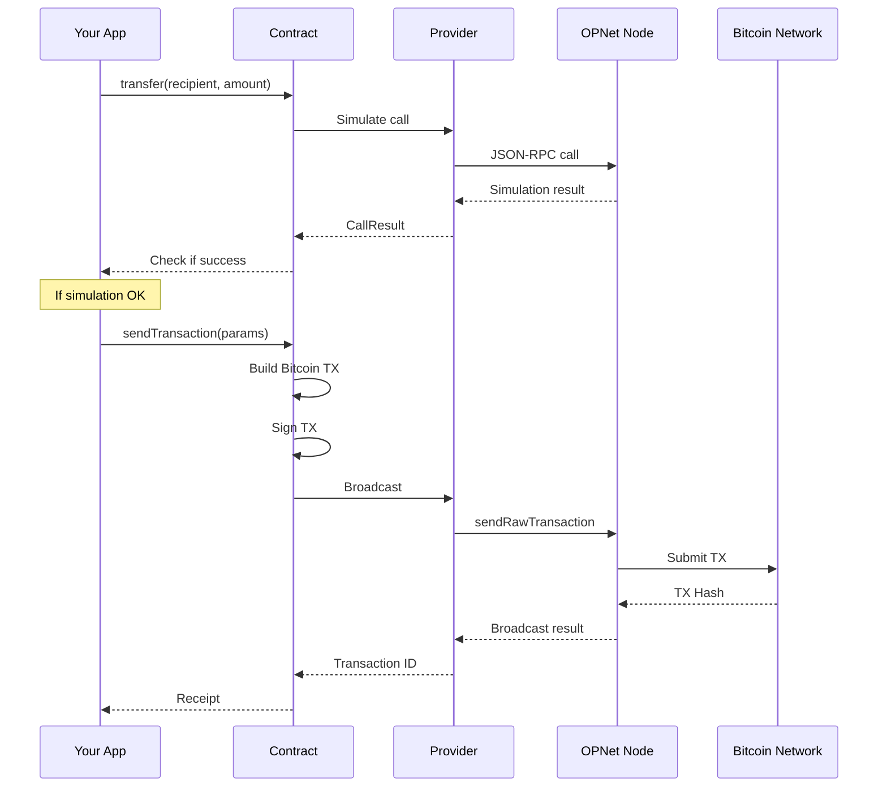

# Quick Start

This guide walks you through building your first OPNet application, from connecting to the network to executing your first smart contract transaction.

## What We're Building

By the end of this guide, you'll be able to:

1. Connect to an OPNet node
2. Read data from a smart contract
3. Send a transaction to a smart contract



---

## Step 1: Provider Setup

First, establish a connection to an OPNet node:

```typescript
import { JSONRpcProvider } from 'opnet';
import { networks } from '@btc-vision/bitcoin';

// Choose your network
const network = networks.regtest;  // Use regtest for development

// Create the provider
const provider = new JSONRpcProvider({
    url: 'https://regtest.opnet.org',
    network,
});

// Test the connection
async function testConnection() {
    const blockNumber = await provider.getBlockNumber();
    console.log('Connected! Current block:', blockNumber);
}

testConnection();
```

### Network URLs

| Network | URL |
|---------|-----|
| Mainnet | `https://mainnet.opnet.org` |
| Regtest | `https://regtest.opnet.org` |

---

## Step 2: Create a Wallet

To interact with contracts, you need a wallet. OPNet extends BIP32 to provide seamless ML-DSA (quantum-resistant) key management alongside traditional ECDSA keys. This means a single mnemonic seed phrase generates both key types automatically.

> **Important**: Using WIF (Wallet Import Format) is **NOT recommended**. Always use the `Mnemonic` class for proper key derivation and ML-DSA support.

> **OPWallet Compatibility**: Use `deriveUnisat()` to match OPWallet's derivation path. This ensures your addresses match what OPWallet generates from the same seed phrase.

```typescript
import {
    Mnemonic,
    MnemonicStrength,
    MLDSASecurityLevel,
    AddressTypes,
} from '@btc-vision/transaction';
import { networks } from '@btc-vision/bitcoin';

const network = networks.regtest;

// Option 1: Generate a new mnemonic (24 words for maximum security)
const mnemonic = Mnemonic.generate(
    MnemonicStrength.MAXIMUM,      // 24 words (256-bit entropy)
    '',                            // BIP39 passphrase (optional)
    network,                       // Network
    MLDSASecurityLevel.LEVEL2,     // Quantum security level
);
console.log('Seed phrase:', mnemonic.phrase);

// Option 2: Import from existing seed phrase
const existingMnemonic = new Mnemonic(
    'your twenty four word seed phrase goes here ...',
    '',                            // BIP39 passphrase
    network,
    MLDSASecurityLevel.LEVEL2,
);

// RECOMMENDED: Use deriveUnisat() to match OPWallet derivation
const wallet = mnemonic.deriveUnisat(AddressTypes.P2TR, 0);  // OPWallet-compatible

// Alternative: Standard derivation (different path than OPWallet)
const walletStandard = mnemonic.derive(0);

// Wallet properties (both ECDSA and ML-DSA keys derived from same mnemonic)
console.log('Taproot address:', wallet.p2tr);
console.log('SegWit address:', wallet.p2wpkh);
console.log('Keypair:', wallet.keypair);              // ECDSA keypair
console.log('Address object:', wallet.address);
console.log('ML-DSA keypair:', wallet.mldsaKeypair);  // Quantum-resistant keypair
```

### Why Mnemonic Over WIF?

| Feature | Mnemonic | WIF |
|---------|----------|-----|
| ML-DSA key derivation | Automatic | Manual (error-prone) |
| OPWallet compatibility | Yes (with `deriveUnisat`) | No |
| Multiple accounts | Easy (`derive(0)`, `derive(1)`, ...) | Requires separate keys |
| Backup | Single seed phrase | Multiple private keys |
| Quantum-resistant | Built-in | Requires separate management |

---

## Step 3: Instantiate a Contract

Use `getContract()` to create a type-safe contract instance:

```typescript
import {
    getContract,
    IOP20Contract,
    JSONRpcProvider,
    OP_20_ABI,
} from 'opnet';
import {
    Address,
    AddressTypes,
    Mnemonic,
    MLDSASecurityLevel,
    Wallet,
} from '@btc-vision/transaction';
import { Network, networks } from '@btc-vision/bitcoin';

const network: Network = networks.regtest;
const provider: JSONRpcProvider = new JSONRpcProvider({
    url: 'https://regtest.opnet.org',
    network,
});

// Your wallet (from mnemonic) - use deriveUnisat for OPWallet compatibility
const mnemonic = new Mnemonic('your seed phrase here ...', '', network, MLDSASecurityLevel.LEVEL2);
const wallet: Wallet = mnemonic.deriveUnisat(AddressTypes.P2TR, 0);

// Contract address (the token you want to interact with)
const tokenAddress: Address = Address.fromString(
    '0x1234567890abcdef1234567890abcdef1234567890abcdef1234567890abcdef'
);

// Create the contract instance
const token: IOP20Contract = getContract<IOP20Contract>(
    tokenAddress,
    OP_20_ABI,
    provider,
    network,
    wallet.address  // Optional: sender address for simulations
);
```

---

## Step 4: First Contract Call (Reading Data)

Read data from the contract without spending any Bitcoin:

```typescript
async function readTokenInfo() {
    // Get token metadata
    const nameResult = await token.name();
    const symbolResult = await token.symbol();
    const decimalsResult = await token.decimals();
    const totalSupplyResult = await token.totalSupply();

    console.log('Token Name:', nameResult.properties.name);
    console.log('Symbol:', symbolResult.properties.symbol);
    console.log('Decimals:', decimalsResult.properties.decimals);
    console.log('Total Supply:', totalSupplyResult.properties.totalSupply);

    // Check your balance
    const balanceResult = await token.balanceOf(wallet.address);
    console.log('Your Balance:', balanceResult.properties.balance);
}

readTokenInfo();
```

### Understanding CallResult

Every contract call returns a `CallResult` object:

```typescript
const result = await token.balanceOf(wallet.address);

// Access decoded properties
console.log(result.properties.balance);  // bigint

// Check for errors
if (result.revert) {
    console.error('Call reverted:', result.revert);
}

// Gas used
console.log('Gas used:', result.estimatedGas);
```

---

## Step 5: First Transaction (Writing Data)

Sending a transaction requires:
1. Simulating the call
2. Building the transaction
3. Signing and broadcasting

```typescript
import { TransactionParameters } from 'opnet';

async function transferTokens() {
    // Recipient address
    const recipient = Address.fromString(
        '0xabcdef1234567890abcdef1234567890abcdef1234567890abcdef1234567890'
    );

    // Amount to transfer (with decimals - e.g., 100 tokens with 8 decimals)
    const amount = 100_00000000n;  // 100 tokens

    // Step 1: Simulate the transfer
    const simulation = await token.transfer(recipient, amount, new Uint8Array(0));

    // Check if simulation succeeded
    if (simulation.revert) {
        throw new Error(`Transfer would fail: ${simulation.revert}`);
    }

    console.log('Simulation successful!');
    console.log('Gas used:', simulation.estimatedGas);

    // Step 2: Build and send the transaction
    const params: TransactionParameters = {
        signer: wallet.keypair,           // ECDSA signing key
        mldsaSigner: wallet.mldsaKeypair, // Quantum-resistant key (optional)
        refundTo: wallet.p2tr,            // Where to send change
        maximumAllowedSatToSpend: 10000n, // Max sats for fees
        feeRate: 10,                      // sat/vB (0 = automatic)
        network: network,
    };

    const tx = await simulation.sendTransaction(params);

    console.log('Transaction sent!');
    console.log('Transaction ID:', tx.transactionId);
    console.log('Estimated fees:', tx.estimatedFees, 'sats');

    return tx;
}

transferTokens().catch(console.error);
```

---

## Complete Example

Here's a complete, runnable example:

```typescript
import {
    getContract,
    IOP20Contract,
    JSONRpcProvider,
    OP_20_ABI,
    TransactionParameters,
} from 'opnet';
import {
    Address,
    AddressTypes,
    Mnemonic,
    MLDSASecurityLevel,
} from '@btc-vision/transaction';
import { networks } from '@btc-vision/bitcoin';

async function main() {
    // ============ Configuration ============
    const network = networks.regtest;
    const rpcUrl = 'https://regtest.opnet.org';

    // ============ Setup Provider ============
    const provider = new JSONRpcProvider({ url: rpcUrl, network });

    // Verify connection
    const blockNumber = await provider.getBlockNumber();
    console.log('Connected to block:', blockNumber);

    // ============ Setup Wallet ============
    // IMPORTANT: Replace with your actual seed phrase
    // Use deriveUnisat for OPWallet-compatible derivation
    const mnemonic = new Mnemonic(
        'your twenty four word seed phrase goes here ...',
        '',                            // BIP39 passphrase
        network,
        MLDSASecurityLevel.LEVEL2,
    );
    const wallet = mnemonic.deriveUnisat(AddressTypes.P2TR, 0);
    console.log('Wallet address:', wallet.p2tr);

    // ============ Get Balance ============
    const balance = await provider.getBalance(wallet.p2tr);
    console.log('Bitcoin balance:', balance, 'sats');

    // ============ Setup Contract ============
    const tokenAddress = Address.fromString(
        '0x...'  // Replace with actual token address
    );

    const token = getContract<IOP20Contract>(
        tokenAddress,
        OP_20_ABI,
        provider,
        network,
        wallet.address
    );

    // ============ Read Token Info ============
    const [name, symbol, decimals] = await Promise.all([
        token.name(),
        token.symbol(),
        token.decimals(),
    ]);

    console.log('Token:', name.properties.name);
    console.log('Symbol:', symbol.properties.symbol);
    console.log('Decimals:', decimals.properties.decimals);

    // ============ Check Balance ============
    const tokenBalance = await token.balanceOf(wallet.address);
    console.log('Token balance:', tokenBalance.properties.balance);

    // ============ Transfer (if you have balance) ============
    if (tokenBalance.properties.balance > 0n) {
        const recipient = Address.fromString('0x...');  // Replace
        const amount = 1000000n;  // Amount to send

        // Simulate first
        const simulation = await token.transfer(recipient, amount, new Uint8Array(0));

        if (simulation.revert) {
            console.error('Transfer would fail:', simulation.revert);
            return;
        }

        // Send transaction
        const params: TransactionParameters = {
            signer: wallet.keypair,
            mldsaSigner: wallet.mldsaKeypair,
            refundTo: wallet.p2tr,
            maximumAllowedSatToSpend: 10000n,
            feeRate: 10,
            network: network,
        };

        const tx = await simulation.sendTransaction(params);
        console.log('Transaction sent:', tx.transactionId);
    }

    // ============ Cleanup ============
    provider.close();
}

main().catch(console.error);
```

---

## Transaction Flow Diagram



---

## Best Practices

### Always Simulate First

```typescript
const simulation = await contract.someMethod(args);

// ALWAYS check for revert before sending
if (simulation.revert) {
    console.error('Would fail:', simulation.revert);
    return;
}

// Only then send
const tx = await simulation.sendTransaction(params);
```

### Handle BigInt Correctly

```typescript
// Token amounts are always bigint
const amount = 100_00000000n;  // 100 tokens with 8 decimals

// Use BigInt operations
const doubled = amount * 2n;
const half = amount / 2n;

// Convert for display
console.log('Amount:', amount.toString());
```

### Error Handling

```typescript
try {
    const simulation = await token.transfer(recipient, amount, new Uint8Array(0));

    if (simulation.revert) {
        throw new Error(`Simulation failed: ${simulation.revert}`);
    }

    const tx = await simulation.sendTransaction(params);
    console.log('Success:', tx.transactionId);

} catch (error) {
    console.error('Transaction failed:', (error as Error).message);
}
```

### Cleanup Resources

```typescript
// Always close the provider when done
provider.close();
```

---

## Troubleshooting

### "Insufficient balance"

Ensure your wallet has enough BTC for fees:

```typescript
const balance = await provider.getBalance(wallet.p2tr);
console.log('Balance:', balance, 'sats');
```

### "No UTXOs available"

Your address needs confirmed UTXOs:

```typescript
const utxos = await provider.utxoManager.getUTXOs({
    address: wallet.p2tr,
});
console.log('Available UTXOs:', utxos.length);
```

### "Simulation reverted"

Check the revert message for details:

```typescript
if (simulation.revert) {
    console.error('Revert reason:', simulation.revert);
}
```

---

## Next Steps

- [Understanding Providers](../providers/understanding-providers.md) - Learn about provider options
- [Simulating Calls](../contracts/simulating-calls.md) - Deep dive into contract simulation
- [Transaction Configuration](../contracts/transaction-configuration.md) - All transaction options
- [OP20 Examples](../examples/op20-examples.md) - More token examples

---

[← Previous: Overview](./overview.md) | [Next: Understanding Providers →](../providers/understanding-providers.md)
