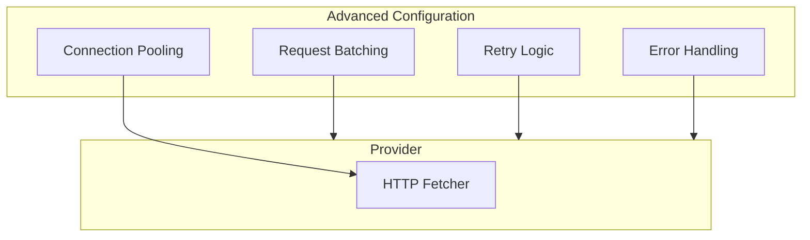

# Advanced Configuration

This guide covers advanced provider configuration including request batching, error handling, retry logic, and connection pooling.

## Overview



---

## Request Batching

While the provider handles individual requests, you can batch operations for efficiency:

### Parallel Requests

```typescript
// Batch multiple independent requests
const [block, balance, utxos] = await Promise.all([
    provider.getBlockNumber(),
    provider.getBalance('bc1q...'),
    provider.utxoManager.getUTXOs({ address: 'bc1q...' }),
]);
```

### Sequential with Dependencies

```typescript
// When requests depend on each other
const blockNumber = await provider.getBlockNumber();
const block = await provider.getBlock(blockNumber);
const transactions = await Promise.all(
    block.transactions?.map((txId) => provider.getTransaction(txId)) || []
);
```

### Batch Pattern for Multiple Addresses

```typescript
// Efficient batch balance check
async function getBalancesBatch(addresses: string[]): Promise<Map<string, bigint>> {
    const balanceMap = await provider.getBalances(addresses, true);
    return new Map(Object.entries(balanceMap));
}

const addresses = ['bc1q...', 'bc1p...', 'bc1r...'];
const balances = await getBalancesBatch(addresses);
```

---

## Error Handling

### OPNet Error Types

```typescript
import { OPNetError } from 'opnet';

try {
    await provider.getBlock(999999999);
} catch (error) {
    if (error instanceof OPNetError) {
        console.error('OPNet Error');
        console.error('  Message:', error.message);
        console.error('  Code:', error.code);
    } else if (error instanceof Error) {
        // Network or other error
        console.error('Error:', error.message);
    }
}
```

### Common Error Scenarios

| Error Type | Cause | Solution |
|------------|-------|----------|
| Timeout | Request took too long | Increase timeout or retry |
| Connection Refused | Server unavailable | Check URL, retry later |
| Invalid Response | Malformed RPC response | Check request parameters |
| Block Not Found | Non-existent block | Verify block number exists |
| Revert | Contract execution failed | Check simulation first |

### Error Handling Patterns

```typescript
// Comprehensive error handling
async function safeGetBlock(height: bigint) {
    try {
        return await provider.getBlock(height);
    } catch (error) {
        if (error instanceof Error) {
            if (error.message.includes('timeout')) {
                console.warn('Request timed out, retrying...');
                return await provider.getBlock(height);
            }
            if (error.message.includes('not found')) {
                console.warn('Block not found');
                return null;
            }
        }
        throw error;  // Re-throw unknown errors
    }
}
```

---

## Retry Logic

Implement retry logic for transient failures:

### Simple Retry

```typescript
async function withRetry<T>(
    operation: () => Promise<T>,
    maxRetries: number = 3,
    delayMs: number = 1000
): Promise<T> {
    let lastError: Error | undefined;

    for (let attempt = 1; attempt <= maxRetries; attempt++) {
        try {
            return await operation();
        } catch (error) {
            lastError = error as Error;
            console.warn(`Attempt ${attempt} failed: ${lastError.message}`);

            if (attempt < maxRetries) {
                await new Promise((r) => setTimeout(r, delayMs * attempt));
            }
        }
    }

    throw lastError;
}

// Usage
const block = await withRetry(() => provider.getBlock(height));
```

### Exponential Backoff

```typescript
async function withExponentialBackoff<T>(
    operation: () => Promise<T>,
    maxRetries: number = 5,
    baseDelayMs: number = 1000
): Promise<T> {
    let lastError: Error | undefined;

    for (let attempt = 0; attempt < maxRetries; attempt++) {
        try {
            return await operation();
        } catch (error) {
            lastError = error as Error;

            // Exponential backoff: 1s, 2s, 4s, 8s, 16s
            const delay = baseDelayMs * Math.pow(2, attempt);
            console.warn(`Attempt ${attempt + 1} failed, waiting ${delay}ms`);

            await new Promise((r) => setTimeout(r, delay));
        }
    }

    throw lastError;
}
```

### Retry with Circuit Breaker

```typescript
class CircuitBreaker {
    private failures = 0;
    private lastFailure = 0;
    private readonly threshold = 5;
    private readonly resetTimeMs = 30000;

    async execute<T>(operation: () => Promise<T>): Promise<T> {
        // Check if circuit is open
        if (this.failures >= this.threshold) {
            if (Date.now() - this.lastFailure < this.resetTimeMs) {
                throw new Error('Circuit breaker is open');
            }
            // Reset after timeout
            this.failures = 0;
        }

        try {
            const result = await operation();
            this.failures = 0;  // Reset on success
            return result;
        } catch (error) {
            this.failures++;
            this.lastFailure = Date.now();
            throw error;
        }
    }
}

// Usage
const breaker = new CircuitBreaker();
const block = await breaker.execute(() => provider.getBlock(height));
```

---

## Connection Pooling

The JSON-RPC provider uses undici for HTTP requests with built-in connection pooling:

### Default Pool Configuration

```typescript
const provider = new JSONRpcProvider({
    url,
    network,
    timeout: 20_000,
    fetcherConfigurations: {
        keepAliveTimeout: 30_000,     // Socket keep-alive
        keepAliveTimeoutThreshold: 30_000,
        connections: 128,             // Max connections
        pipelining: 2,                // Pipelined requests
    },
});
```

### High-Performance Configuration

```typescript
// For high-throughput applications
const provider = new JSONRpcProvider({
    url,
    network,
    timeout: 30_000,
    fetcherConfigurations: {
        keepAliveTimeout: 60_000,    // Longer keep-alive
        keepAliveTimeoutThreshold: 60_000,
        connections: 256,            // More connections
        pipelining: 10,              // More pipelining
    },
});
```

### Configuration Options Explained

| Option | Description | Default |
|--------|-------------|---------|
| `keepAliveTimeout` | How long sockets stay open without activity | 30s |
| `keepAliveTimeoutThreshold` | Threshold before closing keep-alive sockets | 30s |
| `connections` | Maximum concurrent connections per server | 128 |
| `pipelining` | Maximum requests to pipeline per connection | 2 |

---

## Timeout Configuration

### Request-Level Timeout

```typescript
// Provider-wide timeout
const provider = new JSONRpcProvider({
    url,
    network,
    timeout: 60_000, // 60 second timeout
});
```

### Operation-Specific Timeout

```typescript
// Wrap with custom timeout
async function withTimeout<T>(
    promise: Promise<T>,
    timeoutMs: number
): Promise<T> {
    let timeoutId: NodeJS.Timeout;

    const timeoutPromise = new Promise<never>((_, reject) => {
        timeoutId = setTimeout(() => {
            reject(new Error(`Operation timed out after ${timeoutMs}ms`));
        }, timeoutMs);
    });

    try {
        return await Promise.race([promise, timeoutPromise]);
    } finally {
        clearTimeout(timeoutId!);
    }
}

// Usage
const block = await withTimeout(
    provider.getBlock(height),
    5000  // 5 second timeout for this specific call
);
```

---

## Request Rate Limiting

Implement rate limiting to avoid overwhelming nodes:

```typescript
import pLimit from 'p-limit';

// Limit concurrent requests
const limit = pLimit(10);  // Max 10 concurrent

async function rateLimitedFetch(addresses: string[]) {
    return await Promise.all(
        addresses.map((addr) =>
            limit(() => provider.getBalance(addr))
        )
    );
}
```

### Token Bucket Rate Limiter

```typescript
class RateLimiter {
    private tokens: number;
    private lastRefill: number;

    constructor(
        private readonly maxTokens: number = 10,
        private readonly refillRate: number = 1  // tokens per second
    ) {
        this.tokens = maxTokens;
        this.lastRefill = Date.now();
    }

    async acquire(): Promise<void> {
        this.refill();

        if (this.tokens > 0) {
            this.tokens--;
            return;
        }

        // Wait for token
        const waitTime = (1 / this.refillRate) * 1000;
        await new Promise((r) => setTimeout(r, waitTime));
        return this.acquire();
    }

    private refill(): void {
        const now = Date.now();
        const elapsed = (now - this.lastRefill) / 1000;
        const newTokens = elapsed * this.refillRate;

        this.tokens = Math.min(this.maxTokens, this.tokens + newTokens);
        this.lastRefill = now;
    }
}

// Usage
const limiter = new RateLimiter(10, 5);  // 10 tokens, 5/second refill

async function rateLimitedCall<T>(operation: () => Promise<T>): Promise<T> {
    await limiter.acquire();
    return operation();
}
```

---

## Complete Production Example

```typescript
import { JSONRpcProvider, OPNetError } from 'opnet';
import { networks } from '@btc-vision/bitcoin';
import pLimit from 'p-limit';

// Production-ready provider wrapper
class OPNetClient {
    private provider: JSONRpcProvider;
    private limiter = pLimit(20);
    private retryConfig = { maxRetries: 3, baseDelay: 1000 };

    constructor(url: string, network: typeof networks.bitcoin) {
        this.provider = new JSONRpcProvider({
            url,
            network,
            timeout: 60_000,
            fetcherConfigurations: {
                keepAliveTimeout: 60_000,
                connections: 256,
                pipelining: 4,
            },
        });
    }

    async getBlock(height: bigint) {
        return this.execute(() => this.provider.getBlock(height));
    }

    async getBalance(address: string) {
        return this.execute(() => this.provider.getBalance(address));
    }

    async getBalances(addresses: string[]) {
        return this.execute(() =>
            this.provider.getBalances(addresses, true)
        );
    }

    async close() {
        await this.provider.close();
    }

    private async execute<T>(operation: () => Promise<T>): Promise<T> {
        return this.limiter(async () => {
            let lastError: Error | undefined;

            for (let i = 0; i < this.retryConfig.maxRetries; i++) {
                try {
                    return await operation();
                } catch (error) {
                    lastError = error as Error;

                    if (error instanceof OPNetError) {
                        // Don't retry certain errors.
                        // Note: OPNetError.code values are WebSocket error codes,
                        // not HTTP status codes. Check for specific error codes
                        // relevant to your application.
                        throw error;
                    }

                    const delay = this.retryConfig.baseDelay * Math.pow(2, i);
                    await new Promise((r) => setTimeout(r, delay));
                }
            }

            throw lastError;
        });
    }
}

// Usage
const client = new OPNetClient('https://mainnet.opnet.org', networks.bitcoin);

try {
    const block = await client.getBlock(800000n);
    console.log('Block:', block.hash);
} finally {
    await client.close();
}
```

---

## Best Practices

1. **Always Handle Errors**: Wrap provider calls in try/catch

2. **Implement Retries**: Use exponential backoff for transient failures

3. **Rate Limit**: Don't overwhelm nodes with requests

4. **Configure Timeouts**: Set appropriate timeouts for your use case

5. **Close Connections**: Always clean up provider resources

6. **Monitor Performance**: Track request times and failure rates

---

## Next Steps

- [Contract Interactions](../contracts/overview.md) - Working with smart contracts
- [UTXO Management](../bitcoin/utxos.md) - Managing Bitcoin UTXOs

---

[← Previous: Internal Caching](./internal-caching.md) | [Next: Contract Overview →](../contracts/overview.md)
