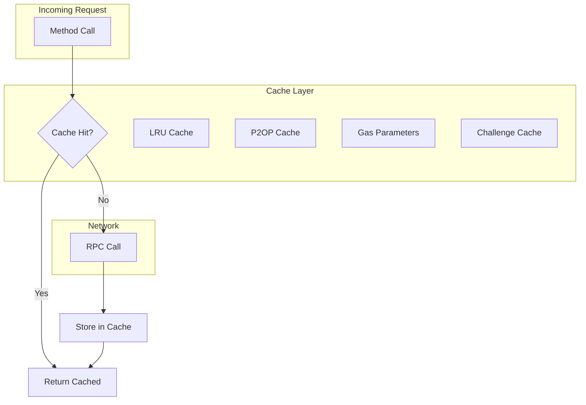
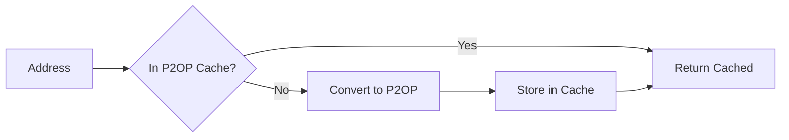

# Internal Caching

Providers include internal caching mechanisms to improve performance and reduce unnecessary network requests. This page explains how caching works and how to leverage it effectively.

## Overview



---

## LRU Cache Behavior

The provider uses an LRU (Least Recently Used) cache for frequently accessed data. When the cache reaches capacity, the least recently accessed items are evicted.

### Cached Data Types

| Data Type | Cache Duration | Invalidation |
|-----------|---------------|--------------|
| Gas Parameters | ~1 block | On new block |
| Challenge | Until expiry | Automatic |
| P2OP Addresses | Long-term | Manual |
| CSV1 Addresses | Long-term | Manual |
| Chain ID | Permanent | Never |

### Gas Parameters Cache

Gas parameters are cached to reduce RPC calls:

```typescript
// First call fetches from network
const gasParams1 = await provider.gasParameters();

// Second call returns cached value (if recent)
const gasParams2 = await provider.gasParameters();

// Cache refreshes when data becomes stale
```

The gas cache automatically refreshes when:
- More than a few seconds have passed since last fetch
- A new block has been received (WebSocket provider)

---

## P2OP Address Cache

P2OP (Pay-to-OPNet) addresses are cached to avoid repeated conversions:

```typescript
// First lookup converts and caches
const p2op1 = contract.p2op;

// Subsequent lookups use cached value
const p2op2 = contract.p2op;  // From cache
```

### How P2OP Caching Works



---

## Challenge Cache

Transaction challenges are cached with expiration tracking:

```typescript
// Get current challenge
const challenge = await provider.getChallenge();

// If called again before expiry, returns cached
const challenge2 = await provider.getChallenge();  // Same challenge
```

### Challenge Cache Behavior

| Scenario | Behavior |
|----------|----------|
| First request | Fetch from network, cache result |
| Within expiry | Return cached challenge |
| After expiry | Fetch new challenge |
| On error | Clear cache, retry |

---

## CSV1 Address Cache

CSV1 (CheckSequenceVerify v1) addresses are cached per address:

```typescript
// Get CSV1 address (takes an Address object, not a string)
const csv1 = provider.getCSV1ForAddress(address);  // address: Address

// Subsequent calls return cached
const csv1Again = provider.getCSV1ForAddress(address);  // From cache
```

---

## Performance Considerations

### Benefits of Caching

1. **Reduced Network Calls**: Fewer RPC requests
2. **Lower Latency**: Instant responses for cached data
3. **Bandwidth Savings**: Less data transferred
4. **Node Relief**: Less load on OPNet nodes

### Cache Considerations

1. **Memory Usage**: Caches consume memory
2. **Stale Data**: Cached data may become outdated
3. **Cache Misses**: First calls always hit network

### Optimizing Cache Usage

```typescript
// Good: Batch operations that use same cached data
const [balance1, balance2, balance3] = await Promise.all([
    contract.balanceOf(addr1),
    contract.balanceOf(addr2),
    contract.balanceOf(addr3),
]);

// These share cached gas parameters

// Less optimal: Sequential calls with delays
const balance1 = await contract.balanceOf(addr1);
await sleep(60000);  // Cache may expire
const balance2 = await contract.balanceOf(addr2);
```

---

## Cache Invalidation

### Automatic Invalidation

- **Gas Parameters**: Refresh on new blocks or timeout
- **Challenge**: Refresh on expiration
- **Chain ID**: Never invalidates (permanent)

### Manual Cache Management

The provider does not expose direct cache manipulation, but you can create new provider instances to start with fresh caches:

```typescript
// If you need a fresh cache
const freshProvider = new JSONRpcProvider({ url, network });
```

---

## WebSocket vs JSON-RPC Caching

### WebSocket Provider

- Receives real-time block notifications
- Can invalidate gas cache immediately on new blocks
- More up-to-date cached values

### JSON-RPC Provider

- Uses time-based cache invalidation
- Polls for updates when needed
- May have slightly stale data between polls

```typescript
// WebSocket: Cache updates with real-time blocks
await wsProvider.subscribeBlocks((block) => {
    // Gas cache automatically refreshes
});

// JSON-RPC: Cache updates on access after timeout
const gasParams = await httpProvider.gasParameters();
```

---

## Debugging Cache Behavior

While the cache is internal, you can observe its behavior:

```typescript
// Measure response times
async function measureCacheEffect() {
    const start1 = Date.now();
    await provider.gasParameters();
    console.log('First call:', Date.now() - start1, 'ms');

    const start2 = Date.now();
    await provider.gasParameters();
    console.log('Second call:', Date.now() - start2, 'ms');
    // Second call should be nearly instant if cached
}
```

---

## Best Practices

1. **Reuse Provider Instances**: Take advantage of cached data

2. **Batch Related Operations**: Operations sharing cached data run faster

3. **Consider Cache Timing**: For time-sensitive operations, fresh data may be needed

4. **Monitor Memory**: Long-running applications may accumulate cache entries

5. **New Providers for Fresh Data**: Create new provider when fresh data is required

```typescript
// Good: Reuse for efficiency
const provider = new JSONRpcProvider({ url, network });
await provider.gasParameters();
await provider.gasParameters();  // Cached

// When fresh data is critical
const freshProvider = new JSONRpcProvider({ url, network });
const freshGas = await freshProvider.gasParameters();
```

---

## Next Steps

- [Advanced Configuration](./advanced-configuration.md) - Error handling and retry logic
- [Contract Interactions](../contracts/overview.md) - Working with contracts

---

[← Previous: WebSocket Provider](./websocket-provider.md) | [Next: Advanced Configuration →](./advanced-configuration.md)
