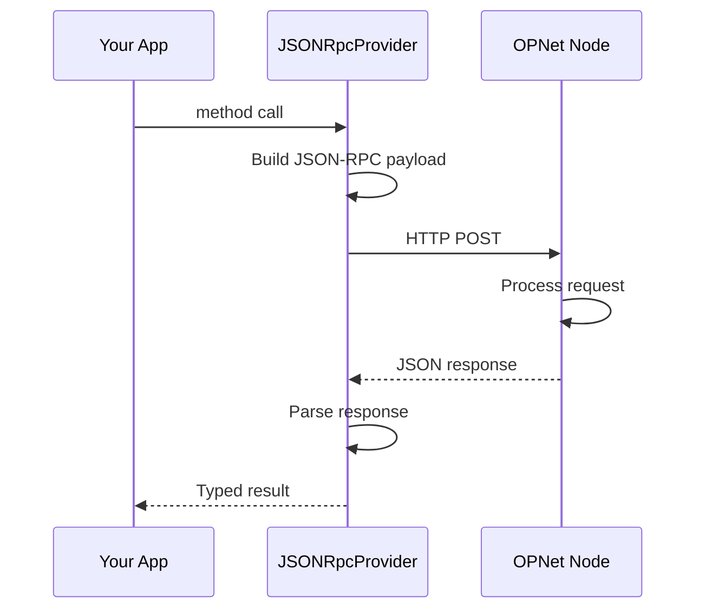
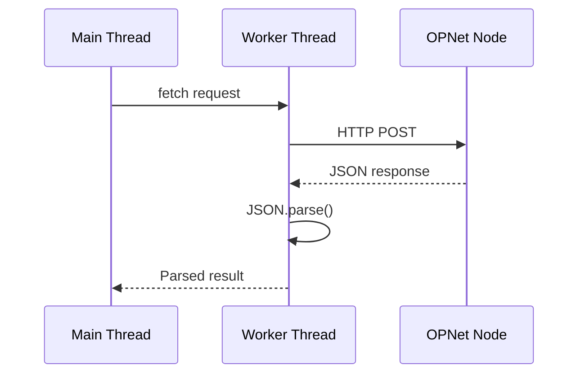

# JSON-RPC Provider

The `JSONRpcProvider` is the primary way to communicate with OPNet nodes using HTTP-based JSON-RPC protocol.

## Table of Contents

- [Overview](#overview)
- [Setting Up HTTP Connections](#setting-up-http-connections)
- [Constructor Configuration](#constructor-configuration)
- [Network Configuration](#network-configuration)
- [Threaded Parsing](#threaded-parsing)
- [Threaded HTTP](#threaded-http)
- [Complete Configuration Example](#complete-configuration-example)
- [Provider Methods](#provider-methods)
  - [Block Methods](#block-methods)
  - [Transaction Methods](#transaction-methods)
  - [Contract Methods](#contract-methods)
  - [Balance Methods](#balance-methods)
  - [Public Key Methods](#public-key-methods)
  - [Epoch Methods](#epoch-methods)
- [UTXO Manager](#utxo-manager)
- [Error Handling](#error-handling)
- [Resource Cleanup](#resource-cleanup)
- [Best Practices](#best-practices)

---

## Overview



---

## Setting Up HTTP Connections

### Basic Setup

```typescript
import { JSONRpcProvider } from 'opnet';
import { networks } from '@btc-vision/bitcoin';

const provider = new JSONRpcProvider({
    url: 'https://regtest.opnet.org',
    network: networks.regtest,
});
```

### With Custom Timeout

```typescript
const provider = new JSONRpcProvider({
    url: 'https://regtest.opnet.org',
    network: networks.regtest,
    timeout: 30_000, // 30 second timeout
});
```

---

## Constructor Configuration

The `JSONRpcProvider` accepts a `JSONRpcProviderConfig` object:

```typescript
interface JSONRpcProviderConfig {
    readonly url: string;
    readonly network: Network;
    readonly timeout?: number;
    readonly fetcherConfigurations?: Agent.Options;
    readonly useThreadedParsing?: boolean;
    readonly useThreadedHttp?: boolean;
}
```

### Parameter Reference

| Parameter | Type | Default | Description |
|-----------|------|---------|-------------|
| `url` | `string` | *required* | RPC endpoint URL |
| `network` | `Network` | *required* | Bitcoin network (mainnet/testnet/opnetTestnet/regtest) |
| `timeout` | `number` | `20000` | Request timeout in milliseconds |
| `fetcherConfigurations` | `Agent.Options` | *see below* | HTTP agent configuration |
| `useThreadedParsing` | `boolean` | `false` | Parse responses in worker thread |
| `useThreadedHttp` | `boolean` | `false` | Perform entire HTTP request in worker thread |

### Default Fetcher Configuration

```typescript
{
    keepAliveTimeout: 30_000,        // Socket keep-alive duration
    keepAliveTimeoutThreshold: 30_000, // Keep-alive threshold
    connections: 128,                 // Max connections per server
    pipelining: 2,                   // Max pipelined requests
}
```

---

## Network Configuration

### Available Networks

```typescript
import { networks } from '@btc-vision/bitcoin';

// Production
const mainnetProvider = new JSONRpcProvider({
    url: 'https://mainnet.opnet.org',
    network: networks.bitcoin,
});

// Development
const regtestProvider = new JSONRpcProvider({
    url: 'https://regtest.opnet.org',
    network: networks.regtest,
});
```

### Network URLs

| Network | URL | Description |
|---------|-----|-------------|
| Mainnet | `https://mainnet.opnet.org` | Production network |
| Regtest | `https://regtest.opnet.org` | Development/regression testing |

---

## Threaded Parsing

For large responses, the provider can parse JSON in a worker thread to avoid blocking the main thread:

```typescript
// Enable threaded parsing (not enabled by default)
const provider = new JSONRpcProvider({
    url: 'https://regtest.opnet.org',
    network: networks.regtest,
    useThreadedParsing: true,
});
```

**When to use threaded parsing:**
- Processing large block data
- Fetching many transactions at once
- Production environments

**When to disable:**
- Debugging
- Small responses
- Environments without worker support

---

## Threaded HTTP

Beyond threaded parsing, the provider can offload the **entire HTTP request** (network I/O + JSON parsing) to a worker thread, completely freeing the main thread:

```typescript
// Enable threaded HTTP (not enabled by default)
const provider = new JSONRpcProvider({
    url: 'https://regtest.opnet.org',
    network: networks.regtest,
    useThreadedParsing: true,
    useThreadedHttp: true,
});
```

**How it works:**



**When to use threaded HTTP:**
- High-frequency RPC calls
- Real-time applications where main thread responsiveness is critical
- Browser environments to prevent UI blocking
- Production environments

**When to disable:**
- Debugging network issues
- Service worker contexts (automatic fallback provided)
- When you need fine-grained control over HTTP requests

For detailed documentation on the threading system, see [Threaded HTTP](./threaded-http.md).

---

## Complete Configuration Example

```typescript
import { JSONRpcProvider } from 'opnet';
import { networks } from '@btc-vision/bitcoin';

const provider = new JSONRpcProvider({
    url: 'https://regtest.opnet.org',
    network: networks.regtest,
    timeout: 30_000,
    fetcherConfigurations: {
        keepAliveTimeout: 60_000,
        connections: 256,
        pipelining: 4,
    },
    useThreadedParsing: true,
    useThreadedHttp: true,
});

async function main() {
    // Use the provider
    const block = await provider.getBlockNumber();
    console.log('Current block:', block);

    // Always close when done
    await provider.close();
}

main();
```

---

## Provider Methods

### Block Methods

```typescript
// Get latest block number
const height = await provider.getBlockNumber();

// Get block by number
const block = await provider.getBlock(12345, true);  // prefetch txs

// Get block by hash
const blockByHash = await provider.getBlockByHash('0x...');

// Get block by checksum
const blockByChecksum = await provider.getBlockByChecksum('0x...');

// Get multiple blocks
const blocks = await provider.getBlocks([1, 2, 3, 4, 5]);

// Get gas parameters
const gasParams = await provider.gasParameters();
```

### Transaction Methods

```typescript
// Get transaction by hash
const tx = await provider.getTransaction('txHash');

// Get transaction receipt
const receipt = await provider.getTransactionReceipt('txHash');

// Broadcast transaction
const result = await provider.sendRawTransaction(rawTx, psbt);

// Broadcast multiple transactions
const results = await provider.sendRawTransactions([rawTx1, rawTx2]);
```

### Contract Methods

```typescript
// Call contract (simulation)
// `from` is an Address object (not a string), return type is Promise<CallResult | ICallRequestError>
const result = await provider.call(
    contractAddress,    // Contract to call (string | Address)
    calldata,          // Encoded function call (Uint8Array | string)
    fromAddress,       // Optional sender (Address)
    blockHeight,       // Optional block height
    simulatedTx,       // Optional simulated transaction
    accessList         // Optional access list
);

// Get contract code
const code = await provider.getCode(contractAddress, false);

// Get storage value
const storage = await provider.getStorageAt(
    contractAddress,
    storagePointer,
    true,              // Include proofs
    blockHeight        // Optional block height
);
```

### Balance Methods

```typescript
// Get single balance
const balance = await provider.getBalance(
    'bc1q...',
    true  // Filter out ordinals
);

// Get multiple balances
const balances = await provider.getBalances(
    ['bc1q...', 'bc1p...'],
    true  // Filter ordinals
);
```

### Public Key Methods

```typescript
// Get public key info
const address = await provider.getPublicKeyInfo(
    'bc1q...',
    false  // Not a contract
);

// Get multiple public keys
const keys = await provider.getPublicKeysInfo(
    ['bc1q...', 'bc1p...'],
    false
);

// Validate address
const type = provider.validateAddress('bc1q...', network);
```

### Epoch Methods

```typescript
// Get latest epoch
const epoch = await provider.getLatestEpoch(true);  // Include submissions

// Get epoch by number
const epochByNum = await provider.getEpochByNumber(42n);

// Get epoch by hash
const epochByHash = await provider.getEpochByHash('0x...');

// Get mining template
const template = await provider.getEpochTemplate();

// Submit epoch solution
const submitted = await provider.submitEpoch({
    epochNumber: 123n,
    checksumRoot: checksumRootBuffer,
    salt: saltBuffer,
    mldsaPublicKey: publicKeyBuffer,
    signature: signatureBuffer,
    graffiti: graffitiBuffer,  // optional
});
```

---

## UTXO Manager

Access the UTXO manager through the provider:

```typescript
// Get UTXOs for address
const utxos = await provider.utxoManager.getUTXOs({
    address: 'bc1q...',
    optimize: true,
    mergePendingUTXOs: true,
    filterSpentUTXOs: true,
});

// Get UTXOs for a specific amount
const utxosForAmount = await provider.utxoManager.getUTXOsForAmount({
    address: 'bc1q...',
    amount: 100000n,
});
```

---

## Error Handling

```typescript
import { JSONRpcProvider, OPNetError } from 'opnet';

const provider = new JSONRpcProvider({
    url: 'https://regtest.opnet.org',
    network: networks.regtest,
});

try {
    const block = await provider.getBlock(999999999);
} catch (error) {
    if (error instanceof OPNetError) {
        console.error('OPNet error:', error.message);
        console.error('Error code:', error.code);
    } else {
        console.error('Network error:', error);
    }
}
```

---

## Resource Cleanup

Always close the provider when done:

```typescript
const provider = new JSONRpcProvider({
    url: 'https://regtest.opnet.org',
    network: networks.regtest,
});

try {
    // Use provider...
} finally {
    await provider.close();
}
```

---

## Best Practices

1. **Reuse Providers**: Create one provider instance and reuse it

2. **Set Appropriate Timeouts**: Increase timeout for slow networks or complex operations

3. **Enable Threaded Parsing**: For production with large responses

4. **Close Connections**: Always call `close()` when done

5. **Handle Errors**: Wrap calls in try/catch for proper error handling

```typescript
// Production configuration
const provider = new JSONRpcProvider({
    url: 'https://mainnet.opnet.org',
    network: networks.bitcoin,
    timeout: 60_000,
    fetcherConfigurations: {
        connections: 256,
        pipelining: 4,
    },
    useThreadedParsing: true,
    useThreadedHttp: true,
});
```

---

## Next Steps

- [WebSocket Provider](./websocket-provider.md) - Real-time subscriptions
- [Threaded HTTP](./threaded-http.md) - Deep dive into worker thread HTTP
- [Internal Caching](./internal-caching.md) - Provider caching behavior
- [Advanced Configuration](./advanced-configuration.md) - Error handling and retry logic

---

[← Previous: Understanding Providers](./understanding-providers.md) | [Next: WebSocket Provider →](./websocket-provider.md)
