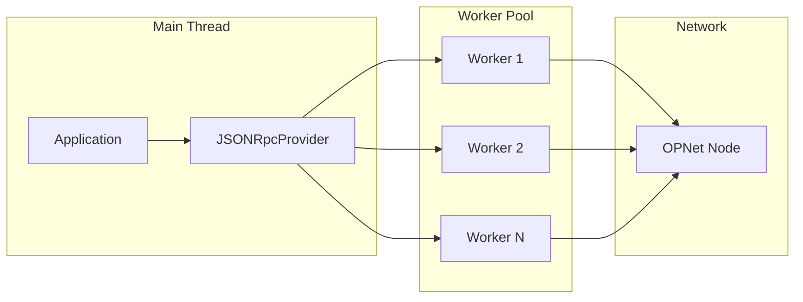

# Threaded HTTP

The OPNet library includes a powerful threading system that offloads HTTP requests and JSON parsing to worker threads, keeping your main thread responsive.

## Table of Contents

- [Overview](#overview)
- [Architecture](#architecture)
- [JSONRpcProvider Integration](#jsonrpcprovider-integration)
- [JsonThreader API](#jsonthreader-api)
  - [Configuration](#configuration)
  - [Methods](#methods)
  - [FetchRequest Interface](#fetchrequest-interface)
- [Worker Script](#worker-script)
- [Service Worker Support](#service-worker-support)
- [Browser Compatibility](#browser-compatibility)
- [Performance Considerations](#performance-considerations)
- [Troubleshooting](#troubleshooting)

---

## Overview

Traditional JSON-RPC calls block the main thread during:
1. Network I/O (waiting for HTTP response)
2. JSON parsing (especially for large payloads)

The threaded HTTP system moves both operations to a worker thread pool:



---

## Architecture

The threading system consists of three components:

| Component | File | Purpose |
|-----------|------|---------|
| `JsonThreader` | `src/threading/JSONThreader.ts` | Worker pool manager with `parse()`, `stringify()`, and `fetch()` methods |
| `JSONWorker` | `src/threading/worker-scripts/JSONWorker.ts` | Worker script handling operations in background threads |
| `JSONRpcProvider` | `src/providers/JSONRpcProvider.ts` | RPC provider with optional threaded HTTP support |

---

## JSONRpcProvider Integration

Enable threaded HTTP when creating a provider:

```typescript
import { JSONRpcProvider } from 'opnet';
import { networks } from '@btc-vision/bitcoin';

const provider = new JSONRpcProvider({
    url: 'https://regtest.opnet.org',
    network: networks.regtest,
    timeout: 20_000,
    useThreadedParsing: true,
    useThreadedHttp: true,
});
```

### Threading Modes

| `useThreadedHttp` | `useThreadedParsing` | Behavior |
|-------------------|----------------------|----------|
| `true` | (ignored) | Full HTTP + parsing in worker |
| `false` | `true` | HTTP on main thread, parsing in worker |
| `false` | `false` | Everything on main thread |

When `useThreadedHttp` is enabled, the entire request lifecycle runs in a worker:

```typescript
// This call runs entirely in a worker thread
const blockNumber = await provider.getBlockNumber();
```

---

## JsonThreader API

The `JsonThreader` class manages a pool of worker threads for JSON operations.

### Configuration

```typescript
import { JsonThreader } from 'opnet';

const threader = new JsonThreader({
    poolSize: 4,              // Number of workers (default: CPU cores)
    threadingThreshold: 16384  // Min size to use workers (bytes, default: 16384)
});
```

### Methods

#### `parse<T>(data: string): Promise<T>`

Parse JSON string in a worker thread:

```typescript
const obj = await threader.parse<MyType>('{"key": "value"}');
```

#### `stringify(data: JsonValue): Promise<string>`

Stringify a value in a worker thread:

```typescript
const json = await threader.stringify({ key: 'value' });
```

#### `fetch<T>(request: FetchRequest): Promise<T>`

Perform an HTTP POST request entirely in a worker thread:

```typescript
const result = await threader.fetch<MyResponse>({
    url: 'https://regtest.opnet.org/api/v1/json-rpc',
    payload: {
        jsonrpc: '2.0',
        method: 'btc_blockNumber',
        params: [],
        id: 1
    },
    timeout: 10_000,
    headers: {
        'Content-Type': 'application/json',
        'Accept': 'application/json'
    }
});
```

#### `terminate(): Promise<void>`

Shut down all workers:

```typescript
await threader.terminate();
```

#### `stats: WorkerStats`

Get worker pool statistics:

```typescript
const stats = threader.stats;
console.log(`Workers: ${stats.total}, Available: ${stats.available}`);
console.log(`Processed: ${stats.processed}, Failed: ${stats.failed}`);
```

### FetchRequest Interface

```typescript
interface FetchRequest {
    url: string;                        // Request URL
    payload: JsonValue;                 // Request body (will be JSON.stringify'd)
    timeout?: number;                   // Timeout in ms (default: 20000)
    headers?: Record<string, string>;   // HTTP headers
}
```

---

## Worker Script

The worker script handles three operations:

### Parse Operation

```javascript
// Worker receives: { id: 1, op: 'parse', data: '{"key": "value"}' }
// Worker returns:  { id: 1, result: { key: 'value' } }
```

### Stringify Operation

```javascript
// Worker receives: { id: 2, op: 'stringify', data: { key: 'value' } }
// Worker returns:  { id: 2, result: '{"key":"value"}' }
```

### Fetch Operation

```javascript
// Worker receives: { id: 3, op: 'fetch', data: { url, payload, timeout, headers } }
// Worker performs: HTTP POST, parses response
// Worker returns:  { id: 3, result: { ...parsedResponse } }
```

The worker includes:
- AbortController for request timeouts
- Automatic JSON parsing of responses
- Error handling with detailed messages

---

## Service Worker Support

The `fetch()` method automatically detects service worker contexts and falls back to main-thread execution:

```typescript
// In a service worker, this runs on the main thread automatically
const result = await threader.fetch(request);
```

Detection methods:
1. `__IS_SERVICE_WORKER__` build-time constant
2. Runtime check for `ServiceWorkerGlobalScope`

---

## Browser Compatibility

The threading system works in both Node.js and browsers:

| Environment | Worker Type | Communication |
|-------------|-------------|---------------|
| Node.js | `worker_threads` | `parentPort.postMessage()` |
| Browser | Web Worker | `self.postMessage()` |

The worker script auto-detects its environment:

```javascript
if (typeof self !== 'undefined' && typeof self.onmessage !== 'undefined') {
    // Browser: use self.onmessage and postMessage
} else {
    // Node.js: use worker_threads parentPort
}
```

---

## Performance Considerations

### When Threaded HTTP Helps Most

- **High-frequency polling**: Block number checks, balance updates
- **Large responses**: Block data with many transactions
- **UI applications**: Prevents jank during RPC calls
- **Concurrent requests**: Worker pool handles parallel requests efficiently

### When to Disable

- **Debugging**: Main thread execution is easier to trace
- **Simple scripts**: Overhead may outweigh benefits for one-off calls
- **Memory constraints**: Each worker consumes memory

### Benchmarks

Typical improvements for common operations:

| Operation | Main Thread | Threaded HTTP | Improvement |
|-----------|-------------|---------------|-------------|
| `getBlockNumber()` | 2ms blocking | 0ms blocking | UI responsive |
| Large block fetch | 50ms blocking | 0ms blocking | UI responsive |
| 100 concurrent calls | Sequential | Parallel workers | ~4x throughput |

---

## Troubleshooting

### Workers Not Starting

Check if worker threads are supported:

```typescript
const threader = new JsonThreader({ poolSize: 2 });
await threader.parse('{}');  // Forces worker init

console.log('Workers:', threader.stats.total);
```

### Timeout Errors

Increase timeout for slow networks:

```typescript
const result = await threader.fetch({
    url: 'https://node.example.com/rpc',
    payload: request,
    timeout: 60_000  // 60 seconds
});
```

### Memory Usage

Monitor and limit worker pool size:

```typescript
// Use fewer workers for memory-constrained environments
const threader = new JsonThreader({ poolSize: 2 });
```

### Error Messages

| Error | Cause | Solution |
|-------|-------|----------|
| `Request timed out after Xms` | Server didn't respond in time | Increase timeout |
| `HTTP 4xx/5xx` | Server error | Check request payload |
| `No data fetched` | Empty response | Verify endpoint URL |

---

## Next Steps

- [JSON-RPC Provider](./json-rpc-provider.md) - Provider configuration
- [Advanced Configuration](./advanced-configuration.md) - Retry logic and error handling
- [WebSocket Provider](./websocket-provider.md) - Real-time subscriptions

---

[← Previous: JSON-RPC Provider](./json-rpc-provider.md) | [Next: Internal Caching →](./internal-caching.md)
