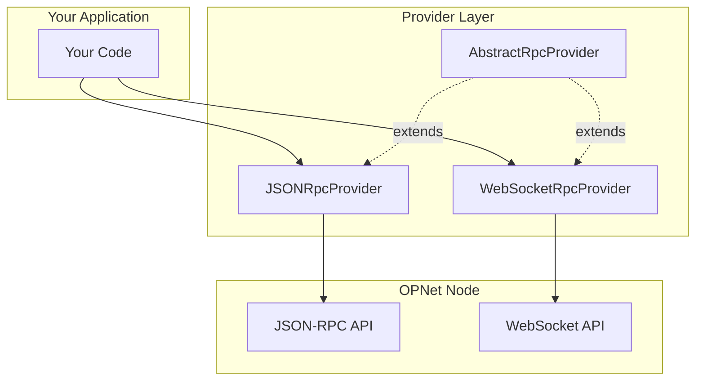
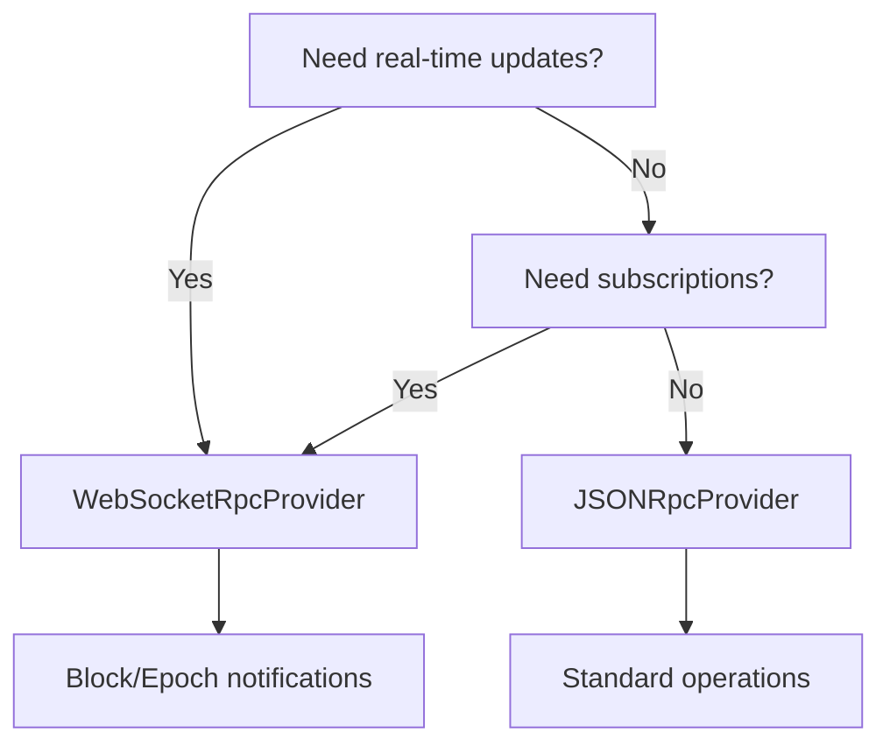

# Understanding Providers

Providers are the communication layer between your application and OPNet nodes. They handle all RPC calls, manage connections, and provide a clean API for blockchain operations.

## Overview



---

## What Providers Do

Providers abstract the complexity of communicating with OPNet nodes:

| Capability | Description |
|------------|-------------|
| **RPC Communication** | Send and receive JSON-RPC requests |
| **Block Operations** | Fetch blocks by number, hash, or checksum |
| **Transaction Handling** | Get transactions, receipts, broadcast new transactions |
| **Contract Calls** | Execute contract simulations and read storage |
| **UTXO Management** | Fetch and track unspent transaction outputs |
| **Balance Queries** | Get Bitcoin balances for addresses |
| **Epoch Operations** | Access epoch mining data and submit solutions |
| **Public Key Lookups** | Convert addresses to unified formats |

---

## Provider Types

### JSONRpcProvider

HTTP-based provider using standard JSON-RPC protocol:

```typescript
import { JSONRpcProvider } from 'opnet';
import { networks } from '@btc-vision/bitcoin';

const provider = new JSONRpcProvider({
    url: 'https://regtest.opnet.org',
    network: networks.regtest,
});
```

**Best for:**
- Standard request/response operations
- Server-side applications
- Stateless interactions
- Simple integrations

### WebSocketRpcProvider

WebSocket-based provider with real-time capabilities:

```typescript
import { WebSocketRpcProvider } from 'opnet';
import { networks } from '@btc-vision/bitcoin';

const provider = new WebSocketRpcProvider({
    url: 'wss://regtest.opnet.org/ws',
    network: networks.regtest,
});

// Subscribe to new blocks
await provider.subscribeBlocks((block) => {
    console.log('New block:', block.blockNumber);
});
```

**Best for:**
- Real-time block notifications
- Epoch monitoring
- Event-driven applications
- Long-running processes

---

## Choosing the Right Provider



---

## Network Selection

OPNet supports multiple Bitcoin networks:

```typescript
import { networks } from '@btc-vision/bitcoin';

// Available networks
const mainnet = networks.bitcoin;   // Production
const regtest = networks.regtest;   // Local development
```

### Network Configuration

| Network | RPC URL | WebSocket URL | Use Case |
|---------|---------|---------------|----------|
| Mainnet | `https://mainnet.opnet.org` | `wss://mainnet.opnet.org/ws` | Production |
| Regtest | `https://regtest.opnet.org` | `wss://regtest.opnet.org/ws` | Development |

### Complete Setup Example

```typescript
import { JSONRpcProvider, WebSocketRpcProvider } from 'opnet';
import { networks, Network } from '@btc-vision/bitcoin';

// Configuration based on environment
const config = {
    mainnet: {
        rpc: 'https://mainnet.opnet.org',
        ws: 'wss://mainnet.opnet.org/ws',
        network: networks.bitcoin,
    },
    regtest: {
        rpc: 'https://regtest.opnet.org',
        ws: 'wss://regtest.opnet.org/ws',
        network: networks.regtest,
    },
};

// Select environment
const env = 'regtest';
const { rpc, ws, network } = config[env];

// Create providers
const httpProvider = new JSONRpcProvider({ url: rpc, network });
const wsProvider = new WebSocketRpcProvider({ url: ws, network });
```

---

## Common Provider Methods

All providers inherit from `AbstractRpcProvider` and share these methods:

### Block Operations

```typescript
// Get current block height
const height = await provider.getBlockNumber();

// Get a specific block
const block = await provider.getBlock(height);

// Get block by hash
const blockByHash = await provider.getBlockByHash('0x...');
```

### Transaction Operations

```typescript
// Get transaction
const tx = await provider.getTransaction('txHash');

// Get receipt
const receipt = await provider.getTransactionReceipt('txHash');

// Broadcast transaction
const result = await provider.sendRawTransaction(rawTx, psbt);
```

### Contract Operations

```typescript
// Call contract (simulation)
const result = await provider.call(
    contractAddress,
    calldata,
    senderAddress
);

// Get contract code
const code = await provider.getCode(contractAddress);

// Read storage
const value = await provider.getStorageAt(contractAddress, pointer);
```

### Balance & UTXO Operations

```typescript
// Get balance
const balance = await provider.getBalance('address');

// Get multiple balances
const balances = await provider.getBalances(['addr1', 'addr2']);

// Get UTXOs
const utxos = await provider.utxoManager.getUTXOs({
    address: 'address',
});
```

---

## Resource Management

Always clean up providers when done:

```typescript
// For JSONRpcProvider
await provider.close();

// For WebSocketRpcProvider
provider.disconnect();
```

### Example with Cleanup

```typescript
import { JSONRpcProvider } from 'opnet';
import { networks } from '@btc-vision/bitcoin';

async function main() {
    const provider = new JSONRpcProvider({
        url: 'https://regtest.opnet.org',
        network: networks.regtest,
    });

    try {
        const block = await provider.getBlockNumber();
        console.log('Block:', block);
    } finally {
        await provider.close();
    }
}
```

---

## Best Practices

1. **Single Provider Instance**: Reuse provider instances rather than creating new ones for each operation

2. **Error Handling**: Always wrap provider calls in try/catch blocks

3. **Connection Cleanup**: Close providers when your application shuts down

4. **Network Matching**: Ensure the provider network matches your contract addresses

5. **Timeout Configuration**: Set appropriate timeouts for your use case

```typescript
// Good: Reuse provider
const provider = new JSONRpcProvider({ url, network });
const block1 = await provider.getBlock(1);
const block2 = await provider.getBlock(2);

// Bad: Creating new provider each time
const block1 = await new JSONRpcProvider({ url, network }).getBlock(1);
const block2 = await new JSONRpcProvider({ url, network }).getBlock(2);
```

---

## Next Steps

- [JSON-RPC Provider](./json-rpc-provider.md) - Detailed HTTP provider configuration
- [WebSocket Provider](./websocket-provider.md) - Real-time subscriptions
- [Advanced Configuration](./advanced-configuration.md) - Error handling and retry logic

---

[← Previous: Quick Start](../getting-started/quick-start.md) | [Next: JSON-RPC Provider →](./json-rpc-provider.md)
