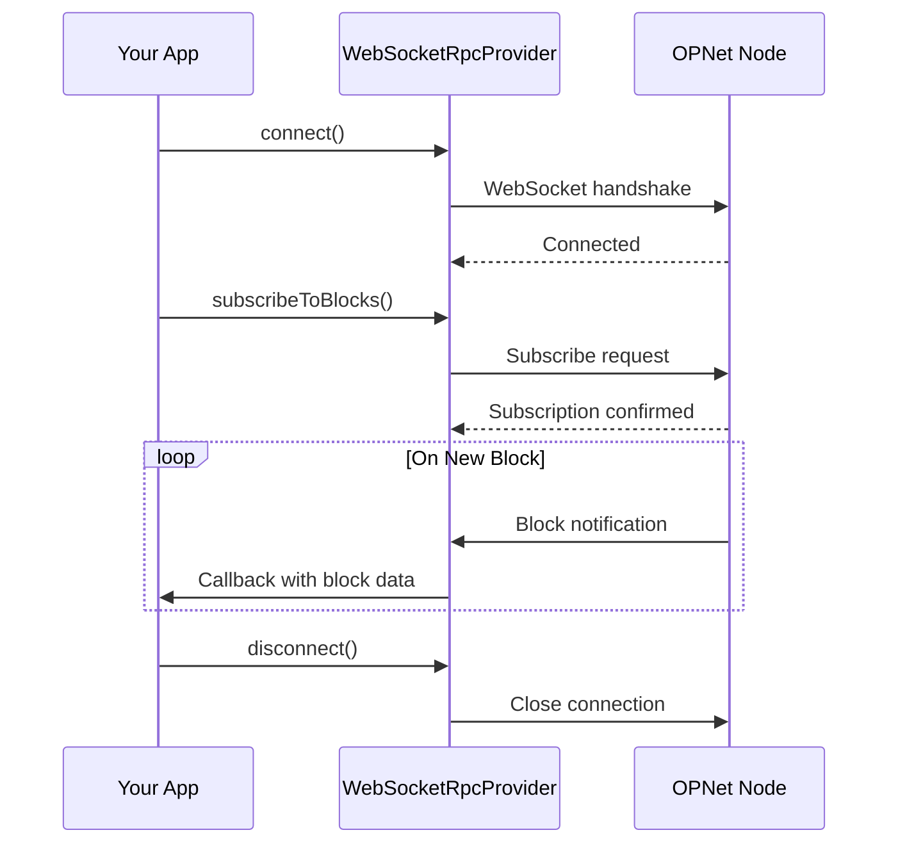

# WebSocket Provider

The `WebSocketRpcProvider` enables real-time communication with OPNet nodes through persistent WebSocket connections, supporting subscriptions for new blocks and epochs.

## Overview



---

## Basic Setup

```typescript
import { WebSocketRpcProvider } from 'opnet';
import { networks } from '@btc-vision/bitcoin';

const provider = new WebSocketRpcProvider(
    'wss://regtest.opnet.org/ws',
    networks.regtest
);

// Wait for connection
await provider.connect();

console.log('Connected to OPNet!');
```

---

## Real-Time Subscriptions

### Block Notifications

Subscribe to receive notifications when new blocks are mined:

```typescript
// Subscribe to new blocks
const unsubscribe = provider.subscribeToBlocks((block) => {
    console.log('New block!');
    console.log('  Height:', block.height);
    console.log('  Hash:', block.hash);
    console.log('  Transactions:', block.txCount);
});

// Later, unsubscribe
unsubscribe();
```

### Block Subscription with Full Data

```typescript
// Request full block data with transactions
const unsubscribe = provider.subscribeToBlocks(
    (block) => {
        console.log('Block:', block.height);

        // Access transactions if prefetched
        if (block.transactions) {
            for (const tx of block.transactions) {
                console.log('  TX:', tx.hash);
            }
        }
    },
    { prefetchTransactions: true }
);
```

### Epoch Notifications

Subscribe to epoch updates for mining:

```typescript
// Subscribe to epoch updates
const unsubscribe = provider.subscribeToEpochs((epoch) => {
    console.log('Epoch update!');
    console.log('  Epoch number:', epoch.epochNumber);
    console.log('  Target hash:', epoch.targetHash);
    console.log('  Difficulty:', epoch.difficultyScaled);

    if (epoch.proposer) {
        console.log('  Winner:', epoch.proposer.publicKey);
    }
});

// Unsubscribe when done
unsubscribe();
```

---

## Event Handlers

The WebSocket provider emits various events you can listen to:

```typescript
import { WebSocketClientEvent } from 'opnet';

// Connection opened
provider.on(WebSocketClientEvent.Connected, () => {
    console.log('WebSocket connected');
});

// Connection closed
provider.on(WebSocketClientEvent.Disconnected, () => {
    console.log('WebSocket disconnected');
});

// Error occurred
provider.on(WebSocketClientEvent.Error, (error) => {
    console.error('WebSocket error:', error);
});

// Block received
provider.on(WebSocketClientEvent.Block, (block) => {
    console.log('Block via event:', block.height);
});

// Epoch received
provider.on(WebSocketClientEvent.Epoch, (epoch) => {
    console.log('Epoch via event:', epoch.epochNumber);
});
```

---

## Connection Management

### Connection States

```typescript
import { ConnectionState } from 'opnet';

// Check connection state
const state = provider.connectionState;

switch (state) {
    case ConnectionState.Disconnected:
        console.log('Not connected');
        break;
    case ConnectionState.Connecting:
        console.log('Connecting...');
        break;
    case ConnectionState.Connected:
        console.log('Connected');
        break;
    case ConnectionState.Reconnecting:
        console.log('Reconnecting...');
        break;
}
```

### Manual Connection Control

```typescript
// Connect
await provider.connect();

// Disconnect
provider.disconnect();

// Reconnect
await provider.reconnect();
```

### Automatic Reconnection

The provider automatically attempts to reconnect on connection loss:

```typescript
const provider = new WebSocketRpcProvider(url, network, {
    reconnectAttempts: 5,        // Max reconnection attempts
    reconnectInterval: 3000,     // Wait between attempts (ms)
    autoReconnect: true,         // Enable auto-reconnect
});
```

---

## Configuration Options

### WebSocketClientConfig

```typescript
interface WebSocketClientConfig {
    // Reconnection settings
    reconnectAttempts?: number;     // Default: 5
    reconnectInterval?: number;     // Default: 3000ms
    autoReconnect?: boolean;        // Default: true

    // Timeout settings
    connectionTimeout?: number;     // Default: 10000ms
    requestTimeout?: number;        // Default: 30000ms

    // Heartbeat
    pingInterval?: number;          // Default: 30000ms
}
```

### Complete Configuration Example

```typescript
import { WebSocketRpcProvider } from 'opnet';
import { networks } from '@btc-vision/bitcoin';

const provider = new WebSocketRpcProvider(
    'wss://regtest.opnet.org/ws',
    networks.regtest,
    {
        reconnectAttempts: 10,
        reconnectInterval: 5000,
        autoReconnect: true,
        connectionTimeout: 15000,
        requestTimeout: 60000,
        pingInterval: 20000,
    }
);

await provider.connect();
```

---

## Making RPC Calls

The WebSocket provider supports all the same RPC methods as the JSON-RPC provider:

```typescript
// Block operations
const height = await provider.getBlockNumber();
const block = await provider.getBlock(height);

// Transaction operations
const tx = await provider.getTransaction('txHash');
const receipt = await provider.getTransactionReceipt('txHash');

// Contract operations
const result = await provider.call(contractAddress, calldata);

// Balance operations
const balance = await provider.getBalance('bc1q...');
```

---

## Complete Example

```typescript
import {
    WebSocketRpcProvider,
    WebSocketClientEvent,
    ConnectionState,
} from 'opnet';
import { networks } from '@btc-vision/bitcoin';

async function main() {
    const provider = new WebSocketRpcProvider(
        'wss://regtest.opnet.org/ws',
        networks.regtest,
        {
            autoReconnect: true,
            reconnectAttempts: 5,
        }
    );

    // Set up event handlers
    provider.on(WebSocketClientEvent.Connected, () => {
        console.log('Connected!');
    });

    provider.on(WebSocketClientEvent.Disconnected, () => {
        console.log('Disconnected');
    });

    provider.on(WebSocketClientEvent.Error, (error) => {
        console.error('Error:', error);
    });

    // Connect
    await provider.connect();

    // Get current state
    const height = await provider.getBlockNumber();
    console.log('Current block:', height);

    // Subscribe to new blocks
    const unsubscribeBlocks = provider.subscribeToBlocks((block) => {
        console.log('New block:', block.height);
    });

    // Subscribe to epochs
    const unsubscribeEpochs = provider.subscribeToEpochs((epoch) => {
        console.log('Epoch:', epoch.epochNumber);
    });

    // Keep running for a while
    await new Promise((resolve) => setTimeout(resolve, 60000));

    // Cleanup
    unsubscribeBlocks();
    unsubscribeEpochs();
    provider.disconnect();
}

main().catch(console.error);
```

---

## Error Handling

```typescript
import { OPNetError, WebSocketErrorCode } from 'opnet';

try {
    await provider.connect();
} catch (error) {
    if (error instanceof OPNetError) {
        switch (error.code) {
            case WebSocketErrorCode.ConnectionFailed:
                console.error('Could not connect to server');
                break;
            case WebSocketErrorCode.Timeout:
                console.error('Connection timed out');
                break;
            case WebSocketErrorCode.ServerError:
                console.error('Server error:', error.message);
                break;
            default:
                console.error('Unknown error:', error.message);
        }
    }
}
```

---

## Best Practices

1. **Handle Disconnections**: Set up reconnection handlers

2. **Unsubscribe When Done**: Always call unsubscribe functions

3. **Configure Timeouts**: Adjust based on network conditions

4. **Monitor Connection State**: React to state changes

5. **Clean Disconnect**: Call `disconnect()` before exiting

```typescript
// Graceful shutdown
process.on('SIGINT', () => {
    console.log('Shutting down...');
    provider.disconnect();
    process.exit(0);
});
```

---

## Next Steps

- [Internal Caching](./internal-caching.md) - Provider caching behavior
- [Advanced Configuration](./advanced-configuration.md) - Error handling and retry logic
- [Epoch Operations](../epochs/overview.md) - Working with epochs

---

[← Previous: JSON-RPC Provider](./json-rpc-provider.md) | [Next: Internal Caching →](./internal-caching.md)
