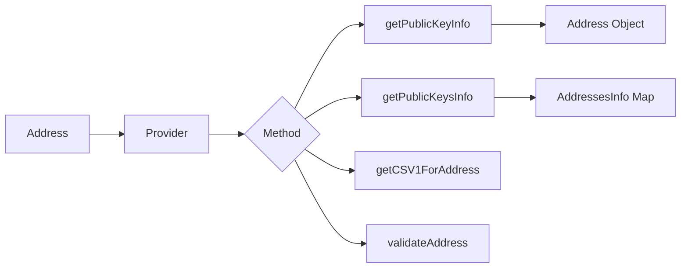

# Public Key Operations

This guide covers public key lookups and address operations on OPNet.

## Overview

OPNet provides methods to look up public key information for addresses, including unified address resolution across different Bitcoin address formats and ML-DSA quantum-resistant key support.



---

## Get Public Key Info (Single)

### Basic Query

```typescript
import { JSONRpcProvider } from 'opnet';
import { networks, Address } from '@btc-vision/bitcoin';

const network = networks.regtest;
const provider = new JSONRpcProvider({ url: 'https://regtest.opnet.org', network });

// Get public key info for an address
const address = await provider.getPublicKeyInfo(
    'bc1p...taproot-address...',
    false  // Not a contract
);

console.log('Address:', address.toHex());
console.log('P2TR:', address.p2tr(network));
```

### For Contract Addresses

```typescript
// For contract addresses, set isContract to true
const contractAddress = await provider.getPublicKeyInfo(
    'bc1p...contract-address...',
    true  // Is a contract
);

console.log('Contract public key:', contractAddress.toHex());
```

### Method Signature

```typescript
async getPublicKeyInfo(
    addressRaw: string | Address,  // Address to look up
    isContract: boolean            // Whether address is a contract
): Promise<Address>
```

---

## Get Public Keys Info (Multiple)

### Batch Query

```typescript
const addresses = [
    'bc1p...address1...',
    'bc1p...address2...',
    'bc1q...address3...',
];

const results = await provider.getPublicKeysInfo(
    addresses,
    false,  // Not contracts
    true    // Log errors
);

// Results is a map of input -> Address
for (const [input, address] of Object.entries(results)) {
    console.log(`${input} => ${address.toHex()}`);
}
```

### With Error Handling

```typescript
const results = await provider.getPublicKeysInfo(
    addresses,
    false,
    true  // Enable error logging
);

// Check for missing addresses
for (const addr of addresses) {
    if (!(addr in results)) {
        console.log(`Address not found: ${addr}`);
    }
}
```

### Method Signature

```typescript
async getPublicKeysInfo(
    addresses: string | string[] | Address | Address[],
    isContract: boolean = false,
    logErrors: boolean = false
): Promise<AddressesInfo>
```

---

## Get Raw Public Key Info

### Raw API Response

```typescript
const rawInfo = await provider.getPublicKeysInfoRaw([
    'bc1p...address...',
]);

// Raw info contains all address formats
for (const [key, info] of Object.entries(rawInfo)) {
    if ('error' in info) {
        console.log(`Error for ${key}: ${info.error}`);
        continue;
    }

    console.log(`Public Key Info for ${key}:`);
    console.log('  Original PubKey:', info.originalPubKey);
    console.log('  Tweaked PubKey:', info.tweakedPubkey);
    console.log('  P2TR:', info.p2tr);
    console.log('  P2OP:', info.p2op);
    console.log('  P2WPKH:', info.p2wpkh);
    console.log('  P2PKH:', info.p2pkh);

    // ML-DSA info (quantum-resistant)
    if (info.mldsaHashedPublicKey) {
        console.log('  ML-DSA Level:', info.mldsaLevel);
        console.log('  ML-DSA Hashed PK:', info.mldsaHashedPublicKey);
    }
}
```

### Method Signature

```typescript
async getPublicKeysInfoRaw(
    addresses: string | string[] | Address | Address[]
): Promise<IPublicKeyInfoResult>
```

---

## PublicKeyInfo Structure

```typescript
interface PublicKeyInfo {
    // Public keys
    originalPubKey?: string;     // Original (untweaked) public key
    tweakedPubkey?: string;      // Tweaked public key for Taproot

    // Address formats
    p2tr?: string;               // Pay-to-Taproot address
    p2op?: string;               // OPNet P2OP address
    p2pkh?: string;              // Pay-to-Public-Key-Hash (legacy)
    p2pkhUncompressed?: string;  // P2PKH with uncompressed key
    p2pkhHybrid?: string;        // P2PKH with hybrid key
    p2shp2wpkh?: string;         // P2SH-wrapped P2WPKH
    p2wpkh?: string;             // Pay-to-Witness-Public-Key-Hash

    // Internal
    lowByte?: number;            // Low byte of public key

    // ML-DSA (quantum-resistant)
    mldsaHashedPublicKey?: string;     // Hashed ML-DSA public key
    mldsaLevel?: MLDSASecurityLevel;   // ML-DSA security level
    mldsaPublicKey?: string | null;    // Full ML-DSA public key
}
```

---

## CSV1 Address Lookup

### Get CSV1 Address

```typescript
import { Address, toHex } from '@btc-vision/bitcoin';

const address = Address.fromString('bc1p...taproot-address...');
const csv1Address = provider.getCSV1ForAddress(address);

console.log('CSV1 Address:', csv1Address.address);
console.log('Redeem Script:', csv1Address.redeemScript ? toHex(csv1Address.redeemScript) : undefined);
```

### Method Signature

```typescript
getCSV1ForAddress(address: Address): IP2WSHAddress
```

---

## Address Validation

### Validate Address Format

```typescript
const addressType = provider.validateAddress(
    'bc1p...address...',
    network
);

if (addressType === null) {
    console.log('Invalid address');
} else {
    console.log('Address type:', addressType);
}
```

### Address Types

```typescript
enum AddressTypes {
    P2PKH = 'P2PKH',                             // Legacy address (1...)
    P2OP = 'P2OP',                               // OPNet contract address
    P2SH_OR_P2SH_P2WPKH = 'P2SH_OR_P2SH-P2WPKH', // Script hash (3...)
    P2PK = 'P2PK',                               // Public key
    P2TR = 'P2TR',                               // Taproot (bc1p...)
    P2MR = 'P2MR',                               // Pay-to-Merkle-Root / BIP 360 (bc1z...)
    P2WPKH = 'P2WPKH',                           // Native SegWit (bc1q...)
    P2WSH = 'P2WSH',                             // SegWit script hash
    // P2WDA = 'P2WDA',                          // UNUSED - internal only
}
```

### Method Signature

```typescript
validateAddress(
    addr: string | Address,
    network: Network
): AddressTypes | null
```

---

## Working with Addresses

### Convert Between Formats

```typescript
async function getAddressFormats(
    provider: JSONRpcProvider,
    address: string
): Promise<{
    p2tr?: string;
    p2op?: string;
    p2wpkh?: string;
    p2pkh?: string;
}> {
    const raw = await provider.getPublicKeysInfoRaw([address]);
    const info = raw[address];

    if ('error' in info) {
        throw new Error(`Address not found: ${info.error}`);
    }

    return {
        p2tr: info.p2tr,
        p2op: info.p2op,
        p2wpkh: info.p2wpkh,
        p2pkh: info.p2pkh,
    };
}

// Usage
const formats = await getAddressFormats(provider, taprootAddress);
console.log('P2TR:', formats.p2tr);
console.log('P2OP:', formats.p2op);
```

### Check ML-DSA Support

```typescript
async function hasMLDSAKey(
    provider: JSONRpcProvider,
    address: string
): Promise<boolean> {
    const raw = await provider.getPublicKeysInfoRaw([address]);
    const info = raw[address];

    if ('error' in info) {
        return false;
    }

    return info.mldsaHashedPublicKey !== undefined;
}

// Usage
const hasQuantumKey = await hasMLDSAKey(provider, address);
console.log('Has ML-DSA key:', hasQuantumKey);
```

---

## Batch Operations

### Resolve Multiple Addresses

```typescript
async function resolveAddresses(
    provider: JSONRpcProvider,
    addresses: string[]
): Promise<Map<string, string | null>> {
    const results = new Map<string, string | null>();

    const info = await provider.getPublicKeysInfo(addresses, false, false);

    for (const addr of addresses) {
        if (addr in info) {
            results.set(addr, info[addr].toHex());
        } else {
            results.set(addr, null);
        }
    }

    return results;
}

// Usage
const resolved = await resolveAddresses(provider, [
    'bc1p...addr1...',
    'bc1q...addr2...',
    '1BvBM...addr3...',
]);

for (const [addr, pubkey] of resolved) {
    console.log(`${addr}: ${pubkey ?? 'NOT FOUND'}`);
}
```

### Filter by Address Type

```typescript
function filterAddressesByType(
    provider: JSONRpcProvider,
    addresses: string[],
    targetType: AddressTypes
): string[] {
    return addresses.filter(addr => {
        const type = provider.validateAddress(addr, provider.network);
        return type === targetType;
    });
}

// Usage
const taprootOnly = filterAddressesByType(
    provider,
    allAddresses,
    AddressTypes.P2TR
);
console.log('Taproot addresses:', taprootOnly.length);
```

---

## Complete Public Key Service

```typescript
class PublicKeyService {
    constructor(
        private provider: JSONRpcProvider,
        private network: Network
    ) {}

    async getInfo(address: string, isContract: boolean = false): Promise<Address> {
        return this.provider.getPublicKeyInfo(address, isContract);
    }

    async getBatchInfo(
        addresses: string[],
        isContract: boolean = false
    ): Promise<AddressesInfo> {
        return this.provider.getPublicKeysInfo(addresses, isContract, true);
    }

    async getRawInfo(address: string): Promise<PublicKeyInfo | null> {
        const result = await this.provider.getPublicKeysInfoRaw([address]);
        const info = result[address];

        if ('error' in info) {
            return null;
        }

        return info;
    }

    async getAllFormats(address: string): Promise<Record<string, string>> {
        const info = await this.getRawInfo(address);

        if (!info) {
            throw new Error('Address not found');
        }

        const formats: Record<string, string> = {};

        if (info.p2tr) formats.p2tr = info.p2tr;
        if (info.p2op) formats.p2op = info.p2op;
        if (info.p2wpkh) formats.p2wpkh = info.p2wpkh;
        if (info.p2pkh) formats.p2pkh = info.p2pkh;
        if (info.p2shp2wpkh) formats.p2shp2wpkh = info.p2shp2wpkh;

        return formats;
    }

    validate(address: string): AddressTypes | null {
        return this.provider.validateAddress(address, this.network);
    }

    isValid(address: string): boolean {
        return this.validate(address) !== null;
    }

    getCSV1(address: Address): IP2WSHAddress {
        return this.provider.getCSV1ForAddress(address);
    }

    async hasQuantumKey(address: string): Promise<boolean> {
        const info = await this.getRawInfo(address);
        return info?.mldsaHashedPublicKey !== undefined;
    }
}

// Usage
const pkService = new PublicKeyService(provider, network);

// Validate address
if (pkService.isValid(address)) {
    console.log('Valid address');
}

// Get all formats
const formats = await pkService.getAllFormats(address);
console.log('Address formats:', formats);

// Check quantum key
const hasQuantum = await pkService.hasQuantumKey(address);
console.log('Has ML-DSA key:', hasQuantum);
```

---

## Best Practices

1. **Validate First**: Always validate addresses before lookups

2. **Batch Requests**: Use `getPublicKeysInfo` for multiple addresses

3. **Handle Missing**: Not all addresses may have public key info

4. **Cache Results**: Public key info doesn't change, safe to cache

5. **Contract Flag**: Set `isContract: true` for contract addresses

6. **Enable Logging**: Use `logErrors: true` during development

---

## Next Steps

- [Bitcoin Utils](../utils/bitcoin-utils.md) - Utility functions
- [Revert Decoder](../utils/revert-decoder.md) - Error decoding
- [ABI Overview](../abi-reference/abi-overview.md) - ABI system

---

[← Previous: Broadcasting](../transactions/broadcasting.md) | [Next: Bitcoin Utils →](../utils/bitcoin-utils.md)
