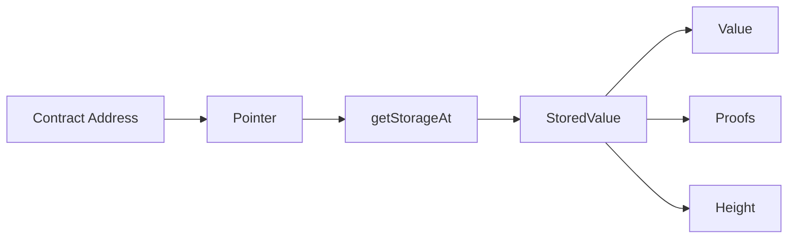

# Storage Operations

This guide covers reading contract storage directly on OPNet.

## Overview

Contract storage can be read directly using pointers, allowing low-level access to contract state without calling functions. This is useful for debugging, verification, and advanced integrations.



---

## Reading Storage

### Basic Storage Query

```typescript
import { JSONRpcProvider } from 'opnet';
import { networks, toHex } from '@btc-vision/bitcoin';

const network = networks.regtest;
const provider = new JSONRpcProvider({ url: 'https://regtest.opnet.org', network });

const contractAddress = 'bc1p...contract-address...';
const pointer = 123456789n; // Storage slot as bigint

const storage = await provider.getStorageAt(contractAddress, pointer);

console.log('Storage Value:');
console.log('  Pointer:', storage.pointer);
console.log('  Value:', toHex(storage.value));
console.log('  Height:', storage.height);
```

### With String Pointer (Base64)

```typescript
// Pointer can be provided as base64 string
const base64Pointer = 'EXLK/QhEQMI5d9DrthLvozT+UcDQ7WuSPaz7g8GV3AQ=';

const storage = await provider.getStorageAt(
    contractAddress,
    base64Pointer
);

console.log('Value:', toHex(storage.value));
```

### With Proofs

```typescript
// Request proofs for verification (default: true)
const storage = await provider.getStorageAt(
    contractAddress,
    pointer,
    true  // Include proofs
);

console.log('Proofs:', storage.proofs.length);
for (const proof of storage.proofs) {
    console.log('  Proof:', proof);
}
```

### Without Proofs

```typescript
// Skip proofs for faster response
const storage = await provider.getStorageAt(
    contractAddress,
    pointer,
    false  // No proofs
);

console.log('Value:', toHex(storage.value));
// storage.proofs will be empty
```

### At Specific Height

```typescript
// Read historical storage at specific block height
const historicalStorage = await provider.getStorageAt(
    contractAddress,
    pointer,
    true,     // Include proofs
    100000n   // Block height
);

console.log('Value at block 100000:', toHex(historicalStorage.value));
console.log('Confirmed at height:', historicalStorage.height);
```

### Method Signature

```typescript
async getStorageAt(
    address: string | Address,     // Contract address
    rawPointer: bigint | string,   // Storage pointer (bigint or base64)
    proofs?: boolean,              // Include proofs (default: true)
    height?: BigNumberish          // Optional block height
): Promise<StoredValue>
```

---

## StoredValue Class

```typescript
interface StoredValue {
    pointer: bigint;       // Storage slot pointer
    value: Uint8Array;     // Stored value as Uint8Array
    height: bigint;        // Block height of the value
    proofs: string[];      // Merkle proofs for verification
}
```

---

## Working with Storage

### Decode Stored Value

```typescript
function decodeUint256(value: Uint8Array): bigint {
    // Stored values are typically 32 bytes
    if (value.length === 0) return 0n;

    // Read as big-endian unsigned integer
    let result = 0n;
    for (const byte of value) {
        result = (result << 8n) | BigInt(byte);
    }
    return result;
}

// Usage
const storage = await provider.getStorageAt(contractAddress, pointer);
const balance = decodeUint256(storage.value);
console.log('Balance:', balance);
```

### Decode Address from Storage

```typescript
import { Address } from '@btc-vision/bitcoin';

function decodeAddress(value: Uint8Array): Address | null {
    if (value.length < 20) return null;

    // Extract address bytes
    const addressBytes = value.slice(-20);
    return Address.fromBuffer(addressBytes);
}

// Usage
const storage = await provider.getStorageAt(contractAddress, ownerSlot);
const owner = decodeAddress(storage.value);
console.log('Owner:', owner?.toHex());
```

### Read Mapping Value

```typescript
import { keccak256 } from 'ethers';
import { fromHex } from '@btc-vision/bitcoin';

function getMapPointer(mapSlot: bigint, key: Uint8Array): bigint {
    // Standard mapping pointer calculation
    const slotBuffer = new Uint8Array(32);
    new DataView(slotBuffer.buffer).setBigUint64(24, mapSlot);

    const data = new Uint8Array([...key, ...slotBuffer]);
    const hash = keccak256(data);

    return BigInt(hash);
}

// Usage: Read balances[address]
const balancesSlot = 0n; // Storage slot of balances mapping
const userKey = fromHex(userAddress.slice(2));
const pointer = getMapPointer(balancesSlot, userKey);

const storage = await provider.getStorageAt(contractAddress, pointer);
console.log('User balance:', decodeUint256(storage.value));
```

---

## Storage Verification

### Verify Storage Proof

```typescript
async function verifyStorageWithProof(
    provider: JSONRpcProvider,
    contractAddress: string,
    pointer: bigint,
    expectedValue: Uint8Array
): Promise<boolean> {
    const storage = await provider.getStorageAt(
        contractAddress,
        pointer,
        true  // Request proofs
    );

    // Compare value
    if (storage.value.length !== expectedValue.length ||
        !storage.value.every((b, i) => b === expectedValue[i])) {
        return false;
    }

    // Verify proofs exist
    if (storage.proofs.length === 0) {
        console.warn('No proofs provided');
        return false;
    }

    // Additional proof verification would go here
    // (depends on specific proof format)

    return true;
}

// Usage
const verified = await verifyStorageWithProof(
    provider,
    contractAddress,
    pointer,
    expectedBytes
);
console.log('Storage verified:', verified);
```

### Compare Storage Values

```typescript
async function hasStorageChanged(
    provider: JSONRpcProvider,
    contractAddress: string,
    pointer: bigint,
    fromHeight: bigint,
    toHeight: bigint
): Promise<boolean> {
    const [oldStorage, newStorage] = await Promise.all([
        provider.getStorageAt(contractAddress, pointer, false, fromHeight),
        provider.getStorageAt(contractAddress, pointer, false, toHeight),
    ]);

    return oldStorage.value.length !== newStorage.value.length ||
        !oldStorage.value.every((b, i) => b === newStorage.value[i]);
}

// Usage
const changed = await hasStorageChanged(
    provider,
    contractAddress,
    pointer,
    100000n,
    100100n
);
console.log('Storage changed:', changed);
```

---

## Batch Storage Reads

### Read Multiple Storage Slots

```typescript
async function getMultipleStorage(
    provider: JSONRpcProvider,
    contractAddress: string,
    pointers: bigint[]
): Promise<Map<bigint, Uint8Array>> {
    const results = new Map<bigint, Uint8Array>();

    // Read in parallel
    const promises = pointers.map(pointer =>
        provider.getStorageAt(contractAddress, pointer, false)
    );

    const storageValues = await Promise.all(promises);

    for (let i = 0; i < pointers.length; i++) {
        results.set(pointers[i], storageValues[i].value);
    }

    return results;
}

// Usage
const pointers = [0n, 1n, 2n, 3n]; // Multiple storage slots
const values = await getMultipleStorage(provider, contractAddress, pointers);

for (const [pointer, value] of values) {
    console.log(`Slot ${pointer}: ${toHex(value)}`);
}
```

### Read Storage Range

```typescript
async function getStorageRange(
    provider: JSONRpcProvider,
    contractAddress: string,
    startPointer: bigint,
    count: number
): Promise<StoredValue[]> {
    const pointers = Array.from(
        { length: count },
        (_, i) => startPointer + BigInt(i)
    );

    const promises = pointers.map(pointer =>
        provider.getStorageAt(contractAddress, pointer, false)
    );

    return Promise.all(promises);
}

// Usage
const storageRange = await getStorageRange(provider, contractAddress, 0n, 10);
console.log('First 10 storage slots:');
for (const storage of storageRange) {
    console.log(`  ${storage.pointer}: ${toHex(storage.value)}`);
}
```

---

## Historical Storage

### Track Storage Over Time

```typescript
async function getStorageHistory(
    provider: JSONRpcProvider,
    contractAddress: string,
    pointer: bigint,
    heights: bigint[]
): Promise<Array<{ height: bigint; value: Uint8Array }>> {
    const history: Array<{ height: bigint; value: Uint8Array }> = [];

    for (const height of heights) {
        try {
            const storage = await provider.getStorageAt(
                contractAddress,
                pointer,
                false,
                height
            );

            history.push({
                height,
                value: storage.value,
            });
        } catch {
            // Storage may not exist at all heights
            history.push({
                height,
                value: new Uint8Array(0),
            });
        }
    }

    return history;
}

// Usage
const heights = [100000n, 100050n, 100100n, 100150n, 100200n];
const history = await getStorageHistory(provider, contractAddress, pointer, heights);

console.log('Storage history:');
for (const entry of history) {
    console.log(`  Height ${entry.height}: ${toHex(entry.value) || '(empty)'}`);
}
```

---

## Complete Storage Service

```typescript
class StorageService {
    constructor(private provider: JSONRpcProvider) {}

    async get(
        contract: string,
        pointer: bigint,
        options?: { proofs?: boolean; height?: bigint }
    ): Promise<StoredValue> {
        return this.provider.getStorageAt(
            contract,
            pointer,
            options?.proofs ?? false,
            options?.height
        );
    }

    async getValue(contract: string, pointer: bigint): Promise<Uint8Array> {
        const storage = await this.get(contract, pointer);
        return storage.value;
    }

    async getUint256(contract: string, pointer: bigint): Promise<bigint> {
        const value = await this.getValue(contract, pointer);
        return this.decodeUint256(value);
    }

    async getMultiple(
        contract: string,
        pointers: bigint[]
    ): Promise<Map<bigint, Uint8Array>> {
        const results = new Map<bigint, Uint8Array>();

        const storageValues = await Promise.all(
            pointers.map(p => this.get(contract, p))
        );

        for (let i = 0; i < pointers.length; i++) {
            results.set(pointers[i], storageValues[i].value);
        }

        return results;
    }

    async hasValue(contract: string, pointer: bigint): Promise<boolean> {
        const value = await this.getValue(contract, pointer);
        return value.length > 0 && !value.every(b => b === 0);
    }

    async compare(
        contract: string,
        pointer: bigint,
        height1: bigint,
        height2: bigint
    ): Promise<{
        changed: boolean;
        value1: Uint8Array;
        value2: Uint8Array;
    }> {
        const [s1, s2] = await Promise.all([
            this.get(contract, pointer, { height: height1 }),
            this.get(contract, pointer, { height: height2 }),
        ]);

        return {
            changed: s1.value.length !== s2.value.length ||
                !s1.value.every((b, i) => b === s2.value[i]),
            value1: s1.value,
            value2: s2.value,
        };
    }

    private decodeUint256(value: Uint8Array): bigint {
        if (value.length === 0) return 0n;

        let result = 0n;
        for (const byte of value) {
            result = (result << 8n) | BigInt(byte);
        }
        return result;
    }
}

// Usage
const storageService = new StorageService(provider);

// Read single value
const balance = await storageService.getUint256(contractAddress, balanceSlot);
console.log('Balance:', balance);

// Read multiple
const values = await storageService.getMultiple(contractAddress, [0n, 1n, 2n]);
for (const [slot, value] of values) {
    console.log(`Slot ${slot}:`, toHex(value));
}

// Compare historical values
const comparison = await storageService.compare(
    contractAddress,
    pointer,
    100000n,
    100500n
);
console.log('Value changed:', comparison.changed);
```

---

## Common Storage Patterns

### ERC-20 Style Storage Layout

```typescript
// Common storage slots for ERC-20-like contracts
const STORAGE_SLOTS = {
    NAME: 0n,           // string name
    SYMBOL: 1n,         // string symbol
    DECIMALS: 2n,       // uint8 decimals
    TOTAL_SUPPLY: 3n,   // uint256 totalSupply
    BALANCES: 4n,       // mapping(address => uint256)
    ALLOWANCES: 5n,     // mapping(address => mapping(address => uint256))
};

async function getTokenInfo(
    provider: JSONRpcProvider,
    tokenAddress: string
): Promise<{
    totalSupply: bigint;
    decimals: bigint;
}> {
    const storageService = new StorageService(provider);

    const [totalSupply, decimals] = await Promise.all([
        storageService.getUint256(tokenAddress, STORAGE_SLOTS.TOTAL_SUPPLY),
        storageService.getUint256(tokenAddress, STORAGE_SLOTS.DECIMALS),
    ]);

    return { totalSupply, decimals };
}
```

---

## Best Practices

1. **Use Pointers Correctly**: Ensure you're using the correct storage slot for the data you want

2. **Skip Proofs When Unnecessary**: Set `proofs: false` for faster queries when verification isn't needed

3. **Batch Requests**: Read multiple storage values in parallel

4. **Handle Empty Values**: Storage slots may be empty (zero-filled)

5. **Historical Queries**: Use the `height` parameter for point-in-time reads

6. **Cache Results**: Storage at specific heights doesn't change, safe to cache

---

## Next Steps

- [Contract Overview](../contracts/overview.md) - Contract interactions
- [Simulating Calls](../contracts/simulating-calls.md) - Contract simulations
- [Fetching Transactions](../transactions/fetching-transactions.md) - Transaction data

---

[← Previous: Submitting Epochs](../epochs/submitting-epochs.md) | [Next: Fetching Transactions →](../transactions/fetching-transactions.md)
