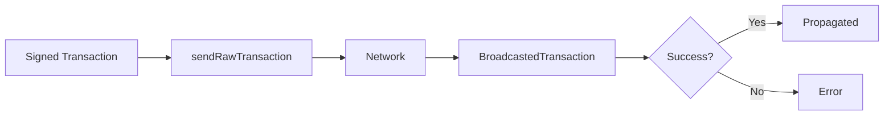

# Broadcasting Transactions

This guide covers broadcasting raw transactions on OPNet.

## Overview

After building and signing a transaction, it needs to be broadcast to the network. OPNet supports both single and batch transaction broadcasting.



---

## Send Single Transaction

### Basic Broadcasting

```typescript
import { JSONRpcProvider } from 'opnet';
import { networks } from '@btc-vision/bitcoin';

const network = networks.regtest;
const provider = new JSONRpcProvider({ url: 'https://regtest.opnet.org', network });

// Raw signed transaction as hex string
const rawTx = '02000000000101ad897689f66c98daae5fdc3606235c1ad7...';

// Broadcast the transaction
const result = await provider.sendRawTransaction(rawTx, false);

if (result.success) {
    console.log('Transaction broadcast successfully!');
    console.log('TxID:', result.result);
    console.log('Peers:', result.peers);
} else {
    console.log('Broadcast failed:', result.error);
}
```

### With PSBT Flag

```typescript
// For PSBT (Partially Signed Bitcoin Transactions)
const psbt = '70736274ff...'; // PSBT as hex

const result = await provider.sendRawTransaction(psbt, true);

if (result.success) {
    console.log('PSBT broadcast successful');
}
```

### Method Signature

```typescript
async sendRawTransaction(
    tx: string,        // Raw transaction as hex string
    psbt: boolean      // Whether the transaction is a PSBT
): Promise<BroadcastedTransaction>
```

---

## BroadcastedTransaction Result

```typescript
interface BroadcastedTransaction {
    success: boolean;     // Whether broadcast succeeded
    result?: string;      // Transaction ID if successful
    error?: string;       // Error message if failed
    peers?: number;       // Number of peers that received the transaction
}
```

---

## Send Multiple Transactions

### Batch Broadcasting

```typescript
const rawTransactions = [
    '02000000000101...',  // Transaction 1
    '02000000000101...',  // Transaction 2
    '02000000000101...',  // Transaction 3
];

const results = await provider.sendRawTransactions(rawTransactions);

for (let i = 0; i < results.length; i++) {
    const result = results[i];
    if (result.success) {
        console.log(`TX ${i + 1} success: ${result.result}`);
    } else {
        console.log(`TX ${i + 1} failed: ${result.error}`);
    }
}
```

### Method Signature

```typescript
async sendRawTransactions(
    txs: string[]  // Array of raw transactions as hex strings
): Promise<BroadcastedTransaction[]>
```

---

## Error Handling

### Handle Broadcast Errors

```typescript
async function broadcastWithRetry(
    provider: JSONRpcProvider,
    rawTx: string,
    maxRetries: number = 3
): Promise<BroadcastedTransaction> {
    let lastError: string | undefined;

    for (let attempt = 1; attempt <= maxRetries; attempt++) {
        try {
            const result = await provider.sendRawTransaction(rawTx, false);

            if (result.success) {
                return result;
            }

            lastError = result.error;
            console.log(`Attempt ${attempt} failed: ${result.error}`);

            // Don't retry on certain errors
            if (
                result.error?.includes('already in block chain') ||
                result.error?.includes('already exists')
            ) {
                return result;
            }

        } catch (error: unknown) {
            const errorMessage = error instanceof Error ? error.message : String(error);
            lastError = errorMessage;
            console.log(`Attempt ${attempt} error: ${errorMessage}`);
        }

        // Wait before retry
        if (attempt < maxRetries) {
            await new Promise(r => setTimeout(r, 2000 * attempt));
        }
    }

    return {
        success: false,
        error: lastError || 'Max retries exceeded',
    };
}

// Usage
const result = await broadcastWithRetry(provider, rawTx);
if (result.success) {
    console.log('Broadcast successful after retries');
}
```

### Common Broadcast Errors

```typescript
function handleBroadcastError(error: string | undefined): string {
    if (!error) return 'Unknown error';

    if (error.includes('already in block chain')) {
        return 'Transaction already confirmed';
    }

    if (error.includes('already exists') || error.includes('txn-mempool-conflict')) {
        return 'Transaction already in mempool';
    }

    if (error.includes('insufficient fee') || error.includes('min relay fee not met')) {
        return 'Fee too low';
    }

    if (error.includes('bad-txns-inputs-spent')) {
        return 'Double spend detected';
    }

    if (error.includes('non-final')) {
        return 'Transaction is not final (locktime)';
    }

    if (error.includes('dust')) {
        return 'Output too small (dust)';
    }

    return error;
}

// Usage
const result = await provider.sendRawTransaction(rawTx, false);
if (!result.success) {
    const friendlyError = handleBroadcastError(result.error);
    console.log('Broadcast failed:', friendlyError);
}
```

---

## Broadcast Verification

### Verify Transaction Propagation

```typescript
async function verifyBroadcast(
    provider: JSONRpcProvider,
    txHash: string,
    timeoutMs: number = 30000
): Promise<boolean> {
    const startTime = Date.now();

    while (Date.now() - startTime < timeoutMs) {
        try {
            const tx = await provider.getTransaction(txHash);
            if (tx) {
                return true;
            }
        } catch {
            // Transaction not found yet
        }

        await new Promise(r => setTimeout(r, 2000));
    }

    return false;
}

// Usage
const result = await provider.sendRawTransaction(rawTx, false);

if (result.success && result.result) {
    const verified = await verifyBroadcast(provider, result.result);
    console.log('Transaction verified:', verified);
}
```

### Wait for Confirmation

```typescript
async function broadcastAndConfirm(
    provider: JSONRpcProvider,
    rawTx: string,
    confirmations: number = 1,
    timeoutMs: number = 600000
): Promise<{
    txHash: string;
    confirmations: number;
    blockNumber?: bigint;
}> {
    // Broadcast
    const broadcastResult = await provider.sendRawTransaction(rawTx, false);

    if (!broadcastResult.success || !broadcastResult.result) {
        throw new Error(`Broadcast failed: ${broadcastResult.error}`);
    }

    const txHash = broadcastResult.result;
    const startTime = Date.now();

    // Wait for confirmations
    while (Date.now() - startTime < timeoutMs) {
        try {
            const tx = await provider.getTransaction(txHash);

            if (tx.blockNumber !== undefined) {
                const currentBlock = await provider.getBlockNumber();
                const confs = Number(currentBlock - tx.blockNumber) + 1;

                if (confs >= confirmations) {
                    return {
                        txHash,
                        confirmations: confs,
                        blockNumber: tx.blockNumber,
                    };
                }
            }
        } catch {
            // Transaction not found yet
        }

        await new Promise(r => setTimeout(r, 10000));
    }

    throw new Error('Timeout waiting for confirmation');
}

// Usage
try {
    const confirmed = await broadcastAndConfirm(provider, rawTx, 1);
    console.log('Confirmed in block:', confirmed.blockNumber);
} catch (error) {
    console.error('Failed to confirm:', error);
}
```

---

## Batch Broadcasting Strategies

### Sequential Broadcasting

```typescript
async function broadcastSequentially(
    provider: JSONRpcProvider,
    transactions: string[]
): Promise<BroadcastedTransaction[]> {
    const results: BroadcastedTransaction[] = [];

    for (const tx of transactions) {
        const result = await provider.sendRawTransaction(tx, false);
        results.push(result);

        // Small delay between broadcasts
        await new Promise(r => setTimeout(r, 100));
    }

    return results;
}
```

### Parallel Broadcasting

```typescript
async function broadcastParallel(
    provider: JSONRpcProvider,
    transactions: string[],
    batchSize: number = 10
): Promise<BroadcastedTransaction[]> {
    const results: BroadcastedTransaction[] = [];

    // Process in batches
    for (let i = 0; i < transactions.length; i += batchSize) {
        const batch = transactions.slice(i, i + batchSize);
        const batchResults = await provider.sendRawTransactions(batch);
        results.push(...batchResults);
    }

    return results;
}

// Usage
const results = await broadcastParallel(provider, transactions, 5);
const successful = results.filter(r => r.success).length;
console.log(`Broadcast ${successful}/${transactions.length} successfully`);
```

---

## Complete Broadcast Service

```typescript
class BroadcastService {
    constructor(private provider: JSONRpcProvider) {}

    async broadcast(
        rawTx: string,
        isPsbt: boolean = false
    ): Promise<BroadcastedTransaction> {
        return this.provider.sendRawTransaction(rawTx, isPsbt);
    }

    async broadcastBatch(
        transactions: string[]
    ): Promise<BroadcastedTransaction[]> {
        return this.provider.sendRawTransactions(transactions);
    }

    async broadcastWithRetry(
        rawTx: string,
        maxRetries: number = 3
    ): Promise<BroadcastedTransaction> {
        for (let attempt = 1; attempt <= maxRetries; attempt++) {
            const result = await this.broadcast(rawTx);

            if (result.success) {
                return result;
            }

            // Don't retry on permanent failures
            if (this.isPermanentFailure(result.error)) {
                return result;
            }

            if (attempt < maxRetries) {
                await new Promise(r => setTimeout(r, 2000 * attempt));
            }
        }

        return { success: false, error: 'Max retries exceeded' };
    }

    async broadcastAndWait(
        rawTx: string,
        timeoutMs: number = 60000
    ): Promise<{
        broadcast: BroadcastedTransaction;
        confirmed: boolean;
    }> {
        const broadcast = await this.broadcast(rawTx);

        if (!broadcast.success || !broadcast.result) {
            return { broadcast, confirmed: false };
        }

        const confirmed = await this.waitForTransaction(
            broadcast.result,
            timeoutMs
        );

        return { broadcast, confirmed };
    }

    async waitForTransaction(
        txHash: string,
        timeoutMs: number = 60000
    ): Promise<boolean> {
        const startTime = Date.now();

        while (Date.now() - startTime < timeoutMs) {
            try {
                const tx = await this.provider.getTransaction(txHash);
                if (tx) return true;
            } catch {
                // Not found yet
            }

            await new Promise(r => setTimeout(r, 3000));
        }

        return false;
    }

    private isPermanentFailure(error: string | undefined): boolean {
        if (!error) return false;

        const permanentErrors = [
            'already in block chain',
            'already exists',
            'bad-txns-inputs-spent',
            'invalid',
        ];

        return permanentErrors.some(e => error.includes(e));
    }
}

// Usage
const broadcastService = new BroadcastService(provider);

// Simple broadcast
const result = await broadcastService.broadcast(rawTx);
console.log('Success:', result.success);

// Broadcast with retry
const retryResult = await broadcastService.broadcastWithRetry(rawTx);
console.log('Success with retry:', retryResult.success);

// Broadcast and wait
const { broadcast, confirmed } = await broadcastService.broadcastAndWait(rawTx);
console.log('Broadcast:', broadcast.success, 'Confirmed:', confirmed);
```

---

## Best Practices

1. **Validate Before Broadcast**: Ensure transactions are properly signed

2. **Handle Errors Gracefully**: Different errors require different handling

3. **Retry on Network Errors**: Network issues are often temporary

4. **Batch Wisely**: Don't broadcast too many transactions at once

5. **Verify Propagation**: Confirm transactions are visible on the network

6. **Track Peer Count**: More peers means better propagation

---

## Next Steps

- [Fetching Transactions](./fetching-transactions.md) - Transaction data
- [Transaction Receipts](./transaction-receipts.md) - Receipt handling
- [Challenges](./challenges.md) - PoW challenges

---

[← Previous: Challenges](./challenges.md) | [Next: Public Key Operations →](../public-keys/public-key-operations.md)
