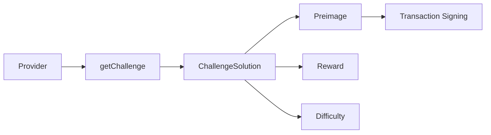

# PoW Challenges

This guide covers proof-of-work challenges required for transaction signing on OPNet.

## Overview

OPNet transactions require a proof-of-work (PoW) challenge to be included when signing. The challenge provides additional security and spam protection.



---

## Get Current Challenge

### Basic Query

```typescript
import { JSONRpcProvider } from 'opnet';
import { networks, toHex } from '@btc-vision/bitcoin';

const network = networks.regtest;
const provider = new JSONRpcProvider({ url: 'https://regtest.opnet.org', network });

const challenge = await provider.getChallenge();

console.log('Challenge:');
console.log('  Preimage:', toHex(challenge.preimage));
console.log('  Reward:', challenge.reward);
console.log('  Difficulty:', challenge.difficulty);
console.log('  Version:', challenge.version);
```

### Method Signature

```typescript
async getChallenge(): Promise<ChallengeSolution>
```

---

## ChallengeSolution Structure

```typescript
interface ChallengeSolution {
    preimage: Uint8Array;   // Challenge preimage data
    reward: bigint;         // Reward for solving
    difficulty?: bigint;    // Current difficulty
    version?: number;       // Challenge version
}
```

---

## ProofOfWorkChallenge in Transactions

When a transaction is processed, it may include PoW challenge data:

```typescript
interface ProofOfWorkChallenge {
    preimage: Uint8Array;   // Challenge preimage
    reward: bigint;         // Reward amount
    difficulty?: bigint;    // Difficulty level
    version?: number;       // Version number
}
```

### Access PoW from Transaction

```typescript
const tx = await provider.getTransaction(txHash);

if (tx.pow) {
    console.log('Transaction PoW:');
    console.log('  Preimage:', toHex(tx.pow.preimage));
    console.log('  Reward:', tx.pow.reward);
    console.log('  Difficulty:', tx.pow.difficulty);
}
```

---

## Using Challenges in Transactions

### Include Challenge in Transaction

```typescript
import { getContract } from 'opnet';
import { Wallet } from '@btc-vision/transaction';

// Get the current challenge
const challenge = await provider.getChallenge();

// Set up contract
const contract = getContract<IOP20Contract>(
    tokenAddress,
    OP_20_ABI,
    provider,
    network
);

// The challenge is automatically fetched when sending transactions
const simulation = await contract.transfer(recipientAddress, amount, new Uint8Array(0));

if (simulation.revert) {
    throw new Error(`Transfer would fail: ${simulation.revert}`);
}

const result = await simulation.sendTransaction({
    signer: wallet.keypair,
    mldsaSigner: wallet.mldsaKeypair,
    refundTo: wallet.p2tr,
    feeRate: 10,
    network: network,
    maximumAllowedSatToSpend: 10000n,
});
```

### Manual Challenge Management

```typescript
class ChallengeManager {
    private provider: JSONRpcProvider;
    private cachedChallenge: ChallengeSolution | null = null;
    private cacheTime: number = 0;
    private cacheDuration: number = 30000; // 30 seconds

    constructor(provider: JSONRpcProvider) {
        this.provider = provider;
    }

    async getChallenge(): Promise<ChallengeSolution> {
        // Use cached challenge if still valid
        if (this.cachedChallenge && Date.now() - this.cacheTime < this.cacheDuration) {
            return this.cachedChallenge;
        }

        // Fetch new challenge
        this.cachedChallenge = await this.provider.getChallenge();
        this.cacheTime = Date.now();

        return this.cachedChallenge;
    }

    invalidateCache(): void {
        this.cachedChallenge = null;
    }
}

// Usage
const challengeManager = new ChallengeManager(provider);
const challenge = await challengeManager.getChallenge();
console.log('Challenge reward:', challenge.reward);
```

---

## Challenge Validation

### Verify Challenge Freshness

```typescript
async function isChallengeValid(
    provider: JSONRpcProvider,
    challenge: ChallengeSolution
): Promise<boolean> {
    // Get current challenge
    const currentChallenge = await provider.getChallenge();

    // Compare preimages
    return challenge.preimage.length === currentChallenge.preimage.length &&
        challenge.preimage.every((b, i) => b === currentChallenge.preimage[i]);
}

// Usage
const challenge = await provider.getChallenge();
// ... some time passes ...
const stillValid = await isChallengeValid(provider, challenge);
console.log('Challenge still valid:', stillValid);
```

### Handle Expired Challenges

```typescript
async function executeWithFreshChallenge<T>(
    provider: JSONRpcProvider,
    operation: (challenge: ChallengeSolution) => Promise<T>,
    maxRetries: number = 3
): Promise<T> {
    for (let attempt = 1; attempt <= maxRetries; attempt++) {
        try {
            const challenge = await provider.getChallenge();
            return await operation(challenge);
        } catch (error: unknown) {
            const errorMessage = error instanceof Error ? error.message : '';
            if (errorMessage.includes('challenge') && attempt < maxRetries) {
                console.log(`Challenge expired, retrying (${attempt}/${maxRetries})...`);
                continue;
            }
            throw error;
        }
    }

    throw new Error('Max retries exceeded');
}

// Usage
const result = await executeWithFreshChallenge(provider, async (challenge) => {
    // Use challenge in transaction
    const simulation = await contract.transfer(recipient, amount, new Uint8Array(0));
    return simulation;
});
```

---

## Difficulty Analysis

### Track Difficulty Over Time

```typescript
interface DifficultyRecord {
    timestamp: number;
    difficulty: bigint;
    reward: bigint;
}

class DifficultyTracker {
    private records: DifficultyRecord[] = [];

    async recordCurrent(provider: JSONRpcProvider): Promise<void> {
        const challenge = await provider.getChallenge();

        this.records.push({
            timestamp: Date.now(),
            difficulty: challenge.difficulty ?? 0n,
            reward: challenge.reward,
        });

        // Keep last 100 records
        if (this.records.length > 100) {
            this.records.shift();
        }
    }

    getAverageDifficulty(): bigint {
        if (this.records.length === 0) return 0n;

        const sum = this.records.reduce(
            (acc, record) => acc + record.difficulty,
            0n
        );

        return sum / BigInt(this.records.length);
    }

    getAverageReward(): bigint {
        if (this.records.length === 0) return 0n;

        const sum = this.records.reduce(
            (acc, record) => acc + record.reward,
            0n
        );

        return sum / BigInt(this.records.length);
    }

    getRecords(): DifficultyRecord[] {
        return [...this.records];
    }
}

// Usage
const tracker = new DifficultyTracker();

// Record periodically
await tracker.recordCurrent(provider);

console.log('Average difficulty:', tracker.getAverageDifficulty());
console.log('Average reward:', tracker.getAverageReward());
```

---

## Challenge Monitoring

### Monitor Challenge Changes

```typescript
async function monitorChallenges(
    provider: JSONRpcProvider,
    onNewChallenge: (challenge: ChallengeSolution) => void,
    intervalMs: number = 10000
): Promise<() => void> {
    let lastPreimage: string | null = null;

    const intervalId = setInterval(async () => {
        try {
            const challenge = await provider.getChallenge();
            const preimageHex = toHex(challenge.preimage);

            if (preimageHex !== lastPreimage) {
                lastPreimage = preimageHex;
                onNewChallenge(challenge);
            }
        } catch (error) {
            console.error('Error fetching challenge:', error);
        }
    }, intervalMs);

    return () => clearInterval(intervalId);
}

// Usage
const stopMonitoring = await monitorChallenges(provider, (challenge) => {
    console.log('New challenge detected!');
    console.log('  Reward:', challenge.reward);
    console.log('  Difficulty:', challenge.difficulty);
});

// Later: stop monitoring
// stopMonitoring();
```

---

## Complete Challenge Service

```typescript
class ChallengeService {
    private provider: JSONRpcProvider;
    private cache: { challenge: ChallengeSolution; expireAt: number } | null = null;
    private cacheDuration: number = 30000; // 30 seconds

    constructor(provider: JSONRpcProvider) {
        this.provider = provider;
    }

    async getChallenge(): Promise<ChallengeSolution> {
        if (this.cache && Date.now() < this.cache.expireAt) {
            return this.cache.challenge;
        }

        const challenge = await this.provider.getChallenge();

        this.cache = {
            challenge,
            expireAt: Date.now() + this.cacheDuration,
        };

        return challenge;
    }

    async getReward(): Promise<bigint> {
        const challenge = await this.getChallenge();
        return challenge.reward;
    }

    async getDifficulty(): Promise<bigint> {
        const challenge = await this.getChallenge();
        return challenge.difficulty ?? 0n;
    }

    async getPreimage(): Promise<Uint8Array> {
        const challenge = await this.getChallenge();
        return challenge.preimage;
    }

    async isExpired(): Promise<boolean> {
        if (!this.cache) return true;
        return Date.now() >= this.cache.expireAt;
    }

    invalidate(): void {
        this.cache = null;
    }

    setCacheDuration(ms: number): void {
        this.cacheDuration = ms;
    }
}

// Usage
const challengeService = new ChallengeService(provider);

// Get current challenge
const challenge = await challengeService.getChallenge();
console.log('Challenge reward:', challenge.reward);

// Get specific properties
const reward = await challengeService.getReward();
const difficulty = await challengeService.getDifficulty();

console.log('Reward:', reward);
console.log('Difficulty:', difficulty);

// Check expiration
if (await challengeService.isExpired()) {
    console.log('Challenge cache expired');
}
```

---

## Best Practices

1. **Cache Challenges**: Challenges can be cached for short periods

2. **Handle Expiration**: Always be ready to fetch a fresh challenge

3. **Monitor Difficulty**: Track difficulty for transaction planning

4. **Include in Transactions**: The library handles challenge inclusion automatically

5. **Error Handling**: Handle challenge-related errors gracefully

---

## Next Steps

- [Fetching Transactions](./fetching-transactions.md) - Transaction data
- [Transaction Receipts](./transaction-receipts.md) - Receipt handling
- [Broadcasting](./broadcasting.md) - Sending transactions

---

[← Previous: Transaction Receipts](./transaction-receipts.md) | [Next: Broadcasting →](./broadcasting.md)
