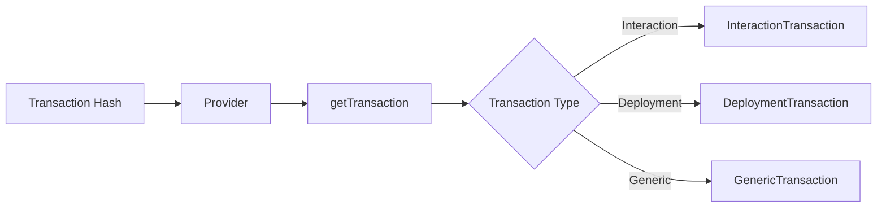

# Fetching Transactions

This guide covers fetching and working with transactions on OPNet.

## Overview

Transactions can be fetched by their hash or ID. Each transaction contains details about contract interactions, deployments, or generic operations.



---

## Get Transaction by Hash

### Basic Query

```typescript
import { JSONRpcProvider } from 'opnet';
import { networks } from '@btc-vision/bitcoin';

const network = networks.regtest;
const provider = new JSONRpcProvider({ url: 'https://regtest.opnet.org', network });

const txHash = '63e77ba9fa4262b3d4d0d9d97fa8a7359534606c3f3af096284662e3f619f374';
const transaction = await provider.getTransaction(txHash);

console.log('Transaction:');
console.log('  ID:', transaction.id);
console.log('  Hash:', transaction.hash);
console.log('  Type:', transaction.OPNetType);
console.log('  Block:', transaction.blockNumber);
```

### Method Signature

```typescript
async getTransaction(
    txHash: string  // Transaction hash or ID
): Promise<TransactionBase<OPNetTransactionTypes>>
```

---

## Transaction Types

OPNet has three transaction types:

```typescript
enum OPNetTransactionTypes {
    Generic = 0,       // Basic Bitcoin transaction
    Interaction = 1,   // Contract interaction
    Deployment = 2,    // Contract deployment
}
```

### Check Transaction Type

```typescript
import { OPNetTransactionTypes } from 'opnet';

const transaction = await provider.getTransaction(txHash);

switch (transaction.OPNetType) {
    case OPNetTransactionTypes.Interaction:
        console.log('Contract interaction');
        // Cast to InteractionTransaction for specific properties
        break;
    case OPNetTransactionTypes.Deployment:
        console.log('Contract deployment');
        // Cast to DeploymentTransaction for specific properties
        break;
    case OPNetTransactionTypes.Generic:
        console.log('Generic Bitcoin transaction');
        break;
}
```

---

## TransactionBase Properties

All transactions share these base properties:

```typescript
interface TransactionBase {
    // Identity
    id: string;              // Transaction ID
    hash: string;            // Transaction hash
    index: number;           // Index in block
    blockNumber?: bigint;    // Block number (if confirmed)

    // Fees & Gas
    burnedBitcoin: BigNumberish;   // Satoshis burned
    priorityFee: BigNumberish;     // Priority fee paid
    maxGasSat: BigNumberish;       // Maximum gas in satoshis
    gasUsed: bigint;         // Gas consumed
    specialGasUsed: bigint;  // Special gas consumed

    // Inputs/Outputs
    inputs: TransactionInput[];    // Transaction inputs
    outputs: TransactionOutput[];  // Transaction outputs

    // Type
    OPNetType: OPNetTransactionTypes;

    // Challenge (if applicable)
    pow?: ProofOfWorkChallenge;

    // Receipt data (inherited from TransactionReceipt)
    receipt?: Uint8Array;
    receiptProofs: string[];
    events: ContractEvents;
    revert?: string;
}
```

---

## InteractionTransaction

Contract interaction transactions have additional properties:

```typescript
interface InteractionTransaction extends TransactionBase {
    // Contract details
    calldata?: Uint8Array;       // Function calldata
    contractAddress?: string;    // Target contract
    contractPublicKey: Address;  // Contract's public key

    // Sender details
    from?: Address;              // Sender address (taproot)
    senderPubKeyHash: Uint8Array; // Sender's public key hash
    interactionPubKey: Uint8Array; // Interaction public key

    // Metadata
    contractSecret: Uint8Array;  // Contract secret
    wasCompressed: boolean;      // Was calldata compressed
}
```

### Working with Interaction Transactions

```typescript
import { OPNetTransactionTypes, InteractionTransaction } from 'opnet';

const tx = await provider.getTransaction(txHash);

if (tx.OPNetType === OPNetTransactionTypes.Interaction) {
    const interactionTx = tx as InteractionTransaction;

    console.log('Contract:', interactionTx.contractAddress);
    console.log('From:', interactionTx.from?.toHex());
    console.log('Calldata:', toHex(interactionTx.calldata ?? new Uint8Array(0)));
    console.log('Was compressed:', interactionTx.wasCompressed);
}
```

---

## DeploymentTransaction

Contract deployment transactions have specific properties:

```typescript
interface DeploymentTransaction extends TransactionBase {
    // Deployment details (optional - may be undefined if reverted)
    contractAddress?: string;          // Deployed contract address
    contractPublicKey?: Address;       // Contract's public key
    bytecode?: Uint8Array;             // Contract bytecode

    // Deployer details
    from?: Address;                    // Deployer address
    deployerPubKey?: Uint8Array;       // Deployer's public key
    deployerHashedPublicKey?: Uint8Array; // Deployer's hashed public key
    deployerAddress?: Address;         // Deployer address object

    // Contract seed info
    contractSeed?: Uint8Array;         // Contract seed
    contractSaltHash?: Uint8Array;     // Contract salt hash
    wasCompressed?: boolean;           // Was bytecode compressed
}
```

### Working with Deployment Transactions

```typescript
import { OPNetTransactionTypes, DeploymentTransaction } from 'opnet';

const tx = await provider.getTransaction(txHash);

if (tx.OPNetType === OPNetTransactionTypes.Deployment) {
    const deployTx = tx as DeploymentTransaction;

    console.log('Deployed contract:', deployTx.contractAddress);
    console.log('Deployer:', deployTx.from?.toHex());
    console.log('Bytecode size:', deployTx.bytecode?.length ?? 0, 'bytes');
}
```

---

## Transaction Inputs and Outputs

### TransactionInput

```typescript
interface TransactionInput {
    originalTransactionId: string | undefined;   // Source transaction ID
    outputTransactionIndex: number | undefined;  // Source output index
    scriptSignature: ScriptSig | undefined;      // Script signature
    sequenceId: number;                          // Sequence number
    transactionInWitness: string[];              // Witness data
}
```

### TransactionOutput

```typescript
interface TransactionOutput {
    value: bigint;                                  // Output value in satoshis
    scriptPubKey: ScriptPubKey;                     // Output script (object with hex, addresses, address)
    index: number;                                  // Output index
    script: Array<number | Uint8Array> | null;      // Decompiled script
}
```

### Analyze Transaction I/O

```typescript
const tx = await provider.getTransaction(txHash);

console.log('Inputs:', tx.inputs.length);
for (const input of tx.inputs) {
    console.log(`  ${input.originalTransactionId}:${input.outputTransactionIndex}`);
}

console.log('Outputs:', tx.outputs.length);
for (const output of tx.outputs) {
    console.log(`  Index ${output.index}: ${output.value} sats`);
}
```

---

## Working with Multiple Transactions

### Get Block Transactions

```typescript
async function getBlockTransactions(
    provider: JSONRpcProvider,
    blockNumber: bigint
): Promise<TransactionBase<OPNetTransactionTypes>[]> {
    const block = await provider.getBlock(blockNumber, true);
    return block.transactions;
}

// Usage
const transactions = await getBlockTransactions(provider, 100000n);
console.log('Transactions in block:', transactions.length);

for (const tx of transactions) {
    console.log(`${tx.hash}: ${tx.OPNetType}`);
}
```

### Filter by Type

```typescript
async function getInteractionTransactions(
    provider: JSONRpcProvider,
    blockNumber: bigint
): Promise<InteractionTransaction[]> {
    const transactions = await getBlockTransactions(provider, blockNumber);

    return transactions.filter(
        (tx): tx is InteractionTransaction =>
            tx.OPNetType === OPNetTransactionTypes.Interaction
    );
}

// Usage
const interactions = await getInteractionTransactions(provider, 100000n);
console.log('Interactions:', interactions.length);
```

---

## Transaction Analysis

### Calculate Gas Cost

```typescript
function analyzeGasCost(tx: TransactionBase<OPNetTransactionTypes>): {
    gasUsed: bigint;
    specialGasUsed: bigint;
    totalGas: bigint;
    burnedBitcoin: bigint;
} {
    return {
        gasUsed: tx.gasUsed,
        specialGasUsed: tx.specialGasUsed,
        totalGas: tx.gasUsed + tx.specialGasUsed,
        burnedBitcoin: tx.burnedBitcoin,
    };
}

// Usage
const tx = await provider.getTransaction(txHash);
const gasAnalysis = analyzeGasCost(tx);
console.log('Gas used:', gasAnalysis.gasUsed);
console.log('Total gas:', gasAnalysis.totalGas);
```

### Check Transaction Status

```typescript
async function getTransactionStatus(
    provider: JSONRpcProvider,
    txHash: string
): Promise<{
    confirmed: boolean;
    blockNumber?: bigint;
    reverted: boolean;
    revertReason?: string;
}> {
    try {
        const tx = await provider.getTransaction(txHash);

        return {
            confirmed: tx.blockNumber !== undefined,
            blockNumber: tx.blockNumber,
            reverted: tx.revert !== undefined,
            revertReason: tx.revert,
        };
    } catch {
        return {
            confirmed: false,
            reverted: false,
        };
    }
}

// Usage
const status = await getTransactionStatus(provider, txHash);
if (status.confirmed) {
    console.log('Confirmed in block:', status.blockNumber);
} else {
    console.log('Not yet confirmed');
}

if (status.reverted) {
    console.log('Transaction reverted:', status.revertReason);
}
```

---

## Complete Transaction Service

```typescript
class TransactionService {
    constructor(private provider: JSONRpcProvider) {}

    async get(txHash: string): Promise<TransactionBase<OPNetTransactionTypes>> {
        return this.provider.getTransaction(txHash);
    }

    async getInteraction(txHash: string): Promise<InteractionTransaction | null> {
        const tx = await this.get(txHash);
        if (tx.OPNetType === OPNetTransactionTypes.Interaction) {
            return tx as InteractionTransaction;
        }
        return null;
    }

    async getDeployment(txHash: string): Promise<DeploymentTransaction | null> {
        const tx = await this.get(txHash);
        if (tx.OPNetType === OPNetTransactionTypes.Deployment) {
            return tx as DeploymentTransaction;
        }
        return null;
    }

    async isConfirmed(txHash: string): Promise<boolean> {
        try {
            const tx = await this.get(txHash);
            return tx.blockNumber !== undefined;
        } catch {
            return false;
        }
    }

    async isReverted(txHash: string): Promise<boolean> {
        try {
            const tx = await this.get(txHash);
            return tx.revert !== undefined;
        } catch {
            return false;
        }
    }

    async getRevertReason(txHash: string): Promise<string | undefined> {
        const tx = await this.get(txHash);
        return tx.revert;
    }

    async waitForConfirmation(
        txHash: string,
        timeoutMs: number = 60000
    ): Promise<TransactionBase<OPNetTransactionTypes> | null> {
        const startTime = Date.now();

        while (Date.now() - startTime < timeoutMs) {
            try {
                const tx = await this.get(txHash);
                if (tx.blockNumber !== undefined) {
                    return tx;
                }
            } catch {
                // Transaction not found yet
            }

            await new Promise(r => setTimeout(r, 5000));
        }

        return null;
    }
}

// Usage
const txService = new TransactionService(provider);

// Get transaction
const tx = await txService.get(txHash);
console.log('Transaction type:', tx.OPNetType);

// Check if confirmed
const confirmed = await txService.isConfirmed(txHash);
console.log('Confirmed:', confirmed);

// Wait for confirmation
const confirmedTx = await txService.waitForConfirmation(txHash, 120000);
if (confirmedTx) {
    console.log('Confirmed in block:', confirmedTx.blockNumber);
}
```

---

## Best Practices

1. **Check Transaction Type**: Always verify the transaction type before casting

2. **Handle Not Found**: Transactions may not exist or be in mempool

3. **Check Revert Status**: Always check if transaction reverted

4. **Use Block Prefetch**: Set `prefetchTxs: true` when getting blocks with transactions

5. **Cache Confirmed Transactions**: Confirmed transactions don't change, safe to cache

---

## Next Steps

- [Transaction Receipts](./transaction-receipts.md) - Receipt handling
- [Challenges](./challenges.md) - PoW challenges
- [Broadcasting](./broadcasting.md) - Sending transactions

---

[← Previous: Storage Operations](../storage/storage-operations.md) | [Next: Transaction Receipts →](./transaction-receipts.md)
