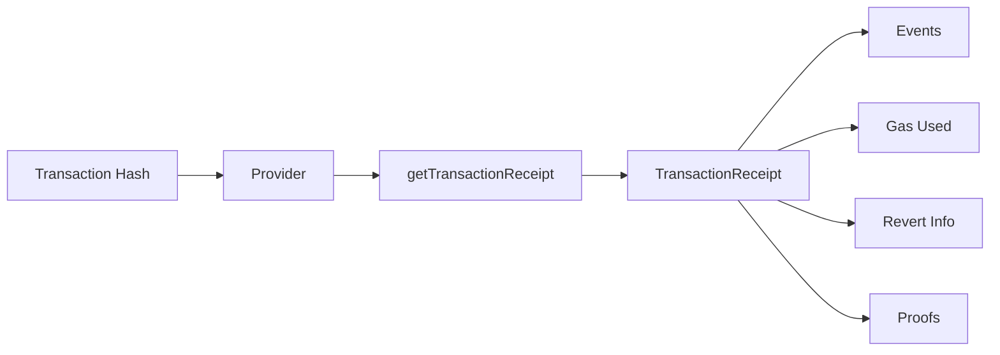

# Transaction Receipts

This guide covers fetching and working with transaction receipts on OPNet.

## Overview

Transaction receipts contain the execution results of transactions, including events emitted, gas consumed, and any revert information.



---

## Get Transaction Receipt

### Basic Query

```typescript
import { JSONRpcProvider } from 'opnet';
import { networks } from '@btc-vision/bitcoin';

const network = networks.regtest;
const provider = new JSONRpcProvider({ url: 'https://regtest.opnet.org', network });

const txHash = '63e77ba9fa4262b3d4d0d9d97fa8a7359534606c3f3af096284662e3f619f374';
const receipt = await provider.getTransactionReceipt(txHash);

console.log('Receipt:');
console.log('  Gas Used:', receipt.gasUsed);
console.log('  Special Gas:', receipt.specialGasUsed);
console.log('  Reverted:', receipt.revert !== undefined);
```

### Method Signature

```typescript
async getTransactionReceipt(
    txHash: string  // Transaction hash
): Promise<TransactionReceipt>
```

---

## TransactionReceipt Structure

```typescript
interface TransactionReceipt {
    // Execution result
    receipt?: Uint8Array;          // Raw receipt data
    receiptProofs: string[];       // Merkle proofs for receipt

    // Events
    events: ContractEvents;        // Parsed events by contract
    rawEvents: ContractEvents;     // Raw events before P2OP conversion

    // Revert information
    revert?: string;               // Decoded revert message
    rawRevert?: Uint8Array;        // Raw revert data

    // Gas metrics
    gasUsed: bigint;               // Gas consumed
    specialGasUsed: bigint;        // Special gas consumed
}
```

---

## Working with Events

### Access Contract Events

```typescript
const receipt = await provider.getTransactionReceipt(txHash);

// Events are grouped by contract address
for (const [contractAddress, events] of Object.entries(receipt.events)) {
    console.log('Contract:', contractAddress);

    for (const event of events) {
        console.log('  Event type:', event.type);
        console.log('  Event data:', event.data);
    }
}
```

### Decode Events with ABI

```typescript
import { getContract, OP_20_ABI } from 'opnet';

// Get the contract with ABI
const contract = getContract<IOP20Contract>(
    tokenAddress,
    OP_20_ABI,
    provider,
    network
);

// Get transaction and decode events
const receipt = await provider.getTransactionReceipt(txHash);
const contractEvents = receipt.events[tokenAddress];

if (contractEvents) {
    const decodedEvents = contract.decodeEvents(contractEvents);

    for (const event of decodedEvents) {
        console.log('Event type:', event.type);
        console.log('Event properties:', event.properties);
    }
}
```

### Filter Events by Type

```typescript
import { OPNetEvent } from 'opnet';

interface TransferEventData {
    from: string;
    to: string;
    amount: bigint;
}

async function getTransferEvents(
    provider: JSONRpcProvider,
    txHash: string,
    contractAddress: string
): Promise<OPNetEvent<TransferEventData>[]> {
    const receipt = await provider.getTransactionReceipt(txHash);
    const events = receipt.events[contractAddress] || [];

    // Filter for Transfer events (event type depends on contract)
    const transferEvents = events.filter(
        (event: OPNetEvent): event is OPNetEvent<TransferEventData> =>
            event.type === 'Transfer'
    );

    return transferEvents;
}

// Usage
const transfers = await getTransferEvents(provider, txHash, tokenAddress);
console.log('Transfer events:', transfers.length);
```

---

## Handling Reverts

### Check for Revert

```typescript
const receipt = await provider.getTransactionReceipt(txHash);

if (receipt.revert) {
    console.log('Transaction reverted!');
    console.log('Reason:', receipt.revert);
} else {
    console.log('Transaction succeeded');
}
```

### Get Raw Revert Data

```typescript
const receipt = await provider.getTransactionReceipt(txHash);

if (receipt.rawRevert) {
    console.log('Raw revert data:', toHex(receipt.rawRevert));
    console.log('Decoded:', receipt.revert);
}
```

### Custom Revert Decoding

```typescript
import { decodeRevertData } from 'opnet';

const receipt = await provider.getTransactionReceipt(txHash);

if (receipt.rawRevert) {
    // Use custom decoder if needed
    const customMessage = decodeRevertData(receipt.rawRevert);
    console.log('Custom decode:', customMessage);
}
```

---

## Gas Analysis

### Analyze Gas Usage

```typescript
interface GasAnalysis {
    gasUsed: bigint;
    specialGasUsed: bigint;
    totalGas: bigint;
    gasEfficiency: number;
}

async function analyzeGas(
    provider: JSONRpcProvider,
    txHash: string,
    expectedGas: bigint
): Promise<GasAnalysis> {
    const receipt = await provider.getTransactionReceipt(txHash);

    const totalGas = receipt.gasUsed + receipt.specialGasUsed;
    const efficiency = Number(expectedGas - totalGas) / Number(expectedGas) * 100;

    return {
        gasUsed: receipt.gasUsed,
        specialGasUsed: receipt.specialGasUsed,
        totalGas,
        gasEfficiency: Math.max(0, efficiency),
    };
}

// Usage
const analysis = await analyzeGas(provider, txHash, 100000n);
console.log('Gas efficiency:', analysis.gasEfficiency.toFixed(2) + '%');
```

### Compare Gas Across Transactions

```typescript
async function compareGasUsage(
    provider: JSONRpcProvider,
    txHashes: string[]
): Promise<Map<string, { gasUsed: bigint; specialGasUsed: bigint }>> {
    const results = new Map();

    const receipts = await Promise.all(
        txHashes.map(hash => provider.getTransactionReceipt(hash))
    );

    for (let i = 0; i < txHashes.length; i++) {
        results.set(txHashes[i], {
            gasUsed: receipts[i].gasUsed,
            specialGasUsed: receipts[i].specialGasUsed,
        });
    }

    return results;
}

// Usage
const gasComparison = await compareGasUsage(provider, [txHash1, txHash2, txHash3]);
for (const [hash, gas] of gasComparison) {
    console.log(`${hash.slice(0, 16)}...: ${gas.gasUsed} gas`);
}
```

---

## Receipt Verification

### Verify Receipt Proofs

```typescript
async function verifyReceiptProofs(
    provider: JSONRpcProvider,
    txHash: string
): Promise<{
    hasProofs: boolean;
    proofCount: number;
}> {
    const receipt = await provider.getTransactionReceipt(txHash);

    return {
        hasProofs: receipt.receiptProofs.length > 0,
        proofCount: receipt.receiptProofs.length,
    };
}

// Usage
const proofStatus = await verifyReceiptProofs(provider, txHash);
console.log('Has proofs:', proofStatus.hasProofs);
console.log('Proof count:', proofStatus.proofCount);
```

---

## Event Parsing Patterns

### Parse Multiple Contract Events

```typescript
import { OPNetEvent } from 'opnet';

interface ContractEvents {
    contractAddress: string;
    eventCount: number;
    events: OPNetEvent[];
}

async function getAllEvents(
    provider: JSONRpcProvider,
    txHash: string
): Promise<ContractEvents[]> {
    const receipt = await provider.getTransactionReceipt(txHash);
    const results: ContractEvents[] = [];

    for (const [address, events] of Object.entries(receipt.events)) {
        results.push({
            contractAddress: address,
            eventCount: events.length,
            events,
        });
    }

    return results;
}

// Usage
const allEvents = await getAllEvents(provider, txHash);
console.log('Contracts with events:', allEvents.length);

for (const contractEvents of allEvents) {
    console.log(`${contractEvents.contractAddress}: ${contractEvents.eventCount} events`);
}
```

### Track Event History

```typescript
import { OPNetEvent } from 'opnet';

interface EventHistoryEntry {
    txHash: string;
    events: OPNetEvent[];
}

async function getEventHistory(
    provider: JSONRpcProvider,
    txHashes: string[],
    contractAddress: string
): Promise<EventHistoryEntry[]> {
    const history: EventHistoryEntry[] = [];

    for (const txHash of txHashes) {
        try {
            const receipt = await provider.getTransactionReceipt(txHash);
            const events: OPNetEvent[] = receipt.events[contractAddress] || [];

            history.push({
                txHash,
                events,
            });
        } catch {
            // Transaction not found
            history.push({
                txHash,
                events: [],
            });
        }
    }

    return history;
}

// Usage
const eventHistory = await getEventHistory(provider, txHashes, contractAddress);
for (const entry of eventHistory) {
    console.log(`${entry.txHash.slice(0, 16)}...: ${entry.events.length} events`);
}
```

---

## Complete Receipt Service

```typescript
class ReceiptService {
    constructor(private provider: JSONRpcProvider) {}

    async get(txHash: string): Promise<TransactionReceipt> {
        return this.provider.getTransactionReceipt(txHash);
    }

    async getGasUsed(txHash: string): Promise<bigint> {
        const receipt = await this.get(txHash);
        return receipt.gasUsed + receipt.specialGasUsed;
    }

    async isReverted(txHash: string): Promise<boolean> {
        const receipt = await this.get(txHash);
        return receipt.revert !== undefined;
    }

    async getRevertReason(txHash: string): Promise<string | undefined> {
        const receipt = await this.get(txHash);
        return receipt.revert;
    }

    async getEvents(txHash: string): Promise<ContractEvents> {
        const receipt = await this.get(txHash);
        return receipt.events;
    }

    async getContractEvents(
        txHash: string,
        contractAddress: string
    ): Promise<OPNetEvent[]> {
        const receipt = await this.get(txHash);
        return receipt.events[contractAddress] || [];
    }

    async hasEvents(txHash: string): Promise<boolean> {
        const receipt = await this.get(txHash);
        return Object.keys(receipt.events).length > 0;
    }

    async getReceiptSummary(txHash: string): Promise<{
        gasUsed: bigint;
        specialGasUsed: bigint;
        reverted: boolean;
        revertReason?: string;
        eventCount: number;
        hasProofs: boolean;
    }> {
        const receipt = await this.get(txHash);

        let eventCount = 0;
        for (const events of Object.values(receipt.events)) {
            eventCount += events.length;
        }

        return {
            gasUsed: receipt.gasUsed,
            specialGasUsed: receipt.specialGasUsed,
            reverted: receipt.revert !== undefined,
            revertReason: receipt.revert,
            eventCount,
            hasProofs: receipt.receiptProofs.length > 0,
        };
    }
}

// Usage
const receiptService = new ReceiptService(provider);

// Get summary
const summary = await receiptService.getReceiptSummary(txHash);
console.log('Receipt Summary:');
console.log('  Gas:', summary.gasUsed);
console.log('  Reverted:', summary.reverted);
console.log('  Events:', summary.eventCount);

// Check if reverted
if (await receiptService.isReverted(txHash)) {
    const reason = await receiptService.getRevertReason(txHash);
    console.log('Revert reason:', reason);
}
```

---

## Best Practices

1. **Check for Reverts**: Always check the `revert` field before processing events

2. **Decode Events with ABI**: Use contract ABIs for proper event decoding

3. **Handle Missing Events**: Contracts may not emit events

4. **Verify Proofs**: Check receipt proofs for critical operations

5. **Cache Receipts**: Receipts don't change once confirmed, safe to cache

---

## Next Steps

- [Fetching Transactions](./fetching-transactions.md) - Transaction data
- [Challenges](./challenges.md) - PoW challenges
- [Broadcasting](./broadcasting.md) - Sending transactions

---

[← Previous: Fetching Transactions](./fetching-transactions.md) | [Next: Challenges →](./challenges.md)
