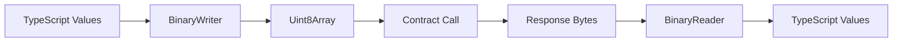

# Binary Serialization

BinaryWriter and BinaryReader are low-level utilities for encoding and decoding binary data used in OPNet smart contract calldata.

## Table of Contents

- [Overview](#overview)
- [Installation](#installation)
- [BinaryWriter](#binarywriter)
  - [Constructor](#constructor)
  - [Primitive Methods](#primitive-methods)
  - [String Methods](#string-methods)
  - [Bytes Methods](#bytes-methods)
  - [Address Methods](#address-methods)
  - [Array Methods](#array-methods)
  - [Map Methods](#map-methods)
  - [Output](#output)
  - [Utility Methods](#utility-methods)
- [BinaryReader](#binaryreader)
  - [Constructor](#constructor-1)
  - [Primitive Methods](#primitive-methods-1)
  - [String Methods](#string-methods-1)
  - [Bytes Methods](#bytes-methods-1)
  - [Address Methods](#address-methods-1)
  - [Array Methods](#array-methods-1)
  - [Map Methods](#map-methods-1)
  - [Utility Methods](#utility-methods-1)
- [Complete Examples](#complete-examples)
- [Type Sizes](#type-sizes)
- [Best Practices](#best-practices)

---

## Overview



These classes are provided by `@btc-vision/transaction` and are essential for:

- Building custom calldata for contract interactions
- Decoding raw contract responses
- Creating deployment parameters
- Working with low-level contract storage

---

## Installation

```bash
npm install @btc-vision/transaction
```

```typescript
import { BinaryWriter, BinaryReader } from '@btc-vision/transaction';
```

---

## BinaryWriter

Creates binary data by sequentially writing typed values.

### Constructor

```typescript
const writer = new BinaryWriter(length?: number);
```

| Parameter | Type | Default | Description |
|-----------|------|---------|-------------|
| `length` | `number` | `0` | Initial buffer size (auto-expands) |

### Primitive Methods

#### writeU8

Write an unsigned 8-bit integer (0-255).

```typescript
writeU8(value: number): void
```

```typescript
const writer = new BinaryWriter();
writer.writeU8(255);
```

#### writeU16

Write an unsigned 16-bit integer (0-65535).

```typescript
writeU16(value: number, be?: boolean): void
```

| Parameter | Type | Default | Description |
|-----------|------|---------|-------------|
| `value` | `number` | Required | Value to write |
| `be` | `boolean` | `true` | Big-endian (true) or little-endian (false) |

```typescript
writer.writeU16(1000);        // Big-endian (default)
writer.writeU16(1000, false); // Little-endian
```

#### writeU32

Write an unsigned 32-bit integer (0-4294967295).

```typescript
writeU32(value: number, be?: boolean): void
```

```typescript
writer.writeU32(1000000);
```

#### writeU64

Write an unsigned 64-bit integer as bigint.

```typescript
writeU64(value: bigint, be?: boolean): void
```

```typescript
writer.writeU64(1000000000000n);
```

#### writeU128

Write an unsigned 128-bit integer as bigint.

```typescript
writeU128(value: bigint, be?: boolean): void
```

```typescript
writer.writeU128(340282366920938463463374607431768211455n);
```

#### writeU256

Write an unsigned 256-bit integer as bigint. Common for token amounts.

```typescript
writeU256(value: bigint, be?: boolean): void
```

```typescript
// Write a token amount (100 tokens with 8 decimals)
writer.writeU256(100_00000000n);
```

#### writeI128

Write a signed 128-bit integer as bigint.

```typescript
writeI128(value: bigint, be?: boolean): void
```

```typescript
writer.writeI128(-50000n);
```

#### writeBoolean

Write a boolean as a single byte (0 or 1).

```typescript
writeBoolean(value: boolean): void
```

```typescript
writer.writeBoolean(true);  // Writes 0x01
writer.writeBoolean(false); // Writes 0x00
```

#### writeSelector

Write a 4-byte function selector.

```typescript
writeSelector(value: number): void
```

```typescript
// Function selector for "transfer(address,uint256)"
writer.writeSelector(0xa9059cbb);
```

### String Methods

#### writeString

Write a raw string without length prefix.

```typescript
writeString(value: string): void
```

```typescript
writer.writeString("Hello");
```

#### writeStringWithLength

Write a string with a u32 length prefix.

```typescript
writeStringWithLength(value: string): void
```

```typescript
writer.writeStringWithLength("Hello World");
// Writes: [4 bytes: length][UTF-8 bytes]
```

### Bytes Methods

#### writeBytes

Write raw bytes.

```typescript
writeBytes(value: Uint8Array): void
```

```typescript
const data = new Uint8Array([0x01, 0x02, 0x03]);
writer.writeBytes(data);
```

#### writeBytesWithLength

Write bytes with a u32 length prefix.

```typescript
writeBytesWithLength(value: Uint8Array): void
```

```typescript
writer.writeBytesWithLength(new Uint8Array([0x01, 0x02, 0x03]));
// Writes: [4 bytes: length][bytes]
```

### Address Methods

#### writeAddress

Write an OPNet address (32 bytes).

```typescript
writeAddress(value: Address): void
```

```typescript
import { Address } from '@btc-vision/transaction';

const recipient = Address.fromString('0x...');
writer.writeAddress(recipient);
```

### Array Methods

#### writeU8Array

Write an array of u8 values with u16 length prefix.

```typescript
writeU8Array(value: number[]): void
```

```typescript
writer.writeU8Array([1, 2, 3, 4, 5]);
```

#### writeU16Array

Write an array of u16 values.

```typescript
writeU16Array(value: number[], be?: boolean): void
```

#### writeU32Array

Write an array of u32 values.

```typescript
writeU32Array(value: number[], be?: boolean): void
```

#### writeU64Array

Write an array of u64 (bigint) values.

```typescript
writeU64Array(value: bigint[], be?: boolean): void
```

#### writeU128Array

Write an array of u128 (bigint) values.

```typescript
writeU128Array(value: bigint[], be?: boolean): void
```

#### writeU256Array

Write an array of u256 (bigint) values.

```typescript
writeU256Array(value: bigint[], be?: boolean): void
```

```typescript
// Write multiple token amounts
writer.writeU256Array([100n, 200n, 300n]);
```

#### writeAddressArray

Write an array of addresses.

```typescript
writeAddressArray(value: Address[]): void
```

```typescript
const addresses: Address[] = [addr1, addr2, addr3];
writer.writeAddressArray(addresses);
```

#### writeStringArray

Write an array of strings (each with length prefix).

```typescript
writeStringArray(value: string[]): void
```

```typescript
writer.writeStringArray(["Alice", "Bob", "Charlie"]);
```

#### writeBytesArray

Write an array of byte arrays.

```typescript
writeBytesArray(value: Uint8Array[]): void
```

#### writeArrayOfBuffer

Write an array of buffers with individual length prefixes.

```typescript
writeArrayOfBuffer(values: Uint8Array[], be?: boolean): void
```

### Map Methods

#### writeAddressValueTuple

Write a map of addresses to u256 values.

```typescript
writeAddressValueTuple(map: AddressMap<bigint>, be?: boolean): void
```

```typescript
import { AddressMap } from '@btc-vision/transaction';

const balances = new AddressMap<bigint>();
balances.set(addr1, 1000n);
balances.set(addr2, 2000n);

writer.writeAddressValueTuple(balances);
```

### Output

#### getBuffer

Get the written data as Uint8Array.

```typescript
getBuffer(clear?: boolean): Uint8Array
```

| Parameter | Type | Default | Description |
|-----------|------|---------|-------------|
| `clear` | `boolean` | `true` | Reset writer after getting buffer |

```typescript
const data: Uint8Array = writer.getBuffer();
// Writer is now cleared

const data2: Uint8Array = writer.getBuffer(false);
// Writer retains state
```

#### toBytesReader

Convert to a BinaryReader for immediate reading.

```typescript
toBytesReader(): BinaryReader
```

```typescript
const reader: BinaryReader = writer.toBytesReader();
```

### Utility Methods

#### getOffset

Get current write position.

```typescript
getOffset(): number
```

#### setOffset

Set write position.

```typescript
setOffset(offset: number): void
```

#### reset

Reset writer to initial state.

```typescript
reset(): void
```

#### clear

Clear buffer and reset offset.

```typescript
clear(): void
```

#### allocSafe

Ensure buffer has space for additional bytes.

```typescript
allocSafe(size: number): void
```

---

## BinaryReader

Reads binary data by sequentially extracting typed values.

### Constructor

```typescript
const reader = new BinaryReader(bytes: Uint8Array);
```

```typescript
const data = new Uint8Array([0x00, 0x01, 0x02]);
const reader = new BinaryReader(data);
```

### Primitive Methods

#### readU8

Read an unsigned 8-bit integer.

```typescript
readU8(): number
```

```typescript
const value: number = reader.readU8();
```

#### readU16

Read an unsigned 16-bit integer.

```typescript
readU16(be?: boolean): number
```

```typescript
const value: number = reader.readU16();        // Big-endian
const value2: number = reader.readU16(false);  // Little-endian
```

#### readU32

Read an unsigned 32-bit integer.

```typescript
readU32(be?: boolean): number
```

#### readU64

Read an unsigned 64-bit integer as bigint.

```typescript
readU64(be?: boolean): bigint
```

```typescript
const value: bigint = reader.readU64();
```

#### readU128

Read an unsigned 128-bit integer as bigint.

```typescript
readU128(be?: boolean): bigint
```

#### readU256

Read an unsigned 256-bit integer as bigint.

```typescript
readU256(be?: boolean): bigint
```

```typescript
// Read a token amount
const amount: bigint = reader.readU256();
```

#### readI128

Read a signed 128-bit integer as bigint.

```typescript
readI128(be?: boolean): bigint
```

#### readBoolean

Read a boolean (u8 != 0).

```typescript
readBoolean(): boolean
```

```typescript
const flag: boolean = reader.readBoolean();
```

#### readSelector

Read a 4-byte function selector.

```typescript
readSelector(): number
```

```typescript
const selector: number = reader.readSelector();
```

### String Methods

#### readString

Read a string of known length.

```typescript
readString(length: number): string
```

```typescript
const text: string = reader.readString(5); // Read 5 bytes as string
```

#### readStringWithLength

Read a string with u32 length prefix.

```typescript
readStringWithLength(be?: boolean): string
```

```typescript
const text: string = reader.readStringWithLength();
```

### Bytes Methods

#### readBytes

Read raw bytes of known length.

```typescript
readBytes(length: number, zeroStop?: boolean): Uint8Array
```

| Parameter | Type | Default | Description |
|-----------|------|---------|-------------|
| `length` | `number` | Required | Number of bytes to read |
| `zeroStop` | `boolean` | `false` | Stop at null byte |

```typescript
const data: Uint8Array = reader.readBytes(32);
```

#### readBytesWithLength

Read bytes with u32 length prefix.

```typescript
readBytesWithLength(maxLength?: number, be?: boolean): Uint8Array
```

| Parameter | Type | Default | Description |
|-----------|------|---------|-------------|
| `maxLength` | `number` | `0` | Maximum allowed length (0 = unlimited) |
| `be` | `boolean` | `true` | Big-endian |

```typescript
const data: Uint8Array = reader.readBytesWithLength();
```

### Address Methods

#### readAddress

Read an OPNet address (32 bytes).

```typescript
readAddress(): Address
```

```typescript
import { Address } from '@btc-vision/transaction';

const address: Address = reader.readAddress();
console.log(address.toHex());
```

### Array Methods

#### readU8Array

Read an array of u8 values.

```typescript
readU8Array(): number[]
```

#### readU16Array

Read an array of u16 values.

```typescript
readU16Array(be?: boolean): number[]
```

#### readU32Array

Read an array of u32 values.

```typescript
readU32Array(be?: boolean): number[]
```

#### readU64Array

Read an array of u64 values.

```typescript
readU64Array(be?: boolean): bigint[]
```

#### readU128Array

Read an array of u128 values.

```typescript
readU128Array(be?: boolean): bigint[]
```

#### readU256Array

Read an array of u256 values.

```typescript
readU256Array(be?: boolean): bigint[]
```

```typescript
const amounts: bigint[] = reader.readU256Array();
```

#### readAddressArray

Read an array of addresses.

```typescript
readAddressArray(be?: boolean): Address[]
```

```typescript
const addresses: Address[] = reader.readAddressArray();
```

#### readStringArray

Read an array of strings.

```typescript
readStringArray(be?: boolean): string[]
```

#### readBytesArray

Read an array of byte arrays.

```typescript
readBytesArray(be?: boolean): Uint8Array[]
```

#### readArrayOfBuffer

Read an array of buffers.

```typescript
readArrayOfBuffer(be?: boolean): Uint8Array[]
```

### Map Methods

#### readAddressValueTuple

Read a map of addresses to u256 values.

```typescript
readAddressValueTuple(be?: boolean): AddressMap<bigint>
```

```typescript
import { AddressMap } from '@btc-vision/transaction';

const balances: AddressMap<bigint> = reader.readAddressValueTuple();
for (const [address, amount] of balances) {
    console.log(`${address.toHex()}: ${amount}`);
}
```

### Utility Methods

#### length

Get total buffer length.

```typescript
length(): number
```

#### bytesLeft

Get remaining unread bytes.

```typescript
bytesLeft(): number
```

```typescript
while (reader.bytesLeft() > 0) {
    // Read more data
}
```

#### getOffset

Get current read position.

```typescript
getOffset(): number
```

#### setOffset

Set read position.

```typescript
setOffset(offset: number): void
```

```typescript
reader.setOffset(0); // Reset to beginning
```

#### setBuffer

Replace the data.

```typescript
setBuffer(bytes: Uint8Array): void
```

#### verifyEnd

Verify buffer has enough bytes.

```typescript
verifyEnd(size: number): void
```

### Static Comparison Methods

```typescript
// String comparison
BinaryReader.stringCompare(a: string, b: string): number

// BigInt comparison
BinaryReader.bigintCompare(a: bigint, b: bigint): number

// Number comparison
BinaryReader.numberCompare(a: number, b: number): number
```

---

## Complete Examples

### Building Contract Calldata

```typescript
import { BinaryWriter, Address } from '@btc-vision/transaction';

function encodeTransfer(recipient: Address, amount: bigint): Uint8Array {
    const writer = new BinaryWriter();

    // Write function selector (transfer)
    writer.writeSelector(0xa9059cbb);

    // Write recipient address
    writer.writeAddress(recipient);

    // Write amount
    writer.writeU256(amount);

    return writer.getBuffer();
}

// Usage
const recipient: Address = Address.fromString('0x...');
const amount: bigint = 100_00000000n; // 100 tokens
const calldata: Uint8Array = encodeTransfer(recipient, amount);
```

### Decoding Contract Response

```typescript
import { BinaryReader, Address } from '@btc-vision/transaction';

interface TokenInfo {
    name: string;
    symbol: string;
    decimals: number;
    totalSupply: bigint;
}

function decodeTokenInfo(data: Uint8Array): TokenInfo {
    const reader = new BinaryReader(data);

    return {
        name: reader.readStringWithLength(),
        symbol: reader.readStringWithLength(),
        decimals: reader.readU8(),
        totalSupply: reader.readU256(),
    };
}

// Usage
const response: Uint8Array = /* contract response */;
const info: TokenInfo = decodeTokenInfo(response);
console.log(`${info.name} (${info.symbol}): ${info.totalSupply}`);
```

### Batch Transfer Encoding

```typescript
import { BinaryWriter, Address } from '@btc-vision/transaction';

interface TransferBatch {
    recipients: Address[];
    amounts: bigint[];
}

function encodeBatchTransfer(batch: TransferBatch): Uint8Array {
    if (batch.recipients.length !== batch.amounts.length) {
        throw new Error('Recipients and amounts must match');
    }

    const writer = new BinaryWriter();

    // Write selector for batchTransfer
    writer.writeSelector(0x12345678);

    // Write arrays
    writer.writeAddressArray(batch.recipients);
    writer.writeU256Array(batch.amounts);

    return writer.getBuffer();
}
```

### Round-Trip Serialization

```typescript
import { BinaryWriter, BinaryReader, Address } from '@btc-vision/transaction';

interface Order {
    id: bigint;
    maker: Address;
    taker: Address;
    amount: bigint;
    price: bigint;
    active: boolean;
}

function serializeOrder(order: Order): Uint8Array {
    const writer = new BinaryWriter();
    writer.writeU64(order.id);
    writer.writeAddress(order.maker);
    writer.writeAddress(order.taker);
    writer.writeU256(order.amount);
    writer.writeU256(order.price);
    writer.writeBoolean(order.active);
    return writer.getBuffer();
}

function deserializeOrder(data: Uint8Array): Order {
    const reader = new BinaryReader(data);
    return {
        id: reader.readU64(),
        maker: reader.readAddress(),
        taker: reader.readAddress(),
        amount: reader.readU256(),
        price: reader.readU256(),
        active: reader.readBoolean(),
    };
}

// Test round-trip
const original: Order = {
    id: 12345n,
    maker: Address.fromString('0x...'),
    taker: Address.fromString('0x...'),
    amount: 1000n,
    price: 50n,
    active: true,
};

const serialized: Uint8Array = serializeOrder(original);
const deserialized: Order = deserializeOrder(serialized);
```

### Deployment Constructor Data

```typescript
import { BinaryWriter } from '@btc-vision/transaction';

function encodeOP20Constructor(
    name: string,
    symbol: string,
    decimals: number,
    maxSupply: bigint
): Uint8Array {
    const writer = new BinaryWriter();

    writer.writeStringWithLength(name);
    writer.writeStringWithLength(symbol);
    writer.writeU8(decimals);
    writer.writeU256(maxSupply);

    return writer.getBuffer();
}

// Usage
const constructorData: Uint8Array = encodeOP20Constructor(
    'My Token',
    'MTK',
    8,
    21_000_000_00000000n
);
```

---

## Type Sizes

| Type | Size (bytes) | Range |
|------|--------------|-------|
| `u8` | 1 | 0 to 255 |
| `u16` | 2 | 0 to 65,535 |
| `u32` | 4 | 0 to 4,294,967,295 |
| `u64` | 8 | 0 to 18,446,744,073,709,551,615 |
| `u128` | 16 | 0 to 340,282,366,920,938,463,463,374,607,431,768,211,455 |
| `u256` | 32 | 0 to 2^256 - 1 |
| `i128` | 16 | -2^127 to 2^127 - 1 |
| `Address` | 32 | OPNet address |
| `Selector` | 4 | Function selector |

---

## Best Practices

1. **Match Write/Read Order**: Always read data in the same order it was written

2. **Use Length Prefixes**: For variable-length data, use `writeStringWithLength` / `readStringWithLength`

3. **Check Remaining Bytes**: Use `bytesLeft()` to verify data availability

4. **Handle Endianness**: Default is big-endian; use `be=false` for little-endian

5. **Type Safety**: Use explicit types for all values

```typescript
// Good
const amount: bigint = reader.readU256();
const count: number = reader.readU32();

// Bad - implicit types
const amount = reader.readU256();
const count = reader.readU32();
```

6. **Error Handling**: Wrap reads in try-catch for malformed data

```typescript
try {
    const value: bigint = reader.readU256();
} catch (error: unknown) {
    console.error('Failed to read value:', error);
}
```

---

## Next Steps

- [Bitcoin Utils](./bitcoin-utils.md) - Formatting utilities
- [Revert Decoder](./revert-decoder.md) - Decoding error messages
- [Contract Deployment](../examples/deployment-examples.md) - Using BinaryWriter for deployment

---

[← Previous: Bitcoin Utils](./bitcoin-utils.md) | [Next: Revert Decoder →](./revert-decoder.md)
