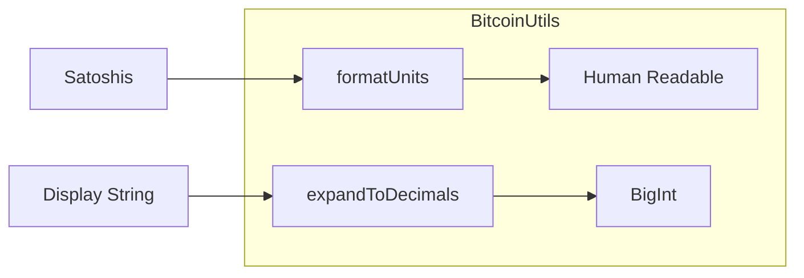

# Bitcoin Utils

This guide covers the utility functions provided by the `BitcoinUtils` class.

## Overview

`BitcoinUtils` provides helper functions for common Bitcoin value conversions, primarily for formatting and expanding decimal values.



---

## Format Units

### Convert to Display Format

The `formatUnits` function converts raw values (like satoshis) to human-readable format.

```typescript
import { BitcoinUtils } from 'opnet';

// Convert satoshis to Bitcoin (8 decimals)
const btcAmount = BitcoinUtils.formatUnits(100000000n, 8);
console.log(btcAmount); // "1"

// Convert satoshis to Bitcoin with decimal
const btcAmount2 = BitcoinUtils.formatUnits(150000000n, 8);
console.log(btcAmount2); // "1.5"

// Convert from smaller amounts
const btcAmount3 = BitcoinUtils.formatUnits(1234n, 8);
console.log(btcAmount3); // "0.00001234"
```

### Token Formatting

```typescript
// Format OP20 token balance (typically 8 decimals)
const tokenBalance = 50000000000n; // Raw balance
const formatted = BitcoinUtils.formatUnits(tokenBalance, 8);
console.log(`Balance: ${formatted} tokens`); // "Balance: 500 tokens"

// Format with different decimals
const usdtBalance = 1000000n; // 6 decimals
const usdtFormatted = BitcoinUtils.formatUnits(usdtBalance, 6);
console.log(`USDT: ${usdtFormatted}`); // "USDT: 1"
```

### Method Signature

```typescript
static formatUnits(
    value: BigNumberish,    // Value to format (bigint, string, or number)
    decimals: number = 8    // Number of decimal places (default: 8)
): string
```

---

## Expand to Decimals

### Convert to BigInt

The `expandToDecimals` function converts human-readable amounts to raw BigInt values.

```typescript
import { BitcoinUtils } from 'opnet';

// Convert 1 Bitcoin to satoshis
const satoshis = BitcoinUtils.expandToDecimals(1, 8);
console.log(satoshis); // 100000000n

// Convert 1.5 Bitcoin to satoshis
const satoshis2 = BitcoinUtils.expandToDecimals(1.5, 8);
console.log(satoshis2); // 150000000n

// Convert 0.001 Bitcoin to satoshis
const satoshis3 = BitcoinUtils.expandToDecimals(0.001, 8);
console.log(satoshis3); // 100000n
```

### Token Amounts

```typescript
// Convert token amount for transaction
const tokenAmount = BitcoinUtils.expandToDecimals(100, 8);
console.log(`Transfer amount: ${tokenAmount}`); // 10000000000n

// Convert with string input
const amount = BitcoinUtils.expandToDecimals('500.5', 8);
console.log(`Amount: ${amount}`); // 50050000000n
```

### Method Signature

```typescript
static expandToDecimals(
    n: number | string,           // Human-readable amount
    decimals: number | string     // Number of decimal places
): bigint
```

---

## Practical Examples

### Display Token Balance

```typescript
async function displayTokenBalance(
    contract: IOP20Contract,
    userAddress: Address
): Promise<void> {
    // Get raw balance
    const result = await contract.balanceOf(userAddress);
    const rawBalance = result.properties.balance;

    // Get decimals
    const decimalsResult = await contract.decimals();
    const decimals = Number(decimalsResult.properties.decimals);

    // Format for display
    const formatted = BitcoinUtils.formatUnits(rawBalance, decimals);
    console.log(`Balance: ${formatted}`);
}
```

### Parse User Input

```typescript
function parseUserAmount(
    input: string,
    decimals: number
): bigint {
    // Handle empty or invalid input
    if (!input || isNaN(parseFloat(input))) {
        throw new Error('Invalid amount');
    }

    // Convert to BigInt
    return BitcoinUtils.expandToDecimals(input, decimals);
}

// Usage
const userInput = '100.5';
const amount = parseUserAmount(userInput, 8);
console.log(`Sending: ${amount} satoshi units`);
```

### Format with Symbol

```typescript
function formatTokenAmount(
    amount: bigint,
    decimals: number,
    symbol: string
): string {
    const formatted = BitcoinUtils.formatUnits(amount, decimals);

    // Add thousands separator
    const parts = formatted.split('.');
    parts[0] = parts[0].replace(/\B(?=(\d{3})+(?!\d))/g, ',');

    return `${parts.join('.')} ${symbol}`;
}

// Usage
const formatted = formatTokenAmount(1234567890000n, 8, 'BTC');
console.log(formatted); // "12,345.6789 BTC"
```

---

## Rounding and Precision

### Handle Decimal Precision

```typescript
function formatWithPrecision(
    amount: bigint,
    decimals: number,
    displayDecimals: number = 4
): string {
    const formatted = BitcoinUtils.formatUnits(amount, decimals);
    const num = parseFloat(formatted);

    return num.toFixed(displayDecimals);
}

// Usage
const display = formatWithPrecision(123456789n, 8, 4);
console.log(display); // "1.2346"
```

### Round to Satoshis

```typescript
function roundToSatoshis(btcAmount: string): bigint {
    // Expand then re-format to ensure proper rounding
    const satoshis = BitcoinUtils.expandToDecimals(btcAmount, 8);
    return satoshis;
}

// Usage
const sats = roundToSatoshis('0.123456789');
console.log(sats); // 12345678n (9th decimal truncated)
```

---

## Complete Utility Service

```typescript
class TokenFormatter {
    private decimals: number;
    private symbol: string;

    constructor(decimals: number, symbol: string) {
        this.decimals = decimals;
        this.symbol = symbol;
    }

    formatBalance(raw: bigint): string {
        return BitcoinUtils.formatUnits(raw, this.decimals);
    }

    formatWithSymbol(raw: bigint): string {
        const formatted = this.formatBalance(raw);
        return `${formatted} ${this.symbol}`;
    }

    parseAmount(display: string): bigint {
        return BitcoinUtils.expandToDecimals(display, this.decimals);
    }

    formatCompact(raw: bigint): string {
        const num = parseFloat(this.formatBalance(raw));

        if (num >= 1e9) {
            return `${(num / 1e9).toFixed(2)}B ${this.symbol}`;
        } else if (num >= 1e6) {
            return `${(num / 1e6).toFixed(2)}M ${this.symbol}`;
        } else if (num >= 1e3) {
            return `${(num / 1e3).toFixed(2)}K ${this.symbol}`;
        }

        return `${num.toFixed(4)} ${this.symbol}`;
    }
}

// Usage
const btcFormatter = new TokenFormatter(8, 'BTC');

// Format balance
console.log(btcFormatter.formatWithSymbol(100000000n)); // "1 BTC"
console.log(btcFormatter.formatCompact(1500000000000n)); // "15.00K BTC"

// Parse amount
const sats = btcFormatter.parseAmount('0.5');
console.log(sats); // 50000000n
```

---

## Best Practices

1. **Use Correct Decimals**: Different tokens have different decimal places

2. **Avoid Floating Point**: Use BigInt for calculations, format only for display

3. **Handle User Input**: Validate and sanitize before parsing

4. **Round Appropriately**: Display with appropriate precision

5. **Include Symbol**: Always show the token/currency symbol for clarity

---

## P2MR Address Detection

The `isP2MRAddress` utility detects Pay-to-Merkle-Root (BIP 360) addresses by checking for witness version 2 with a 32-byte Merkle root.

```typescript
import { isP2MRAddress } from 'opnet';
import { networks } from '@btc-vision/bitcoin';

// Mainnet P2MR addresses start with bc1z
const isP2MR = isP2MRAddress('bc1z...', networks.bitcoin);

// OPNet Testnet P2MR addresses start with opt1z
const isOpnetTestnetP2MR = isP2MRAddress('opt1z...', networks.opnetTestnet);

// Regtest P2MR addresses start with bcrt1z
const isRegtestP2MR = isP2MRAddress('bcrt1z...', networks.regtest);
```

### Method Signature

```typescript
function isP2MRAddress(addr: string, network: Network): boolean
```

| Parameter | Type | Description |
|-----------|------|-------------|
| `addr` | `string` | The address string to test |
| `network` | `Network` | The Bitcoin network to validate against |

---

## Script Constants

Two magic-byte constants are re-exported from `@btc-vision/transaction` for low-level script construction:

```typescript
import { P2MR_MS, P2TR_MS } from 'opnet';
```

| Constant | Description |
|----------|-------------|
| `P2MR_MS` | Magic byte identifying P2MR (BIP 360) script outputs |
| `P2TR_MS` | Magic byte identifying P2TR (Taproot) script outputs |

---

## Next Steps

- [Revert Decoder](./revert-decoder.md) - Error decoding
- [Binary Serialization](./binary-serialization.md) - BinaryWriter and BinaryReader
- [OP20 Examples](../examples/op20-examples.md) - Token examples
- [Simulating Calls](../contracts/simulating-calls.md) - Contract calls

---

[← Previous: Public Key Operations](../public-keys/public-key-operations.md) | [Next: Revert Decoder →](./revert-decoder.md)
