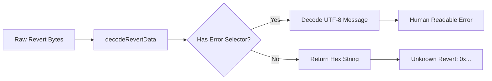

# Revert Decoder

This guide covers decoding contract revert messages on OPNet.

## Overview

When contract calls fail, they return revert data that can be decoded into human-readable error messages. The `decodeRevertData` function handles this decoding.



---

## Decode Revert Data

### Basic Usage

```typescript
import { decodeRevertData } from 'opnet';

// From transaction receipt
const tx = await provider.getTransaction(txHash);

if (tx.revert) {
    console.log('Transaction reverted:', tx.revert);
}

// Manual decoding
if (tx.rawRevert) {
    const message = decodeRevertData(tx.rawRevert);
    console.log('Decoded revert:', message);
}
```

### From Contract Call

```typescript
const result = await contract.transfer(recipient, amount, new Uint8Array(0));

if (result.revert) {
    console.log('Call reverted:', result.revert);
}
```

### Method Signature

```typescript
function decodeRevertData(
    revertDataBytes: Uint8Array
): string
```

---

## How It Works

### Error Selector

OPNet uses a specific error selector (`0x63739d5c`) to identify standard error messages:

```typescript
// Error selector bytes
const ERROR_SELECTOR = [0x63, 0x73, 0x9d, 0x5c];
```

### Decoding Process

1. Check if data starts with the error selector
2. If yes, decode remaining bytes as UTF-8 text
3. If no, return hex representation as "Unknown Revert"

```typescript
function decodeRevertData(revertDataBytes: Uint8Array): string {
    // Check for error selector
    if (startsWithErrorSelector(revertDataBytes)) {
        // Decode as UTF-8 string (skip 8 bytes: 4 selector + 4 padding)
        const decoder = new TextDecoder();
        return decoder.decode(revertDataBytes.subarray(8));
    } else {
        // Return hex for unknown format
        return `Unknown Revert: 0x${bytesToHex(revertDataBytes)}`;
    }
}
```

---

## Common Revert Messages

### Standard Error Messages

| Error Message | Meaning |
|--------------|---------|
| `Insufficient balance` | Sender doesn't have enough tokens |
| `Insufficient allowance` | Spender not approved for amount |
| `Transfer to zero address` | Invalid recipient address |
| `Unauthorized` | Caller lacks required permissions |
| `Contract paused` | Contract operations are paused |
| `Invalid amount` | Amount is zero or invalid |

### Example Handling

```typescript
function handleRevert(revertMessage: string): string {
    const lowerMessage = revertMessage.toLowerCase();

    if (lowerMessage.includes('insufficient balance')) {
        return 'You do not have enough tokens for this transfer';
    }

    if (lowerMessage.includes('insufficient allowance')) {
        return 'You need to approve tokens before transferring';
    }

    if (lowerMessage.includes('unauthorized')) {
        return 'You are not authorized to perform this action';
    }

    if (lowerMessage.includes('paused')) {
        return 'The contract is currently paused';
    }

    return `Transaction failed: ${revertMessage}`;
}

// Usage
if (result.revert) {
    const userMessage = handleRevert(result.revert);
    console.log(userMessage);
}
```

---

## Working with Reverts

### Check for Revert

```typescript
async function safeContractCall<T>(
    call: () => Promise<T & { revert?: string }>
): Promise<{ success: true; result: T } | { success: false; error: string }> {
    try {
        const result = await call();

        if (result.revert) {
            return {
                success: false,
                error: result.revert,
            };
        }

        return {
            success: true,
            result,
        };
    } catch (error: unknown) {
        const errorMessage = error instanceof Error ? error.message : 'Unknown error';
        return {
            success: false,
            error: errorMessage,
        };
    }
}

// Usage
const outcome = await safeContractCall(() =>
    contract.transfer(recipient, amount, new Uint8Array(0))
);

if (outcome.success) {
    console.log('Transfer successful');
} else {
    console.log('Transfer failed:', outcome.error);
}
```

### Extract Revert from Transaction

```typescript
async function getRevertReason(
    provider: JSONRpcProvider,
    txHash: string
): Promise<string | null> {
    const tx = await provider.getTransaction(txHash);

    // TransactionBase has both `revert` (decoded) and `rawRevert` (raw bytes)
    if (tx.revert) {
        return tx.revert;
    }

    if (tx.rawRevert) {
        return decodeRevertData(tx.rawRevert);
    }

    return null;
}

// Usage
const reason = await getRevertReason(provider, txHash);
if (reason) {
    console.log('Transaction reverted:', reason);
}
```

---

## Custom Error Handling

### Create Error Handler

```typescript
class RevertHandler {
    private handlers: Map<string, (msg: string) => string> = new Map();

    registerHandler(
        pattern: string,
        handler: (msg: string) => string
    ): void {
        this.handlers.set(pattern.toLowerCase(), handler);
    }

    handle(revertMessage: string): string {
        const lowerMessage = revertMessage.toLowerCase();

        for (const [pattern, handler] of this.handlers) {
            if (lowerMessage.includes(pattern)) {
                return handler(revertMessage);
            }
        }

        return revertMessage;
    }
}

// Usage
const handler = new RevertHandler();

handler.registerHandler('insufficient balance', () =>
    'Not enough tokens in your wallet'
);

handler.registerHandler('insufficient allowance', () =>
    'Please approve tokens first'
);

handler.registerHandler('unauthorized', () =>
    'Permission denied'
);

// Apply to revert
const userFriendly = handler.handle(result.revert);
console.log(userFriendly);
```

### Log Reverts for Debugging

```typescript
function logRevert(
    operation: string,
    revert: string | undefined
): void {
    if (!revert) {
        console.log(`${operation}: Success`);
        return;
    }

    console.log(`${operation}: REVERTED`);
    console.log(`  Message: ${revert}`);
}

// Usage with CallResult (contract simulation)
const result = await contract.transfer(recipient, amount, new Uint8Array(0));
logRevert('Transfer', result.revert);

// Usage with TransactionBase (fetched transaction) - also has rawRevert
const tx = await provider.getTransaction(txHash);
logRevert('Transaction', tx.revert);
if (tx.rawRevert) {
    console.log('  Raw revert bytes available for manual decoding');
}
```

---

## Batch Error Handling

### Handle Multiple Operations

```typescript
interface OperationResult {
    operation: string;
    success: boolean;
    error?: string;
}

async function executeBatchWithRevertHandling(
    operations: Array<{
        name: string;
        execute: () => Promise<{ revert?: string }>;
    }>
): Promise<OperationResult[]> {
    const results: OperationResult[] = [];

    for (const op of operations) {
        try {
            const result = await op.execute();

            results.push({
                operation: op.name,
                success: !result.revert,
                error: result.revert,
            });
        } catch (error: unknown) {
            const errorMessage = error instanceof Error ? error.message : 'Unknown error';
            results.push({
                operation: op.name,
                success: false,
                error: errorMessage,
            });
        }
    }

    return results;
}

// Usage
const results = await executeBatchWithRevertHandling([
    {
        name: 'Transfer to Alice',
        execute: () => contract.transfer(alice, 100n, new Uint8Array(0)),
    },
    {
        name: 'Transfer to Bob',
        execute: () => contract.transfer(bob, 200n, new Uint8Array(0)),
    },
]);

for (const result of results) {
    if (result.success) {
        console.log(`✓ ${result.operation}`);
    } else {
        console.log(`✗ ${result.operation}: ${result.error}`);
    }
}
```

---

## Complete Revert Service

```typescript
class RevertService {
    private errorMappings: Map<string, string> = new Map();

    constructor() {
        this.initDefaultMappings();
    }

    private initDefaultMappings(): void {
        this.errorMappings.set('insufficient balance', 'Insufficient balance');
        this.errorMappings.set('insufficient allowance', 'Insufficient allowance');
        this.errorMappings.set('unauthorized', 'Unauthorized access');
        this.errorMappings.set('paused', 'Contract is paused');
        this.errorMappings.set('zero address', 'Invalid zero address');
    }

    addMapping(pattern: string, message: string): void {
        this.errorMappings.set(pattern.toLowerCase(), message);
    }

    decode(rawRevert: Uint8Array): string {
        return decodeRevertData(rawRevert);
    }

    getUserFriendlyMessage(revert: string): string {
        const lower = revert.toLowerCase();

        for (const [pattern, message] of this.errorMappings) {
            if (lower.includes(pattern)) {
                return message;
            }
        }

        return revert;
    }

    isKnownError(revert: string): boolean {
        const lower = revert.toLowerCase();

        for (const pattern of this.errorMappings.keys()) {
            if (lower.includes(pattern)) {
                return true;
            }
        }

        return false;
    }

    extractFromCallResult(result: { revert?: string }): string | null {
        if (result.revert) {
            return this.getUserFriendlyMessage(result.revert);
        }

        return null;
    }

    extractFromTransaction(tx: { revert?: string; rawRevert?: Uint8Array }): string | null {
        if (tx.revert) {
            return this.getUserFriendlyMessage(tx.revert);
        }

        if (tx.rawRevert) {
            const decoded = this.decode(tx.rawRevert);
            return this.getUserFriendlyMessage(decoded);
        }

        return null;
    }
}

// Usage
const revertService = new RevertService();

// Add custom mapping
revertService.addMapping('already claimed', 'You have already claimed');

// Use with contract call result
const result = await contract.transfer(recipient, amount, new Uint8Array(0));
const error = revertService.extractFromCallResult(result);

if (error) {
    console.log('Error:', error);
}
```

---

## Best Practices

1. **Always Check Reverts**: Check `revert` on `CallResult`, and both `revert` and `rawRevert` on `TransactionBase`

2. **User-Friendly Messages**: Convert technical errors to user-friendly text

3. **Log Raw Data**: Keep raw revert data for debugging

4. **Handle Unknown Errors**: Provide fallback for unrecognized errors

5. **Centralize Handling**: Use a service class for consistent error handling

---

## Next Steps

- [Bitcoin Utils](./bitcoin-utils.md) - Utility functions
- [Binary Serialization](./binary-serialization.md) - BinaryWriter and BinaryReader
- [Simulating Calls](../contracts/simulating-calls.md) - Contract calls
- [Transaction Receipts](../transactions/transaction-receipts.md) - Receipt handling

---

[← Previous: Bitcoin Utils](./bitcoin-utils.md) | [Next: Binary Serialization →](./binary-serialization.md)
